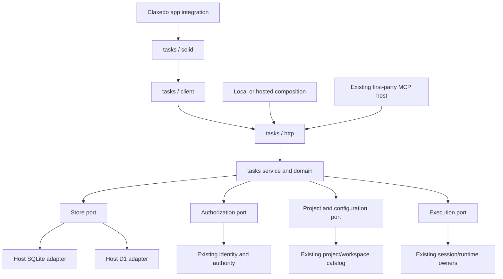

# Tasks — High-Level Design

**Direction updated 2026-09-09:** [One agent, scoped context and memory](2026-09-09-001-claxedo-single-agent-context-memory-direction.md) is authoritative. This document covers the Tasks foundation for @claxedo; it does not specify the complete cross-surface learning system.

Execution references: [technical implementation plan](2026-09-08-006-feat-tasks-implementation-plan.md), [acceptance journeys and live verification](2026-09-08-007-feat-tasks-acceptance-journeys.md), and [goal.md](../../goal.md). These specify delivery and evidence; they do not indicate that the feature is implemented.

## 1. Decision and scope

Build `@claxedo/tasks` as a library containing task behavior, planning records, subtasks, activity, a typed client, HTTP handlers, and a Solid UI. Claxedo supplies persistence, authentication and authorization, project/workspace resolution, session execution, and application navigation through explicit ports. The library does not boot a server, open a database, authenticate users independently, or import a Claxedo application package.

The first implementation uses the stack already present: TypeScript, Solid, the shared UI package, Hono, local SQLite, and hosted Cloudflare D1. Ports separate ownership; they are not a commitment to implement React, another database, another auth system, or third-party hosts. There is one new package with explicit entrypoints, not a package per layer.

The capability is named **Tasks** in both the interface and the design. Its package is `@claxedo/tasks`, located at `packages/claxedo-tasks`, and its service factory is `createTaskService()`. Code and, later, Company mount the same capability. A task does not change identity when shown in another surface.

This pair replaces the earlier scoped design's code grouping and external UI integration decisions. Neither an external board fork nor an independently deployed UI service is required. The broader Company plan remains future context; it does not expand the implementation described here. Everything in this document is proposed unless explicitly described as observed repository behavior.

## 2. The user problem

Claxedo sessions provide a place to work with an agent. Larger work also needs a durable place to state the objective, preserve the agreed approach, expose smaller work items, and record what changed across sessions. Reopening a chat should not be the only way to find the plan or discover unfinished work.

The feature must support both a small task that goes straight to execution and a refactor that needs planning and a breakdown. The user works with @claxedo directly; the host resolves execution settings and authorized context without a named-agent setup step.

Success means a user can create a project-bound task, plan it with an agent, accept useful subtasks, start work with @claxedo, and inspect progress and decisions without reconstructing the session transcript. Hosted task records must remain readable when their execution workspace is stopped.

## 3. Product model

| Concept | Meaning | Authoritative owner |
|---|---|---|
| Task | Objective, description, acceptance criteria, project, status, optional parent | Tasks |
| Plan revision | Immutable proposed approach and optional proposed subtask breakdown | Tasks |
| Subtask | A task with a parent; no second task implementation | Tasks |
| Activity entry | Attributed comment or record of a committed change | Tasks |
| Run | One task-initiated agent invocation, its frozen input, admission checkpoints, and observed outcome | Tasks records; execution facts come from the host |
| Session | Conversation, messages, tool output, permissions, execution binding | Existing Claxedo runtime |
| Project/workspace | Authorized work location and placement | Existing Claxedo project/workspace authority |

A run is not the session itself. **Plan with agent**, **Start**, and a task's explicit **Continue** command each create an invocation record. Continue can reuse a linked session, with a new message identity. Merely opening a session creates no run. Ordinary messages sent directly in the session remain ordinary session messages; this feature does not retroactively fabricate run records for them.

Project and optional workspace selection belong to the task in the Code slice. The host resolves effective harness/model settings and applicable instructions. A run freezes that configuration and its input references so later settings or knowledge changes cannot alter an accepted invocation. Knowledge and access belong to their actual scopes, not to an agent profile.

Task status describes work: `todo`, `doing`, `needs_you`, or `done`. Execution state is displayed separately. An invocation settling successfully does not prove that its task is done.

## 4. Core user flows

### 4.1 Create and execute a small task

The user opens Tasks, chooses a project, and writes a title and optional description/acceptance criteria. Project context may prefill the form, but the saved task explicitly owns that reference. Saving defaults to To do and records the selected initial status in activity; it launches nothing. Group-specific creation may preselect another nonterminal status as described in section 4.6.

The detail view offers **Start**. The host resolves the task's project/workspace and current execution defaults, validates access and configuration, then accepts one run intent before driving the ordinary session creation and prompt admission path. Advanced execution controls can override supported settings for this invocation. The detail exposes the session link and current execution state; there is no bot picker or assignment step.

Editing task metadata or accepting a plan does not launch work. Start and Continue are explicit task actions. A direct request in an existing conversation can initiate ordinary session work without first creating a task; broader channel admission is covered by the single-agent direction, not implemented by this task slice.

Ambiguous workspace placement produces a workspace choice, not a launch in the globally active directory. A failed preflight leaves the run acceptance transaction uncommitted. A failure after acceptance preserves the run and exposes the recovery action appropriate to the authoritative checkpoint.

### 4.2 Plan a larger feature

The user chooses **Plan with agent** on an existing task. The host's effective execution defaults supply the model/harness, with supported advanced settings available. A planning run opens an ordinary Claxedo session with the task objective, relevant accepted plan, and explicit planning intent.

The agent investigates and discusses the work. When it has a useful proposal, a task tool saves a plan revision containing the approach, scope boundaries, verification steps, and an optional subtask proposal. The conversation remains in the session; the durable proposal appears in the task's Plan view.

The user may revise or accept a specific revision. Acceptance of a breakdown creates its selected child tasks atomically and records their relation to the accepted revision. It does not start them. A stale proposal requires review against the changed task before acceptance; the system must not silently overwrite newer planning work.

Planning intent shapes the invocation and task-tool permissions. It does not claim to put every harness into an enforced filesystem read-only mode. The host must either report an available planning restriction accurately or present the session's actual permission policy.

### 4.3 Inspect and execute subtasks

The parent detail shows each child's status plus a compact progress count. The first UI supports one level of children; the backend enforces that same limit. Each child uses the normal task detail and execution commands.

Children copy the parent's project and initial workspace selection on creation. While attached, they remain in the same project. Changing a parent's project with attached children is refused; the user must explicitly detach/reorganize the work first. Existing run snapshots never move.

Children can be worked independently. This phase does not infer execution order from their display order. Dependency-aware pickup is a later feature.

Completing all children creates a visible “All subtasks done — review parent” condition. It does not mark the parent Done. Completion requires checked acceptance criteria, finished nonarchived children, and no unresolved task-owned run; tasks without criteria are allowed. Adding or reopening a child under a Done parent requires reopening the parent first.

### 4.4 Record comments and changes

The Activity view interleaves comments with structured records of status, plan, child, and run changes. Entries identify the human, agent session, or system actor and link to the relevant record.

Every successful mutation appends its activity in the same database commit. No notification callback or browser event is responsible for creating the history. A lost response and repeated command produce one change and one corresponding activity record.

Tool transcripts, tokens, and every intermediate execution event remain in the session. The timeline records useful transitions and links. Agent-authored summaries are labeled as such; they are not proof of runtime success or acceptance-criteria completion.

### 4.5 Return after interruption

The task catalog loads without starting a workspace. Linked sessions and runs retain their target references. If execution observation is unavailable, the UI says Unavailable and shows the last confirmed observation time.

Read-side reconciliation can recover an existing session link or known prompt receipt. It cannot create a session or resubmit work. A **Resume start** command rechecks the current user's authority and continues the same pending intent. A **Start fresh** command uses a new run only after the previous task-owned intent has been settled or safely cancelled.

### 4.6 UI direction from the supplied references

The five user-supplied screenshots establish the visual direction: a dense grouped list, a spacious document-style task detail with a right properties panel, an alternate board presentation, a compact Display popover, and a lightweight create dialog. They are layout and interaction references. Their example task content, team navigation, workflow statuses, labels, cycles, and review features do not independently add requirements to this scope.

**Collection surface.** Use one slim header with Active, Backlog, and All tasks presets, followed by Filter, Display, and New task actions. List and Board are two presentations of the same authorized query. List rows emphasize the title and align compact metadata to the right; status groups have a count and an add action. Board columns use quiet tinted headers and compact cards with the same fields. Avoid turning each row into a large dashboard card.

**Task detail.** Opening a row/card navigates within the Tasks surface to a document-style detail. A compact breadcrumb/header preserves the way back. The main column contains the title, description, acceptance criteria, plan, subtasks, and activity in reading order. A right properties panel contains status, project/workspace, and a compact latest-run/session link. Plan with agent and Start are visible actions near the title. Plan revisions and run history expand when requested rather than occupying permanent top-level tabs. This replaces the earlier interpretation of five separate detail tabs.

**Create dialog.** Follow the reference's title-first form with optional description and compact property chips. Project is visibly required for this Code task slice. The primary action is Create task and starts no execution. Creating from a status group can preselect To do, Doing, or Needs you; Done still requires the ordinary completion checks after creation. Creating from a parent preselects and locks the parent's project. Create more can keep the dialog open after a confirmed save.

**Claxedo composition.** The library renders the task collection/detail and its local toolbar, not a second application sidebar or account switcher. Existing Claxedo navigation owns the Tasks entry and space around it. Use the current theme's typography, colors, controls, and focus treatment while matching the references' density, restrained borders, and information hierarchy. The supplied dark screenshots are not a requirement to hardcode a dark-only palette.

Initial metadata is status, project, dates and child progress where available. The interface does not present agent assignment or fabricated presence. Priority and labels require explicit model/API work later; unsupported decorative controls do not ship. The reference's custom columns do not change the four-state task model.

## 5. Existing Claxedo shape and precise extensions

These are observed seams in the inspected checkout, not newly invented services:

| Current owner | Current responsibility | Proposed change |
|---|---|---|
| [Connections service](/Users/yashvardhansingh/test/opencode/packages/claxedo-connections/src/service.ts) | Library behavior constructed with store ports and host dependencies | Follow its library/host shape; do not reuse its connection domain for tasks |
| [App architecture](/Users/yashvardhansingh/test/opencode/packages/claxedo-app/src/ARCHITECTURE.md) and [contribution composition](/Users/yashvardhansingh/test/opencode/packages/claxedo-app/src/app/composition/product-contributions.ts) | App composes independent features and optional surfaces | Mount the package's Solid surface through an enabled-only app integration |
| [Contribution registry](/Users/yashvardhansingh/test/opencode/packages/claxedo-app/src/app/integrations/registry.ts) | Surface/command registration and reactive removal | Register Tasks and its commands through this registry |
| [Route contributions](/Users/yashvardhansingh/test/opencode/packages/claxedo-server-core/src/platform/http/route-contribution.ts) | Product-selected HTTP route families | Supply Tasks routes from enabled host composition |
| [Local app](/Users/yashvardhansingh/test/opencode/packages/claxedo-local-server/src/app/local-app.ts) | Local security and route mounting | Accept the task contribution; no unconditional feature import |
| [Hosted core app](/Users/yashvardhansingh/test/opencode/packages/claxedo-server/src/deployments/hosted-shared/hosted-core-app.ts) | Authenticated hosted routing with contributions | Mount task routes behind existing browser and identity controls |
| [Hosted product](/Users/yashvardhansingh/test/opencode/packages/claxedo-server/src/deployments/hosted-shared/claxedo-hosted-product-app.ts) | Multi-org product composition and workspace entitlement policy | Preserve product gates when a task requests execution |
| [Authentication contract](/Users/yashvardhansingh/test/opencode/packages/claxedo-server-core/src/platform/auth/authentication.ts) | Verified provider-independent principal | Translate verified identity into task request context; no new login system |
| [Hosted connection store](/Users/yashvardhansingh/test/opencode/packages/claxedo-server/src/connections/hosted-d1/connection-store.ts) | Request-scoped D1 partitioning by resolved authority | Apply the same explicit partition discipline to task storage |
| [Session target acquisition](/Users/yashvardhansingh/test/opencode/packages/claxedo-app/src/features/session/composer/ui/submit-create-session.ts) | UI target resolution, reservation, and creation | Reuse authoritative services behind it in a headless host adapter; never import this UI into the library/server |
| [Machine dispatcher](/Users/yashvardhansingh/test/opencode/packages/claxedo-server/src/session/machine-dispatch.ts) | Server-driven creation and prompt dispatch | Add stable operation/session identity support at the canonical owner before retryable task launch ships |
| [Runtime session routes](/Users/yashvardhansingh/test/opencode/packages/workspace-runtime/src/routes/session-core.ts) | Session creation, registration, and prompt admission | Preserve runtime ownership; qualify exact-identity replay and observation for task callers |
| [First-party MCP composition](/Users/yashvardhansingh/test/opencode/packages/claxedo-server/src/mcp/first-party-mcp.ts) | Credential admission and tools reentering authorized APIs | Add optional task commands through the existing gateway, without another credential issuer |
| [Product closure tooling](/Users/yashvardhansingh/test/opencode/script/product-boundary/closure.ts) | Dependency closure inspection | Extend existing artifact gates for enabled and excluded Tasks variants |

The machine dispatcher's current `create` generates new session and registration IDs internally. Its `prompt` accepts a caller-supplied message ID, but that alone does not prove durable replay safety through every harness. These are launch prerequisites, not guarantees the task library can manufacture.

## 6. Library and host boundary

The library owns rules and reusable presentation. The host owns the environment in which those rules run.



Public entrypoints separate dependency closures: root service/domain, `/contracts`, `/http`, `/client`, `/solid`, `/styles.css`, `/schema`, and `/conformance`. The root does not reexport UI or host adapters. Server imports cannot accidentally acquire Solid/CSS; UI imports cannot acquire SQLite or runtime code. Schema resources are inert until the host's selected migration lifecycle executes them.

The host supplies an already configured authenticated fetch to the client, navigation functions to the Solid surface, and request-scoped ports to the server factory. UI ports are a small named contract, not the entire application context. Persistence engines and authorization providers stay outside the package.

No new daemon, autonomous scheduler, generalized workflow framework, or dynamic plugin marketplace is introduced. The package mounts into the current local and hosted hosts. Future standalone deployment would be another composition root, not a reason to add an unused deployment now.

## 7. Persistence, authority, and hosted availability

One catalog is authoritative for a given scope. Local/self-hosted Node uses a dedicated task SQLite catalog under the existing host data path. Hosted uses task-prefixed tables in `CONTROL_PLANE_DB`. The host supplies the database handle and owns its lifecycle, backups, and migration execution.

An unsigned local catalog belongs to an explicitly resolved local installation scope. Hosted catalogs belong to an explicitly resolved organization scope. Project authorization still controls which tasks a caller can see within that organization. A stored organization ID or project ID is not an access grant. Execution settings do not confer workspace access.

Moving between Code and Company within the same authority does not copy records. Moving between local and hosted authorities requires a later explicit migration with identity/reference mapping; this version does not synchronize two writable catalogs.

The browser caches task records but does not own them. Closing the Tasks surface disposes its requests and subscriptions without aborting admitted execution. A Worker may finish after accepting a launch; an unresolved intent remains durable and visible. This phase promises explicit recovery, not unattended eventual execution after arbitrary crashes.

## 8. State ownership

Task status changes are explicit business commands except that accepting an execution run moves To do to Doing. Planning does not move a task into Doing. Runtime observations set execution badges and run outcomes, never task Done.

```mermaid
stateDiagram-v2
    [*] --> Todo: create; default
    [*] --> Doing: create with explicit initial status
    [*] --> NeedsYou: create with explicit initial status
    Todo --> Doing: explicit status or accepted execution run
    Todo --> NeedsYou: explicit status
    Doing --> NeedsYou: explicit status
    NeedsYou --> Doing: explicit status or accepted execution run
    Doing --> Todo: explicit status; no unresolved run
    NeedsYou --> Todo: explicit status; no unresolved run
    Todo --> Done: explicit completion; checks pass
    Doing --> Done: explicit completion; checks pass
    NeedsYou --> Done: explicit completion; checks pass
    Done --> Todo: reopen
```

An activity entry records each committed transition. The UI may show Waiting for permission beside Doing without rewriting the task status. This preserves the distinction between an agent waiting and a person deciding that work needs attention.

Plan approval, launch admission, run outcome, and feature availability have separate state machines in the low-level design. They do not add columns to the board.

## 9. Build-time optionality

Proposed selector: `CLAXEDO_BUILD_TASKS=1`; absent or `0` excludes the feature, and invalid values fail the build. The selector is resolved by build tooling and applied to renderer, local server, hosted server, migration staging, and packaging. It is not read as a runtime promise to remove already emitted code.

Disabled products contain no task implementation, UI styles, feature routes, MCP tool definitions, migrations, startup work, or exclusive runtime dependencies. Generic contribution interfaces may remain. Type-only references must emit no runtime edge. An enabled build with an unavailable server renders an honest unavailable state; it does not substitute browser-only task data.

Turning the feature off does not delete existing rows or sessions. Previously admitted ordinary sessions continue under existing runtime ownership. Turning it back on checks schema and reconciles known receipts; pending work requires explicit reauthorization before any new admission.

## 10. Incremental delivery

| Slice | User-visible result | Required proof |
|---|---|---|
| A. Package and host boundary | Optional empty Tasks surface and authenticated capability endpoint | Off/on source and emitted closure; supported local and hosted composition |
| B. Tasks, comments, and activity | Persistent board/detail with status editing and history | Real SQLite and D1 mutations; atomic activity; isolation; lost-response replay |
| C. Context and execution | Start with @claxedo, session link, resume ambiguous start | Canonical runtime identity/admission tests; current harness instructions/model actually applied |
| D. Subtasks | One-level breakdown, progress, parent completion checks | Parent/child concurrency and same-project invariants |
| E. Agent planning | Plan revisions and accepted subtask proposals | Scoped agent tools; stale proposal conflicts; atomic acceptance; no automatic child execution |

Slices add behavior under one feature boundary. Each slice must work on the supported current host stacks before being declared complete. No blank implementation folders, placeholder adapters, or extra framework variants are required in earlier slices.

Outside this Tasks foundation: automatic pickup, schedules, dependencies, the shared learning system, channel triggers, organizational roles beyond current host policy, task attachments, rich document collaboration, nested task trees, and a standalone deployment. Acceptance criteria and Markdown plans are enough for the initial planning workflow.

## 11. Risks and acceptance boundaries

1. **Execution identity:** host/runtime create and prompt replay must return existing work rather than perform it twice. Launch remains gated until qualified.
2. **D1 concurrency:** atomic batches must enforce preconditions inside the transaction. Independent HTTP reads followed by unconditional writes are insufficient.
3. **Scope:** activity, plans, invocation context, and command replay must enforce the same current authorization as tasks. No bypass for agent tools or cached responses.
4. **Plan drift:** acceptance binds a revision and task inputs; changes never silently approve another revision.
5. **Build exclusion:** production closures include packaging and SQL/CSS resources, not just navigation visibility.
6. **Hosted release identity:** implementation must identify the actual managed release entry. Candidate Worker compositions in the checkout are reference points, not evidence of a deployed release.

The user-visible result is a board that can grow into planned, inspectable agent work while continuing to use ordinary Claxedo sessions. The cost is a deliberately specified task catalog and execution-admission bridge. The benefit of the package boundary is that Code and Company share those rules instead of each acquiring its own task engine.

## 12. Companion and verification status

See [Tasks — Low-Level Design](/Users/yashvardhansingh/test/opencode/docs/plans/2026-09-08-005-feat-tasks-low-level-design.md) for module ownership, ports, records, transactional rules, API operations, state machines, and acceptance tests.

These are design documents grounded in source inspection. No task package, adapter, route, migration, or UI has been implemented by this documentation change.

The context/memory workstream is now the broader product priority. Its technical design is pending; completing this Tasks package alone does not satisfy the single-agent learning goal.
