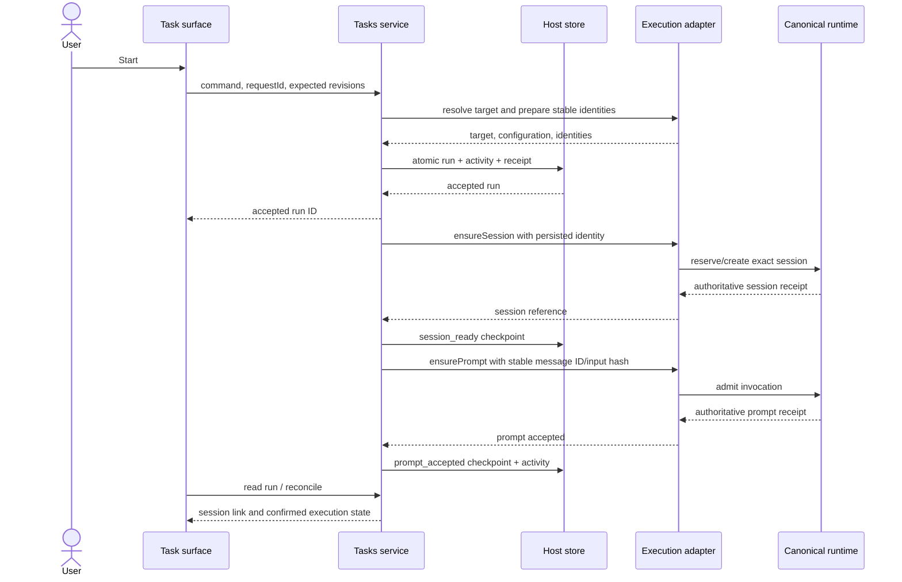
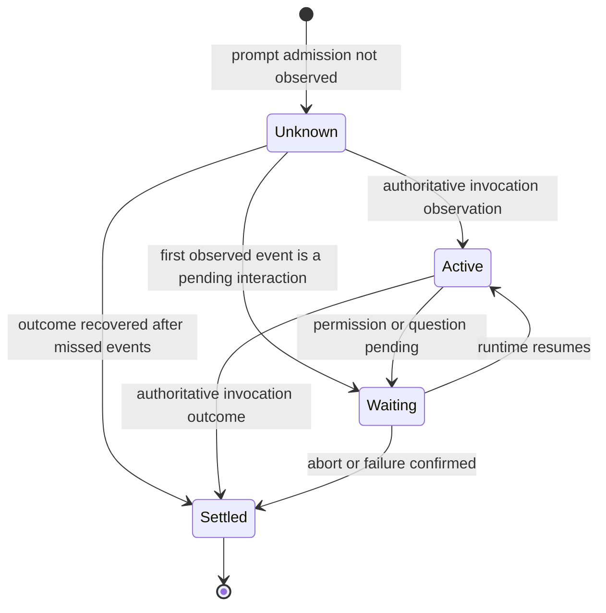
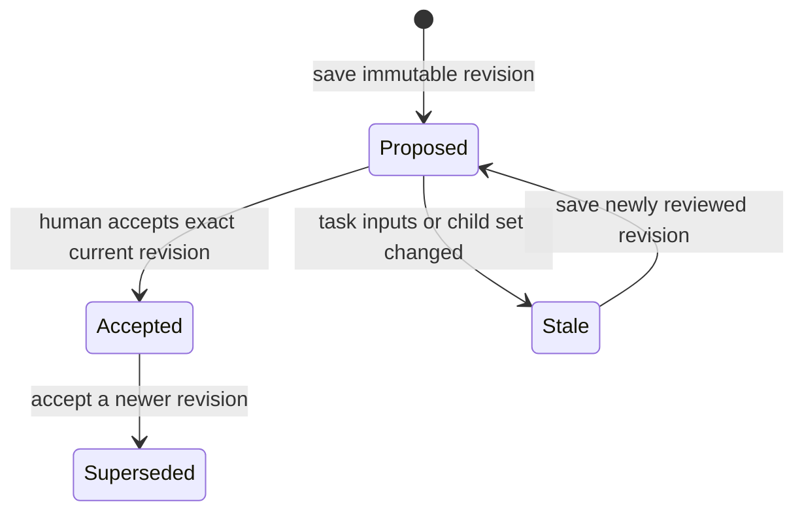
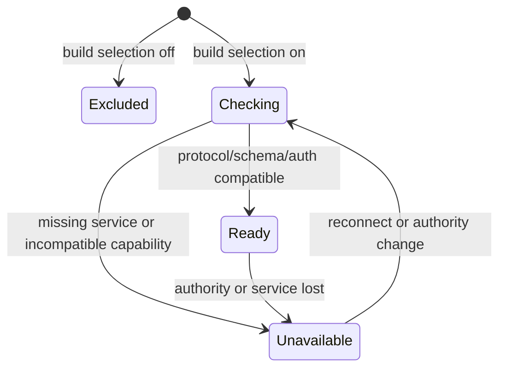

# Tasks — Low-Level Design

**Direction updated 2026-09-09:** [One agent, scoped context and memory](2026-09-09-001-claxedo-single-agent-context-memory-direction.md) is authoritative. This document covers the Tasks foundation for @claxedo; it does not specify the complete cross-surface learning system.

Execution references: [technical implementation plan](2026-09-08-006-feat-tasks-implementation-plan.md), [acceptance journeys and live verification](2026-09-08-007-feat-tasks-acceptance-journeys.md), and [goal.md](../../goal.md). The implementation plan qualifies canonical runtime admission, host authority and build/test wiring; its pending gates are not implemented guarantees.

## 1. Contract and implementation policy

This specifies the proposed `@claxedo/tasks` package and its first Claxedo adapters. [The high-level design](/Users/yashvardhansingh/test/opencode/docs/plans/2026-09-08-004-feat-tasks-high-level-design.md) owns product scope and current-code evidence. Names and signatures below are proposed implementation contracts, not claims that these APIs exist today. Type sketches omit routine DTO fields but must preserve the stated invariants.

The package owns domain validation and transitions. Hosts implement infrastructure capabilities. A host adapter must not invent task status policy, plan acceptance rules, or an alternate launch state machine. The library must not use host globals, filesystem paths, cookies, D1 bindings, or session SDK imports internally.

Only current stacks are implemented: Solid/shared UI, Hono, SQLite for Node/local, D1 for Workers, existing auth and session owners. Conformance tests cover both real stores. An in-memory fake is test support only and cannot be selected by production composition.

## 2. File and dependency layout

All paths in this tree are relative to `/Users/yashvardhansingh/test/opencode`. Files are introduced with the slice that needs them.

```text
packages/claxedo-tasks/
  package.json
  src/
    index.ts                     service/domain exports only
    contracts.ts                 validated wire DTOs, commands, errors
    domain/
      task.ts                    task fields and status rules
      plan.ts                    revisions, acceptance, proposal rules
      run.ts                     admission checkpoints and outcomes
      activity.ts                allowed entry payloads and attribution
    ports/
      store.ts                   scoped queries and atomic commit contract
      authorization.ts           verified-context policy checks
      projects.ts                project/target/config resolution
      execution.ts               stable create/submit/inspect/abort contract
    service/
      create-task-service.ts        dependency binding; public command methods
      tasks.ts                   task commands and parent constraints
      plans.ts                   save and accept revisions
      runs.ts                    accept/drive/resume/cancel an invocation
      activity.ts                comments and history queries
      context.ts                 bounded, versioned invocation input
      command.ts                 replay and concurrency protocol
    http/
      index.ts                   createTaskRoutes with Hono
      routes.ts                  DTO parsing and result/status mapping
    client/
      index.ts                   typed client; host fetch required
    solid/
      index.ts                   TasksSurface exports
      ports.ts                   client, catalog selectors, navigation
      tasks-surface.tsx      board/detail composition
      task-board.tsx             columns and status actions
      task-list.tsx              dense grouped rows over the same query
      task-display-menu.tsx      list/board and metadata preferences
      task-create-dialog.tsx     title, description, property chips
      task-detail.tsx            document body and properties composition
      task-properties.tsx        project, status, latest run
      plan-panel.tsx             revision/proposal review
      activity-panel.tsx         attributed timeline and comments
      queries.ts                 query keys and lifecycle
      styles.css                 explicit, feature-local stylesheet
    schema/
      manifest.ts                schema version and explicit migration list
      001-tasks.sql              tasks/commands/activity as needed
      ...                        later slices add their tables explicitly
    conformance/
      index.ts                   reusable store/host acceptance cases
    test-support/                fakes, fixtures; never root exports

packages/claxedo-server-core/src/tasks-host/
  sqlite-store.ts                Node-only TaskStore implementation
  sql-commit.ts                  SQL encoding shared by SQLite and D1
  scope.ts                      current authority to library scope mapping
  contracts.ts                  host-only composition types if shared

packages/claxedo-local-server/src/tasks/
  composition.ts                local ports, lifecycle, route contribution
  execution.ts                  local runtime adapter

packages/claxedo-server/src/tasks/
  d1-store.ts                   Worker-safe store adapter
  authorization.ts              verified principal/project policy bridge
  execution.ts                  machine/managed runtime bridge
  composition.node.ts           Node host composition
  composition.cf.ts             D1/Worker composition
  mcp.ts                        optional tools for existing MCP composition

packages/claxedo-app/src/app/integrations/tasks/
  contribution.tsx              enabled-only surface/command registration
  ports.ts                      host fetch, project UI, session navigation
  selection.ts                  task route/deep-link interpretation

script/tasks-build.ts         selected enabled/disabled entry resolution
script/product-boundary/...       extend existing checks, not another scanner
```

One library contains feature UI and behavior. No second feature implementation is created under `claxedo-app/src/features`. Application integration is wiring only. Shared `@opencode-ai/ui` controls may be imported by `/solid`; application-private UI controls are passed as narrowly scoped slots only when necessary. Do not copy the existing large session app-port bag.

Exports: `.` (server service and domain), `/contracts`, `/http`, `/client`, `/solid`, `/styles.css`, `/schema`, and `/conformance`. `/schema` exposes resources/version metadata but performs no initialization. `/contracts` and `/client` are browser-safe. Root and `/http` are Worker-safe. `/solid` may depend on Solid, `@tanstack/solid-query`, and individual shared UI exports. The host provides the query client and existing theme context.

No root barrel reexports UI, CSS, conformance fixtures, SQL drivers, or host code. No package import has initialization side effects. The SQL compiler is host infrastructure: it implements the package's closed commit vocabulary for both current stores; it is not a user-extensible SQL/query language.

## 3. Identity and authorization

```ts
type Scope = { authorityId: string; scopeId: string }
type Actor =
  | { kind: "human"; id: string }
  | { kind: "agent"; id: string; sessionRef: string; onBehalfOf: string }
  | { kind: "system"; id: string }

type RequestContext = {
  scope: Scope
  actor: Actor
  authorizationHandle: unknown // opaque, request-lifetime host evidence
}

interface AuthorizationPort {
  authorize(ctx: RequestContext, operation: Operation, resource: Resource): Promise<void>
  readableProjects(ctx: RequestContext): Promise<ProjectReadConstraint>
}
```

The host authenticates at ingress and constructs context. Request bodies cannot choose actor, scope, role, or authorization handle. A scope-bound store is provided for that context. The service still calls authorization for domain operations, so an in-process call or MCP tool cannot bypass route checks.

Every service call verifies that context scope exactly matches the bound store scope. Receipt keys use a namespaced actor key including actor kind and stable identity; human and agent identifiers cannot collide. Authorization handles are neither serialized in records nor logged as activity.

Hosted `scopeId` is derived from current organization authority. Local scope is explicitly installation-bound; undefined never means “all tenants.” All store keys and joins include scope. Project read constraints are applied in SQL before pagination and aggregation; filtering an unauthorized page after reading it is not acceptable. Task details, plans, run input, comments, and parent progress require the same project access.

Initial policy: task read follows project read; task edit/start follows the host's corresponding project/session policy; plan acceptance and explicit completion are human actions. No new role-management UI is introduced. Future automation can receive explicit authority without changing the human default.

Execution settings and applicable instructions are resolved through existing host policy. This Tasks slice adds no profile administration or organization-role extension solely to support named bots. Context/memory administration follows the separate single-agent design workstream and must reuse canonical authority.

An agent task credential is derived by the existing first-party MCP/runtime credential path and mapped to the persisted run. It may read its bound task and allowed parent context, comment, and propose a plan/breakdown. It cannot approve its own plan, change host settings, change project, mark the task Done, or start arbitrary siblings. Server-side binding determines actor/session identity, not a model-provided `actorId`.

The host rechecks execution authority immediately before external create/submit/abort operations. Revocation makes further work fail closed. Replaying a stored command result also requires current read/action authorization; the command ledger is not an information bypass.

## 4. Durable records

IDs are opaque host-generated stable strings. Display titles are not identifiers. Revisions are positive integers checked optimistically. Timestamps are server-generated UTC milliseconds; activity order uses a store sequence, not timestamp ordering.

### 4.1 Task and execution configuration

```ts
type Task = {
  id: string
  revision: number
  contentRevision: number
  projectId: string
  workspaceId: string | null
  parentTaskId: string | null
  title: string
  description: string
  acceptanceCriteria: Array<{ id: string; text: string; checked: boolean }>
  status: "todo" | "doing" | "needs_you" | "done"
  archivedAt: number | null
  activeRunId: string | null
  latestPlanRevisionId: string | null
  acceptedPlanRevisionId: string | null
  childSetRevision: number
  createdAt: number
  updatedAt: number
}

type ExecutionConfig = {
  harness: { access: "native" | "acp"; id: string }
  model: { providerId?: string; modelId: string } | null
  instructions: string | null
}
```

Harness/model DTO translation is the host's responsibility; `acp` identifies an existing host connection, not credentials embedded in execution settings. Omitted model means use the selected harness's actual default, resolved and recorded before admission when the harness exposes it. When it cannot expose the effective default, record `host-default` plus configuration version honestly; do not synthesize a model identity. Execution readiness reports this distinction.

`contentRevision` changes when title, description, acceptance-criteria text, or project/target changes. Status, comment, execution observations, and criterion checked-state changes do not invalidate a plan's input automatically. `revision` tracks user-editable task record mutations and structural changes. Comments/activity do not advance task revision just to order the timeline. Acceptance of a breakdown checks `childSetRevision` separately.

Parent rules: same scope/project, depth at most one, no self-parenting, and no child under a Done/archived parent. A task with children cannot become a child. Parent/project relationships are checked in the same commit as the write. A child inherits a copy of project/workspace at creation; changing a child's workspace within that project is explicit. Project changes are refused while children are attached or a run is unresolved. Detaching a child records activity on both records and permits later independent project changes.

Status or structural changes to a child advance its parent's `childSetRevision` in the same commit. Parent completion verifies that exact child-set revision and all nonarchived children are Done. Archiving unfinished children is an explicit history-preserving scope change, never an automatic way to make progress green.

Completion also requires checked acceptance criteria and no unresolved task-owned run. Empty criteria are allowed for small tasks; explicit completion remains a human judgment. Child creation, restoration, or reopening checks the parent status/version inside the commit. Archiving a task requires no unresolved run and no nonarchived children; the UI does not cascade archives. Restoring a child checks that its parent is available and reopened as needed, or requires explicit detachment. Archived records are excluded from ordinary lists but retained for authorized history and receipts.

Changing scope/criteria or unchecking a criterion on a Done task requires reopening it first. Comments and history inspection remain available. Task completion reads the current record and child-set predicates; a concurrent edit cannot leave a newly unchecked task silently marked Done.

ExecutionConfig is a per-invocation value resolved from host settings and supported overrides, not a saved named entity or a Tasks catalog. Already accepted intents retain their effective configuration and input snapshot; resume still checks current access and target readiness.

### 4.2 Plan revision and proposed children

```ts
type PlanRevision = {
  id: string
  taskId: string
  number: number
  basedOnContentRevision: number
  basedOnChildSetRevision: number
  body: string
  proposal: Array<{
    key: string
    title: string
    description: string
    acceptanceCriteria: Array<{ id: string; text: string; checked: false }>
  }>
  author: Actor
  sourceRunId: string | null
  createdAt: number
}

type PlanAcceptance = {
  id: string
  taskId: string
  planRevisionId: string
  actor: Actor
  createdTaskIdsByProposalKey: Record<string, string>
  createdAt: number
}
```

Plan content is Markdown text stored with the task catalog. There is no dependency on optional Documents service availability. UI renders Markdown safely; HTML/script execution is not a plan feature. Revision content is immutable. Editing creates a new revision and updates `latestPlanRevisionId` with a task revision check.

Acceptance names the exact revision and selected proposal keys. It inserts accepted children and acceptance/activity records and updates the accepted pointer in one commit. Proposal keys are unique within the revision; `(taskId, planRevisionId)` may be accepted once. Repeating the command returns the same child identities. Do not create tasks incrementally across network calls.

Initial acceptance supports at most 20 proposed children in one revision and creates selected children only. It does not edit/delete existing children or reconcile them by matching titles. A later revision that changes existing work leaves those changes for explicit task commands. Accepting a newer plan preserves previous acceptances and children and does not silently recreate previously accepted proposals. The reviewer must see which proposed items are additional; revising only prose can use an empty proposal.

Stale content/child-set revisions produce a conflict and show the changed inputs. A human may save a reviewed new revision against current inputs and then accept it. There is no force-accept switch that quietly relabels stale analysis as current.

### 4.3 Run

```ts
type Run = {
  id: string
  revision: number
  taskId: string
  kind: "planning" | "execution"
  requestedBy: Actor
  effectiveConfiguration: ExecutionConfig
  target: { projectId: string; workspaceId: string; executionTarget: unknown }
  taskContentRevision: number
  planRevisionId: string | null
  inputSnapshot: InvocationInput
  inputHash: string
  operationId: string
  sessionIdentity: string
  sessionRef: string | null
  messageId: string
  admission: "accepted" | "session_ready" | "prompt_accepted" | "failed" | "cancelled"
  driver: "ready" | "driving" | "needs_resume"
  leaseGeneration: number
  leaseExpiresAt: number | null
  execution: "unknown" | "active" | "waiting" | "settled"
  outcome: "completed" | "failed" | "aborted" | null
  lastObservationCursor: string | null
  lastObservedAt: number | null
  settledAt: number | null
}
```

Opaque `executionTarget` is host-produced serializable placement identity, validated by the host on use. It must not contain credentials. Treat `unknown` in these type sketches as an explicit host contract to be narrowed in its implementation, not arbitrary JSON accepted from the browser.

Each accepted task invocation has a stable registration operation/session identity and message identity allocated before external effects. `sessionIdentity` is the prepared create target even while `sessionRef` is null; the latter becomes usable after authoritative registration. Continuing an eligible linked session uses a new run/message ID and the same session reference. The host rejects continuation when the session target/configuration is incompatible; it does not silently create a different session.

Only one unresolved task-owned run is permitted per task. A unique database constraint backs this rule. A run remains unresolved after a timeout, missing observation, or permission/question wait. It becomes resolved only after definitive pre-admission failure/cancellation or an authoritative outcome for its admitted invocation. The parent and each child may have independent runs; this phase does not coordinate a global execution queue.

`completed` means the invocation completed, not that the task is accepted as Done. Manual continuation in an ordinary linked session remains visible there but is not invented as a task run. UI distinguishes latest task invocation from current linked-session activity. This feature does not promise exclusivity over all manual work in all historical sessions.

### 4.4 Activity, comments, and command receipts

`ActivityEntry` contains `id`, scoped monotonic `sequence`, `taskId`, `actor`, `type`, `payloadVersion`, a validated type-specific payload, and `createdAt`. Event types include task created/edited/status changed, child attached/detached/changed, plan saved/accepted, comment added, run accepted/admitted/settled, and cancellation confirmed.

Comments are append-only activity entries in the first version. There is no separate editable comment table or edit UI. A correction is another comment. Administrative retention/deletion is a host maintenance concern, not an agent API. Effective execution configuration is frozen in runs; task activity references accepted invocations rather than logging unrelated host settings changes.

Change payloads contain changed field names, relevant before/after scalar values, and references to immutable plan/run revisions. Do not duplicate complete large descriptions and plan bodies in every timeline row. This is an operational history, not an event-sourced reconstruction of every historical task body.

`CommandReceipt` contains scope, actor identity, request ID, command name, canonical payload hash, result references, and commit sequence. `(scope, actor, requestId)` is unique. Receipt/result references persist for the catalog lifetime in this phase; do not expire launch deduplication records behind a retryable client. Referenced archived entities remain addressable under authorization.

## 5. Service and ports

```ts
function createTaskService(deps: {
  store: TaskStore // bound to one verified scope
  authorization: AuthorizationPort
  projects: ProjectPort
  execution: ExecutionPort
  newId(kind: string): string
  now(): number
}): TaskService

interface TaskService {
  query(ctx: RequestContext, query: TaskQuery): Promise<QueryResult>
  execute(ctx: RequestContext, command: TaskCommand): Promise<CommandResult>
  driveRun(ctx: RequestContext, runId: string): Promise<RunView>
  inspectRun(ctx: RequestContext, runId: string): Promise<RunView>
}

interface TaskStore {
  readonly scope: Scope
  read(query: StoreQuery): Promise<StoreRead>
  lookupCommand(actorId: string, requestId: string): Promise<CommandReceipt | null>
  commit(mutation: PreparedMutation): Promise<CommitResult>
}
```

`TaskCommand`, `StoreQuery`, and `PreparedMutation` are closed typed unions. Query/execute are dispatch façades over small named domain functions, not an arbitrary command bus. `PreparedMutation` names expected record versions/absence predicates, allowed row inserts/updates, activity, and a command receipt. It contains no SQL, callbacks, arbitrary table names, or network operations. Store ports describe guarantees, not just CRUD convenience.

Internal run checkpoints use the same atomic commit primitive with a separate trusted receipt namespace, keyed by run, checkpoint/observation identity, and generation where relevant. They cannot masquerade as human commands or skip scope checks. Repeated runtime observations deduplicate their receipt/activity even when independent host instances inspect the same run concurrently.

```ts
interface ProjectPort {
  resolve(ctx: RequestContext, input: {
    projectId: string
    workspaceId: string | null
    configuration: ExecutionConfig
  }): Promise<ResolvedTarget | TargetChoiceRequired>
  validateConfiguration(ctx: RequestContext, configuration: ExecutionConfig): Promise<void>
}

interface ExecutionPort {
  prepareIdentity(ctx: RequestContext, input: InvocationIdentityInput): Promise<InvocationIdentity>
  ensureSession(ctx: RequestContext, invocation: FrozenInvocation): Promise<SessionReceipt>
  ensurePrompt(ctx: RequestContext, invocation: FrozenInvocation & SessionReceipt): Promise<PromptReceipt>
  inspect(ctx: RequestContext, identity: InvocationIdentity): Promise<ExecutionInspection>
  cancel(ctx: RequestContext, identity: InvocationIdentity): Promise<CancellationResult>
}
```

`prepareIdentity` allocates/validates identity and capabilities without provisioning or prompt submission. The run persists those identities before `ensureSession`. The two ensure operations must be idempotent for their identity and input hash at the authoritative producer. A conflicting hash is an error, never another invocation. Inspect is read-only with respect to execution: it can repair task-side receipts, not cause missing work to run.

Cancellation must distinguish `cancelled_before_admission`, `abort_requested`, `already_settled`, and `unknown`. A successful HTTP response to an abort request is not by itself a terminal invocation outcome. Old driver generations cannot update current run state; cancellation must also fence admission at the authoritative execution owner, not merely change a task row.

The initial adapter may advertise no safe pre-admission cancellation until the runtime contract supports it. In that case the UI offers Inspect/Resume and reports cancellation unavailable; it must not pretend that the outstanding request was cancelled. Launch implementation acceptance requires this limitation to be visible and covered, or the canonical runtime to be extended.

There is no global `start()` scheduler hidden in library construction. Driving is explicitly invoked by the authenticated command handler. Node may await it; Workers may use a bounded host execution context after committing acceptance. Correctness never depends on a background callback surviving host termination. Long-term unattended retry belongs to a later explicit host scheduling adapter.

## 6. Atomic storage and concurrency

### 6.1 Schema responsibilities

Feature tables use the `tasks_` prefix. The package owns versioned logical schema/migration resources; hosts explicitly stage and execute them using their deployment lifecycle. Local schema lives in `tasks.sqlite` under the host data path. Hosted schema lives in the existing `CONTROL_PLANE_DB`, not `AUTH_DB` or workspace disk.

Tables introduced across slices: `tasks`, `plan_revisions`, `plan_acceptances`, `runs`, `activity`, and `commands`, all prefixed. Scope columns participate in every primary/foreign key and uniqueness check. Indexes serve project/status lists, parent children, task activity sequence, task runs, and command replay. A partial unique index prevents two unresolved runs for the same scoped task. Constraints cover parent nonidentity and valid enums; service/read-set checks enforce the relational rules that cannot be expressed by a simple check constraint.

Activity sequence is assigned transactionally by the store; gaps are allowed. Client cursors carry scope/access context and are opaque. An implementation may use the activity table's integer sequence, but may not rely on wall clocks or array order for replay.

Initial list pages default to 50 and cap at 100. Title is limited to 200 characters; task description and individual plan body to 64 KiB UTF-8; comment to 8 KiB; invocation instructions to 16 KiB. Plan proposal limit is 20 children with bounded task fields. These are proposed shared contract constants, enforced by all transports. The D1 implementation must prove its largest accepted commit fits platform limits; reduce the common bound before release if necessary rather than half-committing a proposal.

The store feasibility gate also fixes aggregate request-byte and collection bounds, including acceptance criteria; individual text limits do not permit unbounded arrays. Enforce transport size limits before unbounded parsing and qualify the full encoded mutation, not only each record separately.

### 6.2 Command protocol

1. Parse and validate input; resolve verified context and current authorization.
2. Look up `(actor, requestId)` in the scoped store. Same name/hash returns existing result references after reauthorization. Different payload/name returns `request_id_conflict`.
3. Read the relevant task/parent/plan/run records and verify expected revisions.
4. Perform side-effect-free host target/config checks where required. No session create, network dispatch, or provisioning inside a database transaction.
5. Compute the domain change, activity, and receipt. Include all read-set predicates whose truth the change relies on.
6. Commit them atomically. On a concurrent duplicate command, reread its receipt. On a revision conflict, return a conflict with currently authorized record versions; do not silently replay the user's edit against changed inputs.
7. Return committed result references and new versions. For accepted runs, drive separately after commit.

Reads used to enforce aggregate conditions must be protected: child create/status/reparent updates touch the parent's child-set version; parent completion checks it. Run acceptance checks task versions and absence of an unresolved run, and persists the exact host-resolved configuration. Later defaults do not rewrite that accepted input. Comment writes do not force unrelated task edits to conflict.

### 6.3 SQLite and D1

SQLite uses a short transaction around predicate verification and writes. D1 uses a single prepared-statement batch with the same semantics. Cloudflare documents batch rollback when a statement fails; an update affecting zero rows is not a statement failure. Therefore inspecting `meta.changes` after a batch has committed is too late to protect subsequent activity inserts. [D1 batch semantics](https://developers.cloudflare.com/d1/worker-api/d1-database/#batch).

Proposed D1 encoding: the first statement inserts the command receipt with a checked guard column (`CHECK(preconditions_met = 1)`). Its value is computed inside SQL from the expected-version/absence predicates. A failed predicate raises a constraint error and rolls back the whole batch. Following statements perform the already guarded mutations and activity inserts. The unique command key handles same-request races. The guard compiler only accepts the library's finite record predicates and parameterizes every value.

Use the same guarded encoding or equivalent transaction checks in SQLite. The conformance suite must prove exact errors, full rollback, duplicate receipt replay, and parent/run constraints under concurrent independent connections/Worker requests. This encoding is a proposed implementation to validate, not an already tested D1 adapter.

Node does not expose an async transaction callback to the library, and the library never assumes D1 can hold a transaction open across JS awaits. Cache or replica reads may be stale; in-transaction primary predicates remain authoritative. Mutation responses return committed DTO versions so the UI need not wait for a stale read to catch up.

## 7. Launch, observation, and recovery

### 7.1 Start sequence



HTTP acceptance can return before driving completes. The host owns continuing bounded work after the response; if it cannot, it drives before returning and still relies on the committed receipt for a lost response. There is no browser-only launch coordinator.

Start accepts one frozen invocation and its activity/receipt atomically. Starting from `needs_you` moves the task to Doing; a planning invocation leaves business status unchanged. A Done task must be explicitly reopened before any new task-owned invocation.

### 7.2 Admission state machine

```mermaid
stateDiagram-v2
    [*] --> Accepted: atomic intent commit
    Accepted --> SessionReady: authoritative create receipt
    SessionReady --> PromptAccepted: authoritative admission receipt
    Accepted --> Failed: definitive no-admission failure
    SessionReady --> Failed: definitive rejection; preserve session link
    Accepted --> Cancelled: authoritative fence confirms no admission
    SessionReady --> Cancelled: authoritative fence confirms no admission
    PromptAccepted --> PromptAccepted: replay returns same receipt
```



Admission checkpoints never move backward. A timeout does not transition to Failed. `driver` becomes `needs_resume` and the last confirmed checkpoint remains. A short store lease serializes cooperating drivers; its generation fences task-store checkpoint writes. Lease expiration alone does not cancel an external request, which is why runtime idempotency remains mandatory.

### 7.3 Invocation outcome machine



Connection loss changes freshness to unavailable; it does not erase the last confirmed state or manufacture a terminal outcome. Observations carry exact invocation identity and an authoritative ordering token. The adapter normalizes runtime events into this contract; it cannot infer success from socket closure, elapsed time, or a text summary. If a runtime lacks ordering/terminal evidence, the adapter must reconcile through canonical runtime state or report Unknown.

An authoritative terminal observation atomically updates the run, records activity, and clears `activeRunId` only when it still names that run. A stale event for an older run cannot clear a newer run or change task business status. Intermediate token/tool events are never task activity.

### 7.4 Failure matrix

| Interruption | Durable truth | Allowed recovery |
|---|---|---|
| Before intent commit | No accepted run | Retry original command |
| After commit, before create | Accepted intent with identities | Inspect; explicit Resume start can create |
| Create succeeded, receipt write lost | Runtime owns known session identity | Inspect recovers link; ensure uses same identity |
| Prompt accepted, response lost | Runtime may already be working | Inspect same message; never submit a new message ID |
| Runtime unavailable | Last checkpoint plus stale observation | Show Unavailable; keep unresolved ownership |
| Permission/question wait | Admitted invocation remains open | Open existing session controls |
| Abort requested, no terminal evidence | Cancellation pending | Inspect; no fresh task run yet |
| Definitive prompt rejection after create | Failed invocation with existing empty session | Preserve link; explicit new run or authorized continuation |
| Host settings changed after acceptance | Frozen old configuration | Accepted run retains snapshot |
| Access revoked | Records preserved but inaccessible as policy requires | No further effects; a currently authorized user must recover |
| Feature disabled and re-enabled | Catalog and ordinary sessions survive | Read-only reconciliation; no automatic replay |

No new runtime-specific event is synthesized to repair missing producer evidence. The canonical session/turn producer is the change point where a required receipt or ordering contract is missing.

## 8. Planning and context contracts

### 8.1 Context assembly

`buildInvocationInput` is a pure library function over authorized records. It includes task identity/content, invocation kind, accepted plan revision when relevant, a compact parent objective for a child, and explicit instructions for proposing task changes. It records exact included versions and content hash. It does not concatenate all activity, every plan revision, sibling conversations, or unrelated knowledge.

The host applies resolved invocation instructions using the harness's supported configuration path and contributes ordinary workspace instructions through existing runtime behavior. The library does not re-inject those instructions as another full prefix. Unsupported instruction/model settings are rejected before acceptance or clearly reported by capability resolution; they are never silently dropped. Continue adds one bounded block for its new invocation without concatenating earlier task blocks. A harness may require the system configuration again on each turn; this is distinct from duplicating it in the user prompt or assuming it persists automatically in the session.

The initial invocation payload budget is 24 KiB UTF-8 excluding host-managed system/tool configuration. Include required task content first, then a bounded parent/plan reference summary. When a body does not fit, include its ID, revision, size, and an explicit instruction to fetch it with a paginated task tool; never silently truncate acceptance criteria. Tool reads return versioned sections with explicit continuation cursors. Invocation instructions are separately bounded and supplied once through configuration.

The persisted invocation snapshot includes the complete bounded source task/criteria and selected parent/plan content, separately from the assembled prompt. Run-scoped section reads serve that frozen snapshot under current authorization. A later task edit therefore cannot make the agent fetch different content under the old revision number. Live task reads are explicitly labeled current; an agent proposing against newer inputs must reread them and identify that content revision. General historical task-body storage is not required beyond these invocation snapshots and immutable plans.

The package caches validated records/context by scope/access epoch, task content revision, plan ID, and effective configuration/input hash. These are local computation caches only. Model prompt caching remains the harness/provider's responsibility; stable ordering helps but the package makes no token discount guarantee.

### 8.2 Plan state machine



Stale/superseded are derived views of immutable revisions and current pointers. The Stale-to-Proposed arrow creates a new record, not an in-place revision rewrite. Saving a newer unaccepted proposal does not delete the accepted plan. Execution uses the accepted revision unless the user explicitly chooses a different reviewed input.

A pending proposal checks both captured content and child-set revisions. An accepted plan's content becomes stale when task content changes; its own accepted child inserts or subsequent child progress do not invalidate it. Starting execution with a stale accepted plan returns `plan_stale` until a newly reviewed revision is accepted. Starting without any accepted plan is allowed for a small task. These checks do not rewrite the inputs of an already accepted run.

### 8.3 Agent integration

The package exposes ordinary service commands used by the host's existing MCP tool registration: task read, section read, comment, propose plan. Subtask proposals travel as part of a plan revision. Human APIs additionally expose acceptance, start, completion, and project changes. No second MCP server process or OAuth flow is introduced.

Transport wrappers validate tool inputs and call the same service; they do not duplicate domain logic. Runtime credential verification and run-to-session lookup happen before the service sees an agent context. Continue can reuse a session across runs, so session identity alone is insufficient: task writes also require authoritative invocation binding. An agent-supplied run ID is only a selector to validate against that binding. Use the existing MCP `registerTools` contribution option; do not create a second registry or grant a runtime token full-user authority. The feature-off build registers no task tools or task context prefix.

## 9. API and client

Proposed route family: `/api/claxedo/tasks`. Hono handlers are exported from the library and mounted as a `ControlPlaneRouteContribution`; the host supplies request-context resolution. Existing outer browser security, CORS, and authentication remain in force.

| Endpoint | Meaning |
|---|---|
| `GET /capabilities` | Protocol/schema and supported task actions for the current host |
| `GET /tasks` | Authorized paginated board/list summaries |
| `GET /tasks/:id` | Task detail and versioned references |
| `GET /tasks/:id/children` | Authorized child summaries and aggregate revision |
| `GET /tasks/:id/activity` | Ordered paginated comments and changes |
| `GET /tasks/:id/plans` | Revision metadata; bodies fetched explicitly |
| `GET /plans/:id` | Exact authorized immutable plan revision |
| `GET /tasks/:id/runs` | Paginated invocation history for this task |
| `GET /runs/:id` | Run view and last confirmed observation |
| `GET /runs/:id/input/:section` | Paginated frozen invocation section under current task access and agent invocation binding where applicable |
| `GET /commands/:requestId` | Current actor's committed result references |
| `POST /commands` | Closed union of typed domain commands |

Command names: `task.create`, `task.edit`, `task.set_status`, `task.reparent`, `task.archive`, `task.restore`, `comment.add`, `plan.save`, `plan.accept`, `run.start`, `run.resume_start`, `run.inspect`, and `run.cancel`. `run.start` accepts supported execution overrides and has mode `new_session` or `continue_session`. An execution-affecting command is never represented by a GET. Read-side automatic inspection uses a host read-only execution query; the explicit inspect command can persist recovered receipts.

Every mutation carries `requestId` and the required expected revisions. A successful accepted execution returns 202 with its run/result reference; ordinary committed mutations return 200/201. Validation uses 422; unauthenticated 401; unauthorized 403 or host non-disclosure 404; missing 404; stale/duplicate-payload conflict 409; host unavailable 503. A 503 after an ambiguous external operation includes the known run ID when authorized; it does not label that operation failed.

The client retries safe reads. A lost mutation response is recovered using the same request ID; editing the payload creates a new request ID after conflict handling. `run.resume_start` is a separate explicit command referring to the original run and its frozen invocation. Do not overload replay of `run.start` to trigger additional execution effects.

## 10. Solid UI and caches

```ts
type TasksUiPorts = {
  client: TasksClient
  cachePartition: Accessor<string> // authority + scope + access epoch
  projects: ProjectSelectionPort
  executionConfiguration: ExecutionConfigurationSelectionPort
  openSession(ref: SessionReference): Promise<void>
  openTask(id: string): void
}
```

The surface receives a query client from the host. Query keys start with `tasks`, authority/scope/access epoch, then entity/filter/version. A task board requests summaries, not plan bodies and activity for every card. Detail sections load on demand. Mutations update returned entities and invalidate affected lists, parent aggregates, and timeline queries.

Initial freshness uses bounded polling while the surface is visible plus refetch on focus and mutation. Poll a visible unresolved run more frequently than an idle board; proposed intervals are 3 seconds for unresolved runs and 15 seconds for the board, with one in-flight request per key. Background/unmounted surfaces stop polling. A request failure keeps stale data visibly marked and uses bounded backoff; it does not clear the board or mark runs settled.

Polling works in both current stores and does not require a new broker or Durable Object. A later push adapter may publish invalidation hints; the catalog and sequence remain authoritative. Activity pagination uses a captured high-water mark for history and a separate `after` cursor for new entries, deduplicating by entry ID.

Logout, authority switch, or access-epoch change cancels requests, clears the old cache partition, and closes unauthorized task detail. A late response may update only the partition that issued it. Native/hosted app composition owns those identity notifications.

The detail UI uses a continuous document column for description, acceptance criteria, Plan, Subtasks, and Activity, with properties and a compact latest-run/session link on the right. Plan revisions and run history open on demand from those sections. These are not five mandatory detail tabs. Session conversation, permissions, and questions open through `openSession`; there is no second session transcript renderer. Board status can be changed with keyboard/menu controls; drag-and-drop invokes the same command. A pending drag displays pending state and reconciles/rolls back on a failed commit.

Start resolves existing host execution defaults; optional advanced controls use current harness/model catalogs without saving a named bot. Task creation displays its project; children visibly inherit it. No hidden directory selection or agent-created workspace is introduced.

### 10.1 Collection layout and query semantics

The supplied screenshots are the layout reference described in HLD section 4.6. `task-list.tsx` and `task-board.tsx` consume the same summary contract and mutation client. The initial collection opens All tasks in Board mode; user selection is retained thereafter. Presets are filters, not stored task lifecycle states:

| Preset | Included nonarchived task statuses |
|---|---|
| Active | `doing`, `needs_you` |
| Backlog | `todo` |
| All tasks | `todo`, `doing`, `needs_you`, `done` |

The toolbar shows the current project scope and offers project filters. Display initially exposes List/Board, ordering by updated time/created time/title, show subtasks, show empty status groups, and supported metadata visibility. Grouping is fixed to status in this release; no disabled subgrouping controls or unsupported priority/label menus are rendered. Status icons always have a text label in headers and accessible control names.

An explicit archive filter provides access to retained tasks and Restore; Active, Backlog and All tasks continue to exclude archived records. Drag changes status through the same guarded command as the accessible status menu; manual rank ordering is not part of this release.

The store query must return authorized group counts and a separate cursor per requested status group. A single global page must not masquerade as a complete board when one status consumes the page. Counts include the exact preset, project filter, and show-subtasks setting; they count matching task records, not completed-parent percentages. Each group uses the common page bounds, with stable ID as the ordering tie-breaker. List and board preserve selection and loaded records when toggled; changing filters resets incompatible cursors. Board columns scroll vertically within the surface, with horizontal scrolling for columns that do not fit. The host shell must not gain a second horizontal scrollbar.

List rows and cards show the task title, status, project when useful across projects, and compact child progress. Show-subtasks is off initially so the collection presents parent work once; child progress remains visible. When enabled, children appear as independently actionable rows/cards with a parent reference. A clipped display ID is not a new identity scheme; full stable IDs remain available for copy and API use.

Collection preferences are per user and authority/scope, separate from task data. Extend `TasksUiPorts` with a small preference read/write port backed by current host persistence. No shared organization default or new settings service is introduced. Restoring a preference cannot override server capabilities or grant access to a hidden field/project.

### 10.2 Task detail layout and navigation

At wide pane widths, use a centered readable content column and an approximately 280–320 px right properties panel with a subtle divider. Size from the allocated pane, not the whole browser window. Below approximately 900 px of available width, move properties into an accessible collapsible section near the title; content never requires horizontal scrolling. These are initial layout targets to validate in the actual Claxedo pane, not fixed screenshot dimensions.

The compact header contains project/parent breadcrumbs, task identity, and Back. The main title area exposes Plan with agent, Start/Continue or the relevant pending-run action. The body reads description → acceptance criteria → plan → subtasks → activity. Empty optional sections use a concise add/propose affordance. Activity starts with a bounded recent page and loads older entries explicitly; it does not mount an entire task history. The properties panel separates business status from the latest invocation's execution state and last-observed timestamp.

Opening a task preserves collection filters, scroll positions, and focused row/card. Back restores them. A direct task link opens independently and has a collection fallback. A child breadcrumb opens its parent. Property controls update through versioned commands and retain entered values on conflict so the user can compare/retry. Runtime failure messages belong beside the run action/link, not as an invented board status.

### 10.3 Creation and accessibility

The create dialog uses the shared dialog/focus primitives: title autofocus, optional description, project/status chips, and Create task. The schema allows an initial `todo`, `doing`, or `needs_you` status; default is `todo`. This selection describes work and does not start an invocation. A Done-column add action opens To do creation and explains that completion is a later explicit command. Creation activity records the chosen initial state.

Project is required before save; a host project context can visibly prefill it. A child dialog shows its parent and fixed inherited project. Create more clears task-specific text after confirmed success while retaining the chosen project/status; duplicate clicks share one request ID until the outcome is known. Closing a nonempty form asks about discarding its draft. Save errors preserve the draft and display inline. Pressing Escape closes the topmost selector before the dialog; closing returns focus to the originating add control.

Compact presentation must retain keyboard-operable menus, visible focus, readable contrast in the host's light/dark themes, and accessible names for icon-only actions. No status relies on color alone. Agent work is attributed to @claxedo and the actual invoking session, without a persona picker or fabricated presence dots. The screenshots' priority, labels, cycles, notifications, analytics, and team management remain outside this slice unless their underlying contracts are explicitly added.

## 11. Availability state machine

Availability is constrained by current host capabilities, protocol compatibility and target access. Missing execution settings produce a specific preflight reason.



Excluded is a different artifact; changing it requires a build/deploy, not a runtime transition. Runtime Ready never compensates for a mismatched enabled renderer/disabled server. The UI reports that mismatch explicitly.

## 12. Host composition and resource lifecycle

Local/Node enabled composition opens the SQLite catalog lazily on feature initialization, runs only selected feature migrations, and supplies existing authority/runtime services. Worker enabled composition supplies `CONTROL_PLANE_DB`, a request-scoped store/auth adapter, and the existing managed execution dispatcher. There are no SQLite imports in its transitive closure.

The package does not own process shutdown. Host composition disposes store handles it opened and any observation subscriptions. Renderer integration owns surface mount/unmount and identity changes. Temporary driver leases persist in storage; host restart cannot erase an accepted intent.

The generic route contribution contract and application registry remain feature-neutral. Disabled entry selection supplies no task contribution or loader; do not wrap an unconditional task import in `if (enabled)`. A task-specific enabled module may statically import its package so the existing scanner can see the actual graph.

Host SQL migrations are explicitly sourced from `/schema` by enabled build tooling. Disabled builds neither stage nor apply them. Existing data is retained across off/on transitions. Schema mismatch fails feature readiness; it does not run a guessed migration or use a memory store. Missing/deleted canonical projects are marked unavailable under current authorization; re-enabling the feature cannot restore access to them.

## 13. Build qualification

Implement one selector resolved at build time and feed it to renderer, local server, hosted entry selection, migration/resource staging, and Electron packaging. Reuse the existing browser-auth selection pattern and product-boundary tooling. UI-runtime visibility flags are not sufficient.

Required matrix: clean off; clean on; on then off with reused staging; off then on with persisted rows; enabled renderer/disabled server; enabled hosted bundle without SQLite; feature directories unavailable during an isolated off build; packaged desktop resource inspection; selected Node artifact inspection; selected managed Worker deployment dry run.

Off checks cover all chunks, CSS generated by source scanning, static imports and literal dynamic imports, source maps shipped in the artifact, migration SQL, locale/assets, MCP tools, compiled caches, and exclusive packaged dependencies. Tailwind/source globs must not emit feature-only CSS for an excluded package. Enabled builds act as positive controls for absence checks. Generic string/type contracts may remain when required by restored-state handling, but they may not import implementation.

Run `bun run test:architecture-ratchets` for every production import change during implementation. Qualify intentional closure growth with the affected product's full `verify:closure`; do not raise ceilings before inspecting the dependency chain. Documentation-only changes do not add a production import and do not establish these guarantees.

## 14. Acceptance tests by owner

| Owner | Required behavioral cases |
|---|---|
| Library task rules | Explicit status transitions; Done not inferred; same-project/depth rules; effective configuration snapshot behavior |
| Shared store conformance | Atomic task/activity/receipt; exact duplicate replay; stale revision rollback; scope isolation; parent completion racing child create/reopen; two competing starts |
| SQLite adapter | Separate connections, restart persistence, migration off/on, real rollback and uniqueness |
| D1 adapter | Miniflare concurrent requests; guard failure rolls back all statements; stale reads; maximum accepted proposal; no tenant-unscoped query |
| HTTP/auth host | Forged actor/scope ignored/rejected; list pagination/count isolation; revoked access on replay; project change authorization |
| Execution adapter | Lost create response; lost prompt receipt; same IDs recover same invocation; differing hash refused; cancellation/admission race; stop request is not outcome |
| Runtime owners | Real configured model/instructions through supported harness entrypoints; registration and prompt identity survive retry; no synthesized terminal event |
| Planning tools | Agent bound to its task; cannot self-approve/start siblings; stale revision rejected; accepted breakdown creates one set of children and no executions |
| Solid surface | Create/edit/status/comment; list/board parity; accurate paginated group counts; preset filters; keyboard path and modal focus; drag failure recovery; parent count; document/properties layout in narrow panes; plan review; pending start/session link; unavailable state |
| App integration | Correct target session opens; authority-switch late response discarded; unmount does not abort runtime; package UI has no app imports |
| Build/deployment | Every enabled/off artifact case in section 13; deployed hosted session launch and catalog persistence |

Use owning-package tests, not root `bun test`. Add focused suites beside library functions and host adapters. Extend existing session/runtime tests at their authoritative producer when those contracts change. Do not create tests that only assert a task adapter called a mock with an ID and call that duplicate-execution proof.

Real acceptance includes a local task start and a hosted task start through public entrypoints, followed by reopening the task and its session. Miniflare verifies D1/Worker integration, but it does not prove deployed managed workspace provisioning or harness behavior.

## 15. Delivery and unresolved implementation gates

Deliver in the HLD order: optional package boundary; persisted tasks/activity; context/configuration and runs; subtasks; planning. Introduce future tables/entrypoints only when their slice is implemented, while using stable IDs, scope, revisions, and command receipts from the first persistent slice.

Before execution ships, the runtime/host owner must qualify stable session creation, prompt admission replay, and cancellation evidence. Before hosted support ships, the deployment owner must identify the managed release root and qualify its build/resources and actual launch route. Before planning acceptance ships, the store owner must prove the maximum proposal fits a single SQLite/D1 commit. These are concrete acceptance gates, not permission questions or invitations to implement speculative fallback systems.

This design creates no task code or deployed service. Its central boundary is settled: Tasks owns the task capability; current Claxedo hosts provide its infrastructure and retain execution authority.
