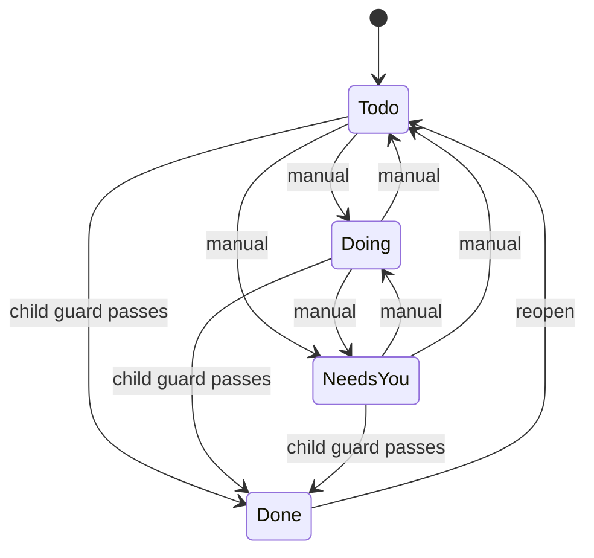

# Tasks and Presets — Low-Level Design

Read the [HLD](2026-09-08-004-feat-tasks-high-level-design.md), [implementation plan](2026-09-08-006-feat-tasks-implementation-plan.md) and [acceptance journeys](2026-09-08-007-feat-tasks-acceptance-journeys.md). Types below are proposed contracts; canonical host reference types are reused rather than redefined as free-form strings.

## 1. Records

```ts
type ConfigurationSlot = "primary" | "planning" | "implementation" | "review"
type ModelConfiguration = {
  harness: HarnessReference
  model: { providerID: string; modelID: string }
  effort: string | null // carried on the wire as the runtime's session-config `variant`
}

type Preset = {
  id: string
  revision: number
  scopeId: string
  ownerId: string
  name: string
  instructions: string
  execution:
    | { placement: "local"; capabilities: { mode: "inherit-local" } }
    | { placement: "cloud"; capabilities: {
        mode: "selected"
        plugins: PluginReference[]
        skills: SkillReference[]
      } }
  configurations: { primary: ModelConfiguration } &
    Partial<Record<Exclude<ConfigurationSlot, "primary">, ModelConfiguration>>
  archivedAt: number | null
  createdAt: number
  updatedAt: number
}

type Task = {
  id: string
  revision: number
  scopeId: string
  projectId: string
  workspaceId: string | null // optional local preference, not cloud placement
  parentTaskId: string | null
  title: string
  description: string
  status: "todo" | "doing" | "needs_you" | "done"
  childSetRevision: number
  archivedAt: number | null
  createdAt: number
  updatedAt: number
}

type TaskSessionLink = {
  taskId: string
  slot: ConfigurationSlot
  attempt: number
  sessionRef: SessionReference
  continuedFrom: SessionReference | null
  presetId: string
  presetRevision: number
  presetNameAtStart: string
  createdAt: number
}
```

The task's former `sessionRef` column is replaced in this unimplemented design by links unique on `(scopeId, taskId, slot, attempt)`. The highest attempt is the slot's current link. Whether that link is live is read from the canonical session owner at request time; Tasks stores no liveness flag. References include the actual backing host/workspace through the canonical host contract. Task links contain no start phase, lease, execution outcome, model trace or transcript. Preset snapshots and capability pins needed by sessions live with the session/workspace owner; the optional package holds only provenance and navigation references.

Presets are personal within the authenticated scope; task access continues to follow project authority. A task collaborator may open an authorized linked session without obtaining access to the preset owner's private instructions. Returning link provenance must not expose private preset contents. Instruction content copied into a session follows that session's access policy; the Start preview shows the destination/access scope so personal instructions are not presented as remaining private after being supplied to a shared session. Archiving a preset hides it from new-start selection and leaves links/sessions unchanged. Hard delete, sharing and published preset versions are deferred. Names are labels, not keys.

Plugin/skill references use catalog identities, never arbitrary paths or client-supplied credentials. Resolve current authorized installed versions at a new start, then pin artifact/source revisions with the session. Future preset starts may resolve newer versions; existing sessions must not silently upgrade on resume. If retained content is unavailable or revoked, explain and block the affected use rather than substitute it.

## 2. Validation and task rules

Preset name is required, max 100 characters; instructions max 64 KiB UTF-8. Exactly one primary configuration and at most one of each optional slot. Bound optional selections to 128 plugin references and 256 skill references, reject duplicate identities and cap total request bytes before parsing. Effort null means no explicit override, not a fabricated universal effort level. Validate explicit values against the chosen harness/model's advertised effort levels. The harness agent is not a preset field; the host resolves it by harness default at start, as the composer does.

Persist structural validity when saving; validate installation, authorization, placement and model availability for the concrete target before start. The API returns specific invalid fields; it never silently drops a skill or substitutes a model. Local presets cannot contain selected capability lists. Cloud selected lists are explicit; an empty set cannot be interpreted as inherit-all. Selecting Cloud requires host cloud capability; local-only hosts may retain an unavailable cloud preset but cannot launch it locally as a fallback.

Task title max 200 characters, description max 64 KiB. Project is required in the Code slice. Local workspace preference must belong to that project. One level of same-project children; reject self-parent, cycles and child-of-child. Child creation copies the parent's local workspace preference, not an execution environment.

Status remains manual. Parent Done requires every nonarchived child Done; adding/reopening a child requires an open parent. Mutations atomically guard parent child-set revisions. Refuse task project changes with attached children or any linked session; refuse local workspace changes once linked. Archive requires no nonarchived children, performs no session operation and has no cascade. Restore validates current parent/project.



Archive is orthogonal to task status. Presets have editable/archived catalog states only. Session lifecycle diagrams remain with existing runtime owners.

## 3. Service, store and API

The package exposes distinct preset/task service methods and finite store operations through host-supplied authorization, clock and ID ports. Keep SQL, session SDKs, credentials and provisioning outside the package. Personal preset ownership is not interchangeable with task project access.

Task/preset edits use expected revisions. Child and parent updates commit together. Link insertion is compare-and-set to the same canonical session; a different reference conflicts. Bounded command receipts support mutation request replay only: request identity/hash and committed result reference, no execution state. Recheck authority before returning a replay. SQLite transactions and D1 atomic batches must fail the transaction on a failed version predicate; zero-row updates cannot commit success receipts.

Base path remains `/api/claxedo/tasks`; the following paths are relative to it:

| Route | Owner and behavior |
|---|---|
| `GET /capabilities` | Host-supported placements, instruction/group/selection support and protocol version |
| `GET /presets`, `GET /presets/:id` | Authorized personal preset catalog/detail |
| `GET /tasks`, `GET /tasks/:id`, `GET /tasks/:id/children` | Authorized task summaries/detail/children; detail includes authorized links |
| `POST /commands` | Closed preset/task mutations |
| `POST /tasks/:id/start-preview` | Host validates preset revision/slot/target and returns resolved settings/availability, whether the slot's current session is live, and whether its transcript is readable for Continue; no provisioning or model calls |
| `POST /tasks/:id/sessions` | Host creates or returns the canonical session for a slot attempt, saves its link and performs initial handoff; a new attempt is accepted only while the slot's current session is not live |

Commands: `preset.create`, `preset.edit`, `preset.archive`, `preset.restore`, `task.create`, `task.edit`, `task.set_status`, `task.reparent`, `task.archive`, `task.restore`. Session attachment is an internal verified operation. No generic activity/comment/run endpoint, bot management or arbitrary session-link command.

List pages default 50, max 100, with stable ID tie-breakers. Counts/cursors apply the same authority/filter before pagination. Preset lists and task lists use distinct cache partitions. Task reads do not retrieve transcripts or provision environments.

Capability catalogs come from existing host services; do not build a second model/plugin catalog in Tasks. A preview is bounded and carries a host-issued configuration digest/expiry. Start revalidates it. If availability, preset revision, selected source/ref or resolved capabilities changed, require a refreshed preview; never treat a browser digest as an access grant.

## 4. Start and durable session linking

A Start request contains task revision, preset ID/revision, slot, attempt, preview reference, bounded optional handoff text, an optional continue-from-previous choice and a client request ID. A preset is required; there is no default. It carries no permission escalation, connection secrets, arbitrary system-role messages or raw executable plugin paths. The host loads the preset itself and constructs session instructions.

1. Authenticate and verify task write/project access, preset ownership and target session/cloud capability. Reject archived task/preset. Load the slot's current link before provisioning. If the session owner reports its session live, return it; a request naming a different attempt or configuration conflicts. If the owner reports it archived, deleted or unavailable, accept only attempt current+1. Explicit Open of an existing link requires session access, not continued access to the preset.
2. Resolve the exact configuration and source/ref. Freeze instructions, slot/group definitions and cloud capability revisions in a feature-neutral session-start configuration. Request identity is stable for retries; a unique origin key `(scope, taskId, slot, attempt)` ensures two clients converge. Same origin/different configuration is a conflict, never a replacement.
3. Have the canonical host session/workspace owner reserve that origin and retain its resolved configuration before side effects. For Local, resolve a reachable authorized local host/workspace. For Cloud, allocate a dedicated workspace under the origin; retries recover that same workspace. Do not use a display name to establish uniqueness.
4. Prepare cloud source, isolated config/filesystem and capability projection; await readiness and exact apply acknowledgement before creating/submitting the session. Local uses existing configuration without mutation. All network work is outside catalog transactions.
5. Create the session through the real registration/runtime path with its canonical create identity. Recheck task scope/target/archive and current authority before atomically saving the slot link. A conflicting task edit can refuse attachment; the host retains the created workspace/session association for authorized recovery and cleanup.
6. Persist the link before first-message handoff. Supply preset instructions through the harness's instruction channel and task text/handoff as user content. When Continue was chosen and the previous session's transcript is readable, the existing handoff transaction renders it into the instruction channel under its own caps and the link records `continuedFrom`; otherwise start from task text. Open the ordinary session. Replays open the same session without blindly resending the initial message.

The origin receipt is owned by existing session/workspace infrastructure, not a Tasks Run record or background driver. Current `clientRequestId` and managed reservations are starting points; they do not prove durable cross-workspace allocation/configuration binding. The producer must retain enough information to recover workspace and session after process loss. If it cannot, the start feature remains gated. Avoid adding a second task-specific orchestration engine.

```mermaid
stateDiagram-v2
    [*] --> Unlinked
    Unlinked --> Pending: Start with validated preset/slot
    Pending --> Linked: canonical session and link saved
    Pending --> Unlinked: definite failure before creation
    Pending --> Recovering: result unknown
    Recovering --> Linked: recover same origin and attach
    Recovering --> Recovering: host unavailable; keep request identity
    Linked --> Linked: Open; no create or send
    Linked --> Pending: session owner reports not live; Start again with next attempt
```



Pending/Recovering describe UI request handling, not durable task statuses. If first-message outcome is unknown, retain the link and let ordinary session UI show/recover the real conversation. A deleted or archived session makes its slot startable again under the next attempt; nothing is replaced automatically and the earlier link stays as history. If preset revision changes during a pending start, replay uses the already reserved resolved configuration; a fresh conflicting request must not alter it.

## 5. Instructions and model groups

Use the runtime's existing model fields, canonical harness identity and effort, carried as the runtime's `variant` field. The harness agent is not persisted; the host resolves it by harness default. Do not persist native/connection aliases that bypass host resolution. Store resolved initial instructions and group settings with session-owned metadata so restart/open does not reload a mutable preset. Session changes explicitly made later remain normal session configuration operations; preset edits are never retroactive.

Expose one bounded instruction block containing user instructions and a structured description of the resolved group. Do not repeat that block as task text, skill text and system text. Each harness adapter must preserve its actual instruction semantics: Claude's system prompt option and Codex's developer instructions are not interchangeable promises to replace every harness's base prompt. User instructions do not override host permission policy. Verify persistence/resume, not just first-turn forwarding.

Explicitly choosing a slot starts that configuration. Model groups do not imply automatic phase completion, parallel fan-out or stage retries. The user can supply handoff text for a separate root. Continue from previous session on a restarted slot reuses the existing handoff transaction through its own capability/authority contract; no transcript is copied without that choice.

For agent-directed use of the group, extend the canonical delegation path rather than adding a Tasks tool. A child request selects a resolved configuration key; the host validates harness/model/effort, parent permission ceiling and capability inheritance. Existing `create_subagent` exposes harness/model but not effort or preset keys; support must be added and tested before the group instructions advertise that operation. Children receive explicit task context and applicable instructions/group data through canonical creation, never implicit parent history. Reject unsupported group execution with a useful reason; do not silently ignore effort.

All sessions in a cloud root's delegation tree use its admitted capability set. A child cannot expand it by selecting another preset or harness. Per-child capability customization and automatic task/subtask creation are excluded. Runtime-only child links stay with the session tree.

## 6. Cloud capability projection and local limits

Proposed host-owned `ResolvedSessionEnvironment` retains placement, source/ref, workspace reference, resolved model group, instruction content/hash and selected capability manifest. The manifest identifies selected plugin instance/artifact digests, independently selected skill source/revisions, derived bundled skills, mandatory platform capabilities and the effective selection hash. No secret values are persisted in presets or task links.

Existing signed plugin activation describes user/org/project defaults. For a selected cloud start, resolve authorized installed artifacts from that source, then build an exact execution projection without rewriting activation defaults. Use the same selection for artifact delivery, skill discovery, MCP registration and credential preparation. Authorization is checked separately from default enabled/disabled preferences. If the existing catalog cannot distinguish installation entitlement from defaults, extend that authoritative contract before supporting explicit selection.

Selected plugins contribute their bundled skills and declared MCP servers. Direct skill selection loads guidance only; it does not implicitly grant the supplying plugin's tools. Preview missing dependencies and require explicit plugin selection. Deduplicate by canonical source/artifact/skill identity. Reject ambiguous same-name skills from different sources if the target harness cannot namespace them. Whole-plugin selection is the only plugin granularity initially.

The apply protocol must distinguish ordinary workspace-default activation from an explicit resolved execution selection. Version and validate the contract at its authoritative producer and all consumers together; an unsupported selected mode fails before session submission. Existing non-preset sessions retain their normal default-activation path. Do not treat missing selection fields as an empty set or a cloud request as inherit-all.

The current apply payload has project identity and revision, and the provisioner coalesces by workspace. Extend its canonical preparation/receipt contract with execution selection identity/hash so different selections with the same activation revision cannot return the wrong cached projection. Selected empty lists remain empty through every adapter. Inspect harness-native config discovery so baked-in global plugins are not silently included. Applying a preset must never mutate another root or the user's local home.

Cloud isolation is per root origin `(task, slot, attempt)` for this slice; a restarted slot allocates its own workspace: independent workspace/config/home/plugin data and narrowly supplied credentials, with no two roots sharing a mutable projection. A new root slot can use a different preset safely. Root children may share the same set. Distinct task/subtask roots do not share files or transcript implicitly; transfer relevant work through explicit source/ref or handoff mechanisms.

Reuse existing brokered-secret and MCP gateway owners. Existing gateway tokens are scoped by workspace/harness/plugin/integration, not task session. Prove unique workspace binding and enforce effective selection/current authorization at issuance and gateway use; hiding a tool is insufficient if a broader credential remains available. Revocation must block future use/credential renewal, and restoring a stopped workspace must not refresh from broader project defaults. Report any revocation latency permitted by the actual gateway contract.

The selected-only promise covers registered/materialized optional capabilities and credentials; repository files and ordinary shell/network are governed by separate host policy. A Cloudflare Worker hosts the control plane; sandbox/runtime execution needs real isolated provisioning. If a harness cannot meet the selected-only contract, do not offer that combination as supported.

Local previews explicitly say inherited configuration. No per-task local projection, global config swapping or local credential pruning is introduced. A Cloud preset cannot fall back to Local on quota/provision failure.

## 7. Package, UI and build boundaries

Proposed package modules: `presets/{model,service}.ts`, `tasks/{model,service}.ts`, `contracts.ts`, `ports/{store,authorization}.ts`, `http/`, `client/`, `solid/`, `schema/`, `conformance/`. Preset contracts must not depend on task rows, task IDs or task lifecycle; the host joins them at Start. Keep one package now and separate public entrypoints only where used.

Solid receives authenticated catalog client, scope/cache identity, capability catalog readers, preview/start callbacks and canonical open-session navigation. Reuse current selectors/shared UI. Persist user preferences by authority; cancel/reject stale responses on logout/target/preset changes. Keep saved preset contents separate from temporary start-dialog selection. Revalidate dependent model/effort fields when the harness changes, without silent substitution on submit.

The host wires task/preset SQLite or D1 stores, personal/project auth, capability resolution and session/workspace bridge. Generic runtime metadata/projection changes live in their existing owners and cannot import `@claxedo/tasks`. Bundle exclusion covers both feature catalogs, UI/styles/routes/migrations; admitted sessions resume independently when the feature is excluded.

## 8. Acceptance boundaries

The [implementation plan](2026-09-08-006-feat-tasks-implementation-plan.md) names S1–S8 and unresolved canonical contracts. The [acceptance catalog](2026-09-08-007-feat-tasks-acceptance-journeys.md) contains T01–T24. No feature or test completion is claimed by this design.
