# Tasks — Technical Implementation Plan

**Direction updated 2026-09-09:** [One agent, scoped context and memory](2026-09-09-001-claxedo-single-agent-context-memory-direction.md) is authoritative. This document covers the Tasks foundation for @claxedo; it does not specify the complete cross-surface learning system.

## 1. Outcome and authority

Deliver a durable Tasks surface inside Claxedo: create project-bound work, inspect it as a list or board, explicitly start a session, break larger work into subtasks, and preserve an agent-proposed plan and activity. The same library must work in the local and hosted products. Disabling its build selection must exclude its implementation and resources from distributed artifacts.

This is an implementation specification, not evidence that the feature exists. Source observations below were checked on 2026-09-08. New files are explicitly marked proposed. No Tasks build, E2E run, deployed acceptance, or live computer-use journey has been executed for this plan.

Read the [HLD](2026-09-08-004-feat-tasks-high-level-design.md) for product decisions and the [LLD](2026-09-08-005-feat-tasks-low-level-design.md) for records, ports, state machines, and invariants. This plan supplies ordering, exact ownership, contract clarifications, and verification. The [acceptance journeys](2026-09-08-007-feat-tasks-acceptance-journeys.md) define release proof. [goal.md](../../goal.md) is the execution entrypoint. The superseded task-work plan and Company PRD are historical/future context, not additional requirements.

### Requirements traced to delivery

| ID | Required result | Implementation units | Acceptance journeys |
|---|---|---|---|
| R1 | Optional package with complete off-build exclusion | U1, U10 | J01–J03, J39–J40 |
| R2 | Durable project-bound tasks, list/board, editing and activity | U2–U4 | J04–J12, J30–J32, J42 |
| R3 | One agent with host-resolved context/settings; explicit execution | U5–U7 | J13–J19, J35–J38 |
| R4 | Stable invocation identity, truthful outcomes and recoverable interruption | U6–U7 | J20–J26, J36–J38 |
| R5 | One level of subtasks and guarded completion | U8 | J27–J29 |
| R6 | Agent planning, exact revision acceptance and bounded context | U9 | J33–J35, J41 |
| R7 | Current local/hosted authority, storage and execution boundaries | U2–U3, U6–U7, U9 | J15–J16, J22–J26, J30–J32, J36–J40 |
| R8 | Reference-informed UI, keyboard/narrow-pane behavior and real session navigation | U4–U5, U7–U9 | J04–J19, J27–J35, J42 |
| R9 | Automated acceptance and separately inspected live computer-use proof | Every unit; U10 assembles release evidence | J01–J42 |

Out of scope: Company navigation, schedules/wakes, automatic task pickup, dependencies between tasks, agent-to-agent channels, long-term agent learning, organizations/teams UI, labels, priority, cycles, custom statuses, external tracker synchronization, and a Circle fork. No separate Tasks server, React renderer, task-specific runtime, or generic plugin marketplace is introduced.

## 2. Current code flow and change points

### A. Opening an optional surface

The app assembles product contributions in [product-contributions.ts](../../packages/claxedo-app/src/app/composition/product-contributions.ts). Its integration [registry](../../packages/claxedo-app/src/app/integrations/registry.ts) registers surfaces/commands and supports removal. The [content surface contract](../../packages/claxedo-app/src/app/integrations/content-surface-contract.ts) and [first-party surfaces](../../packages/claxedo-app/src/app/integrations/first-party-content-surfaces.tsx) connect workbench content to feature UI. Workbench state and canonical SessionRef navigation remain app-owned.

Change: a build-selected `app/integrations/tasks` contribution mounts `@claxedo/tasks/solid`, supplies authenticated client/navigation/preferences, and disposes its requests on removal. The library receives ports, not application providers. The disabled selection resolves to an inert contribution without importing the package. Existing session and workbench components still own chat, permissions, questions, and session navigation.

### B. Receiving an authenticated mutation

[createLocalApp](../../packages/claxedo-local-server/src/app/local-app.ts) and the [hosted core app](../../packages/claxedo-server/src/deployments/hosted-shared/hosted-core-app.ts) mount [ControlPlaneRouteContribution](../../packages/claxedo-server-core/src/platform/http/route-contribution.ts) values behind their existing outer controls. [start-local-server.ts](../../packages/claxedo-local-server/src/app/start-local-server.ts) composes local services and MCP options. The self-hosted Node product has its own [app composition](../../packages/claxedo-server/src/deployments/self-hosted-node/app.ts). The [hosted product app](../../packages/claxedo-server/src/deployments/hosted-shared/claxedo-hosted-product-app.ts) retains organization and execution entitlement policy.

Change: enabled composition supplies one Tasks route contribution, resolves a verified request context, and constructs request-scoped ports. The shape follows [createConnectionsService](../../packages/claxedo-connections/src/service.ts); it does not extend the Connections domain. Host scope discipline follows the [hosted D1 connection store](../../packages/claxedo-server/src/connections/hosted-d1/connection-store.ts). The Tasks service validates a finite command, checks current authorization, prepares guarded writes, and commits data, activity and receipt together. Authentication is never reconstructed from client-supplied task fields.

### C. Starting agent work

The current UI [session creation flow](../../packages/claxedo-app/src/features/session/composer/ui/submit-create-session.ts) resolves/reserves a target and uses the existing session lifecycle. The server [machine dispatcher](../../packages/claxedo-server/src/session/machine-dispatch.ts) currently allocates fresh session and registration IDs inside `create`; `prompt` can receive a message ID. Runtime [session routes](../../packages/workspace-runtime/src/routes/session-core.ts) enforce managed registration and prompt leases before dispatching through the [session service](../../packages/workspace-runtime/src/session/service.ts).

The runtime already has durable turn records and fencing contracts: [turn-record.ts](../../packages/agent-sdk-runtime/src/runtime/turn-record.ts), [runtime-store.ts](../../packages/agent-sdk-runtime/src/harnesses/shared/runtime-store.ts), and [SQLite store](../../packages/agent-sdk-runtime/src/stores/sqlite.ts). The session service accepts `system` in prompt input. A task adapter must trace these existing producers and their harness branches before extending their guarantees.

Change: accept a task run with stable identities and frozen input before invoking these owners. Extend canonical create/admission contracts where exact-identity replay, hash conflicts, or inspection cannot yet be expressed. Do not make a server depend on the UI submit helper. Local execution uses its embedded workspace-runtime route/services; hosted execution preserves managed reservation, workspace authority and entitlement checks.

Important limitation in current code: `/prompt_async` uses a process-local admission map, and retry handling can return 204 for a projected message or a busy/recovering/retry session. A busy session does not prove that this particular message was admitted. Tasks must not convert that response into an exact invocation receipt. U6 must close this gap at the producer or reject that adapter's launch capability.

### D. Calling a task tool from an agent

[First-party MCP composition](../../packages/claxedo-server/src/mcp/first-party-mcp.ts) verifies credentials and builds clients. [FirstPartyMcpOptions](../../packages/claxedo-mcp/src/server.ts) already accepts `registerTools`; [ToolRegistry](../../packages/claxedo-mcp/src/tools/registry.ts) filters tool visibility and rechecks access. Runtime [credentials](../../packages/workspace-runtime/src/first-party-mcp/credential.ts) can carry a session ID.

Change: enabled hosts append the same Tasks tool group to their existing tool composition. Keep the standard group list intact. Resolve a verified runtime/session credential to the task invocation before creating the restricted agent context. Existing runtime credential client construction is not equivalent to a human control-plane fetch; the host must explicitly bridge the permitted task commands with the verified agent context. Never manufacture a full-user credential to get a task tool through HTTP.

### E. Producing an artifact

Renderer selection is in [vite.cloud.config.ts](../../packages/claxedo-app/vite.cloud.config.ts) and its [local wrapper](../../packages/claxedo-app/vite.local.config.ts). Node bundling/resource copying lives in the [local server build](../../packages/claxedo-local-server/scripts/build.ts); desktop packaging uses [bundle-claxedo-server.ts](../../packages/claxedo-desktop/scripts/bundle-claxedo-server.ts). Hosted deployments select a [certified Worker artifact](../../packages/claxedo-server/src/deployments/hosted-workerd/certified-worker-artifacts.ts) through [deploy-hosted.ts](../../packages/claxedo-server/scripts/deploy/deploy-hosted.ts).

Change: propagate one normalized Tasks build selection through these existing pipelines. Reuse [product-boundary verification](../../script/product-boundary/verify.ts) and build manifests. Qualify the selected full-hosted artifact as well as local/Node artifacts; adding a module to a candidate entrypoint does not prove that a deployed release uses it.

## 3. Contract decisions to settle before coding callers

### 3.1 Scope, authorization and retained data

Scope is an explicit local installation or hosted organization, always supplied by host composition. Every task query, count, cursor, mutation, command receipt and frozen input read is evaluated under current authorization. SQLite/D1 keys and references include scope. A project change requires access to both old and new projects; workspace membership must agree with the selected project. No implicit local/hosted replication is introduced.

For hosted task mutations, require the host's current project write authority; reading requires project read authority. U3 maps these operations to the actual authority API and tests current roles. Task tools retain narrower authority even when their initiating human could perform more actions. No profile permissions or Tasks-owned role store are added.

The [WorkspaceAuthority contract](../../packages/claxedo-server-core/src/platform/auth/authority.ts) already exposes `authorizeProject` with read/write/admin actions. Reuse it for task access. The profile-driven proposal to extend organization administration is withdrawn; a shared authority extension must be justified by an actual context/memory requirement in that separate design, not by a removed entity.

Invocation instructions and task/plan/comment bodies are stored user content. Do not log bodies, credentials or complete command payloads in ordinary diagnostics. Render Markdown with the shared safe renderer; no raw HTML execution. Archive retains authorized history and receipts. Full deletion/retention remains the host's maintenance responsibility; do not add an unguarded purge endpoint.

### 3.2 Complete query/command surface

Use the LLD route family `/api/claxedo/tasks` and its finite commands. In addition to its listed queries, implement `GET /tasks/:id/runs` and `GET /runs/:id/input/:section` with pagination. These supply run history and exact frozen context; UI must not download every run/body to emulate missing queries. Human section reads require access to the task; agent section reads additionally require the invocation binding. Cross-scope ID lookup follows the host's non-disclosure policy.

Capabilities describe protocol/schema compatibility, enabled actions, and supported execution configuration for the authorized target. They are descriptive, not authorization tokens. An enabled renderer against an absent/incompatible server shows feature unavailable and issues no writes. Unknown stored content IDs from an excluded feature are handled by generic workbench restoration; the disabled build must not import a Tasks placeholder implementation.

Replay returns the already committed result after reauthorization; it does not redrive a run. Same request ID with changed input returns conflict. Request IDs survive unknown outcomes in the UI; editing the draft creates a new request only after resolving the prior result. Queries that report availability never provision a workspace.

### 3.3 Invocation identity and context

An invocation binds scope, task, actor, target, kind, exact configuration, frozen source revisions, session identity, registration operation ID, message ID and canonical input hash. The producer's hash covers the execution-affecting input actually admitted, including model/instructions/target, rather than only the visible text. Canonical serialization is versioned. Settings or knowledge changes after acceptance cannot alter it.

Creation replay must recover the same session. Prompt replay must recover the same durable turn/receipt. Same identity plus different hash is rejected. No adapter may claim arbitrary external tool effects execute exactly once; the requirement is no duplicate Claxedo session/prompt admission caused by a Tasks retry. A crash around native harness dispatch may remain ambiguous until canonical reconciliation establishes what happened. Do not automatically resubmit an ambiguous operation.

Resolved invocation instructions use the existing supported system/configuration path once per invocation assembly, not an extra copy inside the task text. Resolve and test per-harness behavior; lack of support is visible before accepting the run. Continue requires the same compatible session target/configuration and a new message ID. Supply one bounded invocation block for the new run; do not concatenate prior task blocks, full history, sibling chats, or duplicate tool definitions. Supplying a system value for a new turn may be necessary for a harness; "once" does not imply permanent session persistence that the harness does not provide.

The 24 KiB assembled prompt budget and separately bounded source snapshots follow the LLD. Oversized sections use exact frozen revision reads. The snapshot cannot contain secret execution credentials. Retrieval checks current access even for old snapshots. Context caches are computation aids keyed by authority and exact revisions, not a claim about provider prompt-cache savings. Permission/task-tool instructions are not a sandbox for general harness tools.

### 3.4 Observation, cancellation and authorization changes

Runtime outcomes must identify the invocation, ordering/fencing token and settled state. A session being idle, an SSE disconnect, or a final-sounding assistant sentence cannot settle the task run. A successful turn never sets task status Done. Manual activity in linked sessions is not fabricated as a task run.

Each driver step rechecks current execution authority before dispatch. An operation already admitted before revocation remains subject to the existing runtime policy; Tasks does not promise retroactive cancellation. Revocation prevents subsequent task-driven dispatch and retrieval, including command replay. Observation callbacks contain no new authorization grants and cannot reopen access.

If safe pre-admission cancellation is unavailable, advertise that limitation and show Inspect/Resume instead of a false Cancel. Once admitted, use the existing session Stop control and wait for the producer's terminal outcome. A safe cancellation implementation needs a producer-side fence against a request already in flight; a task-row flag is insufficient. Neither lease expiry nor a 200 abort response clears unresolved ownership.

### 3.5 Storage feasibility gates

The finite mutation compiler owns guarded SQL shared by host adapters; database handles and migration execution remain host-owned. The D1 guard described in the LLD is a proposed encoding and must be proved with real Miniflare D1 before dependent plan acceptance ships. A failed expected-version predicate must fail the transaction, not merely affect zero rows while later activity/receipt writes commit.

Use the same public limits for SQLite and D1. Test worst-case UTF-8 bodies, 20 proposed children, receipts, activity and frozen snapshots together. Record statement count, bound parameters and payload sizes against the deployment's supported D1 limits at implementation time. Store large structured snapshots as bounded section records if a single record exceeds an actual limit; do not silently truncate. If limits must change, update contracts, UI, HLD/LLD and acceptance together before exposing the capability. Keep network effects outside transactions.

U2 must bound aggregate request bytes and every repeated collection, including acceptance criteria, before the transport reads/parses an unbounded body. The LLD's individual text limits alone are not a complete request bound. G1 records the shared constants and worst-case encoded commit; U9 requalifies the expanded plan/proposal shape. Pagination and Markdown rendering must honor those bounds as well. This gate cannot be satisfied by testing only short ASCII titles.

## 4. Delivery units and dependencies

Each unit is a complete reviewable slice with colocated tests. Paths listed as proposed are the intended ownership locations, not claims that files already exist. Minor internal splits may change during implementation when the canonical owner becomes clearer; record any material boundary change in this plan.

```mermaid
flowchart LR
  U1[U1 Build and package boundary] --> U2[U2 Domain and stores]
  U2 --> U3[U3 Authorized HTTP hosts]
  U3 --> U4[U4 Usable task surface]
  U4 --> U5[U5 Host context and configuration]
  U5 --> U6[U6 Canonical invocation contracts]
  U6 --> U7[U7 Task execution and recovery]
  U7 --> U8[U8 Subtasks and completion]
  U8 --> U9[U9 Planning and task tools]
  U9 --> U10[U10 Release qualification]
```

U4 is the first useful release candidate: durable Tasks with activity on current hosts. U7 adds reliable explicit execution. U8 and U9 add larger-work visibility and planning. Every intermediate release exposes only completed capabilities; no inactive control pretends that a later unit exists. Build exclusion and applicable tests are maintained in every unit, not postponed to U10.

### U1 — Establish the optional package and artifact selection

**Create, proposed:** `packages/claxedo-tasks/package.json`, `tsconfig.json`, `src/index.ts`, `src/contracts.ts`; `script/tasks-build.ts` and `script/tasks-build.test.ts`; app integration `selection.ts` and an excluded selection module. Add `/http`, `/client`, `/solid`, `/schema`, `/styles.css`, `/conformance` exports only as their owning slices arrive.

**Modify existing owners:** root workspace/lockfile as required; renderer Vite cloud/local configs; app product-contribution selection; local server build and desktop server bundler; certified Worker artifact/build selection; product-boundary manifest verification. Use a static, inspectable selected import graph. Avoid runtime-only conditions, opaque imports, unconditional barrel exports, or a new bundler pipeline.

**Deliver:** absent/false selection produces no Tasks code, CSS, migration, locale, MCP registration or exclusive runtime dependency in any distributed artifact. Enabled artifacts contain a recognizable positive control. Clean staging belongs to the build owner. Existing rows are not deleted when excluded.

**Verify:** new selection tests; proposed `script/tasks-artifacts.test.ts` against actual emitted inventories; applicable architecture ratchets and full closure checks; J01–J03 and J39. Test source-off isolation with the proposed feature directory unavailable. Test reused staging on→off. A source grep alone is insufficient.

### U2 — Implement task rules, transactional activity and both stores

**Create, proposed:** package `src/domain/{task.ts,activity.ts,commands.ts,errors.ts}`, `src/service/{create-task-service.ts,tasks.ts,activity.ts,command.ts}`, `src/ports/{store.ts,authorization.ts,projects.ts}`, `src/schema/`, `src/conformance/{store.ts,fixtures.ts}`. Host `packages/claxedo-server-core/src/tasks-host/{contracts.ts,scope.ts,sql-commit.ts,sqlite-store.ts}` and `packages/claxedo-server/src/tasks/d1-store.ts`.

**Deliver:** scoped IDs/revisions, task create/edit/status/archive/restore, append-only comments, finite mutation read sets, atomic activity/receipts, paginated summaries/counts and conflict DTOs. Initial Done rules apply to criteria and the absence of unresolved runs/children; later schema migrations add those records without replacing the task model. No future schema tables are created just to reserve names.

**Verify:** colocated domain tests and proposed `sqlite-store.test.ts`, `sql-commit.test.ts`, `d1-store.test.ts` invoke the same conformance cases. Independent connections/requests race duplicate commands and stale revisions. A rejected commit leaves no activity or receipt. Reopen the actual database after process restart. Cover J05–J12, J30–J32 data predicates. U2 is gated on D1 guard and common-bound evidence, not a mocked store callback.

### U3 — Mount authenticated APIs in current host compositions

**Create, proposed:** package `src/http/{routes.ts,context.ts}`, `src/client/{client.ts,queries.ts}`; local server `src/tasks/{composition.ts,authorization.ts}`; hosted server `src/tasks/{authorization.ts,composition.node.ts,composition.cf.ts}`. Use server-core Tasks host adapters only from enabled composition.

**Modify existing owners:** local `app/start-local-server.ts`; local/hosted contribution wiring; self-hosted Node `deployments/self-hosted-node/app.ts`; selected Worker composition/deployment migration manifests. Supply local SQLite at the host data path and D1 through `CONTROL_PLANE_DB`. Never run hosted migrations on ordinary requests or use `AUTH_DB` for task rows.

Host composition continues to use canonical scope and project authority. Do not extend organization authorization solely for the removed profile catalog.

**Deliver:** all implemented queries/commands pass through one service contract. Request context comes from verified host identity. Catalog reads work with execution workspace stopped. Project lists and group counts are authorization-filtered before pagination.

**Verify:** proposed `src/http/routes.test.ts`, host `tasks/authorization.test.ts`, `tasks/composition.node.test.ts`, `tasks/composition.cf.test.ts` and local `tasks/composition.test.ts`. Exercise real Hono public entrypoints, forged actor/scope, foreign IDs/cursors, revoked access on cached receipt replay, project target mismatch, origin controls and incompatible capability versions. Cover J02, J15–J16, J30–J32, J37–J40. Miniflare validates Worker/D1 integration; deployment qualification remains required.

### U4 — Ship collection, document detail, editing and activity

**Create, proposed:** package `src/solid/{tasks-surface.tsx,task-list.tsx,task-board.tsx,task-detail.tsx,task-create-dialog.tsx,task-properties.tsx,task-activity.tsx,task-queries.ts}`, `src/styles.css`; app `app/integrations/tasks/{contribution.tsx,ports.ts}`. Use shared UI and Markdown primitives; do not create another editor framework or transcript renderer.

**Deliver:** HLD section 4.6 and LLD section 10 layouts; required project selection; grouped List/Board with per-group pagination, status filtering, display preferences and deterministic ordering; conflict-preserving edit/create flows; activity pagination; archive/restore access; exact back/deep-link behavior. Empty/loading/error/stale/forbidden states have intentional content. No schedule or custom workflow controls.

The first archive UI is an explicit collection filter/action, separate from Active/Backlog/All nonarchived presets. Drag changes status only; manual rank ordering is not part of the model. Dragging to Done uses normal completion checks and explains any rejection. The status menu provides equivalent keyboard/touch behavior.

**Verify:** colocated `.vitest.tsx` tests with actual Solid mounts for focus, dialogs, pending mutation reconciliation and access partition changes; `.test.ts` for pure query keys and filters. Proposed `core-tasks-catalog.spec.ts` and `real-tasks-catalog.spec.ts` cover J04–J12, J30–J32, J42. Review screenshots at wide, narrow and split-pane sizes in both themes. Run the matching live computer-use catalog journey before claiming this slice user-ready.

### U5 — Resolve context and execution settings for @claxedo

**Create, proposed:** app `app/integrations/tasks/configuration.ts`; package `src/solid/execution-choice.tsx` only if a narrow host-provided slot cannot reuse the current selector. Extend the existing ProjectPort/configuration selection contract; add no named configuration CRUD, profile table or assignment field.

**Deliver:** Start and Plan with agent resolve authorized project/workspace context and existing host execution defaults. Ordinary work needs no agent selection. Advanced controls may choose a supported harness/model or per-invocation instruction override. Resolve once and record effective configuration before acceptance; pending runs do not adopt later defaults. Memory and organizational instructions remain independently scoped sources, not data owned by this selector.

The Tasks contribution supplies bounded task/plan evidence to invocation assembly. The shared context/memory system is a separate workstream requiring its own code-grounded technical design; U5 must not implement a second memory database or claim to complete cross-session learning. Until that system is qualified, use actual available sources and report the capability accurately.

**Verify:** current host catalog/configuration contract and mounted UI tests; proposed `core-tasks-configuration.spec.ts`. J13–J16 prove invocation without profile setup, authorized target context, immutable accepted settings and explicit unavailable configuration. U6 proves real model/instruction delivery. No fake learned context is inserted to make tests pass.

### U6 — Qualify and extend canonical session/invocation contracts

**Modify existing owners:** `claxedo-server/src/session/machine-dispatch.ts` and its tests; `workspace-runtime/src/routes/session-core.ts`, `session-turn-lease.ts`, `session/service.ts` and their tests; `agent-sdk-runtime/src/harnesses/shared/runtime-store.ts`, `runtime/turn-record.ts`, `stores/sqlite.ts`, `stores/memory.ts` and corresponding contract/conformance tests only where the traced guarantee is missing. Preserve ordinary session public contracts unless an explicit versioned extension is required.

**Deliver:** stable create identity/reservation replay; exact message identity/hash admission; durable inspection of the admitted invocation and outcome; configuration delivery through current harness paths; producer-side cancellation capability reporting. Reuse existing turn persistence/fencing. Do not build a parallel task admission journal that disagrees with the runtime store. Any newly needed receipt field belongs to the canonical store contract and all its implementations.

**Required falsification experiments:** lose create response after runtime success; lose prompt response after admission; restart runtime after admission before provider reply; retry different message while a different turn is busy; reuse same identity with different model/system text; expire a task-driver lease while its request remains in flight; race abort and admission. Each experiment must inspect actual producer records and dispatch counts, not task-adapter mocks.

**Verify:** existing runtime/session/machine-dispatch test owners, new colocated tests for the missing producer cases, and Tier R through actual harness entrypoints. Native Claude, Codex, Pi, OpenCode and an installed ACP harness are qualified individually where offered by the host; an unavailable/unsupported integration is not silently substituted. Missing real dependencies block its qualification. J17–J26 and J35 bind these cases to user-visible behavior. This is a launch gate: U7 must not expose a start path that cannot distinguish exact admission from generic busy state.

### U7 — Connect task runs to execution and truthful recovery

**Create, proposed:** package `src/domain/{run.ts,invocation-input.ts}`, `src/execution/{drive-run.ts,inspect-run.ts}`, `src/ports/execution.ts`, `src/solid/task-run.tsx`; local `src/tasks/execution.ts`; hosted `src/tasks/execution.ts`. Add run/snapshot schema and partial unique unresolved-run constraint.

**Deliver:** Start, Plan intent foundation, Continue, Inspect and Resume start with one persisted run intent and frozen input. Preflight rejects before run acceptance. After acceptance, failed or ambiguous execution retains the run/session link. Driver leases fence checkpoint writes; runtime identity fences effects. Known settlement clears only that run's ownership. Unmount/logout stops observation, not runtime execution. Manual chat activity remains distinct.

**Verify:** domain/driver race tests use a controllable execution port for algorithm coverage; host integration and Tier R prove actual producer behavior. Proposed `core-tasks-execution.spec.ts`, `real-tasks-execution.spec.ts`, `real-tasks-recovery.spec.ts`, `live-tasks-execution.spec.ts` cover J17–J26 and J36–J38. Run local unsigned, signed and hosted paths. Open the real resulting session and verify assistant output, tool result and permission/question flow using existing oracles and live visual interaction.

### U8 — Add subtasks and aggregate completion guards

**Create, proposed:** package `src/domain/{subtasks.ts,completion.ts}`, `src/solid/task-subtasks.tsx`; extend finite mutations, parent/child queries and schema. Do not introduce a second child service or scheduler.

**Deliver:** manual child creation; same-project one-level attachment/detachment; copied initial workspace; parent child-set revision; progress counts; explicit reopen and guarded Done/archive/restore. Changing a parent's project with attached children is rejected, even when all are Done. A child cannot be attached beneath itself, a descendant or a child. Detached work remains an ordinary task with history intact.

**Verify:** shared conformance races parent Done against child insert/reopen and plan acceptance; both stores execute them. Proposed `core-tasks-subtasks.spec.ts` and `real-tasks-subtasks.spec.ts` cover J27–J29, with keyboard status changes and visible parent progress. Include unresolved parent/child runs and archived descendants. Completion uses committed criteria/child/run predicates, not a client count.

### U9 — Add planning, constrained task tools and atomic breakdown acceptance

**Create, proposed:** package `src/domain/{plan.ts,plan-acceptance.ts}`, `src/context/{invocation-sections.ts,task-tool-contracts.ts}`, `src/solid/{task-plan.tsx,plan-review.tsx}`; hosted `src/tasks/mcp.ts`; local enabled composition uses the same tool definitions through host bindings. Add immutable plans, acceptances and frozen section migrations as required.

**Modify existing owners:** enabled MCP options supplied to existing mounts, not the unconditional default tool list. Extend a named typed host/client capability only where task reads/commands need a verified agent bridge; do not enlarge runtime credentials into unrestricted user access. Reuse registry access enforcement and preserve baseline tool inventory.

**Deliver:** Plan with agent creates an ordinary session invocation without setting Doing. A bound tool proposes an immutable revision against explicit input versions. Human review selects up to 20 proposed children and accepts them in one guarded commit. Replay returns identical child IDs. Stale content/child-set revisions require a reviewed new proposal. Prose-only revision does not recreate prior children; additional proposals are clearly labeled. Existing task edits remain explicit.

Resolve tool authority using runtime ID, workspace, session and the invocation selected by the host's active-turn evidence. A session ID alone cannot distinguish a current run from a stale prior run on Continue. Agent-provided `runId` is a selector to validate, never proof. Where the canonical credential/turn context cannot bind an invocation, fail the task write and extend that owner before claiming planning support. Read current task content separately from frozen run sections; check current authorization for both.

**Verify:** plan tests; both-store maximum acceptance and rollback tests; MCP inventory/auth tests; frozen section pagination/budget tests; proposed `core-tasks-planning.spec.ts`, `real-tasks-planning.spec.ts`, `live-tasks-planning.spec.ts`. J33–J35 and J41 exercise actual model/tool proposal, human review, no implicit child execution, stale proposals, hostile cross-task calls and context correctness. Agent self-approval, arbitrary starts and host settings edits must fail even through direct tool calls.

### U10 — Qualify release artifacts and complete journey evidence

**Modify existing owners:** app `e2e/suites.ts` and `discovery.test.ts`, package scripts, `e2e/launch/build-e2e-app.ts` and manifest consumers, applicable CI workflows (`test.yml`, `release-gates.yml`, app deployment and desktop release workflows), existing deployed Cloudflare acceptance orchestration. Add explicit Tasks-on lanes and an independent off-artifact lane.

The current E2E build manifest contains auth mode and Git SHA. Add selected feature/protocol identity to producer and all readers so a Tasks-on test cannot unknowingly use an off/stale artifact. Existing real/desktop scripts name particular specs; adding a file does not put it in those lanes. Wire discovery and selection deliberately. Standard tests should continue to cover feature-off product behavior.

**Deliver:** prebuilt artifact reuse per shard with known selection; visible missing dependencies as GATING; evidence for every applicable journey and surface in the companion document. Produce packaged desktop, local server and selected hosted artifacts from the reviewed source. Miniflare is the Worker iteration loop; deployed Claxedo-hosted acceptance establishes real D1, auth, provisioning, runtime and relay behavior.

**Verify:** owning-package typechecks/tests/builds, architecture ratchets for changed imports, affected full product closures, suite-discovery tests, Tier M/R/L, desktop file-origin acceptance and deployed Cloudflare acceptance. Inspect screenshots and videos; then separately execute the live computer-use protocol. Record exact commands/results during execution, not invented successful commands in this plan. Do not launch release/publish actions solely because the documentation exists.

## 5. Pressure test and resolutions

The plan was reviewed sequentially against current code using product, scope, coherence, feasibility, design, security and adversarial lenses. "Resolved" below means a design/implementation requirement was corrected here; it does not mean the future implementation passed a test. Evidence gates remain pending until executed.

| Finding / counterexample | Severity | Resolution in this plan | Falsifying acceptance |
|---|---|---|---|
| A task retry receives 204 because another message made the session busy; task reports its own prompt admitted | Critical | U6 exact durable identity/hash receipt; busy is not admission | J21–J22; actual runtime record and dispatch count |
| Task driver dies after prompt acceptance; a lease expires and another driver launches duplicate work | Critical | Persist identity before effects; producer replay; ambiguous dispatch stays unresolved | J20–J23; restart + competing drivers |
| Cancel only updates the catalog while an in-flight request admits work | Critical | Producer cancellation fence or visible unsupported cancellation; no false terminal result | J24–J25 |
| A revoked user replays a valid command receipt to fetch a task or resume execution | Critical | Reauthorize before receipt retrieval and every new driver effect | J30–J31 |
| Agent changes `runId` or reuses an old session credential to approve a plan for another task | Critical | Invocation binding from verified host/runtime context; narrow tool allowlist | J35, J41 |
| D1 zero-row guard still commits activity or half a 20-child proposal | High | Transaction-failing predicate guard; worst-case real D1 conformance gate | J12, J29, J34 |
| Individually bounded strings still allow an unbounded criteria array/request | High | Aggregate byte/collection limits before parsing; G1 qualifies maximum encoded shape | J05, J34–J35 |
| Parent becomes Done concurrently with a new/reopened child | High | Parent child-set revision participates in the same guarded commit | J29 |
| Execution controls display instructions that never reach a native or ACP invocation | High | Qualify actual supported system/configuration path per harness before acceptance | J14, J17, J35 |
| Continue applies latest settings silently, duplicates all prior context, or retrieves edited content as an old snapshot | High | Frozen config; compatible continuation; one bounded invocation block; exact section reads | J19, J35 |
| UI is hidden but package CSS, source maps or migration files survive in desktop resources | High | Inspect all emitted artifacts; enabled positive control; on→off dirty staging test | J01, J39 |
| Tasks tests exist but default-off CI or fixed spec lists never run them | High | Explicit on/off lanes and manifest feature identity; discovery gate | J03 |
| Playwright green screenshots are presented as computer-use proof without viewing or interacting | High | Separate automated result, visual inspection and live computer-use evidence fields | All live journeys; acceptance sections 2 and 5 |
| Runtime/session failure sets Done and hides unfinished acceptance criteria | High | Business state remains separate; explicit guarded human completion | J18, J26, J28 |
| Global list pagination makes some board columns look empty or leaks hidden project counts | High | Authorized per-group counts/cursors and common filter contract | J08, J30 |
| Account switch leaves an old request able to repopulate another user's surface | High | Partition + access epoch, request cancellation and late-response fencing | J31–J32 |
| Task run history/frozen tools are specified but have no query endpoint | Medium | Explicit run-list and frozen-section contracts in section 3.2 | J19, J35 |
| Proposed new MCP registry duplicates an existing composition seam | Medium | Reuse `registerTools` and current ToolRegistry; add only enabled task group | J35, J39 |
| Board uses screenshot-only labels/priorities, or named-agent setup remains in the flow | Medium | Keep supported four statuses/metadata; @claxedo uses host defaults with optional execution controls | J04, J13, J17 |
| Hosted UI works only while workspace storage/runtime is online | High | Catalog in control-plane D1; read paths do not provision | J37–J38 |
| Enabled frontend and disabled backend produce broken actions or cached writable data | High | Capability mismatch/read-only unavailable state; no writes | J02, J40 |

### Deliberate tradeoffs after review

The broader product priority is now scoped context and memory for one agent, as recorded in the linked direction. This plan remains the work-tracking foundation and must not be mistaken for its complete implementation. The first useful board still needs scoped storage and command receipts: removing them would create a different hosted persistence contract when execution arrives. A generalized workflow engine, event broker, second chat UI and agent memory service can all be removed without weakening this scope, so they are excluded. The existing UI screenshot direction supplies layout, not a requirement to replicate a complete issue tracker.

Execution takes materially more work than a button that creates a session. This is justified by the user's requirement to reuse the capability in hosted Company later without duplicate starts or false progress. Runtime changes are restricted to canonical identity/configuration/evidence gaps needed by present task starts; no future scheduling framework is smuggled into U6.

No arbitrary scalability guarantee is claimed. Acceptance exercises bounded pages, large bodies, concurrent writers and long activity history. Polling is intentionally sufficient for this first version; adding a broker now would increase deployment and correctness obligations without a current journey requiring it.

### Remaining execution gates, owners and failure action

| Gate | Accountable implementation unit | Required evidence | Action when not satisfied |
|---|---|---|---|
| G1: common SQLite/D1 atomic encoding and maximum payload | U2 / store owner; repeated U9 | Real adapter conformance, concurrent requests, worst-case size measurements | Block affected persistence/acceptance capability; fix encoding or explicit shared bounds |
| G2: exact session/prompt replay and configuration per supported harness | U6 / runtime owner | Producer-level restart/fault evidence + Tier R + live qualified harness | Block task launch for the unqualified capability; fix producer, never synthesize success |
| G3: authoritative terminal observation and cancellation behavior | U6–U7 / runtime and execution adapter owner | Exact invocation outcomes and admission/abort race evidence | Keep unresolved/unsupported truthful; do not clear ownership on timeout |
| G4: agent invocation binding through current MCP mounts | U9 / host MCP owner | Negative token/run/session tests and real proposal tool round trip | Block task-writing tools until binding is enforced |
| G5: selected managed release root and resources | U1/U10 / deployment owner | Certified artifact selection, dry-run inventory, deployed build identity and D1/launch proof | Keep hosted qualification incomplete; a different candidate root is not evidence |
| G6: live visual environment and credentials | U10 / acceptance owner | Actual app access, screenshot-driven input tool, supported harness credentials and evidence ledger | Mark exact journeys GATING; do not substitute mocked or DOM-driven tests |

These are engineering verification tasks, not unanswered product choices or permission requests. Their owners are implementation responsibilities, not assumed named people. Every gate has concrete progress available before external dependencies are needed.

## 6. Completion and evidence discipline

Each unit records files changed, exact commands and outcomes, exercised entrypoints, observed failures and fixes. Run only relevant owning-package checks; never root `bun test`. Every production import change also runs the repository architecture ratchets; intentional closure increases require the affected full closure proof and the measured justified ceiling, following AGENTS.md.

The acceptance document is the authoritative journey checklist. Tests inspect actual persisted state and canonical runtime evidence where the result depends on them. Screenshot/video inspection proves visible behavior; screenshot-driven live interaction proves the separate computer-use requirement. Neither substitutes for the other.

Mark the overall implementation complete only when all required journeys and environmental matrix cells have evidence, no unresolved blocking defect remains, and feature-off exclusion passes against final artifacts. A missing deployed environment, model credential or computer-use tool leaves the corresponding criterion explicitly unverified with owner and follow-up. Passing local tests alone does not complete the goal.
