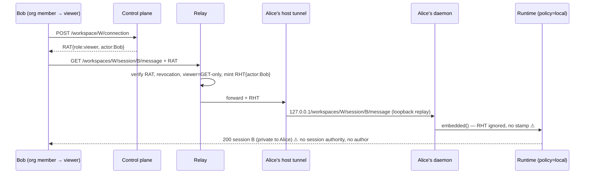

> Status note (2026-09-20): superseded in part by `docs/plans/2026-09-19-001-refactor-host-is-a-machine.md`, which makes the desktop and `claxedo connect` one host identity, gives a workspace a placement instead of a `user-hosted` kind, and removes the account heartbeat described here. The §2.B/§2.F desktop findings (account bearer on every beat, every workspace member reaching every session) are the defects that plan's slices 1 and 2 remove, and they take over the slice 4 sketch in §11. §1's slice 1 (machine principal, invitations, `claxedo connect`) landed as P1–P3 of `2026-09-14-003` and stands. The rest is the record of what was observed and proposed on 2026-09-14.

# Shared setup, enrollment and connectivity foundation — investigation and proposal

Every claim below is tagged: **[observed]** = read in the code at dev `d12391a146`; **[probe]** = run live in this investigation (commands in §14); **[inference]** = follows from observed code but not executed; **[proposed]** = does not exist today.

## 1. Direct recommendation

**Adopt the invitation model and the machine-key-only serving identity, but scope it narrower than the proposal, and fix one thing first.**

1. **The proposal is appropriate for user-managed hosts and it is not a new idea in this codebase — it is the missing half of an existing one.** The machine key, the enrollment challenge, the signed heartbeat, the assignment/acked/lease routing rule and the host tunnel all exist and are canonical (`@claxedo/host-connector`, `routes/hosted/host-enrollment.ts`, `authority/adapters/d1/host-access-authority.ts`, `local-server/src/workspace/user-hosted-serving.ts`). What does not exist is a control-plane route that accepts a **machine-signed request without an authenticated account principal** (a bearer, or a browser session through the authentication adapter — `auth.ts:264` builds `mode: "signed"` without a token). Today every enrollment and heartbeat route is `requireSigned: true` and resolves the owner from the *caller's account* (`handle()` in `host-enrollment.ts:151-166`; `requirePrincipal(auth)` in every D1 method) [observed]. Consequently every headless composition keeps an account credential on the machine: `claxedo up` stores the user's access **and refresh token** in `~/.claxedo/credentials.json` [observed, `cli/src/auth/token-store.ts:22-37`, `helpers/claxedo-credentials.ts`]; the self-hosted node keeps the enabling user's `SignedControlPlaneAuth` in memory and loses remote access on restart [observed, `remote-access-service.ts:80-90,298-305`]. **The single required change is a machine-authenticated principal at the control plane**, whose authority is derived from the `host_enrollments` row (owner, scope) rather than from a bearer. Everything else in the proposal composes on top of that.

2. **Do not give managed sandboxes a renewable machine identity.** Managed serving today needs **no enrolled machine key and no account refresh token** on the box (model-provider credentials are a separate concern, brokered by `server-core/credentials/native-delivery.ts`): the relay dials it inbound at the provider's service URL, it verifies relay-signed Relay Host Tokens against the relay's JWKS, and it forwards the *caller's* credential to the control plane for private-session decisions [observed, `sandbox-manager/src/runtime-env.ts`, `workspace-runtime/src/remote-session-authority.ts:65-72`, `service-url-exposure.ts`]. Adding an enrolled identity to a box whose image may be hostile and whose agent has root would create a credential to steal where there is none now. Reuse the existing provider authorization; unify the **UX and the workspace/session contracts**, not the custody.

3. **Fix the desktop-local session-authority gap before building sharing on top of the desktop host.** The lead is confirmed [probe]: the desktop daemon composes its embedded runtimes with the unbound `local` policy and its relay proxy with no actor resolver, so a relayed request reaches the runtime with no actor, no role and no session authority. A workspace member can reach any session in the workspace through direct APIs and the workspace-wide event stream. This is *consistent with the declared design* (`sessionAuthority: "local"` is declared honestly on every heartbeat and the relay enforces viewer read-only by HTTP method), but it means "Alice shares session A, B stays private" is **not achievable on a desktop- or `claxedo up`-hosted workspace today**, and Bob's writes carry no author identity. The same one-sided seam is why `claxedo up` clients get no workspace event stream (its heartbeat omits `sessionAuthority`) [inference].

4. **Smallest slice** (§11): machine-authenticated heartbeat + first-use bearer invitation + `claxedo connect --token-file` for user-managed hosts, reusing the existing enrollment tables with two new columns and one new principal kind. Desktop keeps its current account-mediated path unchanged in that slice.

## 2. Current flows (observed)

### 2.A Desktop, unsigned local use

**A.1** Electron main (`claxedo-desktop/src/main/index.ts`) discovers or spawns the daemon (`server-daemon-discovery.ts`: `~/.claxedo/local-daemon.json` with pid/port/token, mode 0600) and holds a lease against it (`server-daemon-lease.ts` → `POST/PUT /api/claxedo/daemon/leases`, 5 s renew, 15 s TTL).
**A.2** The daemon is `startLocalServer` (`claxedo-local-server/src/app/start-local-server.ts`). It claims `~/.claxedo` with `withDataDirOwnership` (`server-core/.../data-dir-owner.ts`: additive unique claim files under `control-plane.owners/`, 409 `data_dir_already_owned` on contention), binds `127.0.0.1` only, and composes embedded workspace runtimes via `configureEmbeddedWorkspaceRuntime` with `routeContributions: []` and **no `sessionAccessPolicy`** — so `embeddedWorkspaceRuntimeSessionAuthority()` answers `"local"` (`embedded-workspace-runtime.ts:127-129`).
**A.3** Renderer → `/workspaces/:id/*` → `createLocalWorkspaceRelayProxy()` (constructed with **no options** at `start-local-server.ts:298`) → `localWorkspaceRelayProxy` (loopback gate) → `embedded()` (`runtime-dispatch/internals.ts:388`) → in-process `runtime.app.fetch`. Because `resolveRelayActor` is absent, no `x-claxedo-embedded-relay-host-auth` stamp is set, `sessionAccessContext` returns `{}`, and `managedWorkspaceSessionAccessPolicy().authorize` admits everything (`session-access-policy.ts:261-262`, pinned by `session-access-policy.test.ts:69`).
**A.4** Idle lifecycle: `createLocalDaemonLifecycle` (`local-daemon-lifecycle.ts`) shuts the daemon down after 180 s with zero residency pins, where pins = Electron leases + `Pty.activity().running` + `activeTurns + activeWrites + checkpointing` from the embedded runtimes (`localDaemonResidencyPins`). Electron's exit intent is `quit` (release → shutdown) or `handoff` (keep running) (`daemon-exit-lifecycle.ts`).
**A.5** Account: `AccountPort` (`claxedo-app/src/platform/account/account-port.ts`) is a **closed** set of named operations; Electron main owns the credential behind `safeStorage` (`account/credential-store.ts`, `secure-storage.ts` refuses Linux `basic_text`). The renderer never sees a token.

### 2.B Desktop remote access (signed)

**B.1** The user presses Enable → `registerHostConnectorIpc` → `setupElectronHostConnector.start()` (`host-connector/child-supervisor.ts`). The machine key is minted **in a utility child** (`scripts/host-connector-entry.ts`, `createHostKeyPair` P-256 via Web Crypto) and persisted by main as `safeStorage`-encrypted `host-machine-identity.json` (`identity-store.ts`).
**B.2** The child runs `createHostConnector` (`host-connector/src/connector.ts`) with a transport that asks main to run the three reviewed account operations `host.enrollmentNonce` / `host.enrollCurrentMachine` / `host.enrollmentHeartbeat` (`child-protocol.ts:20-28`). **The account bearer is used on every beat**; the key only signs the payload.
**B.3** Control plane: `POST /api/claxedo/host/enrollments/requests` → nonce (60 s challenge TTL); `POST /` → `enrollHost` verifies the ECDSA signature over `claxedo.host-enrollment.enroll.v1\nhost_id=…\nrequest_id=…\nnonce=…`, consumes the request in a guarded batch, upserts `host_enrollments (owner_actor_id, host_id)` (`host-access-authority.ts:394-482`); `POST /heartbeat` verifies the v2 payload over the sorted served set, renews `expires_at` (default 60 s, max 5 min), records `acked_workspace_ids` and `session_authority`, and returns `assigned_workspace_ids` plus **one Host Tunnel Token** (aud `workspace-relay-host-tunnel`, default 5 min) for assigned∩acked (`host-enrollment.ts:236-267`).
**B.4** Sharing a workspace = owner's `POST /api/workspace/:id/host-assignment` (account-authenticated, admin on the workspace, `assignWorkspaceHost`; cold-registers the workspace row through `registerLocalForSharing`) + the machine's consent via the next signed beat. Routing requires assignment ∧ acked ∧ live lease (`HOST_SERVING_WORKSPACE_SQL`).
**B.5** Main pushes each ack's credential to the daemon (`PUT /api/claxedo/host-serving`, `index.ts:717-737`); `setUserHostedServing` opens **one outbound WebSocket per workspace** to the relay `/host-tunnels/<host>` (the relay refuses multi-workspace connects, `user-hosted-serving.ts` header) and arms a lapse timer on the token expiry. Frames are replayed to `127.0.0.1` with `loopbackReplayHeaders` and routed by `userHostedSurface` (denies `/api/claxedo`, `/api/workspace`, `/api/auth`, `/api/runtime-authority`, …).
**B.6** Account follow: sign-out or a descriptor 503 suspends the connector (`suspendForAuthLapse`); a return to `signed` resumes it (`index.ts:648-690`).
**B.7** Revocation: `pauseHostEnrollment` / `revokeHostEnrollment` (cascade: retire user-hosted workspaces, delete assignments, revoke runtime tokens minted for that host, `host-access-authority.ts:588-629`). The connector distinguishes decisions (400/401/403/404/409/410 → `stopped:revoked`) from disruptions (anything else → keep beating; the lease is the backstop) (`transientHeartbeatFailure`).

### 2.C `claxedo up` (CLI, user-managed host)

**C.1** `claxedo login` = device code → `credentials.json` (access + refresh token, 0600) [observed `cli/src/auth/device-code.ts`, `token-store.ts`]. `CLAXEDO_DEV_TOKEN`/`CLAXEDO_ACCESS_TOKEN` env is an alternative.
**C.2** `claxedo up <dir>` → `registerHost` (`cli/src/host/register.ts`): `loadMachineHostKey` (plaintext JWK in `~/.claxedo/machine-host.json`, `keys/host-key.ts`), `enrollMachine` (same two routes as B.3, **with the account bearer**), `POST /api/workspace/:id/host-assignment` (cold-registers by `remote_directory` match), then `startHost` (`host/runtime.ts`): `startServer` from `@claxedo/workspace-runtime` with `loopbackWorkspaceRuntimeExposure()`, one `hostTunnel` per process, heartbeat every 25 s **with `requireAccessToken()` every time** and **without `sessionAuthority`** (`register.ts:176-186`).
**C.3** Consequence [inference]: `heartbeatHostEnrollment` assigns `session_authority = null` (`host-access-authority.ts:520-524`), `userHostedConnectionInfo` omits it, and `claxedoEventStreamTargets` opens no workspace stream for the client (`claxedo-event-targets.ts:156-159`) — terminals and `pty.*` frames do not arrive for `claxedo up` workspaces.
**C.4** The runtime is `loopback` exposure with the default `managedWorkspaceSessionAccessPolicy()` (`runtime.ts:1417-1418`) and no relay-host auth → same session-authority shape as the desktop (§2.F).

### 2.D Self-hosted node (headless, signed)

`createSelfHostedApp` (`claxedo-server/src/deployments/self-hosted-node/app.ts`) composes `embeddedManagedPrivateSessionPolicy` (`managed-private`), a `resolveRelayActor` that verifies control-plane JWTs **and** Relay Host Tokens (`app.ts:751-800`, needs `CLAXEDO_RELAY_HOST_PUBLIC_KEY_JWK`), and `createRemoteAccessService`, which enrolls and beats with the **enabling user's bearer held in memory** (`remote-access-service.ts:298-305`). Restart ⇒ remote access off until a user enables it again [observed; no persistence path in the file].

### 2.E Managed sandbox (Claxedo-provisioned)

**E.1** `POST /api/workspace/create` (`routes/hosted/workspace.ts:323`) → `SandboxManager.ensure` (`sandbox-manager/src/index.ts`) → driver (`drivers/{modal,vercel,cloudflare,daytona,docker,box,exe,fetch-bridge}.ts`) places a sandbox running `workspace-runtime` with `workspaceRuntimeBootEnv`: workspace id, host id (a **label**, `input.hostId ?? nameFor(workspaceId)`), git source, relay JWKS URL, session-authority URL (`runtime-env.ts`). **No enrollment, no key, no bearer.**
**E.2** Transport: the relay resolves `(workspaceId, hostId)` via `/internal/relay/target` (`shared-routes/internal-relay.ts`) to the provider service URL and dials **inbound** (`upstream-websocket.ts`, HTTP fetch). URL exposure is per driver: `docker` private loopback, `daytona` driver-authenticated signed preview URL with public fallback, everything else `public` (`service-url-exposure.ts`). The only thing between the internet and the runtime on a `public` driver is RHT verification (`relayWorkspaceRuntimeExposure` → `createRelayHostAuthMiddleware`, `server.ts:479-523`).
**E.3** Private sessions: `remoteWorkspaceSessionAccessPolicy` POSTs to `WORKSPACE_RUNTIME_SESSION_AUTHORITY_URL` with the **caller's** RHT as `authorization` (`remote-session-authority.ts:65-72`); the control plane's `runtime-session-authority.ts` adjudicates creator/participant/share/org-admin (`actorSessionAccessSql`, `d1/session-authority.ts:1916-1961`) and mints stream/turn leases bound to the parent RAT `jti`.
**E.4** Lifecycle: driver `autoStopMs` / `autoDeleteMs` (`fetch-bridge.ts` asserts both finite), `manager.touch/stop`, checkpoints via `checkpoint-manager.ts`. Idle here is provider time since last `touch`, **not** the runtime's own activity.

### 2.F Teammate access to a shared local session — lead re-verified

Trace for Bob (org member) reaching Alice's desktop-hosted workspace W:

1. **Publication**: Alice assigned W to her host (B.4); her machine acks it; lease live.
2. **Membership**: Bob's role on W comes from `workspaceAccessCte` (`host-access-authority.ts:1012-1044`): owner → 4; direct/project membership → its rank; org owner/admin → 3; **org `member` → 1 (viewer)**. Every org member is a viewer of every workspace in the org [observed, mirrored in `workspace-authority.ts:1541,1601`, `session-authority.ts:1882`].
3. **Mint**: `POST /api/workspace/W/connection` → `userHostedConnectionInfo` → `openWorkspace` (role) + `activeWorkspaceHost` → Runtime Access Token (aud `workspace-relay`, 30 min default, claims `actor_id/actor_kind/actor_public_id/actor_name/org_id/workspace_id/host_id/role`) recorded in `runtime_access_tokens` (`user-hosted-connection.ts:107-133`).
4. **Relay**: verifies RAT, checks revocation via `/internal/relay/revocation` (cached 10 s, plus DO alarm re-check), enforces `roleAllowsRelayRequest` (viewer: GET/HEAD/OPTIONS only, `/api/wr/pty` denied, `relay/src/server.ts:570-577`), mints a **60 s Relay Host Token** carrying Bob's actor claims and `parent_jti` (`relayHostTokenFor`), forwards over Alice's host tunnel.
5. **Host**: tunnel → `userHostedSurface` → `http://127.0.0.1:<port>/workspaces/W/<path>` → `localWorkspaceRelayProxy` → `embedded()` with **no `resolveRelayActor`** → the `Authorization: Bearer <RHT>` header is forwarded unchanged but never verified or translated into the embedded actor stamp (`internals.ts:399-408` deletes any incoming stamp and re-creates one only through a resolver) → runtime sees no actor/authority.
6. **Runtime enforcement**: `managedWorkspaceSessionAccessPolicy()` (`local`): `authorizeManaged` → `!input.authority && !requireActor` → allowed for **every** operation on **every** session, including `GET /session` (unfiltered list), `GET /session/:id/message`, and `GET /api/wr/events` (workspace-wide bus, `session-event-privacy.ts` only applies to `managed-private`). Author attribution: `sessionAccessContext` returns no `author`, so Bob's prompts are stored without `claxedo.author` (the exact defect `embedded-relay-host-auth.ts` header describes for the signed composition).
7. **What still holds**: the relay's method-based viewer rule; RAT revocation at the relay; enrollment revoke cascading to `runtime_access_tokens`; the tunnel's path denylist. What does **not** hold: session privacy, session share grants (no `sessions` rows exist for user-hosted sessions — `session-projection.ts:5-16`: the control plane projects **cloud workspaces only**), per-actor role at the runtime for editors, author identity.

**Live probe** (§14.1) against the real `startLocalServer` entrypoint with a git workspace: a relay-shaped request (`x-forwarded-by: workspace-relay`, opaque bearer) for a non-existent session answered **404 `session_not_found`** on `GET /workspaces/W/session/ses_x` and reached the prompt handler (**500**, `WorkspaceHarnessUnavailableError`) on `POST …/message`; `GET /api/claxedo/host-serving` reported `sessionAuthority: "local"`. A `managed-private` composition answers 403 `session_actor_required` / `session_authority_required` **before** lookup (`session-access-policy.test.ts:50-67`). So the guard is bypassed by composition, not by a bug in the policy: the policy fails closed only when handed claims, and the desktop never hands it any.

**Why the runtime does not refuse**: `runtime.ts:1422-1428` requires `managed-private` for non-loopback exposure but exempts `loopback` and `embedded` — and the host tunnel makes a loopback/embedded runtime remotely reachable. The exemption is keyed on the listen address, not on reachability.

**Verdict on the lead**: confirmed as a **design limit with a security consequence** (org-wide viewer + workspace-wide session visibility + no author identity on desktop/CLI hosts), not a bypass of an intended control. It is also the reason a shared bootstrap for user-managed hosts must ship with the `managed-private` composition, not the desktop's `local` one.

### 2.G Who registers and checkpoints sessions when nobody is watching

- Cloud: the **client** drives `POST /api/control/workspaces/:w/sessions/:s/{register,checkpoint,repair}` (`claxedo-app/src/platform/runtime/agent/session-projection.ts` → `AccountPort` op → `routes/hosted/control.ts:118-190` → `pullControlSession[Messages]` pulls from the runtime). Session **existence** is registered by the runtime through the managed-private `registerSession` → `registerRuntimeSession` (creator derived from the verified relay proof, `runtime-session-authority.ts:409`; user-hosted proofs accepted at `:762`) at create time [observed] — so a `managed-private` user-hosted host already registers creators; only the desktop's `local` runtime does not. **History checkpoints happen only while a signed client is attached** [observed]; an unattended turn (agent-driven, wake, or a second device) leaves history un-checkpointed until a client returns (the client replays `unsettled` pulls on focus, `session-projection.ts:44-58`).
- User-hosted (desktop/CLI): nothing at the control plane. `sessionProjectionBacking` returns `undefined` for non-cloud [observed]. Sessions are listable only by asking the host's runtime over the relay (`session-source.ts` per `docs/tech-docs/user-hosted-workspaces.md` §D). If the host is offline, the session list is empty.
- Self-hosted node: `registerSession` runs through the remote authority (sessions rows exist), checkpoints still client-driven.

So moving heartbeat renewal off the account bearer makes a host **routable** unattended; it does **not** make its sessions **discoverable or shareable** unattended. That needs a runtime-driven register/checkpoint using the machine identity (§4.5).

## 3. Diagrams

### 3.1 Existing desktop local use

```mermaid
sequenceDiagram
  participant R as Renderer (AccountPort, no token)
  participant M as Electron main (account in safeStorage)
  participant D as Daemon startLocalServer (127.0.0.1, owns ~/.claxedo)
  participant W as Embedded runtime (policy=local)
  M->>D: spawn or discover local-daemon.json; POST /daemon/leases (renew 5s)
  R->>D: /workspaces/:id/* (loopback)
  D->>W: embedded() — no actor stamp
  W-->>R: sessions, events, pty
  Note over D: idle = leases + pty + turns + writes + checkpointing == 0 for 180s → stop
```

### 3.2 Interactive user-managed enrollment (proposed; key first, approval binds the key)

```mermaid
sequenceDiagram
  participant H as Host: claxedo connect
  participant CP as Control plane
  participant B as Browser (or desktop) signed as owner
  H->>H: mint P-256 key (0600, service user)
  H->>CP: POST /host/enrollments/pending {hostId, publicKey, displayName} (unauthenticated, rate-limited)
  CP-->>H: {pending_id, user_code, approval_url, poll_interval}
  H-->>B: show URL + code (or open browser)
  B->>CP: POST /host/enrollments/pending/:id/approve (account bearer; owner, scope, expiry chosen here)
  CP->>CP: bind: host_enrollments(owner_actor_id, host_id, public_key) ← pending.public_key
  H->>CP: POST /host/enrollments/heartbeat  (machine-signed, NO bearer)
  CP-->>H: lease + assigned set + Host Tunnel Token
  H->>Relay: outbound /host-tunnels/:host per workspace
```

### 3.3 Non-interactive user-managed enrollment (proposed; first-use bearer invitation)

```mermaid
sequenceDiagram
  participant O as Owner (signed: desktop/web/CLI)
  participant CP as Control plane
  participant P as Provisioning (user's own cloud-init/systemd/ECS task)
  participant H as Host: claxedo connect --token-file
  O->>CP: POST /host/invitations {scope, expires_in, max_uses=1, display_name?}
  CP-->>O: {invitation_id, token (shown once)}
  O->>P: token delivered by the USER's secret channel (SSM/Secrets Manager/env at boot)
  P->>H: start service with --token-file
  H->>H: mint key, persist it; read token
  H->>CP: POST /host/enrollments/redeem {invitation token, hostId, publicKey, signature}
  CP->>CP: atomic: claim invitation → insert host_enrollments from invitation.owner/scope (idempotent for the same key+host)
  CP-->>H: enrollment (no bearer ever on the host)
  H->>H: persist enrollment, then delete the token file
  H->>CP: machine-signed heartbeats thereafter
```

### 3.4 Managed sandbox provisioning (existing; keep)

```mermaid
sequenceDiagram
  participant U as Signed user
  participant CP as Control plane + SandboxManager
  participant S as Sandbox (workspace-runtime, no secret)
  participant RL as Relay
  U->>CP: POST /api/workspace/create
  CP->>S: driver.ensure → boot env (workspace id, host label, JWKS URL, authority URL)
  U->>CP: POST /workspace/:id/connection → RAT
  U->>RL: /workspaces/:id/* + RAT
  RL->>CP: /internal/relay/target → service URL
  RL->>S: inbound fetch/WebSocket + Relay Host Token (60s)
  S->>CP: POST authority URL with the CALLER's RHT for private-session decisions
  Note over S: idle = provider autoStop since last touch; runtime activity not consulted
```

### 3.5 Teammate access to a shared local session (existing desktop path, with the gap marked)



## 4. Proposed flows

### 4.1 Identity model — what changes at the control plane

> **Superseded (4.1).** The controlling design is `2026-09-14-003-feat-connect-implementation-plan.md` rev 4; this section is kept as the original proposal and differs from it where the plan changed the design (route-local verifier keyed by `enrollment_id`, no general machine auth mode, serving-generation fencing via explicit `acquire`, idempotent redeem instead of a recovery route, no shredding claim, visibility = no implicit org-member access, no machine session registration route, project regrouping excluded).


**Existing rows reused**: `host_enrollments`, `host_enrollment_requests`, `host_workspace_assignments`, `runtime_access_tokens`, the signature-hash single-use ledger (`signatureUse`), and the assignment∧acked∧lease routing rule. **New**: 

- `host_invitations (invitation_id, owner_user_id, owner_actor_id, token_hash, scope_json, display_name, expires_at, max_uses=1, redeemed_at, redeemed_host_id, created_by_actor_id, revoked_at)`.
- `host_enrollments.bound_public_key_at` and `host_enrollments.enrolled_via ('account' | 'invitation' | 'pending-approval')` for audit; `scope_json` (allowed roots / workspace policy, §4.4).
- A **machine principal**: `SignedControlPlaneAuth` gains a sibling `{ mode: "machine", hostId, enrollment: HostEnrollmentRow }` produced by a new verifier in `server-core/platform/auth/` that checks a machine signature over `(method, path, body-hash, timestamp, nonce)` against the enrollment's stored public key. Only the routes that a running host needs accept it: heartbeat, and (new) session register/checkpoint. `createRequest`, `enroll`, `pause`, `revoke`, `assignWorkspaceHost`, shares, workspace create — **account only**, unchanged.

**Owner and scope are derived from the row**, never from the request: `heartbeatHostEnrollment` today already ignores caller claims beyond `who.actorId`; with a machine principal it reads `owner_actor_id` from the enrollment row the signature verified against.

**Machine-bound vs first-use bearer invitations**:

| | Machine-bound | First-use bearer |
|---|---|---|
| Definition | invitation carries the host's **public key** (or a verified provider identity); only that key can redeem | whoever presents the token first redeems it, and their key becomes the enrolled key |
| Needs | the key to exist **before** the invitation is minted (a round trip from the host to the owner) | nothing from the host in advance |
| Fits | interactive (§3.2, the pending enrollment is exactly a machine-bound invitation approved after the fact), fleets with a PKI | cloud-init / ECS task / VPS bootstrap where nobody is at the keyboard |
| Theft window | none — a stolen invitation is useless without the private key | from mint until redeem; `expires_at` and `max_uses=1` bound it; redemption is atomic and audited with the redeeming key |
| Recommended default | **interactive setup** | **non-interactive setup**, expiry default 1 h, single use, scope required |

A bearer invitation must be described as "first-come": if it leaks, an attacker's host enrolls as the owner's, the owner sees an unexpected machine in the device list, and revokes it. That is the tradeoff; what makes it acceptable is (a) scope on the invitation, (b) short expiry, (c) single use with the redeeming public key recorded, (d) a device list that shows it.

### 4.2 Interactive setup — mint the key first, approve the exact pending enrollment

> **Superseded (4.2).** Deferred to plan P4a; when built, the approval code is the capability and pending enrollments are never listable.


Recommended over "login then enroll": the host never receives an account credential, and the browser approves **one specific key** (display name + fingerprint + first-seen IP shown to the approver). Reuses the device-code UX (`routes/hosted/device-auth.ts` exists for account login; this is a parallel *approval* route, not a token grant — the poll returns an enrollment, not a bearer). For an installed desktop, the same approval route is one more `AccountPort` operation (`host.approvePendingEnrollment`), so "reuse desktop login, never copy tokens" is satisfied; the desktop can also *offer* the pending enrollments it sees on the account.

### 4.3 Non-interactive setup — `claxedo connect --token-file`

> **Superseded (4.3).** The controlling design is `2026-09-14-003-feat-connect-implementation-plan.md` rev 4; this section is kept as the original proposal and differs from it where the plan changed the design (route-local verifier keyed by `enrollment_id`, no general machine auth mode, serving-generation fencing via explicit `acquire`, idempotent redeem instead of a recovery route, no shredding claim, visibility = no implicit org-member access, no machine session registration route, project regrouping excluded).


- Install at image build: `claxedo` binary + a service unit template; **no state**.
- At boot: the service reads the file, mints the key, redeems, **shreds the file**, writes `machine-host.json` (0600, service user) and enrollment id. Idempotent: a second boot with the key present skips redemption and just beats; a boot with **no key and a redeemed token** fails loudly (`invitation_redeemed`, with the redeeming host id) — it does **not** re-enroll, because that would make the invitation multi-use.
- Cloned disks: two hosts with the same key and host id are one enrollment; both beats succeed (ECDSA signatures differ; the single-use ledger is per signature hash), both open tunnels, the relay's per-workspace room gets **two host sockets** — behaviour today is relay-defined and untested. Proposed: heartbeat carries a per-boot `instance_id`; the authority records the **last** one and rejects beats from another instance with 409 `enrollment_instance_conflict` for `expires_at − now`; the losing instance stops (`transientHeartbeatFailure` already classifies 409 as a decision). Replacement is then explicit: revoke + fresh invitation.

### 4.4 Scope — enrollment must not expose every folder

Existing rule kept: nothing routes without an **owner-assigned** workspace, and assignment is an account-authenticated admin action. Two additions:

- `scope_json.allowed_roots: string[]` on the enrollment (from the invitation or the approval). `assignWorkspaceHost` today accepts any `remote_directory`; it would refuse one outside the roots. The host also refuses to serve a directory outside its own copy of the roots (defence in depth; the host is the only party that can see the filesystem).
- `scope_json.may_register_workspaces: boolean` — whether the **host** may propose new workspaces (cold-register) with its machine identity, or only serve what the owner assigns from a signed client. Default `false` for invitations; `true` only for the interactive path (the approver is the owner and is looking at the machine).

Runtime identity stays serving-only: the machine principal is accepted by heartbeat and session register/checkpoint **and nothing else**. It cannot enroll, invite, assign, share, pause, or create sandboxes.

### 4.5 Unattended session registration and checkpoints (needed for "shareable without a client")

> **Superseded (4.5).** Registration already happens on managed-private runtimes (creator from the verified relay proof); only checkpointing is client-driven. Plan rev 3 P6 defines a projection principal for unattended checkpoints instead of a machine registration route.


The runtime already knows when a session is created and when a turn completes (`afterCreateSession`, `onTurnOutcome`, `session.lifecycle` events, `embedded-workspace-runtime.ts:222-226`). Proposal: the host's connector (which holds the machine identity) calls `POST /api/claxedo/host/sessions/register` and `/checkpoint` with the machine principal; the authority creates the `sessions` row with `creator_actor_id` = the actor who **created** the session (known from the RHT stamp on the create request — which is why §5 "fix the stamp" is a prerequisite) or the owner for host-originated sessions, and pulls history through the existing `pullControlSession` path over the host tunnel. This is the piece that makes a user-managed host's sessions appear in the control-plane list while the host is offline and lets Alice share session A.

### 4.6 Managed sandboxes — reuse provider authorization

Keep §2.E as is. The "shared" parts are the **workspace/session contracts and UX** (`workspace.create` → ready → connection mint → same session policy `managed-private`), not the credential. If a future provider needs an outbound-only transport (no service URL), *that* provider adapter should run the same `claxedo connect` with a **machine-bound** invitation minted by the SandboxManager at `ensure` time (the manager already knows the hostId and can generate the key pair on the control-plane side and inject only the private half into the boot env, or inject a bearer invitation with a 5-minute expiry) — and the enrollment's scope is exactly one workspace. That is the one case where the proposal's unified bootstrap earns its place inside managed provisioning; it should be introduced with that provider, not speculatively.

## 5. Security boundary

> **Read with plan rev 3 P1–P3.** "Nothing to steal" below refers to Claxedo enrollment credentials only; provider credentials are brokered separately (`native-delivery.ts`). "Dedicated service user" is process isolation from other users, not from an agent running as the same user — the plan's P3.2 says so.


Assume the agent runs as the host user (or root) and the image may be hostile.

| Threat | User-managed host (proposed) | Managed sandbox (existing) | Desktop (existing) |
|---|---|---|---|
| Credential theft from disk | key file 0600 under a **dedicated service user**; agent sessions run as the workspace user. If the agent is root (or the same user), the key is readable — accepted limit; what it buys is *serving assigned workspaces*, not the account. `credentials.json` refresh token (today's `claxedo up`) is **removed**. | no Claxedo enrollment credential to steal (RHT verification uses a public JWKS; caller RHTs are 60 s); provider credentials are a separate, brokered concern | account token in `safeStorage` (Keychain on macOS; readable by same-user code with a Keychain prompt; Linux `basic_text` refused); machine key encrypted the same way |
| Replay | enrollment: nonce + single-use signature hash (exists). Heartbeat v2 has **no nonce/timestamp** — a captured signature can be replayed only once (ledger) and only renews a lease; machine-principal requests add `(timestamp, nonce)` and reject skew > 60 s | RHT bound to `parent_jti`, 60 s, workspace-scoped | as user-managed |
| Signing-oracle abuse (agent asks the local connector to sign) | the connector is a separate service-user process with **no local API** — it is a client only (existing design, `connector.ts` header). Nothing on the box can ask it to sign arbitrary payloads. | n/a | connector child has only Electron's message port |
| Duplicate instances / cloned disks | `instance_id` fencing (§4.3); today undefined | manager epoch/lease store (`sandbox-manager` lease epochs) | n/a |
| Revoking active connections | revoke → runtime tokens revoked → relay re-checks active tokens every 30 s (`cloudflare.ts:351`; the resolver client caches 10 s) and closes client sockets on the next check; host tunnel token expires ≤5 min; next beat 401/403 → connector stops; daemon `armLapse` closes tunnels at token expiry | stop/delete sandbox; RAT revocation | same as user-managed |
| Malicious runtime responses | the control plane never trusts runtime-supplied identity: actor claims come from the RAT/RHT; `pullControlSession` treats runtime output as data; `userHostedSurface` blocks a host from being asked for control-plane paths | same; plus the runtime cannot reach `/api/runtime-authority` without a caller's RHT | same |
| Scope expansion by the host | machine principal accepted by 2–3 routes only; assignment stays account-only; `allowed_roots` enforced at the authority | none possible: no principal | connector cannot assign; main can (account) |
| Provider/GitHub/model credentials | untouched: `credentials/broker` (egress broker) and `agent-config/connection-secrets` are a separate registry; `claxedo connect` writes none of them | untouched | untouched |

Limits to state plainly: (1) on a single-user box where the agent is root, isolation is nominal — the mitigation is *what the key can do*, not *whether it can be read*; (2) a bearer invitation is a secret while in flight and the user's delivery channel is out of Claxedo's control; (3) the relay's 30 s active-token re-check means up to ~30 s of continued access on an established socket after revoke (existing).

## 6. Lifecycle is not connectivity

Four independent axes, with what exists:

| Axis | Values | Where it lives today |
|---|---|---|
| Provisioning owner | user-managed / Claxedo-managed | implicit: `host_enrollments` vs `sandbox leases`; propose an explicit `workspaces.provisioning = 'user' \| 'claxedo'` column (today `access = user-hosted \| cloud` conflates transport with owner) |
| Compute lifecycle | persistent / suspend-resume / disposable | user-managed: nothing (host is on or off); managed: driver `autoStopMs/autoDeleteMs` |
| Storage persistence | disk / checkpoint-restore / ephemeral | managed: `checkpoint-manager.ts`; user-managed: the disk |
| Access & sharing | assignment, workspace roles, session grants, RATs | authority tables, unchanged |

Definitions the product needs to state once:

- **Heartbeat expiry** = *unreachable*: `expires_at` passed; `activeWorkspaceHost.active=false`; clients get 409 `user_hosted_workspace_unavailable`; the enrollment row survives; the next beat revives it with no re-enrollment (`heartbeat` only requires `revoked_at is null`). **Enrollment revocation** = *identity dead*: `revoked_at` set, cascades (§2.B.7), the host id never returns; a later enable enrolls a new id.
- **Offline** (no beats, enrollment intact) vs **suspended** (managed: provider paused, lease held, wake on `ensure`; user-managed with external automation: same as offline from the CP's view — the CP cannot tell them apart and should not pretend to) vs **destroyed** (managed: lease closed; user-managed: user revokes or the enrollment ages out — propose `host_enrollments.stale_after` = 30 days without a beat → shown as "gone", revocable, not auto-revoked).
- **Reconnect existing identity** = the key file exists → beat; **enroll replacement** = new key → new invitation/approval → new host id; the old id is revoked by the owner (or fenced by `instance_id` if it was a clone).
- **What survives compute destruction**: control-plane rows (enrollment, assignments, sessions once §4.5 exists, checkpoints for managed); nothing on the host unless the disk survives.
- **Who may start/stop/delete**: managed — the control plane, on behalf of a signed user with workspace admin (existing entitlement gate); user-managed — **nobody in Claxedo**. Enrollment grants no cloud-provider permission; "wake this EC2 instance" is out of scope unless the user connects an AWS credential through the Connections capability, which is a separate, explicit grant. The UI should say "host offline" and stop there.
- **Idle detection**: reuse `localDaemonResidencyPins` on user-managed hosts (turns + writes + checkpointing + PTYs, no UI needed) as the **host's own** idle signal, exposed on the heartbeat (`idle_since`); a managed provider's `touch` should be driven by the runtime's activity, not by client requests, so an unattended long turn is not auto-stopped.

## 7. Connectivity

- **SSH** is optional and only for install/diagnosis (the retired 2026-08-31 plan already fixed this: "SSH is the bootstrap … not the per-command data plane"). With `--token-file` at boot there is no SSH at all.
- **Who dials whom**: user-managed host → **outbound** WebSocket to the relay per served workspace (`startWorkspaceRelayHostTunnel`); user-managed host → **outbound** HTTPS to the control plane for beats. Clients → relay. Relay → managed sandbox **inbound** at the provider URL. NAT/firewalls: a user-managed host needs only egress 443; a managed sandbox needs an inbound-reachable URL from the relay (public, or provider-authenticated as Daytona).
- **What must run on the target**: user-managed — `claxedo` service (connector + workspace-runtime + per-workspace tunnels; today `claxedo up` is one process per workspace with a shared machine key; the proposal makes it one service per machine serving N workspaces, which is what `user-hosted-serving.ts` already does on the desktop). Managed — `workspace-runtime` under the driver's runner.
- **Topology**: enrollment per machine; relay rooms per workspace; **one Host Tunnel Token, one socket per workspace** (relay refuses multi-workspace connects — verified live per the `user-hosted-serving.ts` header). A machine-wide tunnel would require the relay to key rooms by host; not proposed.
- **Local direct vs user-hosted vs managed**: direct = loopback, no tokens, `local` policy; user-hosted = relay + RAT/RHT + tunnel, policy is whatever the host composed (desktop: `local`; self-hosted node: `managed-private`; proposed `claxedo connect`: `managed-private`); managed = relay + RAT/RHT inbound, `managed-private` via remote authority. Not every provider is the same transport: docker is loopback-private (dev only), daytona is signed-URL, fetch-bridge/box are whatever the bridge returns.
- **Disconnection**: tunnel reconnects with backoff (`reconnectIntervalMs: 1_000`, `pingIntervalMs: 15_000`); client `workspace-connection.ts` is the single writer of ready/reconnecting/offline; RAT refresh via `/connection/refresh` with `previousJti` revocation. **Credential expiry**: HTT renewed on every ack; if beats stop, `armLapse` closes tunnels at expiry so `serving:true` never lies. **Recovery**: next successful beat re-issues the HTT; the host re-dials. **Revocation**: §5.

## 8. Shared bootstrap vs deployment-specific

| | One shared bootstrap for all three | Separate per deployment (status quo + fixes) |
|---|---|---|
| User-managed interactive | `claxedo connect` (key-first approval) | `claxedo login` + `claxedo up` (account on disk) |
| User-managed non-interactive | `claxedo connect --token-file` | not possible without an account token on disk |
| Managed sandbox | would add a machine identity to the sandbox | keep inbound relay + JWKS, no enrollment credential |
| Control-plane changes | machine principal, invitations, pending approvals, session register/checkpoint by machine | none for managed; the same machine principal is still needed for the user-managed cases |
| Custody model | uniform (a secret on every host) | per-deployment (no secret where none is needed) |
| Risk | over-unification: a credential in the most hostile environment for the sake of symmetry | fragmentation only if the *contracts* diverge (policy, workspace kind, UI) |
| Recommendation | **shared protocol and UX for user-managed hosts; shared workspace/session contracts everywhere; custody differs** | — |

## 9. Pros, cons, limits, burden, overengineering

**Pros**: removes the account refresh token from servers (the single largest credential exposure today); makes headless enrollment survive restarts (self-hosted node cannot today); reuses ~90% of existing enrollment/relay code; one CLI verb replaces `login`+`up`; the interactive path is safer than today's (approve a key, not mint a token).
**Cons / burden**: a new principal kind in `server-core/platform/auth` with its own verifier, replay ledger and rate limits; an invitation table with expiry sweeps and a device-list UI; a `managed-private` composition for the CLI host (today it composes `loopback`+`local`); the relay-host public key must be distributed to user-managed hosts (`CLAXEDO_RELAY_HOST_PUBLIC_KEY_JWK` today; should become a JWKS URL like the sandbox has, `WORKSPACE_RUNTIME_RELAY_JWKS_URL`).
**Security limits**: §5. **Overengineering risks**: machine-bound invitations for non-interactive use (requires a PKI nobody has); a machine-wide relay tunnel; provider-identity attestation (AWS instance identity documents) in v1; giving the desktop a second enrollment path — the desktop's account-mediated enrollment is fine as is and should stay until the machine principal exists, then switch its heartbeat to the machine principal in place.

## 10. Existing / required / unresolved

| Area | Existing (observed) | Required change | Unresolved decision |
|---|---|---|---|
| Machine key | `host-connector/host-identity.ts`, `cli/keys/host-key.ts`, desktop `identity-store.ts` | one owner: move the CLI to `@claxedo/host-connector` (it duplicates payload builders today) | key file custody on Linux hosts (service user vs root) |
| Enrollment challenge | `createHostEnrollmentRequest` / `enrollHost` | add `pending` (key-first) and `redeem` (invitation) | pending-approval TTL (default 10 min) |
| Heartbeat | account bearer + machine signature | accept machine principal; add `timestamp,nonce,instance_id` (payload v3) | v2 deprecation window |
| Serving credential | HTT on ack, per-workspace tunnels | none | — |
| Invitations | none | `host_invitations` table + owner routes + device list rows | default scope shape; who may mint (workspace admin vs org admin) |
| Session authority on hosts | desktop/CLI `local`; node `managed-private` | CLI host → `managed-private` + RHT verification (JWKS); desktop → **product decision** (§12 Q3) | whether desktop remote access keeps workspace-grain sharing |
| Unattended register/checkpoint | client-driven, cloud only | machine-principal register/checkpoint from the host | history retention for user-hosted sessions |
| Idle | `localDaemonResidencyPins` (desktop); provider autoStop (managed) | expose host idle on beats; drive managed `touch` from runtime activity | idle thresholds |
| Coexistence | separate `~/.claxedo/machine-host.json` vs safeStorage identity; separate host ids; `assignWorkspaceHost` last-writer-wins | `claxedo connect` refuses to start if `local-daemon.json` names a live daemon and offers to reuse it; one host id per machine per *data dir owner* | whether the CLI service may adopt the desktop's identity (recommend no: different custody) |
| Org-wide viewer rank | every org member is viewer of every workspace | none for this proposal; document it | whether user-hosted workspaces default to org-visible |

## 11. Smallest complete slice and migration

> **Superseded (11).** The slice and its sequence are defined in plan rev 3 (§1, P1–P3, lanes). The text below is the original sketch; where it conflicts (general machine principal, host-id lookup, ledger reuse, self-assign, a machine registration route) the plan wins.


**Slice 1 — machine principal + invitations + `claxedo connect` (user-managed only)**

1. `server-core/platform/auth/machine-auth.ts`: verify `x-claxedo-host-id`, `x-claxedo-host-signature` over `v3\n<method>\n<path>\n<sha256(body)>\n<ts>\n<nonce>` against `host_enrollments.public_key_json`; ledger by signature hash (reuse `signatureUse`); skew 60 s. Produces `{ mode: "machine", hostId, enrollment }`.
2. `host-enrollment.ts`: `POST /heartbeat` accepts **either** the account bearer (existing) **or** the machine principal; the D1/SQLite `heartbeatHostEnrollment` takes `owner_actor_id` from the row when the principal is a machine.
3. `host_invitations` migration (D1 + SQLite), `POST /api/claxedo/host/invitations` (account, scope required, expiry ≤ 24 h, single use), `POST /api/claxedo/host/enrollments/redeem` (unauthenticated + rate-limited: token, hostId, publicKey, signature over `claxedo.host-enrollment.redeem.v1\ninvitation=…\nnonce=…` where the nonce is the token's server-side id).
4. `cli`: `claxedo connect [--token-file F] [--name N] [--root DIR]...` = one long-running service: `@claxedo/host-connector` + `workspace-runtime` `startServer` with `relayWorkspaceRuntimeExposure` (JWKS) and `remoteWorkspaceSessionAccessPolicy` (`managed-private`), one tunnel per assigned workspace, beats with the machine principal and `sessionAuthority: "managed-private"`. Remove `claxedo up`'s use of `requireAccessToken()` for beats; keep `claxedo login` only for owner actions (`invite`, `assign`).
5. Device list: show `enrolled_via`, key fingerprint, last beat, redeem IP; revoke button (exists).

**Acceptance for slice 1** (proposed, to be executed against the Tier R fixture extended with a `claxedo connect` host): §13 rows 1–7.

**Slice 2** — key-first interactive approval (`pending` + approve via `AccountPort` op and web).
**Slice 3** — machine-principal session register/checkpoint (§4.5); user-hosted sessions become shareable.
**Slice 4** — desktop: switch the connector child's heartbeat transport to the machine principal (drops the per-beat account op), then decide Q3.
**Slice 5** — instance fencing, idle-on-beat, `stale_after`.

Migration: additive throughout; `claxedo up` stays until slice 4, then is removed (no compatibility layer: its `credentials.json` refresh token is the thing being retired; `claxedo logout` clears it).

## 12. Product questions

| Question | Recommended default | Consequence |
|---|---|---|
| Q1. Do org members see user-hosted workspaces by default? | **No implicit org-member access** for `claxedo connect` hosts (direct, project, team and org-admin access unchanged); sharing is an explicit workspace share | today every org member is a viewer (§2.F.2); changing the general rank is a bigger product change — scope it to hosts enrolled via invitation |
| Q2. Bearer invitation expiry and reuse | 1 h, single use, scope mandatory | a leaked token is worthless after redeem or expiry; multi-use fleets need one invitation per instance (generate at provisioning) |
| Q3. Does desktop remote access get session privacy? | **Yes, later** (slice 4+): compose the desktop daemon with `managed-private` when signed and enrolled; unsigned local stays `local` | without it, sharing a desktop workspace shares every session in it and Bob's prompts are anonymous |
| Q4. Should Claxedo ever start/stop user-managed compute? | **No**; show offline | avoids implying cloud permissions from enrollment |
| Q5. Survive desktop quit? | **No** in this proposal (leases + `quit` intent stop the daemon) | remote access to a laptop depends on the app running; a headless service on the same machine is `claxedo connect`, a separate product decision |
| Q6. Where do user-hosted session histories live? | on the host; control-plane rows are index + checkpoints (slice 3) | offline hosts show titles and last checkpoint, not live transcripts |

## 13. Acceptance checks

| # | Check | Status today | Evidence / how to prove |
|---|---|---|---|
| 1 | Owner access without self-sharing | **holds** [observed] | `workspaceAccessCte`: `owner_user_id` → rank 4 |
| 2 | Fresh enrollment; replay rejected; expiry; scope-expansion denied | enrollment/replay/expiry **hold** [observed: nonce, ledger, `expires_at`]; scope expansion **n/a** (no scope today) | `host-access-authority.test.ts`; slice 1 adds `allowed_roots` tests |
| 3 | Restart with persisted identity; replacement with fresh identity | persisted **holds** for desktop/CLI key; **fails** for self-hosted node (bearer in memory) [observed] | slice 1 |
| 4 | Concurrent replicas / cloned identity | **undefined** [inference: both beat, both tunnel] | slice 5 fencing |
| 5 | Network recovery; machine revocation | **holds** [observed: `transientHeartbeatFailure`, `armLapse`, revoke cascade] | Tier R `pauseTunnel/resumeTunnel` tests exist |
| 6 | Idle shutdown preserves active work | **holds on desktop** [observed: residency pins]; managed uses provider idle | slice 5 for hosts/managed |
| 7 | Desktop/headless coexistence | **partial**: separate identities, no duplicate-enrollment guard, last assigner wins | slice 1 refusal + adopt-or-reuse |
| 8 | Alice shares A, B stays private | **fails on desktop/CLI hosts** [probe]; **holds on self-hosted node and managed** [observed policy] | §14.1 |
| 9 | Bob cannot reach B via APIs/lists/streams | **fails on desktop/CLI** [probe + observed `local` policy]; holds on managed-private | §14.1 |
| 10 | Bob's writes keep Bob's identity and role | **fails on desktop/CLI** (no stamp; relay enforces viewer by method only; editor role not checked at runtime) [observed] | `embedded()` without resolver |
| 11 | Revocation ends access as specified | **holds** within the relay's 30 s re-check (new requests: 10 s cache) and HTT ≤5 min | §5 |
| 12 | Unattended registration/checkpointing | registration **holds** on managed-private runtimes; checkpointing **fails everywhere** (client-driven) [observed] | slice 3 |
| 13 | Equivalent checks across local / user-managed / managed | not equivalent today (three compositions, two policies) | slice 1 makes user-managed = managed policy |

## 14. Verification record

**14.1 Live probe of the desktop composition** (temporary file `packages/claxedo-local-server/src/app/zz-probe-desktop-session-authority.test.ts`, deleted after the run; the real `startLocalServer` entrypoint with the real `createLocalControlPlaneServices`, a `git init` workspace resolved through `GET /api/workspace/resolve?directory=…&create=true`):

```
cd packages/claxedo-local-server && node ./node_modules/vitest/vitest.mjs run src/app/zz-probe-desktop-session-authority.test.ts
PROBE resolve 200 {"workspaceId":"0b85a062-…","access":"local","backing":{"kind":"local-worktree",…
PROBE meta 404 {"error":{"code":"session_not_found","message":"Session not found"}}      ← GET /workspaces/W/session/ses_does_not_exist (relay-shaped headers, opaque bearer)
PROBE write 500 Internal Server Error  (WorkspaceHarnessUnavailableError)                ← POST …/message reached the prompt handler
PROBE host-serving {"serving":false,"sessionAuthority":"local"}
Tests 1 passed (1)   Duration 2.1s
```

Interpretation: the request was **admitted** by the session policy (lookup ran; the write reached the handler). Under `managed-private` the same requests answer 403 before lookup (`packages/workspace-runtime/src/session-access-policy.test.ts:50-67`, existing, not re-run here).

**14.2 Not run**: the Tier R relay fixture (`real-user-hosted-relay.spec.ts`) — it composes the self-hosted signed server, not the desktop daemon, so it would not exercise the gap; no unit or e2e test in the tree drives a relayed request through `start-local-server.ts` with actor claims. No live control plane, relay, or sandbox provider was touched. Nothing in this document is an implementation; no production import changed, so `bun run test:architecture-ratchets` was not required.

**14.3 Code read** (all at `d12391a146`, uncommitted working-tree edits in `claxedo-app` were not part of the trace): `claxedo-host-connector/src/*`, `cli/src/{host,keys,auth,commands/up}.ts`, `claxedo-server/src/routes/hosted/{host-enrollment,workspace,control}.ts`, `claxedo-server/src/authority/adapters/d1/{host-access-authority,session-authority}.ts`, `claxedo-server/src/connections/user-hosted-connection.ts`, `claxedo-server/src/deployments/self-hosted-node/{app,remote-access-service}.ts`, `claxedo-server/src/deployments/shared-routes/internal-relay.ts`, `claxedo-server/src/routes/runtime-session-authority.ts`, `claxedo-server-core/src/platform/auth/{auth,private-session-authority}.ts`, `claxedo-server-core/src/platform/runtime/lib/{data-dir-owner,paths}.ts`, `claxedo-local-server/src/app/{start-local-server,local-daemon-lifecycle}.ts`, `claxedo-local-server/src/deployments/local/embedded-workspace-runtime.ts`, `claxedo-local-server/src/workspace/{user-hosted-serving,user-hosted-surface}.ts`, `claxedo-local-server/src/workspace/runtime-dispatch/{internals,shared-workspace-endpoint,embedded-relay-host-auth}.ts`, `claxedo-local-server/src/platform/http/control-plane-route-auth.ts`, `workspace-runtime/src/{session-access-policy,exposure,remote-session-authority,server}.ts`, `workspace-runtime/src/workspace/runtime.ts`, `workspace-relay/src/{auth,server,user-hosted-forwarding,upstream-websocket}.ts`, `sandbox-manager/src/{runtime-env,service-url-exposure,drivers/fetch-bridge}.ts`, `claxedo-desktop/src/main/index.ts`, `claxedo-desktop/src/main/host-connector/{child-supervisor,child-protocol,identity-store}.ts`, `claxedo-desktop/scripts/host-connector-entry.ts`, `claxedo-app/src/platform/account/{account-port,control-plane-account-fetch}.ts`, `claxedo-app/src/platform/runtime/agent/session-projection.ts`, `claxedo-app/src/app/integrations/claxedo-event-targets.ts`, `docs/tech-docs/user-hosted-workspaces.md`, `docs/plans/2026-08-31-002-feat-ssh-remote-workspace-plan.md`.
