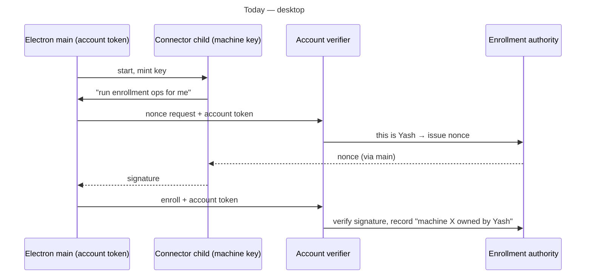
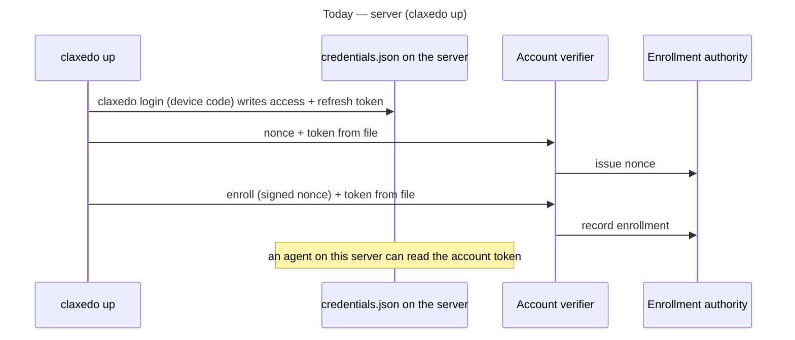
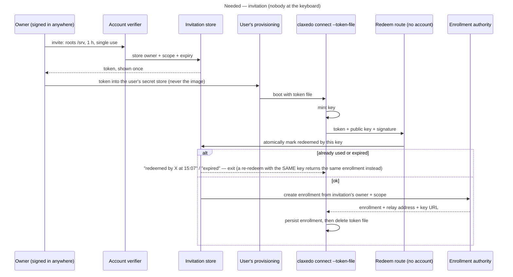
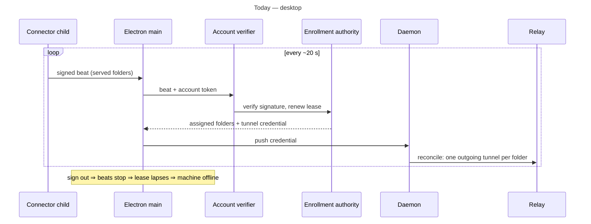

# Remote machine connection — components and flows

Companion to `2026-09-14-001-feat-connect-enrollment-foundation-proposal.md` (code references and evidence) and `2026-09-14-003-feat-connect-implementation-plan.md` rev 4 (the controlling design). Where a component entry or flow below differs from the plan, the plan wins; the differences are marked. This document names each component in plain terms, says where it runs, what it does today, and what changes. Flows follow, today beside needed.

Four places a component can run: **Control plane** (Claxedo's hosted server, or the same code on a self-hosted server), **Relay** (the traffic switchboard hosts dial out to), **Client** (browser, or Electron window + Electron main), **Host** (the machine or sandbox doing the work).

---

## Part A — Components

### Control plane

**Account verifier** — reads the account token or cookie on a request and answers "this is user U". Runs in the control plane, in front of every account route.
*Today*: the only way the control plane knows who is calling. Enrollment, heartbeat, assignment, sharing all sit behind it.
*Needed*: unchanged. It stays in front of everything an owner does.

**Machine verifier** — reads a signature a host put on a request, finds the enrollment by its **enrollment id** (host ids are unique only per owner), checks the signature against the stored public key and key version, that the request is fresh and its nonce unused, and that the enrollment is eligible, and answers "this is enrollment E, owned by U (per the row)".
*Today*: does not exist. A host's signature is only checked *after* the account verifier has already admitted the request.
*Needed*: new, route-local. Accepted by heartbeat, generation acquire, and (P6) checkpoint — nothing else.

**Enrollment routes** — challenge, enroll, heartbeat, pause, list.
*Today*: all account-only. Heartbeat returns assigned workspace **ids** and the tunnel credential; the connector only removes ids it no longer sees, it never learns a new assignment.
*Needed*: heartbeat accepts the machine caller; returns assignment **descriptions** (id, directory, revision); mints the credential only for acks whose revision is current; carries the relay address, key URL and session-authority URL. New: `acquire` (serving generation) and a scope PATCH that retires out-of-scope assignments. Others unchanged.

**Enrollment authority** — the table of enrolled machines: owner, public key, lease expiry, last acked folder set, runtime type; plus a ledger of used signatures.
*Today*: keyed by (owner, host id); owner comes from the caller.
*Needed*: owner readable from the row for machine callers; new columns: scope, key version, serving generation, how enrolled; a nonce table for replay. (Idle/stale metadata deferred.)

**Invitation store + invitation routes** — a one-time token that says "whoever redeems this becomes owner U's machine with scope S, until T".
*Today*: nothing. The closest thing is the enrollment challenge, but it is bound to a host id the owner already knows and consumed by the same account.
*Needed*: new table (records the owner's org) and two routes: *create* (behind the account verifier) and *redeem* (no account in front, rate-limited; atomic single use; records the redeeming key's fingerprint; **idempotent for the same key**, which is how a lost response is recovered).

**Pending approval store + routes** — a key the host generated first, waiting for an owner to claim it.
*Today*: nothing; interactive setup means logging the host into the account.
*Needed (deferred, plan P4a)*: the approval code is the capability and is never listable; the host proves key possession on every poll; decisions are atomic. Not in the first slice.

**Assignment authority** — "host X serves folder F as workspace W"; creates the workspace row on first assignment.
*Today*: accepts any folder path from the owner.
*Needed*: refuses paths outside the enrollment's allowed roots and workspaces outside the invitation's org; applies the enrollment's visibility on every assignment; bumps the assignment revision on any re-point. (Project regrouping excluded — it can attach a workspace to a project that already has memberships.)

**Workspace authority** — workspaces, roles, org/project membership, shares.
*Today*: every org member is a viewer of every workspace in the org.
*Needed*: a workspace flag that removes the **implicit org-member** grant only (direct, project, team and org-admin access unchanged), applied in the three workspace-scoped rank computations; project discovery untouched.

**Session authority** — sessions, who created them, participants, session shares, stream and turn leases.
*Today*: a private-session runtime (managed sandbox, self-hosted node) registers every session at create time with the creator taken from the verified relay proof; only the desktop's "local" runtime never registers.
*Needed*: unchanged for registration — a `connect` host runs the private-session runtime and registers the same way. Host-originated sessions (no human caller) need a defined principal; until then they are created only through a caller.

**Connection minter** — issues the client's relay token for one workspace, naming the caller and role.
*Today / needed*: unchanged.

**Tunnel-credential signer** — issues the host's tunnel token on each acked beat.
*Today / needed*: unchanged.

**Relay directory + revocation lookup** — tells the relay where a workspace is and whether a client token is revoked. The relay re-checks established connections every 30 s.
*Today / needed*: unchanged.

**Session projection** — pulls a session's transcript from a runtime into the control plane store.
*Today*: the control plane can already resolve a user-hosted runtime through the host tunnel; the **app** only asks for projections of cloud workspaces, and only while a client is attached.
*Needed*: a durable trigger with no client attached (machine-signed checkpoint request), plus the app asking for user-hosted projections and showing the offline index.

**Sandbox manager + provider drivers** — places, stops and checkpoints managed sandboxes.
*Today / needed*: unchanged. Managed sandboxes keep their current no-secret model.

### Relay

**Client-token check, viewer read-only rule, per-request identity stamp, per-workspace tunnel rooms, inbound dialer for sandboxes.**
*Today / needed*: unchanged.

**Host-tunnel admission and liveness** — today the tunnel token is verified once at admission and its claims discarded; a new socket for the same host replaces the old one; there is no periodic check of host tunnels (only of client tokens, every 30 s).
*Needed*: the tunnel token carries enrollment id + serving generation; both are kept on the socket (and the hibernation attachment on Cloudflare); admission refuses a stale generation via a control-plane lookup; a 30 s host-tunnel check in **both** relay implementations closes a superseded socket. This is real relay work.

### Host — user-managed machine

**Machine key** — a private key that identifies the machine.
*Today*: `claxedo up` writes it as a plain file; the desktop stores it keychain-encrypted.
*Needed*: plain file, 0600, owned by a dedicated service user. One implementation shared by CLI and desktop.

**Bootstrap** — turns "a fresh key" into "an enrollment".
*Today*: log the host into the account, then enroll with that account.
*Needed*: new. Persist the key first, redeem the invitation from the token file (idempotent, so a lost response is recovered by redeeming again), persist the enrollment, then delete the file; resume if an enrollment is already persisted; acquire a serving generation on every start. Pending-approval bootstrap is deferred.

**Connector** — enroll once, beat until told to stop, distinguish "control plane unreachable" from "you are revoked".
*Today*: exists and is good; every transport it is given attaches an account token.
*Needed*: a transport that signs with the machine key. State machine unchanged.

**Serving loop** — from one tunnel credential, keep exactly one outgoing relay tunnel per assigned folder; drop them when the credential lapses.
*Today*: exists inside the desktop daemon only.
*Needed*: moved into a shared package so `claxedo connect` runs the same code; driven by the connector's assignment discovery (withdraw on re-point, ack the new revision after validation).

**Per-folder runtime** — runs sessions, agents, terminals for one folder.
*Today*: `claxedo up` runs it with the "local" session policy: no per-session privacy, no author identity, and it never verifies the relay's identity stamp.
*Needed*: composed like the managed sandbox's runtime — verifies the relay stamp with the relay's public key, and asks the control plane's session authority "may this caller read/write this session?" using the caller's own token.

**Folder operations** — create a checkout under an allowed root; then have it assigned.
*Today*: nothing reachable through the tunnel; the runtime's worktree route is a *session* resource under `~/.claxedo/workspaces`, not an assignable checkout.
*Needed (deferred, plan P5b)*: a host-management grant bound to actor, enrollment, operation, destination and expiry — a workspace token does not authorize the machine — plus a brokered clone credential. Not in the first slice.

**Idle detector** — running terminals + active turns + pending writes + checkpoints in progress.
*Today*: exists in the desktop daemon for its own shutdown.
*Needed*: deferred; not reported on beats in the first slice.

**`claxedo connect` command + service install** — one process per machine.
*Today*: `claxedo login` + `claxedo up <folder>` = one process per folder, account token on disk.
*Needed*: new command; `up`/`host`/`down` retired.

### Host — desktop laptop

**Electron main** — owns the account token, runs named account operations for the window and the connector child.
*Today / slice 1*: unchanged.
*Later*: stops relaying heartbeats once the child beats with the machine key.

**Connector child** — holds the machine key, signs.
*Today / slice 1*: unchanged.
*Later*: uses the machine-signed transport.

**Daemon** — local server; embedded runtimes with the "local" policy; the serving loop.
*Today*: forwards the relay's bearer to the runtime without verifying or translating it; every workspace member reaches every session.
*Later (product decision, plan P7)*: verify the stamp at ingress and make registration, turn and event decisions request-scoped on that provenance — the runtime's session-authority marker is runtime-wide today, so this is more than a branch in one policy object.

### Host — managed sandbox

**Runtime only**; no enrollment key, no connector, no tunnel; relay dials in; identity stamp verified with a control-plane-supplied key URL; session decisions asked of the control plane with the caller's token. Provider credentials are brokered separately and are out of scope here.
*Today / needed*: unchanged.

### Client

**Account port** — the closed list of named operations the window may ask Electron main (or the browser session) to perform; the window never holds a token.
*Today*: exists.
*Needed*: new names: create invitation, list/approve pending, list machines, folder operations.

**Catalog** — one list of workspaces folded into projects, with "host online" from the lease.
*Today / needed*: unchanged; a `connect` host appears automatically.

**Session source** — where a workspace's sessions are read from; for user-hosted, the machine's runtime over the relay.
*Today / needed*: unchanged.

**Connection authority** — ready / reconnecting / offline per workspace, token refresh.
*Today / needed*: unchanged.

**Environment chip** — Local / Cloud.
*Needed*: adds a "Connected machines" group: online dot, checkout count, "can clone" when scope allows, offline greyed.

**Worktree chip** — folders of the chosen environment; footer creates one.
*Needed*: for a machine, lists its assigned folders; no machine footer until P5b (the runtime's worktree route is a session resource and cannot be promoted to an assignable checkout).

**Create-project form** — name + folder/repo.
*Needed*: a Location step (Local / Cloud in the first slice; machines once P5b exists).

**Remote access panel** — Enable/Pause/Revoke this machine.
*Needed*: machines list (with generation badge), assign a folder, create invitation; pending approvals when P4a lands.

---

## Part B — Flows

### B1. Enrolling a machine

> The "approval" flow below is deferred (plan P4a); the "invitation" flow is the first slice. Redeem is idempotent for the same key, so the recovery case is "redeem again", not a separate route.







```mermaid
sequenceDiagram
  title Needed — approval (a person, no login on the host)
  participant H as claxedo connect
  participant PR as Pending route (no account)
  participant O as Owner (browser / desktop panel)
  participant AV as Account verifier
  participant EA as Enrollment authority
  H->>H: mint key
  H->>PR: public key, name, proposed folders
  PR-->>H: code + URL; terminal shows it
  loop poll
    H->>PR: status?
  end
  O->>AV: open URL / Pending machines; see fingerprint, folders; pick scope; Approve
  AV->>EA: bind exactly that key to Yash with scope
  PR-->>H: approved → enrollment
```

### B2. Heartbeat and serving



```mermaid
sequenceDiagram
  title Needed — connect host
  participant C as Connector
  participant MV as Machine verifier
  participant EA as Enrollment authority
  participant S as Serving loop (same process)
  participant R as Relay
  C->>MV: acquire: signed with key (enrollment id, time, nonce) → new serving generation
  loop every ~20 s
    C->>MV: beat signed with key: enrollment id, generation, acks (workspace + revision)
    MV->>EA: enrollment by id; key version, eligibility, signature, nonce ok; owner from row
    alt generation superseded
      EA-->>C: 409 — stop
    else revoked
      EA-->>C: 403 — stop
    else ok
      EA-->>C: assignment descriptions (id, directory, revision) + credential for current-revision acks + relay/authority addresses
      C->>S: withdraw changed, validate roots, prepare runtime, ack new revision
      S->>R: open/close tunnels
    end
  end
```

### B3. A teammate opens a session

```mermaid
sequenceDiagram
  title Today — desktop-hosted workspace
  participant B as Bob's app
  participant AV as Account verifier
  participant WA as Workspace authority
  participant R as Relay
  participant D as Daemon
  participant RT as Runtime (local policy)
  B->>AV: connect me to W
  AV->>WA: Bob's role (org member ⇒ viewer); host online?
  WA-->>B: relay token (Bob, viewer)
  B->>R: read session S + token
  R->>R: verify, revoked?, viewer ⇒ read-only, stamp "Bob, viewer"
  R->>D: down the tunnel with the stamp
  D->>RT: bearer forwarded but never verified — anonymous request
  RT-->>B: session S (any session, workspace-wide events, no author)
```

```mermaid
sequenceDiagram
  title Needed — connect host (same as managed sandbox today)
  participant B as Bob's app
  participant AV as Account verifier
  participant WA as Workspace authority
  participant R as Relay
  participant RT as Runtime (private-session policy)
  participant SA as Session authority
  B->>AV: connect me to W
  AV->>WA: Bob's role; host online?
  WA-->>B: relay token (Bob, viewer)
  B->>R: read session S + token
  R->>R: verify, revoked?, viewer ⇒ read-only, stamp "Bob, viewer"
  R->>RT: down the tunnel with the stamp
  RT->>RT: verify stamp with relay public key
  RT->>SA: may Bob read S? (Bob's own token)
  alt creator / participant / shared / org admin
    SA-->>RT: yes
    RT-->>B: session S; an editor Bob's writes are authored as Bob
  else
    SA-->>RT: no
    RT-->>B: 403
  end
```

### B4. Sessions when nobody is watching

```mermaid
sequenceDiagram
  title Today
  participant RT as Runtime
  participant CL as Browser / desktop client
  participant AV as Account verifier
  participant SP as Session projection
  RT->>CL: session events (only while a client is attached)
  CL->>AV: "checkpoint S" (cloud workspaces only)
  AV->>SP: pull transcript from runtime
  Note over RT: desktop's local runtime never registers; managed-private hosts register but are never checkpointed; host offline ⇒ empty list
```

```mermaid
sequenceDiagram
  title Needed
  participant RT as Runtime
  participant C as Connector
  participant MV as Machine verifier
  participant SA as Session authority
  participant SP as Session projection
  Note over RT: S was registered at create time with Alice as creator (existing private-session path)
  RT->>C: "turn finished on S"
  C->>MV: machine-signed checkpoint S
  MV->>SP: folder assigned to this host? → pull transcript over the tunnel
  Note over SA: host offline ⇒ title + checkpoint still listed; Alice can share S alone
```

### B5. New checkout on a machine from the composer — deferred (plan P5b)

> Not in the first slice: a workspace token cannot authorize a machine-wide clone; this needs a host-management grant and a brokered clone credential. Kept as the target shape.

```mermaid
sequenceDiagram
  title Deferred
  participant W as Window (composer)
  participant AP as Account port
  participant AV as Account verifier
  participant R as Relay
  participant FO as Host folder ops
  participant AA as Assignment authority
  W->>AP: project web, environment api-box, "New checkout" into /srv
  AP->>AV: mint connection to api-box's existing workspace (owner token)
  W->>R: clone request + owner token
  R->>FO: down the tunnel with owner stamp
  FO->>FO: /srv allowed by scope? clone with owner's GitHub connection (nothing stored)
  FO->>AA: assign /srv/web to this host
  AA->>AA: path inside roots? create workspace row, owner-only
  AA-->>W: new workspace; catalog refreshes; session starts there
```

### B6. Revocation and offline (unchanged)

```mermaid
sequenceDiagram
  title Today and needed
  participant O as Owner
  participant AV as Account verifier
  participant EA as Enrollment authority
  participant R as Relay
  participant C as Connector
  O->>AV: revoke machine X
  AV->>EA: mark revoked; retire its workspaces; revoke client tokens minted for it
  R->>EA: every 30 s: client tokens still active? → no → close client sockets (new requests: 10 s cache)
  R->>EA: every 30 s (new): host generation still current? → no → close host socket
  C->>EA: next beat → 403 → connector stops, tunnels close
  Note over EA: no beats but not revoked ⇒ lease lapses ⇒ "host offline"; next beat revives without re-enrolling
```
