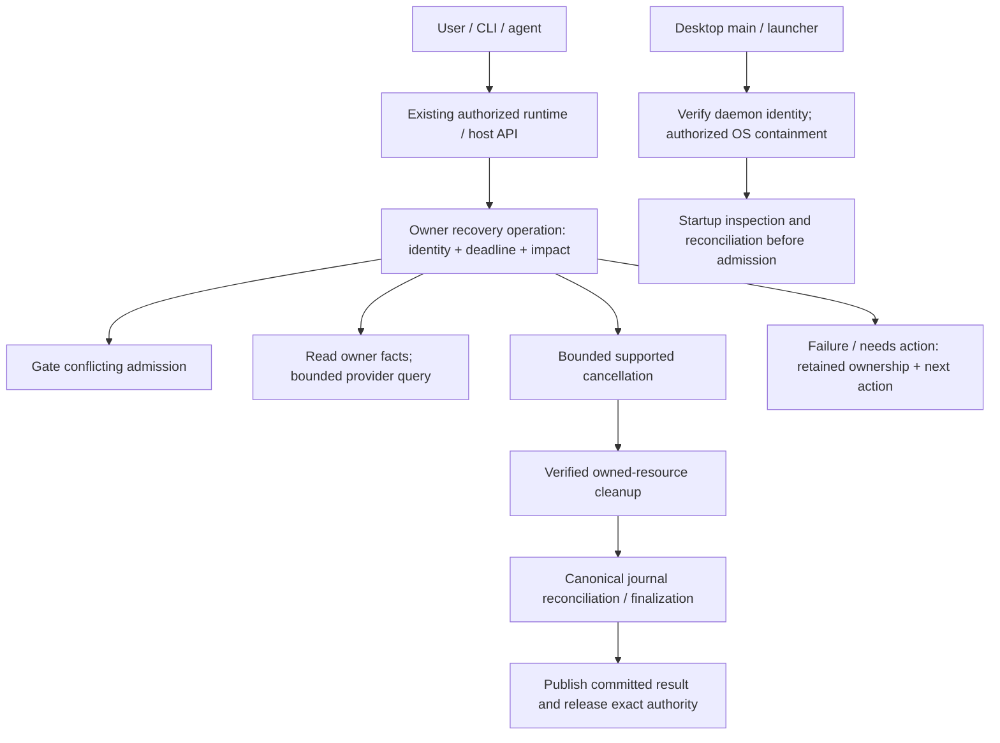

# Runtime recovery implementation plan

## 1. Decision requested and intended result

Approve a coordinated replacement of the current cancellation, retirement, and recovery contracts. This document authorizes no implementation by itself. The user requested a detailed plan and two independent reviews before implementation. No live session cleanup, process termination, database repair, release, or deployment is part of this planning task.

The goal is that every failed turn or resource operation remains inspectable, controllable, and recoverable even when its normal producer, cleanup path, or persistence has failed. Errors must reach an owner and caller promptly. A recovery attempt finishes within a deadline with evidence, partial effects, and the next action; unfinished resources remain owned. Successful recovery establishes execution termination where required, verified cleanup, and durable reconciliation before conflicting work resumes.

This is broader than fixing the photographed sessions or their renderer refresh race. Those incidents exposed a lifecycle failure class. They do not establish that every surviving process is an OS zombie.

**No backward compatibility:** one runtime/host/client contract, one implementation per responsibility, coordinated protocol/schema cutover, removal of superseded paths. No optional legacy result branches, synthetic success, alternate legacy endpoints, dual event producers, or fallback-to-session-only cancellation. Data preservation and truthful handling of old uncertain records remain required; no compatibility requirement authorizes deleting user history.

## 2. Evidence and current flow

Origin: [runtime recovery contract](../architecture/runtime-recovery-contract.md). This plan clarifies its independence rule: reporting/containment bypass execution and persistence waits; durable reconciliation still uses the authoritative store. The platform capability limits and U0 approval gate below make the original guarantee testable rather than implying universal OS control. Evidence: [validated SWE-2 sweep](../verification/runtime-recovery-swe2-sweep-2026-09-20.md), including 13 findings, four missing capabilities, and seven isolated fault scenarios. The probes establish control-flow defects, not real-provider/process-tree acceptance.

Planning baseline is HEAD `e06522f6e6092f90c549815edb33b37264759b20` plus the current dirty working tree. Concurrent ACP, authentication, runtime, and UI changes exist. Before each implementation unit, reread its owners, callers, tests, and applicable repository instructions. Do not replace other work with a stale snapshot or presume all historical findings remain open.

### A. Prompt acceptance and execution

`workspace-runtime/src/routes/session-core.ts` acquires route admission/lease authority and calls `AgentRuntime.turns.start`. `agent-sdk-runtime/src/runtime/turn-admission.ts` maintains the active turn and in-process generation, coordinates the store lease, and hands admission to queued callers. The workspace host also tracks active turns and writes.

The runtime selects a harness through its execution binding; the SDK driver runs the provider. Driver/adapter events flow to the runtime store/journal, projections, the event hub, then clients. Some adapters commit stream events themselves. `runtime.ts` invokes durable `finishTurn` for runtime-admitted turns. ACP provider-goal turns (`harnesses/acp/turn-runner.ts`) and provider child turns (`harnesses/shared/subagent-lifecycle.ts`) also finalize through the store today. The replacement establishes one generation-checked finalization implementation with explicitly registered authority per turn domain; it must not add a competing recovery publisher or assume every child has a root runtime admission.

Normal completion records the outcome, releases admission and scopes, and removes residency pins. A detached finalization failure can currently leave stored busy state and only a console error (R12). Lease loss fences some writes but its failed containment can be discarded (R13).

### B. Stop and dependent mutations

The composer invokes the workspace client abort route. `AgentRuntime.turns.abort` checks a supplied turn ID before awaiting the adapter, then completes cancellation by session. A delayed result can act on a replacement turn (R1). Shared adapter cancellation can wait for producer idle; provider cancellation and process teardown can remain pending or suppress errors (R2–R6).

The composer currently writes optimistic idle before abort settles. Some revert callers catch abort failure and continue (R11). Goal stopping and child/session abort paths are additional callers; all must adopt the same factual preconditions.

### C. Host retirement and daemon adoption

Workspace disposal waits for requests/producers; known teardown errors can remain hidden behind those waits (R3). Checkpoint interruption has waits outside its effective deadline (R9). Host-serving and embedded runtimes cache a rejected retirement promise and lose the path for a real checked retry (R10).

PTY/managed-process removal can drop ownership before verified exit (R7). `localDaemonResidencyPins` counts active work and retains healthy background execution, but stranded owners can retain the daemon without a usable bounded recovery action. Desktop relaunch adopts a responding daemon. Failed daemon health currently permits signalling a numeric PID and can report stopped without final verification (R8).

### D. Existing mechanisms to extend

Use the runtime admission owner, `RuntimeStore` journal and checkpoints, existing health/recovering status, host runtime composition, daemon admission, desktop launch/discovery, typed workspace client, and current process diagnostics presentation. `workspace-runtime/src/store.ts` already retries failed projections before later writes, and has journal-before-projection tests: extend and prove this mechanism rather than replacing it. Optional diagnostics and inferred process observations are not launch/kill authority.

## 3. Goals, non-goals, and scope

| ID | Goal and user-visible success | Primary units |
|---|---|---|
| G1 | Known execution, cancellation, cleanup, and persistence errors are immediately inspectable; no operational console-only failure | U1, U2, U4, U5 |
| G2 | Stop, retry, drain, and retirement return bounded factual outcomes independently of stuck work | U1–U6 |
| G3 | Delayed callbacks, cancellation, and lease loss cannot mutate or stop another execution generation | U1, U2, U5 |
| G4 | Every managed local process retains mandatory ownership until verified exit or explicit handoff; remote uncertainty is honest | U3, U4, U6 |
| G5 | Canonical journal reconciliation restores consistent session/tool/interaction state without repeating user work | U5, U7 |
| G6 | A blocked daemon has an independently reachable local recovery owner; healthy background work survives ordinary app exit | U6 |
| G7 | UI, CLI, and agent callers use the same authorized operations and show pending, partial, failed, and committed outcomes | U1, U6, U7 |
| G8 | All replaced paths are removed; current clients and supported execution shapes pass acceptance together | U8 |

**In scope:** native Codex/Claude/Cursor/Pi harnesses; the OpenCode adapter/engine; configured ACP local/remote execution; in-process execution; session turns and goals; permission/question waits involved in turn ownership; durable leases, queued admission, journal projections and checkpoint transitions; turn-owned tool children; managed dev-server/PTY stop and ownership handoff; workspace retirement; local daemon drain/adoption/replacement; failure/recovery UI and client parity. Host-wide interruption must remain a machine-authorized action.

**Scoped out, with reasons:**

- Automatic killing by age, silence, missing UI events, or busy duration. These do not establish abandonment and would kill healthy work or approval waits.
- Repairing the user's current processes/databases during implementation without a separately authorized, concrete recovery action. Acceptance uses disposable sessions and isolated data roots.
- A new daemon/watchdog service, new transcript store, or generalized workflow engine. Existing parent owners can carry narrow recovery responsibilities; another service would introduce another lifecycle and authority boundary.
- A complete observability platform or performance dashboard. Deliver named blockers, actionable errors, evidence, operation status, and the existing diagnostics integration needed for recovery.
- Automatic replay of prompts/tools or exactly-once guarantees for external tool effects. Unknown remote effects remain unknown; reconciliation does not repeat mutations.
- Implementing missing remote-provider kill APIs or changing provider protocols. Expose supported authority and honest unavailable/unknown outcomes; inability to independently stop remote work remains a documented platform capability limit.
- Redesigning queues, tasks, permissions UX, checkpoint storage, or the entire renderer. Change their lifecycle boundaries and preconditions only. Preserve pending queued intent; do not automatically resend uncertain accepted work.
- A second renderer reconciliation pass or timer. Update the existing completion owner so it retains finished-turn identity and consumes a response covering that turn despite a newer turn starting.
- Live transfer of arbitrary running harnesses between binary versions. A coordinated drain/restart is the release boundary.
- Backward-compatible wire contracts, mixed-version execution, downgrade readers, legacy polling, optional old abort shapes, or duplicate finalization paths.

## 4. Architecture and decisions: why, why not, what can break

### 4.1 A control path in each existing owner

Ordinary execution continues through admission → provider → journal/projection → publication. Inspection and recovery use a narrow control path on the same authoritative owner. Inspection, operation acceptance, error reporting, and containment may atomically gate admission and capture identity, but must not await the target's admission, `whenIdle`, producer iterator, configuration/apply queue, or projection mutex. Durable reconciliation/finalization necessarily uses the canonical store transaction, within its own bounded attempt; lock/storage failure yields pending/unavailable persistence. It is never a prerequisite for reporting or containment. If a synchronous store call blocks the event loop, the external owner supplies the deadline and containment boundary.

**Why:** an operation cannot be responsible for unblocking itself before its failure is reported. **Why not a recovery service:** it would duplicate ownership and require synchronizing a second authority. **Risk:** wrapping recovery methods in the current `resource()`/`track()` lifecycle can accidentally place them behind disposal or count the recovery request among the work it must drain. Add explicit tests that recovery remains reachable after normal serving is fenced.

### 4.2 Identity across every asynchronous boundary

Use a stable tuple of machine/workspace/session/turn IDs, owner generation, and durable write authority where applicable. The existing in-process object generation remains useful locally but is not a wire or restart identity. Capture the tuple before provider lookup; revalidate before signalling, committing, releasing admission, clearing interactions, and handing off queued work.

**Why:** checking the turn only at request entry does not protect a later completion. **Why not session-only cancellation:** it can cancel the new turn. **Risk:** local admission leases and route durable leases are separate today. The two existing layers are `store.acquireTurnLease` in `runtime/turn-admission.ts` and the policy-backed `acquireSessionTurnLease` in `routes/session-turn-lease.ts`. A managed route can involve a remote authority, so these are not assumed to share a SQLite transaction. Hold the local recovery admission gate, fence the old producer, establish required execution/cleanup evidence, commit canonical finalization, complete exact-generation policy lease release where applicable, then release the local store lease and reopen queue handoff. A crash or failed release leaves a resumable gated transition. A revoked remote lease cannot itself prevent a remote authority assigning another owner: the revoked owner must retain containment obligations, and admission authority must distinguish revocation from verified external-tool quiescence before claiming non-overlap. Once reassignment is confirmed, the revoked owner has no authority to cancel/query-mutate a session-addressed or shared remote resource: it reports unresolved obligations to the higher-fenced current authority. It may still contain a distinct local process generation it exclusively launched and that cannot include successor work, subject to the same identity checks. A remote provider with no immutable execution identifier cannot be safely cancelled by the old owner after reassignment. Test old cancellation racing a successor on the same remote session. Inventory all writers; a new identifier alone is not fencing. Fencing denies future authoritative writes; it does not prove a provider stopped executing external tools. Replace `completeCancellation`'s unfenced `finishTurn` and generation-blind `admissions.discard` with the captured turn/write authority and identity-checked release. A stale request returns a distinct generation-conflict result; it cannot claim `already_idle` for a busy replacement.

**How callers obtain identity:** current execution identity is exposed by authorized session inspection and admission/status snapshots. UI/CLI/MCP first capture that identity, then send it unchanged in the mutation; internal lease-loss callbacks capture it when the lease is acquired. A race between inspect and mutate returns a conflict and refreshed permitted inspection. There is no session-only mutation overload or server guess of the user's intended current turn.

### 4.3 One recovery result, three independent facts

Shared contract types describe execution (`running/terminal/unknown`), cleanup (`owned/verified_clear/unknown`), and persistence (`committed/pending/unavailable`) with source, observed-at time, and generation. Reuse existing `recovering/uncertain_execution` and degraded/unavailable health for session availability. Recovery command state is separate from transcript status.

A mutating operation has a caller-scoped request ID, operation ID, target, action, authorized scope revision, attempt, phase/deadline, initiating error, cleanup errors, and permitted next actions. Same request ID plus different intent is a conflict. Same authorized request joins/reads the same operation. Creation uses an atomic uniqueness constraint on `(owner scope, authenticated caller identity, request ID)` in canonical persistence; compare the full normalized intent on conflict. Route instances sharing a store forward execution to the single current owning generation; a second instance must not become an independent OS/provider controller by winning a receipt insert. Owner-generation authority also fences side effects. During persistence outage only that already-established live owner may accept a marked volatile attempt for its existing resources; another process cannot assume its authority. A non-owning instance that cannot resolve/forward to the existing owner returns unavailable, never an independent volatile mutation receipt.

Across different request IDs, one in-flight action on `(target generation, action, authorized impact scope)` is coalesced, with separately authorized caller receipts. Narrow callers see only their allowed facts, not another caller's broader inventory. For nested scopes, a session Stop inside an active workspace/daemon drain is a linked child operation on the same resource controller, with its own authorized receipt and deadline. Graceful drain does not itself authorize cancellation, but a valid session Stop can supply that narrower authorization while the parent gate remains held. The parent may observe the child outcome; the child never waits for the parent's drain to finish or inherits its broader permissions. Disjoint scopes may proceed independently. Incomparable overlapping scopes require arbitration/new preview before conflicting side effects, never two controllers for the same generation. A scope change cannot silently join or upgrade an existing operation: return scope conflict/preview, then authorize a linked escalation. A control phase is bounded bookkeeping/action issuance, never a wait for turn quiescence; nested authorized Stop remains serviceable during drain. Retirement/cancellation side effects are serialized by this small owner arbiter, not by waiting for the execution to finish. Explicit retry is a new linked attempt that verifies partial effects and current authority. Terminal attempt outcomes remain historical; later evidence updates current facts without rewriting a timed-out attempt into success.

**Why:** caller acknowledgement, provider termination, OS cleanup, and stored finalization are different events. **Why not `ok: true` on timeout:** it admits conflicting work and misleads callers. **Risk:** an operation log must not become an alternative transcript or a globally unbounded cache. Persist metadata through the owning host/runtime store; bound completed-record retention with a documented expired receipt, retaining unresolved ownership until resolution. An expired request ID returns `receipt_expired` without executing it again; inspection plus an explicit new retry is required. A storage outage yields explicitly volatile observations/receipts; restart never invents their success.

### 4.4 Mandatory launch ownership, separate from diagnostics

Extend the existing host/runtime persistence with ownership metadata: resource/launch ID, parent owner, execution generation, role (turn/harness/managed process), platform identity, permitted containment scope, handoff, and unresolved cleanup. Inject a narrow launch-ownership interface into SDK/PTY launchers from host composition; do not import desktop diagnostics or workspace-runtime into agent-sdk-runtime.

**Why:** cleanup cannot rely on optional `AgentProcessObserver` data or numeric PID liveness. **Why not a second transcript database:** ownership metadata contains no replacement messages/tools. **Risk:** recording a PID after spawn has a crash gap. U3 must establish a crash-safe prepared-launch/activation protocol with an OS containment identity or a launch handshake that cannot execute user work before recoverable ownership exists. A database write after an unconstrained spawn is not acceptable. No managed spawn is acknowledged while recoverable ownership for its declared scope is unproven; this does not promise containment of every arbitrary descendant.

Explicitly transfer retained dev servers from turn ownership to the managed-process owner; both sides must agree on the same generation. No implicit ownership by command name. Descendants escaping a process group are not automatically proven clear: either prevent escape within the supported launch mechanism or record the capability limit and keep cleanup unresolved.

**Selected launch protocol:** persist a prepared launch ID and role before spawning a small launch gate; the gate establishes its declared OS scope, reports creation identity, and waits on a private parent channel before executing the provider/PTY command. The host records recoverable ownership, then authorizes activation. Before activation, parent-channel loss or a short activation deadline makes the gate exit without executing user work. After activation, durable ownership already exists. This is a per-launch bootstrap, not an additional long-lived recovery daemon. A nonce correlates the gate exchange; an environment variable or command-line token alone never proves ownership or authorizes signalling. Prepared-but-never-activated records reconcile as no execution only when the gate protocol establishes that fact; otherwise remain uncertain.

**Platform scope decision:** use a Windows Job Object assigned before resuming the payload, with supported breakaway policy explicitly declared; on Linux use stable process handles where available plus an owned process group, and on macOS use an owned process group plus recorded creation identity. A process group is not a sandbox. Launch may proceed with durable ownership of that declared scope even when arbitrary descendant containment is unavailable. An escaping/unverifiable descendant makes whole-turn cleanup unknown and prevents a claim of fully verified retirement; it does not retroactively invalidate all normal launches. Cross-owner reacquisition and signalling must satisfy the platform's identity guarantees; if a race-safe target cannot be established, automatic signalling is unavailable, with operator action required. No PID-only fallback is permitted. U0 must validate these native integrations before changing production launchers.

**Unresolved architecture gate requiring user review:** G6 still includes a daemon adopted after app relaunch on macOS; this plan does not silently narrow it to daemons spawned by the current launcher. Recorded creation identity plus a process group is not by itself proof of race-free signalling after adoption. Nor does a discovery handshake magically recreate a kernel process handle. U0 must resolve and prove that specific control mechanism before any production recovery cutover, including the first U1/U2/U5/U7 slice. If it cannot, the decision returns to the user: explicitly accept adopted-daemon recovery ending at operator action, or approve a changed ownership architecture. Neither narrower scope nor a new persistent supervisor is pre-approved. The safe negative result (no guessed signal) must pass, but does not satisfy the full G6 automatic-containment goal.

The distinction is supported by [Microsoft's Job Object documentation](https://learn.microsoft.com/en-us/windows/win32/procthread/job-objects), which describes child association and breakaway policy; [Linux's pidfd signalling interface](https://www.man7.org/linux/man-pages/man2/pidfd_send_signal.2.html), which addresses PID reuse for the referenced process; and [Apple's setsid documentation](https://developer.apple.com/library/archive/documentation/System/Conceptual/ManPages_iPhoneOS/man2/setsid.2.html), which permits creation of a new process group/session. None of these sources establishes that the current Node/PTY/SDK integration already implements the proposed guarantees.

**Storage consequence:** new managed harness/PTY launches require ownership persistence; during its outage the UI refuses them with that explicit reason. Already-owned execution remains inspectable and containable. Recovery must therefore be available in the existing app/launcher and must not require opening a new terminal whose launch is blocked by the same outage.

### 4.5 Evidence-based reconciliation through one finalizer

`RuntimeStore` remains journal/projection authority. The shared generation-checked finalization primitive serves root turns, ACP provider-goal turns, and provider child turns with their own captured turn identity and registered owner authority. Root runtime, ACP goal, and child lifecycle code become callers of that primitive rather than independently projecting finish then committing another terminal. Child identity includes its seeded assistant/user turn IDs and the captured provider/parent owner generation; do not treat the current parent turn as authority over an older child. Preserve the existing distinction: Claxedo-owned child sessions and background provider children can outlive their initiating turn. Foreground child interruption requires evidence from its authoritative provider/lifecycle contract, not merely a parent UI completion. Test late child settle and `settleOpen` against replacement parent/child generations. A bounded reconciliation operation replays from the last successful sequence, checks provider/process facts, invokes canonical lifecycle finalization, and releases only the corresponding leases. Store transaction and publication boundaries must be explicit. Where lease storage and journal storage cannot participate in one transaction, use an idempotent ordered protocol that retains the admission gate across a crash until both are verified.

**Why:** no renderer can establish that a process stopped. **Why not manufacture idle/tool output:** it destroys factual history. **Risk:** a committed journal entry with failed projection and an uncommitted event require different recovery. Replay must not skip malformed required records or checkpoint past failed projection. Preserve failure diagnostics and leave that target gated. Bounded explicit rebuilding of an affected projection uses the same reducer, consistent snapshot boundary, and event sequence, not duplicate live publication.

A local verified owner exit proves interruption only for execution exclusively controlled by that owner. Remote work requires remote evidence. Existing `runRuntimePromptTurn` and machine-dispatch waiters must also consume an out-of-band owner-failure/operation result. On known finalization failure, settle the caller/subscription with a typed error and operation reference, without publishing a fake transcript terminal. Do not perform an unbounded post-abort message read just to close that caller. Move ongoing execution/cleanup accounting to the retained owner before releasing an observer/request scope; the failure channel is not permission to drop residency or write fences.

Pending permission/question requests end only under the same generation's canonical terminal/owner-loss outcome; stale response callbacks cannot reopen or mutate replacement work.

### 4.6 Parent-controlled escalation with authorization

Session Stop authorizes its turn and exclusively owned resources. Shared harness/daemon retirement requires a preview naming affected owners plus authorization bound to target generation and impact revision. Atomically accept authorization and gate local machine ingress in the machine owner's coordination domain; revalidate before destructive action. This is not a distributed transaction over workspace stores. Persist the machine operation's authorized intent/revision before destructive work, record each target owner's idempotent gate acknowledgement against its generation, and issue broad destructive actions only after all required gates are acknowledged. Each owner persists its gate before acknowledging it; the machine records progress afterward. A crash between these writes is reconciled by inspecting the same generation's gate, never assuming it was absent. On restart, keep machine ingress closed while recovering an incomplete machine operation, collect persisted owner-gate states, and either resume still-authorized unchanged scope or return needs-action with gates retained. Explicit cancel/release of a drain reopens only gates owned by that operation after confirming no destructive phase or other blocker makes reopening unsafe. Do not automatically un-gate on a timeout or forget the gated subset. If scope expands, return `scope_changed` rather than silently widening interruption.

Daemon responsiveness, execution health, and persistence health are separate. The desktop main/launcher controls the verified local daemon process when HTTP or its event loop is unavailable. Reuse existing daemon capability and desktop IPC trust boundaries; do not expose a machine credential to renderer/harness children. Remote agents receive only their existing session/workspace authority, never permission to kill a shared local daemon.

**Why:** local timers cannot fire when the daemon event loop is synchronously blocked. **Why not unconditional daemon restart:** it interrupts unrelated work and may kill a reused PID. **Risk:** unavailable daemon inventory means the launcher cannot promise a complete fresh session list. Show the last verified ownership snapshot and its age, explicitly mark unknown additional impact, and require authority for the entire verified daemon generation. Refuse signalling when generation identity cannot be established.

The machine lifecycle owner produces a redacted inventory snapshot in the daemon data root, using atomic replacement alongside the existing discovery publication (proposed `local-daemon-ownership.json`). Publish on owner/scope transitions and at most every 5 seconds while work is active; expose timestamps/revisions and treat snapshots older than 10 seconds as stale for presentation. This is an informational view, not authorization or proof of exit. The desktop reads this small file without opening a live daemon's SQLite store. Scope authorization for an unreachable daemon always covers the entire verified daemon generation, even when the last snapshot is recent. After verified daemon exit, the new owning runtime reads canonical ownership records and reconciles survivors before admission.

Workspace recovery/ownership metadata belongs to `RuntimeStore`. Machine operation metadata belongs to the existing local host database (`ClaxedoDB`) through a narrow daemon-owned operation store, proposed under `claxedo-local-server/src/app/daemon-operation-store.ts`; it contains receipts/impact facts, not transcripts. An external desktop emergency operation uses the trusted launch owner and may return only a volatile receipt when daemon persistence is inaccessible. It never edits a live daemon's database. Reads/actions continue to enforce authorization: unavailable remote authorization is a denied/unavailable action, not an excuse to use a cached guessed scope. Established local launch authority can still contain its own verified resources.

### 4.7 Deadlines and containment

Use centralized injectable budgets from the contract: 2s acknowledgement/local inspect; 5s provider query; 10s graceful cancel; 3s TERM grace; 2s post-KILL verification; 30s reconcile/drain. Parent deadlines cap child phases and parallel fanout; no per-resource multiplication of the public deadline. These are proposed initial local policy, not limits on healthy model execution.

A timed-out await is detached from the caller but remains observed and owned. Fence late continuations and retain cleanup obligations. Abort supported transport requests; do not pretend `Promise.race` cancels their effects. If synchronous native/storage operations block all scheduling, use external generation-verified containment rather than claiming an in-process deadline guarantee.

## 5. Intended user and runtime flows

This illustrates the intended approach and is directional guidance for review, not implementation specification.

**Normal Stop:** caller names current turn → owner accepts/join operation → gates conflicting work → provider cancellation → required cleanup → canonical finalization → exact lease release → committed result. Last-known execution remains displayed while cancellation is pending.

**Provider cancellation hangs:** graceful phase expires → command becomes needs-action with current facts → authorized exclusive containment can continue within scope, otherwise shared-impact preview → verified exit → reconcile. No permanently running command; unresolved resource ownership remains visible.

**Database fails after execution stops:** direct owner reports terminal execution and persistence unavailable → cleanup can finish → admission stays gated → repair storage → reconcile the same generation and release authority. No synthetic successful tool result or second transcript. If the host dies, startup reconstructs from surviving canonical evidence or remains uncertain.

**Daemon event loop hangs:** desktop cannot get fresh inspection → external owner verifies creation identity and explains full-daemon impact/unknowns → authorized containment → verify required exit and ownership → new daemon establishes durable authority and reconciles before accepting work. Killing only the daemon leader does not prove surviving harness children are cleared.

**Reconnect or queued next turn:** read operation by request/operation identity → reconcile only if evidence is invalidated → existing completion fetch continues to cover the finished turn even if another turn is busy → new turn and old cleanup remain distinguishable. Do not spawn another reconciliation loop.

## 6. Implementation units and dependencies

All paths are relative to the repository root. Files marked **new** are proposed modules/tests, not existing APIs. Unit checks use production owners with injected faults; OS/provider acceptance is additional. No unit is complete merely because a type or mock exists. U0 is an architecture qualification milestone; U1–U8 are the implementation units.

### U0 — Qualify launch identity and activation before production changes

- [x] **Goal:** resolve the native architecture risk underpinning G4/G6 without touching live sessions. This milestone is required before approving production U3/U6 changes; it does not authorize weakening the contract.
- **Targets:** disposable native fixture under `packages/workspace-runtime/src/ownership/launch-qualification.test.ts` (**new**) and a platform evidence record; the launch-gate interface in §4.4; read-only inspection of existing child-process and PTY launch integrations. U0 lands zero production launcher edits and is distinct from U3 production ownership tests. No user process/data roots.
- **Prove:** prepared row with no spawn; gate started with parent dying before identity receipt; identity saved but activation absent; activation delivered then parent dies before acknowledgement; identity reacquisition after owner restart; surviving/detaching child; stale PID; installed SDK without a controllable handle. Establish that the gate cannot execute user payload before ownership is recoverable.
- **Outcome:** a concrete platform capability matrix, native dependency/build/packaging choices, and the exact automatic actions supported. For descendant escape, `cleanup: unknown` and blocked conflicting replacement is the expected honest result, not a test failure to hide. If safe ownership of the declared scope or essential external recovery cannot be demonstrated on a required platform, stop that production unit and present the specific architecture change for approval. Do not disable existing production launches merely because the experimental fixture is incomplete.
- **Why first:** launch/bootstrap and identity APIs determine packaging and the safe signalling boundary. They are architecture qualification work, not a TODO hidden inside a broad implementation unit.

### U1 — Shared recovery contract and atomic caller cutover

- [x] **Goal:** G1–G3/G7. Define factual operations and make every caller consume them consistently. Contract drafting has no prerequisite; caller cutover depends on U2 factual production and durable operation ownership from U5. U1/U2/U5 foundations plus the initial U7 consumer change must land together. Never map an old boolean abort reply into invented execution evidence.
- **Files:** `packages/agent-runtime-contract/src/recovery.ts` and `recovery.test.ts` (**new**); `src/index.ts`; `packages/agent-sdk-runtime/src/runtime/contracts.ts`; `src/adapter-contract.ts`; `packages/workspace-runtime/src/routes/session-core.ts`; `packages/workspace-runtime/src/client/session.ts`, `client/request.ts`, `client/request.test.ts`, `client/session-route-inventory.guard.test.ts`; `packages/claxedo-server-core/src/workspace/http/workspace-runtime-client.ts`; their existing adjacent tests. Add `packages/workspace-runtime/src/routes/session-recovery.test.ts` (**new**).
- **Approach:** put dependency-free wire/evidence types in the contract package; keep host-specific execution policy in its owner. Replace ambiguous abort results; require exact target identity and request identity. Add authorized inspect/read-operation/reconcile and scoped recovery transport to existing route ownership; retain one implementation behind all entrypoints. Recovery registration must occur before normal serving is gated. Public input validation rejects missing generations, invalid actions, reused IDs with different intent, and authority mismatch.
- **Caller inventory:** runtime goals and child cancellation; route lease loss; workspace checkpoint/retirement; composer Stop and goal Stop; abort-before-revert commands; CLI and MCP session/process actions; server proxy/client methods and generated clients if present. Concrete callers also include `packages/claxedo-mcp/src/tools/subagents.ts`, `packages/claxedo-app/src/features/session/ui/session-screen.tsx`, `packages/workspace-runtime/src/routes/session.ts`, `routes/session-children.ts`, `routes/events.ts`, and `packages/claxedo-server/src/session/machine-dispatch.ts`. Include the OpenCode adapter, client body/query serialization, daemon routes in `local-app.ts`, and all deployment forwarding boundaries. The current typed client sends abort without a body and omits the caller's turn ID; test the actual serialized request, not only a mocked client method. Enumerate actual callsites before deletion; do not retain optional old overloads to quiet compilation.
- **Tests:** same request concurrently delivered through two runtime instances sharing a store returns one operation; different caller IDs for the same authorized action coalesce without widening access; same request concurrently delivered returns one operation; changed body with same ID conflicts; stale generation returns a conflict with no side effect; an expired receipt never re-executes; target identity survives actual HTTP serialization; expired receipt is explicit; unauthenticated, cross-workspace, and session-only shared-action requests denied; operation read is caller-authorized; clients handle accepted/failed/needs-action and volatile receipts. Verify cancellation never returns success for unknown execution.
- **Gate:** producers and all consumers typecheck against the replacement contract together; no old abort result branch survives. This unit alone is not release-ready.

### U2 — Generation-safe runtime control and immediate failure reporting

- [x] **Goal:** G1–G3. Dependencies: U1. Addresses R1, R2 shared boundary, R3 runtime boundary, R12, R13.
- **Files:** `packages/agent-sdk-runtime/src/runtime.ts`, `runtime/turn-admission.ts`, `runtime/lifecycle.ts`, `runtime/goal-controller.ts`; `runtime/recovery.ts` and `runtime/recovery.test.ts` (**new**); `runtime.test.ts`, `runtime/turn-admission.test.ts`; `packages/workspace-runtime/src/routes/session-turn-lease.ts`, `session-core.ts`, `session-turn-lease.test.ts`.
- **Approach:** extend the canonical runtime owner with a narrow operation registry, current facts, failure sink, independent cancellation coordination, and injected budgets. Capture exact generation before awaits and guard every effect. Separate a bounded caller result from a potentially live producer obligation. Normal finalization and recovery use one generation-checked finalizer. Never release admission because cancellation merely acknowledged a request or an adapter has no local entry. Keep cleanup and persistence failures inspectable after `closing` is set. Mark health before any failing persistence retry.
- **Queue behavior:** retain queued intent and existing FIFO handoff; place the recovery gate before `handOff` resolves a waiter, and cover `whenIdle`'s immediate-resolve fast path as well. `claim` still atomically rechecks gate and generation, because the gate can change after a waiter is granted; handoff gating prevents spurious wakeup but never substitutes for claim validation. A waiter whose previously handed token becomes invalid must be explicitly abandoned/requeued by the owning admission flow; failed lease acquisition cannot leave `handed` stranded. Reopen the gate and wake at most the next eligible waiter only after reconciliation postconditions hold. Old release/discard callbacks cannot advance B's queue or release its durable lease. A completed A callback may be recorded for A without publishing idle over B. Session-scoped recovery must never call global `admissions.clear()`. Full-owner shutdown settles handed/waiting callers explicitly as unavailable/cancelled instead of issuing unusable admission tokens, while preserving queued intent in its canonical queue owner. Add a two-session test: recovering A leaves B's handed token and queued intent unchanged.
- **Tests:** delayed abort A → A completes → B starts → A reply cannot affect B; stale lease-loss callback cannot stop B; cancellation rejects while producer never resolves and error is immediately inspectable; finalization append fails after acceptance and is visible without SSE/journal; repeated checked retry succeeds after transient failure; closing runtime remains inspectable; callback after deadline cannot rewrite the attempt; healthy completion and queued steering retain existing ordering; recovery begins between handoff and claim; store lease acquisition fails after a waiter wakes; neither case strands `handed` or loses queued intent.
- **Gate:** promote the isolated race/error probes into durable integration tests through `createAgentRuntime`; no console-only operational catch at the affected boundary, no false admission release, no store close under a live writer.

### U3 — Mandatory local process ownership and verified retirement

- [x] **Goal:** G4. Dependencies: U0 qualification and U1; U2 integrates the result. Addresses R4, R6, R7, and launch/crash capability gaps.
- **Files:** `packages/agent-sdk-runtime/src/harnesses/shared/windows-process.ts`; a narrow shared launch/retirement module and test beside it (**new**, name chosen to reflect supported platforms); `harnesses/codex/app-server-process.ts` and `.test.ts`; `harnesses/pi/rpc-process.ts` and `.test.ts`; `harnesses/acp/process.ts`, `process-manager.ts`, and `process.test.ts`; `packages/workspace-runtime/src/pty/index.ts`, `managed-processes/manager.ts`, `pty/index.test.ts`, `pty/real-spawn.test.ts`, `managed-processes/manager.test.ts`; `packages/workspace-runtime/src/store.ts` and `store.test.ts` for ownership metadata; `workspace/runtime.ts` for injection; `src/ownership/launch.test.ts` (**new**).
- **Approach:** implement one launch-authority interface, used by actual launch owners, with identity validation and bounded termination/verification results. Maintain platform-specific mechanisms below that interface. Preserve PTY/port/resource associations when cleanup fails; never infer exit from registry removal, transport error, or diagnostic callback. A result can report leader exit with descendant cleanup unresolved. Failed first retirement remains retryable with the same resource identity and retained partial effects.
- **Architecture gate before enabling managed launches:** prove crash behavior before spawn, after spawn before activation, after activation before acknowledgement, during handoff, and after leader exit. Implement the U0-qualified §4.4 launch gate and platform scope; unsupported primitives must not silently downgrade to PID-only ownership. Do not introduce a long-lived extra recovery daemon. If the installed SDK hides process authority, U4 must use a supported containing owner instead.
- **Tests:** TERM ignored; KILL denied; identity mismatch/PID reuse; process-tree query fails; leader exits while child survives; child attempts detachment; native PTY kill fails; port retained on unknown exit; retry after partial cleanup; handoff interrupted by crash; process start rejected when ownership persistence unavailable. Use real disposable child trees for every shipped platform implementation.
- **Gate:** process absence has OS/owner evidence, spawn acknowledgement has recoverable ownership, and mandatory ownership survives disabled/broken diagnostics. Test helpers that simply invoke an exit callback do not satisfy acceptance.

### U4 — Harness adapters and outstanding interactions

- [x] **Goal:** G1/G2/G4. Dependencies: U1–U3. Addresses R2, R4–R6 and interaction-related error propagation.
- **Files:** `packages/agent-sdk-runtime/src/harnesses/shared/sdk-runtime-adapter.ts`, `sdk-runtime-driver.ts`, `sdk-runtime-interactions.ts`, `subagent-lifecycle.ts`, `subagent-lifecycle.test.ts` (**new**), existing child event-routing/subagent tests; `harnesses/codex/driver.ts`, `protocol.ts`; `harnesses/claude/driver.ts`; `harnesses/cursor/driver.ts`; `harnesses/pi/driver.ts`; `harnesses/acp/turn-runner.ts`, `recovery.ts`, `session.ts`, `transport.ts`, `permission-reply.ts`; `packages/workspace-runtime/src/opencode/harness-adapter.ts`, `opencode/runtime.ts`, `opencode/host.ts` and existing `harness-adapter.test.ts`, `host.test.ts`, `ports.integration.test.ts`; corresponding driver/protocol/interaction/recovery tests; `harnesses/recovery-contract.test.ts` (**new**).
- **Approach:** each driver exposes supported cancel/query/retire authority and a truthful bounded result. Forward known provider/RPC/cancel errors immediately; pending iterator cleanup does not hide them. Do not map transport disconnect to provider termination. Release credentials/auth profiles only after the owning generation no longer needs them, or retain an explicit unresolved owner. Remove empty operational catches in the affected lifecycle paths; optional metrics can remain best effort.
- **Execution shapes:** Codex app-server uses direct process ownership; Pi/ACP direct children use U3; Claude/Cursor SDKs use their supported control interfaces, with containing-owner escalation if individual ownership cannot be proved; remote ACP remains uncertain on transport loss; in-process noncooperation escalates to its containing host. OpenCode uses its actual engine interrupt/ownership boundary; a configured external engine is not owned merely because the adapter can reach it. Its current interrupt acknowledgement must not be assumed to prove terminal execution. Verify actual capabilities rather than assuming all drivers spawn one process per session.
- **Interactions:** permission/question projection or response failure must become inspectable immediately. Attempt a valid provider failure/denial response through existing protocol semantics where supported; do not invent acceptance. Track unresolved request ownership until canonical turn termination or explicit provider settlement. Late answers from old generations are rejected.
- **Tests:** provider interrupt never replies; cancel rejects with stream open; prompt and goal cancellation; failure during approval persistence and response; terminal provider with live tool child; shared harness affects multiple sessions; missing process handle; remote disconnect; stale interaction response; transient failure with checked retry. Prove normal approvals/questions/goals still work.
- **Gate:** per-harness capability matrix and evidence accompany changes. Unsupported independent remote stop is explicit; required normal cancellation remains a real-provider acceptance gate.

### U5 — Durable reconciliation, leases, and workspace retirement

- [x] **Goal:** G1–G5. Durable registry/fencing foundations co-land with U1/U2; full reconciliation integration depends on U3/U4. Addresses R3 workspace boundary, R9, R10, R12/R13 persistence completion.
- **Files:** `packages/workspace-runtime/src/store.ts`, `store.test.ts`, `workspace/runtime.ts`, `workspace/runtime-lifecycle.test.ts`, `routes/checkpoint.ts`, `routes/checkpoint.test.ts`; `packages/agent-sdk-runtime/src/harnesses/shared/runtime-store.ts`, `stores/memory.ts`, `stores/sqlite.ts`, existing store tests; `packages/claxedo-host-serving/src/runtime.ts` and `runtime.test.ts`; `packages/claxedo-local-server/src/deployments/local/embedded-workspace-runtime.ts` and `.test.ts`.
- **Approach:** expose bounded reconcile from the existing store/runtime owner. Gate conflicting admission; replay strictly; retain last successful position; distinguish journal-committed/projection-failed from uncommitted lifecycle evidence; use one canonical finalizer. Persist operation/ownership metadata in the existing owning store with explicit transaction boundaries. Retain in-memory direct observations during outage, marked volatile. Startup completes required reconciliation before write admission; unrelated healthy workspaces remain available.
- **Retirement:** replace rejected-promise-only maps with retained owner entries and operation attempts. Serving may be removed while inspect/retry remains reachable. `ensure` must refuse conflicting creation while unresolved; it must not automatically reinterpret retry as permission to kill. Carry one deadline through checkpoint interruption, producer/write quiescence, and disposal. Aggregate `close()` must collect bounded retirement results and blockers, including failures, rather than short-circuiting on a cached rejected promise and losing the remaining owners. Its result can be failed/blocked; do not turn this into unconditional success. Host active counters alone cannot establish that the internal producer lost write authority. Partial freeze returns named blockers; preserve its gate until a checked release/retirement establishes safety.
- **Tests:** fault at journal append, projection, terminal commit, lease release, and result publication; reopen at each crash boundary; malformed required journal row stops replay; older checkpoint skipped row requires explicit bounded rebuild; no duplicate terminal publication/tool output; lease loss fences writes and retains cleanup; storage outage still permits inspect/containment; repaired storage reconciles same generation; transient retirement failure then real retry; checkpoint cannot return frozen with a live unfenced writer; both embedded and host-serving ownership remain visible.
- **Gate:** no replacement writer before durable authority/required cleanup; no checkpoint past error; memory/SQLite/workspace stores conform to the same required recovery contract. Old uncertain records remain uncertain unless canonical evidence supports repair.

### U6 — Machine drain, desktop external recovery, and protocol cutover

- [x] **Goal:** G2/G4/G6/G7. Dependencies: U1–U5. Addresses R8 and daemon capability gaps.
- **Files:** `packages/claxedo-local-server/src/app/local-daemon-lifecycle.ts`, `start-local-server.ts`, `daemon-admission.ts`, `local-app.ts`, `daemon-operation-store.ts` and `.test.ts` (**new**), existing tests; `packages/claxedo-desktop/src/main/server-daemon-discovery.ts`, `server-daemon-discovery.test.ts`, `server-daemon-lease.ts`, `index.ts`, `daemon-exit-lifecycle.test.ts`; desktop shared IPC/preload surfaces and `main/diagnostics/owner-operation-bridge.ts`; `main/daemon-recovery.test.ts` (**new**). Also change `packages/claxedo-desktop/scripts/claxedo-server-entry.ts`, `claxedo-server-startup.ts` and `.test.ts`, `src/preload/index.ts`, `src/preload/types.ts`, and `packages/cli/src/connect/desktop-daemon.ts`, `connect/service.ts`, `connect/machine-lifecycle.test.ts`. CLI service adoption must distinguish incompatible/unresponsive ownership from absence before starting a competing owner. U3 supplies named PTY/resource owners and U5 supplies named active/retiring runtime owners; U6 composes those inventories and executes the crash-resumable per-owner gate protocol in §4.6. Test a crash after 3 of 5 target owners acknowledge gating; restart retains the machine ingress fence and reconstructs the exact gated subset before action or explicit safe release. Locate and update every discovery producer/consumer and standalone launcher before protocol removal.
- **Approach:** named owner inventory replaces aggregate-only drain reporting; residency still preserves healthy background work. Explicit bounded drain gates new work and reports blockers. Separate stop request acceptance from verified daemon termination. Desktop external control reads trusted launch identity plus ownership evidence without requiring daemon HTTP. Verify identity immediately before signalling and verify exit afterward; retain uncertainty rather than launching a conflicting replacement. Reconcile surviving child owners on restart. Reuse authenticated IPC/capability routes, keeping machine privileges out of renderer/session credentials.
- **Unavailable inventory:** full-daemon escalation is a distinct authorized action; preview last-known evidence with freshness and unknown impact. No claim that a stale snapshot lists everything. Refuse machine actions without machine authority, including child-agent attempts to escalate themselves.
- **Tests:** healthy silent turn and managed server survive app close/reopen; drain deadline names blockers; blocked daemon event loop is controllable through the external owner; stale discovery PID reused; generation changes after preview; child admitted during preview; process remains alive after KILL; old protocol refused without killing by unverified PID; new daemon cannot admit before ownership/authority reconciliation; failed startup does not leave two accepted daemons.
- **Gate:** packaged desktop plus real disposable daemon/children prove external recovery; mixed protocol versions fail with explicit restart/update-required behavior. No auto-adoption of incompatible live owners.

### U7 — Truthful recovery UI and client parity

- [x] **Goal:** G5/G7. Dependencies: U1/U2 for initial Stop consumer change; U4–U6 for complete recovery actions. Addresses R11 and the original completion-fetch ownership defect.
- **Files:** `packages/claxedo-app/src/features/session/composer/ui/submit-abort.ts` and `.test.ts`; `features/session/store/session-status-dispatcher.ts`, `session-controller.ts`, `accepted-prompt-refresh.ts`, `accepted-prompt-refresh.test.ts` and controller tests; `features/session/ui/session-message-actions.ts`, `use-session-commands.tsx`; `features/processes/ui/dialog-process-diagnostics.tsx` and `.vitest.tsx`; `features/processes/ui/diagnostics/model.ts` and `.test.ts`; `features/session/ui/session-recovery.vitest.tsx` (**new**); `packages/claxedo-server-core/src/workspace/http/workspace-runtime-client.ts`; `packages/claxedo-mcp/src/tools/sessions.ts`, `processes.ts` and tests; `packages/workspace-runtime/src/client/session.ts`; `packages/claxedo-mcp/src/tools/subagents.ts` and tests; `packages/cli/src/connect/desktop-daemon.ts`/`service.ts` and their tests; actual CLI session/machine callers found by inventory.
- **Approach:** show the accepted operation, original/cleanup errors, three facts, waiting reason, and safe next actions. Do not optimistically publish idle or clear todos on Stop. Keep inspect/reconcile accessible while composer admission is blocked; show host-unavailable versus provider-unknown versus save-failed distinctly. Refresh from committed authoritative state. Repeated Stop joins; explicit Retry starts checked attempt. Revert/switch/other dependent mutation proceeds only after its required postcondition is established.
- **Completion owner:** retain finished-turn identity and requested complete coverage across a queued new turn; retire the coverage obligation only after applying a response covering that turn or recording an authoritative permanent unavailability reason (for example an authorized deletion). Replace the single global request/claim/completedSequence with per-target pending obligations and claims keyed by directory/session/turn. These obligations are an in-memory client read-work index, not a durable second store. Reconstruct them on mount/restart from a bounded authoritative turn-coverage index for the loaded history range and the existing committed stream cursor; if no usable cursor survives, fetch that canonical index afresh. U5/U7 extend the existing store/read owner to provide this index from turn/journal facts. Page through at most 64 outstanding targets per client scope with bounded concurrent reads; pending ranges remain represented by the read cursor, not silently evicted claims. Leaving a history range discards only its disposable read-work entries; reopening reconstructs them. Apply complete authoritative snapshots before marking coverage resolved. A bounded attempt can end needs-action and release its claim while retaining the unresolved coverage obligation; it cannot monopolize other sessions or silently mark coverage complete. Unmount releases execution ownership of the attempt, not the obligation; mount/reconnect/explicit Retry can resume it through the same owner. Use existing session-controller completion ownership and server read/event path. Extend the existing typed message-page/read boundary (`agent-sdk-runtime/src/message-page.ts` and `.test.ts`, `workspace-runtime/src/store.ts`, `routes/session-core.ts`, `client/session.ts`) to support a complete requested-turn snapshot with turn identity, coverage/terminal evidence, and committed sequence. A latest-turn response for B cannot satisfy A. Apply A's coverage through the existing merge owner without replacing B's live window or regressing newer events. Adapters/external engines must return supported exact coverage or explicit unavailable evidence; never synthesize it. Correct insufficient latest-surface tool coverage at that owner; add no secondary sweep or synthesized terminal event.
- **Tests:** failed/pending Stop retains last-known execution; old operation result cannot idle B; response lost and app reopened finds same operation; storage failure is visible without transcript update; broader scope preview changes and requires reauthorization; no permission escalation in MCP/CLI; completed old tool reconciles while B busy; response lacking target coverage does not retire obligation; exhaustion releases only the attempt claim; A and another session reconcile independently; normal healthy Stop and managed process flows remain usable. Browser tests cover keyboard/focus, disabled composer with usable recovery, and actionable errors.
- **Gate:** the same typed factual result is consumed through UI, MCP, and CLI; no consumer infers success from HTTP acceptance, catches-and-continues a failed prerequisite, or patches the database.

### U8 — Integrated acceptance and removal audit

- [x] **Goal:** G8 and all user-visible outcomes. Dependencies: U1–U7.
- **Files:** `packages/workspace-runtime/src/recovery.integration.test.ts` (**new**); harness/process contract tests above; disposable packaged acceptance fixture under `packages/claxedo-desktop/scripts/runtime-recovery-smoke.ts` (**new**); update `docs/architecture/runtime-recovery-contract.md` to implemented only after evidence; add the implementation verification record in `docs/verification/`.
- **Approach:** exercise public route → runtime → harness → ownership → store → client paths with deterministic injected faults and real disposable provider/process runs. Cover embedded local, connect/host-serving, self-hosted-node, hosted-shared/hosted-workerd forwarding, and standalone/sandbox workspace-runtime compositions. Concrete cutover/acceptance inventory: `packages/claxedo-server/src/deployments/self-hosted-node/app.ts`, `deployments/hosted-shared/{hosted-core-app,claxedo-hosted-product-app,user-deployed-product-app}.ts`, hosted-workerd entry composition, `src/session/machine-dispatch.ts`, `packages/workspace-runtime/src/{cli,runtime-bin}.ts`, and `packages/workspace-relay/src/{server,bun,cloudflare}.ts`, with their route/auth/forwarding tests. The relay currently forwards HTTP bodies/status; its `AbortController` is a transport timeout, not semantic turn cancellation. Keep the relay opaque to the new recovery payload, prove byte/status/identity preservation and loss-of-response behavior, and do not bump `workspace-relay-protocol` solely because a forwarded body changed. Any actual envelope/lease contract change requires coordinated update of that protocol's producers and consumers. Review scopes and imports rather than raising architecture baselines to make checks pass.
- **Removal audit:** no session-only abort overload; no old boolean-success adapter; no competing terminal publisher for the same registered turn owner (including ACP goal and provider child domains); no registry-removal-as-exit; no failed retirement promise as retry; no recovery route behind normal lifecycle waits; no PID-only external kill; no optimistic idle; no operational empty catch at changed boundaries; no duplicate renderer repair pass; no compatibility protocol or feature flag keeping old behavior alive.
- **Gate:** focused suites, affected package typechecks/builds, architecture ratchets for changed production imports, affected full closure verification when intentional dependency changes require it, and real supported-platform/provider acceptance. Report exact commands/results in the implementation verification record. A skipped required platform/provider check is an unmet criterion, not an inferred pass.

**Dependency/landing policy:** U0 qualifies launch architecture independently and resolves the adopted-macOS-daemon gate before any production recovery cutover; documentary/type design can proceed, but no partial feature release or production ownership change bypasses this gate. U1+the minimum U2+U5 durable operation/fence foundations+U7 cancellation consumer change form the first coherent review slice; the old result cannot be bridged to fake facts. Do not deploy intermediate in-memory-only idempotency to environments relying on reconnect/restart receipts. U3 precedes enabling destructive harness recovery in U4; U5 precedes replacement admission; U6 precedes claiming recovery from a blocked daemon. Units are review boundaries, not permission to release partial semantics. Keep contract producer/consumer changes atomic; use compile failures to find stale callers, not compatibility wrappers. Do not ship intermediate ownership metadata that is not yet enforced.

## 7. Acceptance matrix and evidence requirements

| Scenario | Required evidence | Release gate |
|---|---|---|
| Session Stop arrives inside daemon drain | Linked narrow result serviced without waiting for parent drain, no new controller or privilege inheritance | Nested-scope integration |
| Machine crashes after gating some workspaces | Ingress remains fenced; exact per-owner gate progress recovered; no unreviewed scope expansion | Multi-store crash fixture |
| Remote lease reassigned while old containment is pending | Old owner cannot signal successor/shared remote session; higher-fenced owner receives obligation | Remote authority integration |
| Idle fast path while recovery is gated | No immediate admission; claim rechecks after every wake | Admission integration |
| User-deployed old app meets upgraded authority | Explicit update-required; no legacy decoding or silent lost mutation | Deployment version integration |
| Concurrent Stop from different callers/runtime instances | One target control operation, independently authorized receipts, durable uniqueness; no scope inheritance | Actual shared-store route integration |
| Recovery gate races a handed queue token | Waiter is retained/requeued; no stranded handoff token; at most next eligible waiter wakes | Admission integration |
| Prepared launch without activation | No user payload executed; evidence-backed prepared-row settlement or explicit uncertainty | Launch-gate crash fixture |
| Ownership persistence unavailable before PTY launch | New launch refused with reason; existing-resource inspect/containment remains usable without a new terminal | Host + UI integration |
| Emergency stop with blocked daemon and storage unavailable | External owner reports only facts it observed and a volatile receipt; no durable success claim | Packaged negative flow |
| Delayed A cancellation arrives during B | B identity, lease, provider and displayed busy unchanged; C not improperly admitted | Runtime + real route integration |
| Stop rejects while producer hangs | Immediate inspectable initiating error; bounded operation; unresolved owner retained | Lifecycle fault injection |
| Provider never answers cancellation | Deadline result; authorized containment available; no false terminal state | Each harness shape; real provider where available |
| Permission projection/response fails | Prompt visible error; provider interaction settlement or explicit unresolved obligation; no replay skip | Store + adapter + UI |
| Process refuses TERM/KILL or descendants survive | Identity checked; bounded unresolved result; resource/port owner retained | Real process fixtures on shipped OSes |
| Crash during launch/ownership handoff | No acknowledged unowned execution; next owner can contain or truthfully block | Crash-injected OS fixture |
| Finalization fails after accepted turn | Health/recovery visible without store write; no false idle; repaired store reconciles same turn | Public runtime route + isolated DB |
| Crash after terminal append / before lease release | Idempotent startup finishes release for exact generation; no duplicate output | Crash/reopen store integration |
| Malformed or failed projection entry | Checkpoint stays before failure; later events cannot bypass; explicit repair is bounded | Actual RuntimeStore |
| Checkpoint interrupt cannot drain | Bounded named blocker; no false frozen state or admission reopening | Public checkpoint route |
| First retirement fails, next succeeds | Retired owner remains inspectable; explicit retry executes checked remaining steps | Both host compositions |
| Impact changes after shared preview | Action refused or constrained to approved unchanged scope; no unintended interruption | Authorization/concurrency integration |
| Daemon synchronous event-loop stall | External desktop owner verifies and contains exact generation without HTTP | Packaged app + disposable daemon |
| Adopted daemon on macOS cannot be safely re-identified for signalling | No guessed signal; explicit operator-action result. This negative test passes but leaves full G6 unmet until U0 resolves authority or user explicitly narrows scope | U0 architecture decision + packaged acceptance |
| Non-owning route during storage outage | Unavailable response; no volatile receipt or second controller | Shared-store instance integration |
| Stale PID/discovery after restart | Unrelated process receives no signal; mismatch visible | Desktop launch integration |
| Lost Stop response / renderer relaunch | Receipt resumes; no duplicated action; volatile receipt limitation explicit | UI + transport integration |
| Healthy silent/background/approval work | Remains active across normal desktop close/reopen; no age-based stop | Packaged positive control |
| Remote authority unavailable | Unknown execution and unavailable action; no local success inference | Remote ACP transport/provider |
| Queued B begins before A refresh | Complete response for A applied without mutating B; request survives | Production session controller |

Repeat only relevant checks after a change/failure. Passing isolated tests is not evidence of real OS containment, remote provider cancellation, packaged desktop recovery, or live data migration.

## 8. Cutover, data, and operational safety

1. **Single coordinated version:** bump the applicable daemon/runtime management protocol when the new required contract lands. Update all repository producers, clients, serializers, route validators, fixtures, launchers, and generated outputs together, including the deployment/forwarding inventory in U8. `@claxedo/agent-runtime-contract` is a published package; use an explicitly breaking release version and update dependent package ranges/exports as one release set. Do not claim there are no external consumers: document the break and require them to upgrade. Existing provider-to-canonical event normalization (including a module named `compat-events`) is not automatically a backward-compatibility shim; remove only superseded protocol behavior, preserving one current canonical normalization path. For separately deployed hosted components, the release owner establishes a maintenance/admission gate before the cutover, drains old executions under old authority, deploys the new management authority and host/runtime binaries, then admits current-version clients. Unsupported version pairs are refused before mutation; deliberate temporary unavailability is preferable to mixed-version execution. For user-deployed product apps/hosts outside release-owner control, this is an explicit breaking consequence: mismatched management/session API calls are refused with `version/update-required` until the deployment owner upgrades/redeploys the matching components. Apply the version boundary to affected typed reads as well as mutations where decoding changed; public version/readiness discovery remains a minimal explicit contract. No legacy payload branch is added. Old entirely self-contained deployments outside the updated authority cannot be remotely forced to upgrade and remain outside this release's recovery guarantees. This cost follows the user's no-backward-compatibility requirement and must be prominent in release notes and upgrade UX. Opaque relay forwarding need not change version solely for a payload change. Incompatible clients/daemons return an explicit version/restart-required condition. Do not guess missing identity fields or coerce old replies.
2. **Data migration is forward-only:** add ownership/operation metadata and any necessary durable generation fields through the owning store's existing migration mechanism. U5 owns pre-migration snapshot capture and restore verification after verified quiescence, before schema writes. If quiescence cannot be established, do not pretend a file copy is a consistent backup; block the cutover with the identified owner. Preserve journal/history and session identity. No dual read/write schema. Historical missing ownership remains unverified; migration does not create proof of process identity. Existing valid journal schemas continue to represent their original facts rather than being synthesized into successful outcomes.
3. **Pre-cutover:** inspect and drain old-version work using the old binary through its supported authority before replacing it. If old ownership cannot be verified, block automatic migration/replacement and identify the manual operator action needed; never kill a guessed PID. Implementation acceptance uses copied/disposable stores and explicit authorized process fixtures, not the user's current sessions.
4. **Startup:** establish exclusive owning generation and migration readiness before normal write admission; inspect persisted incomplete operations/ownership; reconcile; expose degraded state where unresolved. Durable metadata must not permit a second writer to bypass a surviving old owner.
5. **No downgrade shim:** rollback is a coordinated stop plus restoration of the pre-migration data snapshot and matching binary, with explicit acknowledgement of any newer data that would be lost; prefer a forward fix when post-cutover work exists. Never run the old binary against an incompatible migrated store. Document backup/restore validation as a release requirement, not an automatic destructive action.
6. **Operational privacy:** public errors retain stable codes and actionable causes without credentials or raw tool input. Inspection enforces existing session/workspace/machine scope. Machine action tokens and ownership proof are not exposed through broad diagnostics or agent tools. Bounded inventory/operation retention must not erase unresolved owners.

## 9. Risks, careful-execution gates, and unresolved implementation evidence

| Architectural risk | Required mitigation / stop condition | Owning unit |
|---|---|---|
| New control path accidentally waits on disposal or DB | Dependency walk plus blocked-producer/store tests; external owner for event-loop stall | U1/U2/U6 |
| Local object generation mistaken for durable fencing | Explicit identities for both lease layers; validate every write/release/signal | U2/U5 |
| Spawn-to-record crash gap / escaping child | Actual launch-containment protocol proven before enabling managed execution; no PID fallback | U3 |
| SDK hides child authority | Supported cancellation or explicit containing-owner escalation; do not use inferred diagnostics PID | U4 |
| Non-atomic journal/lease finalization | Idempotent ordered transition with retained gate and crash tests at every boundary | U5 |
| Failed store prevents error reporting | Direct live owner facts and volatile receipt; no execution admission needing failed persistence | U2/U5 |
| Shared escalation interrupts other sessions | Authenticated impact revision + atomic admission gate + pre-signal revalidation | U6 |
| Live daemon protocol cutover breaks healthy work | Explicit drain/version boundary; no automatic guessed cleanup or mixed versions | U6/U8 |
| Existing clients/goal/revert paths retain old assumptions | Complete caller inventory, required type changes, parity tests, deletion search | U1/U7/U8 |
| Narrow test suite falsely implies recovery complete | Disposable real process/provider/packaged entrypoint acceptance with positive controls | U8 |

**Resolved planning decisions:** no extra daemon/transcript authority; no backward compatibility; exact-generation operations; retain ownership through failure; one canonical finalizer; no age-based termination; healthy background policy retained; shared interruption needs scope authority; no arbitrary prompt/tool replay.

**Deferred execution evidence, not permission to weaken the contract:** actual SDK cancel/query guarantees; proof of the selected launch-gate/platform mechanisms in U0; which journal/lease tables can share a transaction; exact CLI/generated-client callers; platform process creation-identity reliability and descendant containment. Owners are U4/U0/U5/U1 respectively. The proposed platform scope is decided in §4.4; qualification may reveal a blocker but may not silently weaken the declared scope. Each has an explicit acceptance gate above. If a required mechanism is unavailable, report the concrete capability gap and revised design for review; do not hide it behind a best-effort fallback.

**Review and approval boundary:** obtain independent Opus 5 and Devin SWE-2 reviews of the same frozen draft, including coherence, feasibility, user flow, security, scope, and adversarial failure cases. Neither reviewer sees the other's output. Validate actionable findings against the origin/code, revise this plan, and record remaining design decisions for user approval. A reviewer endorsement is not runtime acceptance and does not authorize implementation.

## 10. Independent review disposition and approval boundary

Two independent reviewers each reviewed the same frozen draft in a fresh session, then independently reviewed the same revised draft. Neither received the other's findings. Exact models: **Claude Opus 5** (`claude-opus-5`) through Claude Code, and **Devin SWE-2 High** (`swe-2-high`) through Devin CLI. Both rounds completed successfully. Reviews were read-only; no implementation or live recovery was delegated.

The first round requested revisions (Opus: 11 findings; Devin: 8). The second round requested narrower revisions (Opus: 6; Devin: 5). The following disposition records the subsequent synthesis; **the final synthesized text has not received a third review or unconditional reviewer approval**. Review does not substitute for U0 or runtime acceptance.

| Reviewed concern | Disposition in this plan |
|---|---|
| Caller cutover before factual runtime/durable operations exist | U1/U2/U5 foundations and initial U7 consumer land together; no fabricated mapping from old boolean replies |
| Independence rule contradicting store-based reconciliation | §4.1 separates independent reporting/containment from bounded canonical store work |
| Request-ID and cross-caller/cross-instance dedup | §4.3 defines durable uniqueness, single execution owner, coalescing, authorization boundaries, expiry, and nested Stop/drain results |
| Exact target unavailable to clients / stale turn falsely idle | §4.2 defines inspect-then-mutate identity, conflict results, both lease layers, and fenced finalization; U1 names the actual HTTP serializer |
| Global refresh slot / indefinite claims / restart reconstruction | U7 names `accepted-prompt-refresh`, per-target bounded claims, authoritative coverage reads, reconstruction and pagination |
| Containment guarantee and launch crash gap | §4.4 proposes an activation-gated launch protocol and explicit platform scope; environment tokens are not kill authority. U0 is separate disposable qualification with no production launcher edits |
| Adopted macOS daemon lacks proven race-safe external control | **Open architectural gate.** Full G6 remains required. U0 must establish the mechanism before production cutover; otherwise user decides whether to narrow the goal or change ownership architecture. No unsafe fallback |
| Inventory freshness / cached failed close | §4.6 assigns snapshot producer/location/freshness; U3/U5 retain named owners; U5 aggregates bounded close outcomes without losing failed resources |
| Hosted, self-hosted, user-deployed and relay cutover omissions | U8/§8 cover every composition and explicit version refusal/upgrade impact. Relay transport abort is not provider cancellation; opaque forwarding alone needs no envelope protocol bump |
| Queue gating and global reset | U2 covers queued handoff, idle fast path, claim recheck, failed tokens, and unrelated-session protection; global shutdown settles waiters explicitly |
| In-flight prompt subscribers waiting forever for terminal commit | §4.5 settles the caller through typed owner failure while retaining execution/cleanup accounting; no transcript terminal substitute |
| Rollback relies on an unassigned snapshot | §8 assigns quiescent pre-migration capture/restore proof to U5 |
| ACP goal/provider-child finalizers omitted | §2/§4.5/U4 name the additional domains and one finalization primitive with registered per-turn authority; background/Claxedo child ownership is preserved |
| Non-owning route during persistence outage | §4.3 requires unavailable, never a second volatile controller |
| Old remote owner signalling after reassignment | §4.2 limits revoked authority to reporting and exclusively owned distinct local resources; current remote authority handles shared resources |
| Machine gate spans multiple databases | §4.6 specifies persisted authorized intent, per-owner acknowledgements, crash reconstruction, and explicit safe release |

Corrections were validated against the relevant source boundaries. Some suggested remedies were deliberately not adopted: resolving mutations by session alone would weaken exact-target intent; an environment token cannot authorize a kill; denying all disjoint recovery scopes would unnecessarily serialize independent work; a discovery handshake is not proof that an adopted OS handle exists; published package visibility does not establish that the repository has no external consumers.

**Ready for user review:** goals, exclusions, architecture, implementation sequence, breaking-cutover consequences, and acceptance obligations are explicit. **Not yet approved for production implementation:** the user must approve the plan, and U0 must resolve the adopted-daemon architecture gate before the production cutover. A narrower G6 or an additional persistent supervisor requires a separate explicit decision rather than a hidden implementation compromise.

Planning validation: read-only source/caller inspection; local Markdown link and new-file inventory checks; source drift check (the route lease file changed concurrently and its relevant failure path was reread). No repository test suite, typecheck, build, architecture ratchet, OS kill test, database mutation, or live session cleanup was run during planning. Those are implementation acceptance work, not evidence already obtained.
