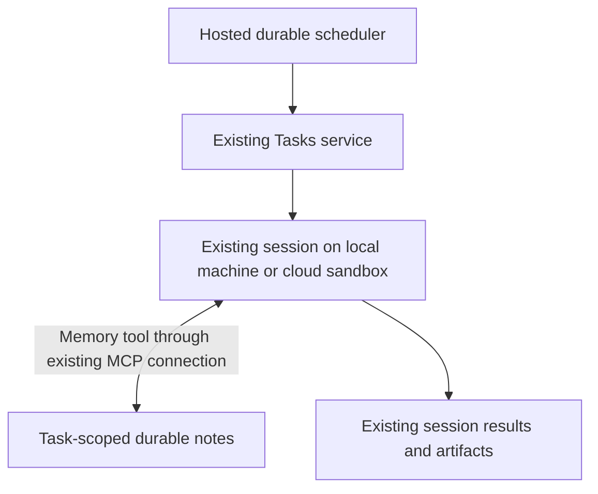

# Task: durable wakes and session memory

Proposed design · October 1, 2026 · Not implemented

This is the first delivery slice of the [Work system HLD](2026-10-01-work-system-hld.md). The HLD covers the full preset/session/task system, including script checks before agent wakes, shared memory ownership, event intake and ongoing work. Those broader capabilities are not implied by this one-time-wake scope.

## What we want

An existing task session can remember useful context and continue later. It can run on a local machine or in a cloud sandbox using the existing harness and session system.

The user says, “Check this tomorrow at 9 and continue here.” The agent saves useful context through a memory tool and records an authorized wake. At the requested time, the scheduler resumes the same linked session. The agent reads its task memory and continues with its existing tools and account.

**The scope is existing Tasks, a shared memory tool, and durable wakes.** We keep task records, project grouping, details, presets, session links and Start. We do not move the agent loop into a Worker, introduce a coordinator session or replace Tasks with a hosted plugin. The [Pi Worker core proposal](2026-10-01-001-feat-hosted-agent-core-plan.md) is a possible later execution option, not a prerequisite.

## Memory belongs to the task, not the machine

Give authorized linked sessions one proposed `memory` tool with list, read and write operations. Each call operates in the task's memory namespace. A local session and a cloud session see the same durable notes; replacing a session or stopping its sandbox does not discard them.

The first implementation stores bounded text entries and their revisions alongside the existing hosted Task data. Names such as `context.md`, `decisions.md` and `progress.md` make them easy to organize, but they are tool-addressed entries, not mounted OS files. This needs no remote filesystem, synchronization loop, staging directory, vector database or separate memory agent. Large files remain existing artifacts referenced from notes.

Reads return content and revision. Writes include the revision read; a stale write returns a conflict so the agent can read and reconcile. Retain prior versions under the task's retention policy. A retried write has a stable operation ID and returns the original result instead of creating another revision. Tool limits bound entry size, list/read output and retained storage.

The host binds tool access to the authenticated session and its task authorization. Passing another task ID cannot grant access. Notes contain context and source references; they cannot authorize tools, change account permissions or schedule work. Secrets remain with the existing credential owners. Memory has the task's access scope, with no automatic sharing across tasks or projects.

The session receives a short instruction to read relevant task memory when starting or resuming, and to save useful findings, accepted decisions and next steps as it works. This is ordinary agent tool use, not an automatic summary process. A confirmed memory write is durable; merely mentioning a fact in chat does not mean it was saved. Notes distinguish source-backed facts from inference and preserve references to relevant sessions/artifacts. Explicit session replacement can reuse the notes without pretending to recreate the old model conversation.

Tool output and existing task/session surfaces are sufficient for the first version. Users can ask to inspect or correct notes through the session; there is no separate memory dashboard. If the memory service is unreachable, the tool reports the failure and never claims a write succeeded. Both local and cloud callers use the same service through the existing tool connection.

## Durable wake

The first version allows **one pending, one-time wake per task**, targeting an existing linked session. A task without a session uses the current Start flow first. The wake records the due time, instruction, target and authority to continue. The confirmation shows the exact local date/time and time zone, for example: **“October 2 at 9:00 AM · Asia/Kolkata — Check the deployment and report here.”**

An explicit request authorizes that continuation. If the agent independently proposes returning later, the user accepts before it is scheduled. A later wake requires authority for that continuation; one wake does not grant endless recurrence. Changing the time, instruction or target replaces the pending wake under a new revision.

The task detail offers the pending wake with **Change** and **Cancel wake**, and later shows its accepted continuation or delivery blocker. This is wake-specific information, not a new progress/status system. Completing, archiving or deleting the task invalidates pending wakes; reopening does not restore them.

The hosted clock and stored memory survive with every client closed. **The agent still runs on the selected local or cloud runtime.** A suspended cloud workspace can resume through the existing authorized lifecycle. If a local machine is offline, its wake waits with a visible reason. The scheduler does not silently move it to cloud or create a replacement session. No model runs merely to wait for the due time.

## One execution path

Setting a wake persists its record before confirming success. The scheduler discovers due records from durable storage, so a crash between saving and notifying the clock cannot lose a wake. Due time means eligible from that time, not exact-second execution. After an outage, an overdue one-time wake is delivered once when its target and authorization permit it.

Tasks claims the current revision with a recoverable lease, checks task/session eligibility and current authority, then submits the saved instruction using a stable wake delivery ID. The runtime durably admits that continuation or returns the already-recorded admission. If the session is busy, input waits behind the current turn; it never steers the turn or bypasses a pending human decision.

The resumed agent reads the latest authorized notes through the memory tool, does the work, and writes useful updates. It uses its normal model conversation and native tools. Memory persists separately from that conversation and from its repository. No second model coordinates this process.

## Ownership

| Owner | Responsibility |
|---|---|
| Existing `@claxedo/tasks` domain and hosted store | Wake records, task-to-memory namespace association, task lifecycle and authorization |
| Proposed shared memory domain and hosted adapter | Entry content/history, revisions and idempotency; the first slice admits Task namespaces only, as defined in the Work system HLD |
| Existing MCP/tool layer | Expose the same memory and wake operations to authorized local/cloud sessions |
| Hosted scheduler | Find due/retryable wakes and invoke dispatch without a resident model |
| Existing Tasks session bridge | Resolve the selected session/placement and submit an authorized continuation |
| Existing session runtime | Durable wake admission, duplicate readback, input ordering and execution |
| Existing account, authorization and sandbox services | Current access, credentials, execution limits and placement lifecycle |

The wake record holds its ID/revision, task/session references, saved instruction, UTC due time/display zone, authorizing principal/reference, delivery state, dispatch lease, retry timing, last blocker and accepted input/turn reference. Memory records hold task scope, name, content, revision and write provenance. Neither stores account tokens.

Only hosted deployments with the memory service and durable clock offer these additions. A signed-in local session can use them without running the agent in cloud. Existing local-only Tasks remains available without pretending that offline local storage is shared hosted memory.

## Delivery and recovery

A scheduler-side “already sent” check is insufficient. Today's Tasks bridge reads history before the first message, while `admitTurnMessageIds` allows the same session message ID to run again. The canonical runtime admission owner must atomically persist a wake delivery ID, its input and recoverable disposition before execution. Repeated delivery returns that disposition rather than starting another turn. Ordinary explicit user retries remain separate operations.

| Situation | Behavior |
|---|---|
| Scheduler restarts or dispatches twice | Recover the wake; claim checks and runtime deduplication prevent duplicate admission |
| Runtime accepts but acknowledgement is lost | Reconcile by the same delivery ID; never invent a fresh input ID |
| Session is busy or awaiting permission | Keep input durable and preserve ordering/permissions |
| Local machine is offline or cloud resume fails | Retain the wake with bounded backoff and a visible reason; preserve placement |
| Memory read/write fails | Return an explicit tool error; do not claim to remember or persist unavailable data |
| Two sessions edit the same note | Compare revisions; return conflict rather than silently overwrite |
| Task/session access is revoked | Block subsequent memory calls and wake admission |
| Wake changes or is canceled during dispatch | Fence new attempts for the old revision; reconcile any in-flight acceptance before replacement |
| Accepted continuation fails during execution | Preserve the accepted reference and runtime error; do not replay the wake as a new turn |

Canceling prevents delivery that has not entered dispatch. If dispatch has begun, its acceptance must be reconciled; stopping already-admitted work uses the existing Stop control. Automatic delivery retries have bounded backoff and a finite recovery window. Exhaustion leaves a blocked wake for explicit retry/reschedule. Retain runtime deduplication evidence beyond that window and any surviving lease. One admitted continuation does not guarantee exactly-once external actions performed by the agent.

The host derives the acting identity from persisted authorization, rechecks access and issues short-lived runtime authority. An owner ID alone is not a grant. Record the authorized execution configuration with the wake: a change of payer, harness or permission scope requires review rather than silent adoption. Existing runtime limits bound the continuation; this adds no separate Task policy or budget engine.

## Fit with existing code

`TasksPage` → `useServer().tasks` → `@claxedo/tasks` → `TasksSessionBridgePort` → `createTasksSessionBridge` → workspace runtime remains the execution path. Memory is a tool call from that session through the existing MCP connection to the same task-scoped backend, independent of its local/cloud placement.

Task contracts, commands and store ports in `packages/claxedo-tasks/src/` own the wake records and task lifecycle rules. `packages/claxedo-server/src/tasks/{d1-store,hosted-composition}.ts` own hosted Task persistence/composition. The HLD's proposed shared memory domain owns entry/history/revision rules, with its first adapter using the hosted database and task-derived authorization. The clock is added to the optional hosted Task execution composition; the existing core Worker does not already provide a task scheduler. `packages/claxedo-mcp/src/tools/tasks.ts` and the existing registrar/access machinery expose the operations; declare their schemas once and use the same service for any direct session-tool registration. `packages/claxedo-server-core/src/tasks-host/session-bridge-core.ts` adds continuation delivery distinct from Start's first-message handoff. The runtime admission/store owner beside `packages/workspace-runtime/src/host/turn-admission.ts` supplies durable wake-key acceptance and readback.

The later Pi Worker runtime, if adopted, consumes this same memory service and wake contract. It must not introduce a second memory store or require a Task replacement. No hosted Pi, filesystem mount or general session-core extraction blocks this first version.

## Expected result

A user works on a task in a local or cloud session, saves context through the memory tool, schedules a wake and closes the app. When its selected runtime is available after the due time, one continuation reads the retained notes and proceeds. Another explicitly linked session can read those same authorized notes after the first sandbox stops. Restart, lost acknowledgement, concurrent edits and revoked access retain the specified behavior.

These are proposed requirements, not implemented behavior. Recurrence, Slack/webhooks, support-case routing, human handoff queues, a new Task UI and the Worker-hosted Pi loop remain outside this first version.
