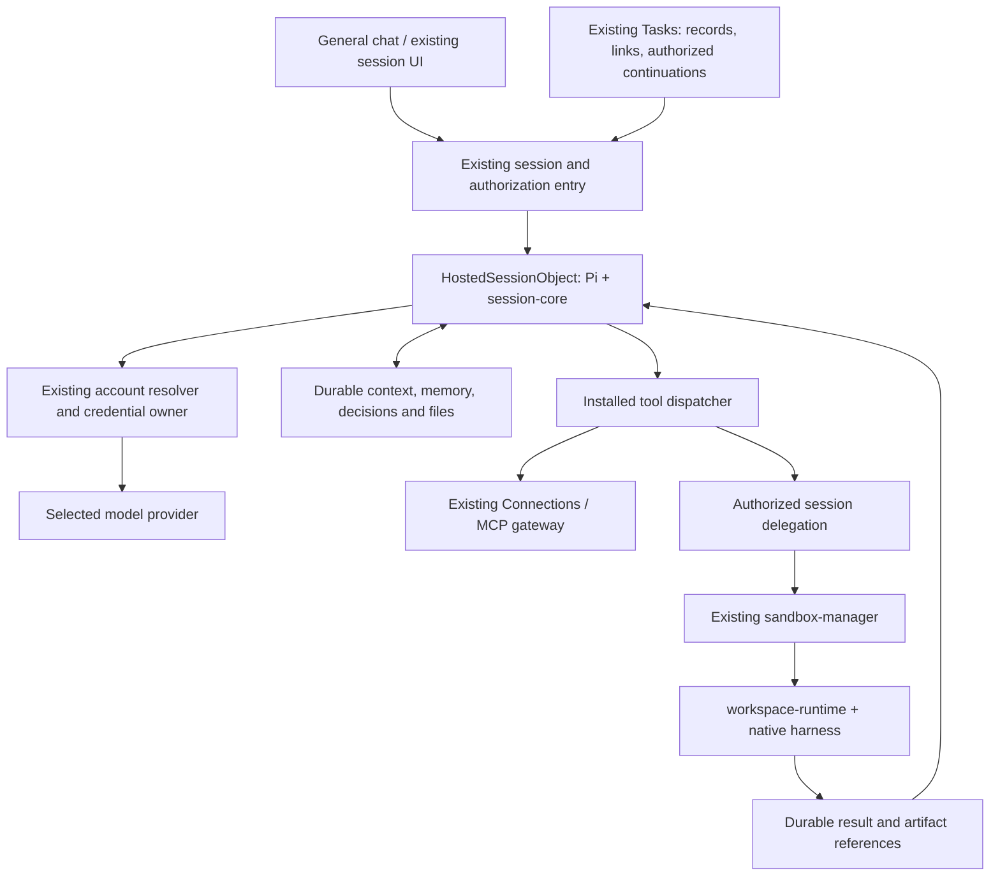

# Hosted agent core: Pi, durable filesystem memory and sandbox work

Status: deferred architecture proposal, not implemented. Updated October 1, 2026. Current Task work does not depend on this runtime.

The [Work system HLD](2026-10-01-work-system-hld.md) owns the overall preset/session/task, memory, trigger and execution architecture. This document describes only the optional Worker-hosted execution placement.

The current decision is [Task: durable wakes and session memory](2026-09-29-001-feat-tasks-plugin-on-pi-plan.md): expose one shared memory tool to existing local/cloud sessions and add durable wake delivery. That is sufficient for the first version. This document retains the possible later Worker-hosted Pi design; its runtime, mounted filesystem and sandbox delegation are not prerequisites. If built, it consumes the same Task memory service rather than creating another store. The runtime-neutral session extraction remains owned by [LOC reduction, D16 / Phase 3](2026-09-29-002-refactor-loc-reduction-plan.md).

## 1. Outcome and scope

If this later proposal is adopted, a person opens general chat or explicitly starts a Worker-hosted task session, chooses an allowed model/account, and talks to Pi without starting a machine. Core provides the conversation, tools and private working files, while reading Task notes through the existing shared memory service. A message or wake loads relevant context and runs Pi; idle has no model loop. This removes machine startup for ordinary turns, but that optimization is deferred from the current local/cloud session design.

When work needs native software or a repository, core starts a linked session on an authorized machine/sandbox through the existing execution system. The original conversation and durable work folder stay in core. The machine owns its native execution and repository, and publishes results back to the shared work context.

Existing Tasks can later integrate core as an explicit execution placement, retaining its records, presets, links, memory namespace and wake lifecycle. Pi uses the same scoped memory operations already available to local/cloud sessions. No separate memory engine or permanently running coordinator is introduced. General chat is independent of Tasks. Support cases, automated check scripts and human handoff queues remain outside the present scope.

**Scope of this future runtime:** hosted general chat; explicit provider/account/model policy; durable Pi sessions; reuse of Task memory; private files and authorized mounts; installed remote tools; bounded sandbox delegation through existing native sessions; optional Task placement integration. Existing machine sessions keep their native harness and current UI and are not silently migrated.

**Outside this plan:** Task scheduling/event ingress/handoff implementation; a new Space hierarchy; another connector or credential store; arbitrary npm extensions inside the privileged Worker; a new shell/process supervisor; live two-way mirroring of repositories; browser takeover; automatic conversion of old native sessions into hosted sessions. General chat does not acquire background recurrence merely by using this runtime.

## 2. Requirements

| ID | Requirement | Acceptance |
|---|---|---|
| **Product and spending** | | |
| R1 | Core is independent of Task | General chat works with Tasks disabled; no runtime import of Task implementation |
| R2 | User controls accounts and models allowed for general chat | Settings and server enforce the same allowed set; picker visibility alone grants nothing |
| R3 | Billing identity is explicit | Selected provider, credential reference and payer are fixed for an admitted turn; no personal/org/provider fallback |
| R4 | Chat needs no project or machine | First message, model catalog and private files work with zero workspaces |
| **Execution and authority** | | |
| R5 | Pi and client state recover together | Eviction/redeploy preserves model context, admitted input and correct existing session UI; duplicate delivery starts no second turn |
| R6 | Durable filesystem memory and mounted context have one owner | A wake reads retained context/decisions after session eviction and sandbox shutdown; revisions, source/resource access and isolation apply to reads/writes |
| R7 | Tools use existing installed capabilities and connections | One tool declaration and credential owner; absent/revoked authority blocks execution at dispatch |
| R8 | Machine work uses the existing sandbox/session system | Durable child identity, bounded access and cost, reconnectable progress/results, explicit stop and no silent placement change |
| R9 | Callers can narrow core authority | Current caller grants gate session and descendant actions; revocation prevents new admissions |
| **Operations and presentation** | | |
| R10 | Costs and limits are visible and bounded | Idle chats have no model loop; file/tool/model/delegation quotas and usage settle durably |
| R11 | Existing session UI remains the work surface | Transcript, composer, permissions, reconnect, files/results and linked work reuse existing components |

## 3. What exists today

These are repository observations, not evidence that the proposed Worker runtime already ships.

| Existing owner | Observed behavior / reuse point |
|---|---|
| `packages/claxedo-app/src/accounts/README.md`, `view/models-tab.tsx` | Settings → Models already has account setup, personal/org source selection and model visibility. Visibility is a composer preference; model discovery currently uses a project placement. |
| `packages/claxedo-server/src/credentials/worker/pi.ts` | `hostedPiCredentials` implements hosted Pi account-source selection and credential setup; provider catalog projection is not a running hosted harness. |
| `packages/claxedo-server/src/credentials/worker/index.ts` | `hostedOrgCredentials` owns encrypted, org-partitioned credentials. It is gated by hosted credential configuration and rejects an org-less secret operation. One row per owner/provider is the current account cardinality. |
| `packages/claxedo-server-core/src/credentials/{account-holder,account-source,pi-provider-projection,pi-credentials}.ts` | Selected source, credential admission and Pi provider projection already have owners. Extend those owners; do not make a second account resolver. |
| `packages/agent-runtime-contract/src/pi-providers.ts` | `PI_LAUNCH_PROVIDERS` is the canonical provider mapping. OpenAI API and OpenAI Codex are different routes. Native compatibility does not prove Worker compatibility. |
| `packages/harness/src/transports/pi-rpc/` | Current Pi is a native executable/RPC transport, with a tested range in `version.ts` (currently 0.99.0–0.99.1). `launch.ts` uses Node/process APIs. It cannot be bundled unchanged into a Worker. |
| `packages/harness/src/contract/{transport,session,broker}.ts` | Existing transport, turn, broker and event contracts. Hosted Pi must implement these semantics through a Worker-safe entry, not invent another UI protocol. |
| `packages/claxedo-connections/src/{types,service}.ts` | Connection capabilities and secret resolution. Personal-account use requires verified subject authority; an owner ID is not delegation. |
| `packages/claxedo-server/src/agent-plugins/mcp/{runtime-preparation,connections}.ts` | Installed MCP preparation, readiness and scoped gateway credentials. Current preparation is workspace-oriented; hosted chat needs a real session context, not a fake workspace ID. |
| `packages/claxedo-server/src/connections/turn-credentials.ts` | Current interactive turn credentials are process-local. Extract/reuse authorization semantics, but do not use an in-memory map as a durable background grant store. |
| `packages/sandbox-manager/src/manager.ts`, `packages/claxedo-server/src/authority/adapters/worker/hosted-sandbox-driver.ts` | Sandbox lifecycle, leases and hosted driver selection already exist. Core delegates to them. |
| `packages/workspace-runtime/src/` | Machine session host, native filesystem and harness execution. Shared journal/routes/projection move to `packages/session-core` under D16; that package is a prerequisite, not an existing completed extraction. |

Live account source vocabulary is `own` / `team`; LOC decision D17 proposes `own` / `org`, reserving “team” for an access group. This plan uses “organization account” in the UI and follows the canonical vocabulary when implemented, without adding a parallel alias scheme.

### Dependency gate before implementation promises

The original Task plan named `AgentHarness`, `createStorageConformance` and `@cloudflare/shell` as fixed interfaces. Do not implement against those assumptions without a pinned release.

The current official [Pi durable harness documentation](https://github.com/earendil-works/pi/blob/main/packages/durable/README.md) describes an experimental `Harness`, portable SQLite storage suitable for a supplied Durable Object adapter, execution environments, and `registerStorageConformance`. Tool intent is persisted, but only replay-safe tools rerun automatically after interruption. Its live watch can coalesce state; it is not itself Claxedo's reconnect journal. These are upstream capabilities to verify at a pinned revision, not a completed integration.

The current [Cloudflare computer documentation](https://github.com/cloudflare/computer/blob/main/packages/computer/README.md) describes SQLite-backed files, read-only R2 mounts and selectable execution backends, but explicitly marks the package preview and unsuitable for production. Container-backed file access also has limits for heavy repository workloads. Use it for the initial filesystem feasibility gate; production adoption is blocked until its suitability is resolved and documented. A successful prototype does not waive that gate.

Unit 1 must establish compatible, pinned dependencies, DO transaction semantics, model-context recovery and a production-suitable filesystem owner. If the SDK cannot satisfy them, stop that implementation slice and revise this plan. Do not repair it with a custom agent loop, transcript-to-model reconstruction, an in-memory filesystem or an automatic native fallback.

## 4. User configures general chat

### 4.1 Settings and the composer

Add a **General chat** section to the existing **Settings → Models** surface. Reuse its account rows and Connect/sign-in dialogs. Account permission, model permission and default selection are visible together:

```text
Settings / Models / General chat

Account                       Available here       Allowed models
Personal OpenAI API           [on]                 Selected models…
Organization OpenAI API       [off]                Managed by organization
Personal Codex login          Unavailable          Unsupported in this runtime

Default                       OpenAI API · Personal / selected model
Sandbox work                  Ask before first use · runtime/cost limit

Chat composer
[Model · Personal account ▾]   [Tools]   [Files]     Send
```

This is a directional UI sketch, not a claim that a particular provider is supported or unsupported. Eligibility comes from the tested runtime capability matrix and current account state.

1. The user opens General chat. Load hosted account metadata and the hosted runtime's model catalog; do not scan local CLIs or require a project.
2. **Connect account** uses the existing provider flow. Connecting makes an account available for selection; it does not enable every use or silently set it as default.
3. The user enables a permitted account for general chat and selects allowed models. An organization administrator sets the organization's ceiling: which organization accounts/models members may use and who may use them. A member can narrow that set, never expand it. An organization can also restrict personal-account use in organization-scoped chats.
4. The user selects a default eligible account/model. With no eligible default, Send offers account/model setup and spends nothing. A newly added or replacement account is not enabled by an old deleted credential's ID.
5. A chat may override the default using the same eligible list. The composer shows who pays. Changes during a turn apply to the next turn; they never silently change an in-flight payer.
6. Model visibility remains presentation only. Hiding a model does not revoke it; disabling it in General chat policy does. Direct API calls must pass the same policy as the UI.

Keep the existing **Allow in cloud sandboxes** consent distinct from **Allow for general chat**. Enabling Worker chat does not export that account into a machine, and a sandbox-enabled CLI login is not automatically a Worker-compatible provider credential. Machine-only credentials require an explicit supported hosted sign-in/import flow; never read them out of a user's machine as an implicit setup step.

### 4.2 Authority and storage

Extend the existing account configuration service with revisioned, non-secret usage policy. It references existing credential IDs, provider IDs, allowed model IDs, subjects/organization scope, purpose and defaults. Store small policy metadata alongside hosted account configuration in D1; keep secrets in `hostedOrgCredentials`. No second login or credential table.

An admitted model request must satisfy all of:

**tested Worker provider/auth support ∩ account usable by this principal ∩ organization policy ∩ general-chat policy ∩ selected model support ∩ current credential health ∩ budget.**

General-chat policy authorizes interactive chat only. Task automation uses an accepted, revocable delegation for that task and purpose. Neither a user's default model nor a session's author grants future autonomous use of that person's account. A child session gets its own authorized account selection; a native-only plan can be chosen for the child without changing the Worker's billing identity.

Resolve policy on the server from the authenticated principal, not client-supplied owner/account claims. Freeze the resulting account reference and policy revisions with turn admission. Recheck revocation before every later provider request, including tool-loop continuations and compaction. Refresh OAuth only through the existing credential owner. A removed or exhausted account yields a visible blocker and an explicit change/retry action; never substitute another payer. Requests already accepted by a provider can still finish and incur usage.

Provider launch eligibility must be tested separately for API keys, supported OAuth paths and native-only subscriptions. A CLI accepting a login does not establish that the Worker SDK can or is authorized to use it. Offer only validated provider/auth combinations; label the rest unavailable with an actionable reason.

## 5. Core ownership

The names below are proposed implementation names. They add one hosted execution placement; they do not replace native Pi or move existing native sessions into the control plane.



| Owner | Responsibility |
|---|---|
| `packages/hosted-agent-runtime/` (new) | Worker-safe Pi adapter, durable turn orchestration, session-core projection, filesystem environment and delegated-session tool. No Task business rules or token refresh implementation. |
| `packages/claxedo-server/src/hosted-agent/` (new) | Cloudflare composition: `HostedSessionObject`, bindings, authenticated routes, storage adapters and ports to existing authority/accounts/connections/sandbox services. |
| `HostedSessionObject`, one per hosted session | Pi's complete model conversation, durable inputs/turns, session-core client journal, private workspace files and delegation links. Persisted state survives object eviction. |
| Task memory service proposed in the current Task plan | Authoritative task-scoped notes and revisions, independent of runtime/session lifetime. Pi uses the same operations as local/cloud sessions; any mounted view is an adapter, not a writable copy. |
| Existing credential/account services | Secrets, refresh, provider mapping, account selection and new usage policy. |
| Existing Connections and plugin owners | Tool declarations, installed capabilities, connections, external credentials and resource enforcement. |
| Existing session authority / `session-core` | Session identity/access, canonical client protocol, list metadata and journal/projection contracts across placements. |
| Existing sandbox manager and `workspace-runtime` | Placement lifecycle, native child sessions, repository files and execution truth on a machine. |
| Existing Tasks service | Task records, presets, session links and durable wakes. No embedded Pi harness or transcript store. |

Core depends on host ports and shared contracts; hosted composition implements those ports using existing services. If integrated, Tasks selects this placement through its session bridge; Pi calls the shared memory service under current authority. Core must not import Task business rules, infer permission from a stale grant or duplicate Task note storage.

Extend the canonical `SessionRef` / placement contract to distinguish a hosted session object from a native workspace. Both carry the real session ID; only native placement requires a workspace ID. The server issues and authorizes the placement reference. General chat must not allocate a fake project, directory or machine workspace to pass existing routing checks. Update session lists, attachment routing, access checks and clients together through that one contract.

### 5.1 One durable conversation, one client protocol

1. Send reaches existing session authority, which checks session access, placement and model policy, then forwards a command with a stable input ID to `HostedSessionObject`.
2. The object persists the input and selected execution identity before acknowledging it. Duplicate IDs return the original disposition. Inputs serialize per conversation; independent conversations use separate objects.
3. Pi loads its own durable conversation and runs the turn. The host supplies scoped tools, files and account resolution. The entire model conversation lives here; a UI transcript in another store is not a replacement for Pi state.
4. The hosted adapter projects authoritative, committed Pi entries/state into the same session-core turn/message/tool contract used by the UI. Stable upstream identities plus a durable projection cursor/outbox make publication retryable. Pi storage is the model authority; session-core is the client journal. There is no third recovery ledger.
5. Existing session routes/streams expose frames only to authorized viewers. D1 holds list/placement rows; it holds neither the model transcript nor the filesystem.
6. On eviction, restore Pi state, pending input and projection progress; recheck authority before continuing. Unit 1 must prove the commit-to-journal boundary across a crash, including a crash between a Pi commit and publication. A coalesced live watch is insufficient evidence of complete journal recovery.

The adapter reports the upstream result faithfully: replay-safe work may resume; an interrupted unsafe tool is reconciled or exposed as uncertain. Never fabricate a successful result, restart the whole turn blindly, or replay an external action just to complete a transcript.

Liveness is a host responsibility as well as persistence. Durable pending work must register a recoverable wake before acknowledgement; platform alarms resume interrupted scheduling with bounded retries. A browser connection or an in-memory promise must not be the only thing keeping an admitted turn alive. Stop is a durable command, not closing an SSE connection.

## 6. Files and mounts

### 6.1 A real scope boundary

Each hosted session starts with a private durable working folder, created lazily on first write. The logical tree might be:

```text
/work/                 session-owned scratch, notes and outputs
/attachments/          explicitly attached input versions, read-only
/task/memory/          optional view over existing task memory operations
/project/docs/         explicitly selected authorized document mounts
```

Paths are examples, not global buckets exposed to the model. A mount record names its source owner/resource, root, access mode, revision behavior and authorized grant. It contains no credentials. Being in a project does not mount every company document.

Pi's file tools use an environment adapter over this tree. Every access resolves a mount and checks its current authority. Enforce traversal, encoded paths, symlink escape, list/search filtering, byte limits and write mode at the filesystem boundary. Shared-file updates use source revisions/compare-and-set; concurrent edits report conflicts rather than overwrite silently. Worker-local file locks alone cannot protect a shared resource in another object.

### 6.2 Where bytes live

- **Private session files:** the session object's durable filesystem metadata/small content; large immutable blobs in R2 with org/session ownership. Core owns publication, quotas and garbage collection for these files.
- **Task memory:** the service proposed in the current Task plan remains authoritative. Core accesses its list/read/write operations directly; a later file-shaped view maps to those same versioned operations without copying entries into session SQLite. Artifacts referenced by notes remain with their existing artifact owner. No per-task filesystem object is required for the initial memory tool.
- **Existing documents:** their existing document service remains authoritative. A mount adapter reads authorized versions; writes go through its versioned API. General chat's private filesystem does not depend on hosted Documents being deployed; unavailable document mounts are shown as unavailable.
- **Repository/native files:** the sandbox or enrolled machine remains authoritative. Publish selected inputs/outputs across the boundary as described in §8; never pretend the small Worker folder is a full repository.

Mounting is access to an owned resource, not automatic ingestion of every file into the prompt. Retrieval records source and revision. Revocation prevents later reads/writes and stream access; previously read text remains part of the already-authorized conversation history and cannot be “unread” by a model. Sharing a chat does not itself grant access to its mount sources or protected history: the share/read check must verify the recipient's required source access and reject the share when that access is missing.

### 6.3 Long-term memory is part of normal work

Durable notes are the agent's ongoing work context. The proposed memory tool lists and reads entries such as `context.md`, `decisions.md` and `progress.md`, with references to source material and results. A filesystem-shaped view is optional in this future runtime; it does not replace the service's authority or require a separate memory product/vector database.

At a new turn or wake, Pi reads the relevant notes through the shared memory tool instead of loading all history into every prompt. During normal work, it saves useful findings and accepted decisions, links sources and distinguishes inference from confirmed facts. Writes use service revisions and persist before a later wake depends on them. Users can inspect or correct entries through their sessions; any future file editor uses those same operations and retention rules.

On wake, use the latest authorized file versions, including intervening human edits, and report their provenance. Files are context, not grants: a note cannot change account policy, authorize a tool or create a wake. Secrets stay with credential owners. Scoped memory is not automatically shared with unrelated tasks or chats.

Pi conversation persistence and shared memory have different jobs. Pi preserves the exact model conversation and execution state; notes preserve readable knowledge across context compaction, explicit session replacement and sandbox shutdown. Neither is reconstructed by guessing from the other. The current Task plan lets local/cloud sessions consume this service without a Worker parent. A future delegated session publishes result references through the same memory operations; its repository remains native.

## 7. Tools and connections

1. Hosted session setup resolves installed tool declarations and selected connections under the caller's scope. Reuse existing plugin activation and MCP preparation with a host-neutral session execution context. Reject workspace-required tools when no workspace is present; never mint a dummy workspace to satisfy a check.
2. Offer only applicable, authorized tools. The host selects exact trusted Pi extensions/tool definitions; upstream registry defaults must not expose every installed extension. Do not load third-party extension code into the privileged model/credential Worker.
3. Every call crosses the existing scoped action boundary with session, turn, tool-call identity and current grant. Tool visibility is not authorization. Validate arguments, source resource restrictions, approval and revocation at dispatch, including calls issued before a policy change.
4. Local file operations use the scoped environment. Remote MCP/connector operations use supported HTTP transports and existing gateway credentials. Stdio servers and native tools require a machine session; don't import Node launch code into core.
5. Model credentials go only to the trusted provider client. Connector secrets remain with the gateway/connection owner. No secrets in filesystem mounts, model prompts, result attachments or untrusted code environments.
6. An operation awaiting approval persists its request ID and resumes from the exact approved call after authority is rechecked. Approval timeout or rejection grants nothing. Connector calls retain durable action IDs and uncertain-outcome handling at the shared connection execution boundary. Existing Task command receipts are not external-action receipts; selecting a task session must not imply that an autonomous action policy already exists.

**Isolated JavaScript execution:** expose a bounded, separately isolated execution capability only after its own Worker gate passes. It receives scoped file/tool RPC stubs and explicit egress/resource limits, never ambient account secrets. The same dispatcher checks every action reached through code. Automated Task checks are outside the current Task scope; durable wakes invoke a session continuation, not a check runner.

## 8. When Pi needs a sandbox

### 8.1 Use a native child session

For the first release, machine-required work uses a linked normal session, not a newly built remote shell service. This reuses the existing native harness, its tool permissions and session persistence. It may cost a second model turn; make that visible. Direct command-only offload can be considered later if measured need justifies an API in the canonical execution owner.

Example: **“Read these support exports and generate a PDF report.”** Pi reads permitted files in the Worker. If generating the PDF needs native libraries, it requests a sandbox session with that bounded objective and selected input versions.

1. Pi calls the core's proposed `delegate_work` tool with the objective, required capabilities, input references and output destination. The host resolves placement, harness and billing from authorized configuration; model-supplied IDs cannot grant access.
2. The user approves first sandbox use, account and runtime/cost limits unless explicit existing authority already covers them. A Task wake authorizes only its recorded continuation, not arbitrary new sandbox work or a new account. No additional approval is needed for an already-authorized operation.
3. Persist a delegation ID bound to the parent turn/tool call before starting anything. Existing `sandbox-manager` ensures/resumes the selected workspace with its lease and epoch. Existing session authority starts the native child idempotently and records the same delegation ID. A lost response is reconciled by ID, not a second start.
4. The child receives only selected context, mounts/staged inputs and a scoped tool grant. A required native harness/account must be explicitly allowed for that placement. If unavailable, show the blocker; do not silently substitute Pi, another account, a local machine or a different sandbox.
5. The child executes through `workspace-runtime` and the existing harness. It owns its model conversation and native files. The Worker parent is durably waiting; no model tokens are spent polling and no long HTTP request is the completion contract.
6. Completion/progress reaches core through authenticated, idempotent session events. Persist completion before waking the parent; verify child identity and lease/epoch. Record a tool result with the real outcome and authorized artifact references. Pi continues from that result.
7. **Open work session** opens the existing child UI, with files/review/browser only where applicable. The general chat remains the original conversation; delegation is not a silent move or rewrite of its history.

### 8.2 File transfer and authority

Baseline: stage only selected, versioned input files into the child workspace, read-only where required. Native output stays there until the child publishes an explicit manifest of files and revisions to core. Publication validates paths, sizes, types, access and destination revisions. Reject conflicting outputs for review rather than overwrite newer documents.

Do not configure automatic bidirectional sync of the Worker's folder and a repository. A genuine remote mount may replace staging for a particular backend only after read/write isolation, durable disconnect behavior and single-writer/conflict rules pass the same gate. The SDK's ability to mount a filesystem does not by itself establish those guarantees.

### 8.3 Stop, failure and revocation

- Parent **Stop** durably cancels its outstanding delegation and asks the child session to stop. Do not report stopped until acknowledged; an unreachable child is unknown/stopping. A user who wants it to continue independently must explicitly detach/reassign it under existing session authority.
- A deadline fences new child actions and requests cancellation; a timeout is not proof that a side effect or process stopped. Reconcile through the existing runtime owner before retrying.
- Parent eviction restores the same child reference. Child completion delivered twice creates one tool result. Child failure returns the actual failure and partial outputs; retry is an explicit new attempt with the previous attempt retained.
- Descendant grants remain bounded by current caller authority. Revocation fences new action admission throughout the delegation tree and requests running descendants to stop. Already-admitted actions must drain or remain visibly uncertain. A future human-handoff feature can use this boundary, but its business workflow is outside the current Task/core launch.
- A sandbox that cannot enforce required resource/egress/action restrictions is ineligible for that delegated policy. Giving a machine unrestricted credentials and relying on a prompt to narrow them is not enforcement.

## 9. UI and operational behavior

General chat uses the existing session layout. The composer identifies model and payer, Tools shows selected capabilities, and the right workspace exposes actual attached files and generated results. No separate Task product UI is required to use core.

Account policy saves show pending, saved or a row-local failure; a failed save cannot make the picker claim access was granted. Catalog loading and no eligible account are distinct from a provider outage. Reuse existing keyboard, screen-reader and responsive settings/session controls; account source and authorization failures must have text labels, not color-only indicators. On narrow screens, the existing workspace sheet presents files and delegation details.

Permission cards and linked work cards reuse existing session components. A delegation card shows placement, child session, state, runtime limit and Open/Stop actions. Unavailable account, revoked tool, mount conflict and offline sandbox each have an actionable state; they are not generic “agent failed” messages. Native sessions remain selectable as before, with placement capabilities determining which controls appear.

Existing Task UI, presets and session links remain their current owner's responsibility. Core integration adds a placement, not the previously proposed Task home redesign. Task completion must not be inferred from a linked session becoming idle.

Record session/turn/tool/delegation IDs, account references, policy revisions, usage and failure classes; redact secrets and avoid logging customer payloads. Measure cold start, first token, recovery latency, memory, storage, model/tool usage and sandbox duration. Reserve budgets before concurrent admission and settle actual usage, including failed requests and child work. No idle model loop; durable storage and platform operations may still incur cost.

Deleting a hosted session first fences turns and descendants, then deletes owned state/files and indexes through an idempotent cleanup record. Detach external mounts without deleting source documents or repositories. Shared workspaces are deleted by their owning resource lifecycle, not whichever session ends first. Task deletion invokes these core operations under its retention policy; export and retained Task session links must not silently become dangling references.

## 10. Implementation units and gates

Paths marked **new** are proposed. Read the owning packages' instructions when implementing. Each unit extends a canonical owner and finishes through its public entrypoints; mock-only tests do not satisfy live gates.

### Unit 1 — Pin and prove the hosted runtime (R4–R6)

- **New:** `packages/hosted-agent-runtime/src/{pi,storage,environment}/`; focused files `storage/durable-storage.test.ts`, `pi/recovery.test.ts`, `environment/filesystem.test.ts`.
- **New composition/probe:** `packages/claxedo-server/src/hosted-agent/{session-object,workspace-object}.ts` and `session-object.workerd.test.ts`.
- Pin Pi durable and filesystem dependencies; record API/version support and production suitability. Prove the supplied async SQLite transaction facade against DO transaction restrictions, rollback, concurrent requests and the upstream conformance suite. Do not wrap an async transaction body in `transactionSync` and assume it commits atomically.
- Prove private files persist across eviction, Task notes remain in the shared service across runtime replacement, and forbidden mounts/paths fail. Prove a real provider turn reads a file, streams a response, restarts, and uses prior **model** context accurately; durable notes alone cannot satisfy model-state recovery.
- Prove input acknowledgement/wake/recovery without a connected browser; crash between Pi commit and client-journal publication; interrupted tool behavior. Measure deployed Worker CPU/memory and tool-loop duration, not just local Node execution.
- **Exit:** pinned source evidence, workerd and deployed staging results, production suitability decision. Failure blocks subsequent runtime adoption. No alternate loop or filesystem implementation is silently added.

### Unit 2 — General-chat account policy and UI (R2–R4)

- **Extend:** `packages/claxedo-server-core/src/credentials/` with `usage-policy.ts` / `usage-policy.test.ts`; existing `account-holder.ts` and `pi-provider-projection.ts` only where their canonical responsibilities change.
- **Extend:** `packages/claxedo-server/src/credentials/worker/{index,pi}.ts`, hosted schema migration and `credentials/worker/general-chat-policy.test.ts` (**new**) for policy storage/routes. Use the next migration in the existing migration owner at implementation time.
- **Extend:** `packages/claxedo-app/src/accounts/` with `view/general-chat.tsx` and `view/general-chat.test.tsx` (**new**); existing Connect components and account store.
- Cases: zero workspaces; personal and organization restrictions; hidden versus forbidden model; no default; forged credential ID; newly replaced account; native-only auth; revoked credential during a tool loop; refresh race; account change mid-turn; missing hosted credential configuration. Direct API refusal must match the picker.
- **Exit:** user configures an account and completes an actual general-chat turn; disabled account/model is rejected through the same public API. No unintended payer change or sandbox credential delivery.

### Unit 3 — Existing session contract and durable projection (R1, R5, R11)

- **Prerequisite:** D16 / LOC Phase 3 supplies `packages/session-core` ports and canonical journal.
- **New:** `packages/hosted-agent-runtime/src/session/{transport,projection}.ts` and `transport.test.ts`, `projection.test.ts`.
- **Extend:** `packages/harness/src/contract/transport.ts` and existing placement/session routing under `packages/claxedo-server/src/routes/runtime-session-authority.ts`; hosted composition in `src/hosted-agent/`. Add one explicit hosted transport/placement entry without importing the native launch graph into workerd.
- Extend the canonical `SessionRef` issuance from LOC D4 with explicit hosted/native placement. Cover missing and forged placement, zero-workspace creation, history/attachment routing and native-session regression through the same authority tests; no directory sentinel or dummy workspace.
- Prove actual `HarnessTransport` capability/config/turn/cancel/permission semantics; unsupported operations are reported as such. Native RPC events and hosted durable events are different producers; reuse their shared normalized contract, not a parser that pretends they have the same wire format.
- Cases: duplicate Send; queued turn; provider failure; stop/reconnect; pending permission recovery; authorized stream revocation; transcript and model state after restart; Tasks disabled. Add `packages/claxedo-server/src/routes/hosted-session-authority.test.ts` and `packages/claxedo-app/e2e/hosted-general-chat.spec.ts` (**new**) through existing test harnesses.
- **Exit:** ordinary existing session UI, history and reconnect work for both placements. No second session sidebar or client event protocol.

### Unit 4 — Mounted resources and shared tools (R6, R7, R9)

- **New:** `packages/hosted-agent-runtime/src/files/{mounts,resources}.ts`, `mounts.test.ts`, `memory-continuity.test.ts`; `src/tools/{registry,dispatch}.ts`, `dispatch.test.ts`.
- **Extend:** `packages/claxedo-server/src/agent-plugins/mcp/{runtime-preparation,connections}.ts`, `connections/turn-credentials.ts` and canonical Connections authority; add `agent-plugins/mcp/hosted-session.test.ts` (**new**).
- Cases: independent workspaces; a wake reading saved decisions after eviction and sandbox shutdown; explicit session replacement preserving memory; intervening human edits; versioned corrections and source references; bounded context loading; read-only/revoked mounts; traversal/symlinks; concurrent writes; protected-history sharing; oversized tool output; stdio-only tool refusal; forged subject; approval racing revocation; duplicate/uncertain side effects; memory text attempting to expand authority.
- Bounded JS execution uses the same dispatcher and file policy; prove isolation and egress separately before enabling it. Hosted Documents availability gates that mount adapter alone, not private chat files.
- **Exit:** a real connected tool succeeds under scoped authority; wrong resource/account/scope fails at the execution boundary, including through isolated code.

### Unit 5 — Sandbox delegation (R8–R10)

- **New:** `packages/hosted-agent-runtime/src/delegation/{service,artifacts}.ts`, `service.test.ts`, `artifacts.test.ts`.
- **Extend:** existing session authority and `packages/sandbox-manager/src/manager.ts` only for missing lifecycle contracts; composition reuses `authority/adapters/worker/hosted-sandbox-driver.ts`. No duplicate provisioner, PTY owner or remote shell supervisor.
- **New integration coverage:** `packages/claxedo-server/src/hosted-agent/delegation.integration.test.ts` and `packages/harness/e2e/flows/hosted-chat-delegation.flow.ts` through the existing live harness.
- Cases: first-use approval; already-authorized delegation; lost start response; parent eviction; sandbox restart/offline; duplicate completion; cancel/deadline versus completion; native-only account delivery; child privilege narrowing; output conflict/path escape; exhausted shared budget; caller revocation fencing a descendant.
- **Exit:** a real chat delegates a native-library job, receives a generated file after reconnect and opens its actual work session. Provider credentials and unrelated files never reach the child. Stopping and uncertainty are demonstrated, not inferred from a successful run.

### Unit 6 — Task consumer and operational acceptance (R1, R9–R11)

- **Extend, if this placement is adopted:** `packages/claxedo-tasks/src/ports/session-bridge.ts` and `packages/claxedo-server-core/src/tasks-host/session-bridge-core.ts` for explicit Worker session placement. Reuse the existing Task memory namespace and wake contract; no replacement plugin or second memory store.
- **New:** `packages/claxedo-server/src/tasks/hosted-agent-placement.test.ts`. Task supplies authorized context and continuation identity; core supplies ordinary session execution. No task-specific branch in the Pi loop.
- Cases: Task Start explicitly selects Worker placement; Pi reads the same notes previously written by local/cloud sessions; a wake admits one continuation despite duplicate delivery; memory revision/access rules match across runtimes; changed/revoked authority refuses; general chat works without Tasks. Support cases and human handoff are not acceptance prerequisites.
- **Exit for this future integration:** Worker placement adds execution capability while reusing Task memory/wakes and preserving native execution. Publish capacity/cost measurements and retention limits. Run affected package checks and architecture ratchets for new production imports; document any unverified public flow explicitly. None of this blocks the current memory-tool and durable-wake scope.

**Order:** Unit 1 and D16 establish the runtime/storage contract; Unit 2 establishes permitted spending; Unit 3 integrates sessions; Unit 4 adds scoped tools/mounts; Unit 5 adds native work; Unit 6 validates Task reuse. Account/UI work can begin independently once policy semantics are fixed, but it cannot claim runtime availability before Unit 1 passes.

## 11. Decisions and tradeoffs

- **Worker runtime is core, Task is policy.** General chat gets the same execution foundation without installing a task scheduler.
- **Native and hosted are explicit placements.** Each owns its complete Pi conversation; there is no split in-memory model loop with remote transcript recovery. Existing native sessions stay native.
- **One hosted object per session.** Session concurrency spreads across objects, while shared workspaces serialize their own writes. This adds cross-object references; idempotent start/delete/result delivery are required.
- **Server policy is separate from UI visibility.** More settings than a single model toggle, but users can distinguish what is hidden, what is forbidden and whose account is charged.
- **Child sessions first for sandbox work.** Reuses execution, permissions and UI, at the cost of child-agent startup/model overhead. It avoids adding a second process API solely for this feature.
- **Versioned inputs and published outputs first.** Clear authority and recoverable conflicts; less seamless than a shared live filesystem. Large native repositories stay on native storage.
- **Dependency maturity is a blocker, not an implementation detail.** The named upstream APIs are currently experimental/preview. Unit 1 owns the evidence required to adopt them; this planning change does not establish launch readiness.

## 12. Completion criteria

- [ ] All R1–R11 pass through real hosted entrypoints with recorded version/configuration evidence.
- [ ] A user can configure permitted accounts/models, send a projectless chat, use mounted memory/files and a connected tool, delegate native work and receive its result after reconnect. A Task wake resumes with retained context and decisions even after its sandbox stops.
- [ ] Account, tool, mount, organization and Task ownership checks fail closed; no implicit payer or placement changes.
- [ ] Pi state, client journal, inputs, approvals and delegation recover without losing or fabricating execution history.
- [ ] Task embeds no private Pi runtime, credential refresher or filesystem implementation; native sessions continue through their existing transport.
- [ ] Dependency suitability, deployed Worker recovery, sandbox cancellation, isolation, retention and measured cost/capacity gates are recorded. Unit tests alone do not close them.
