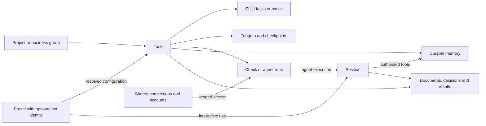
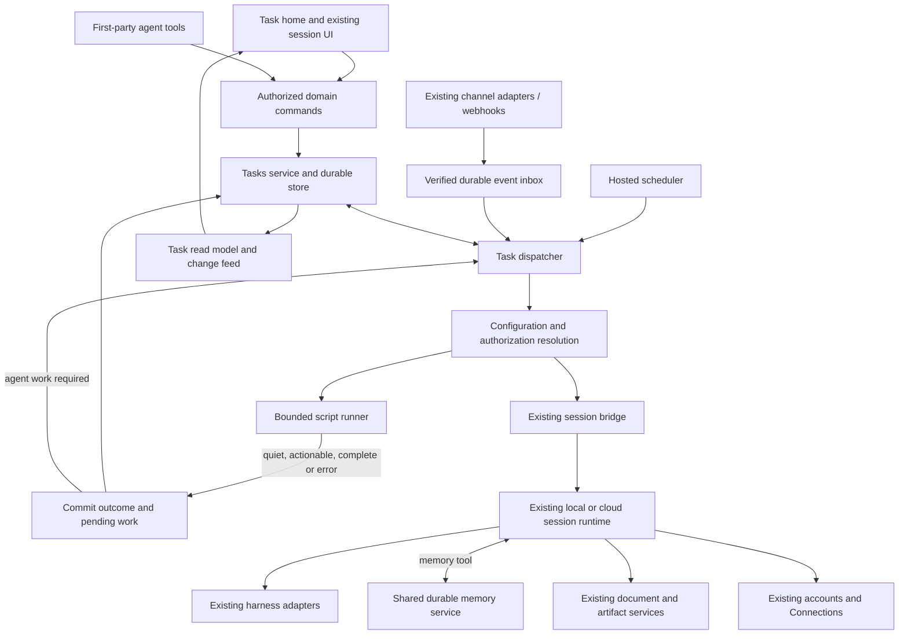
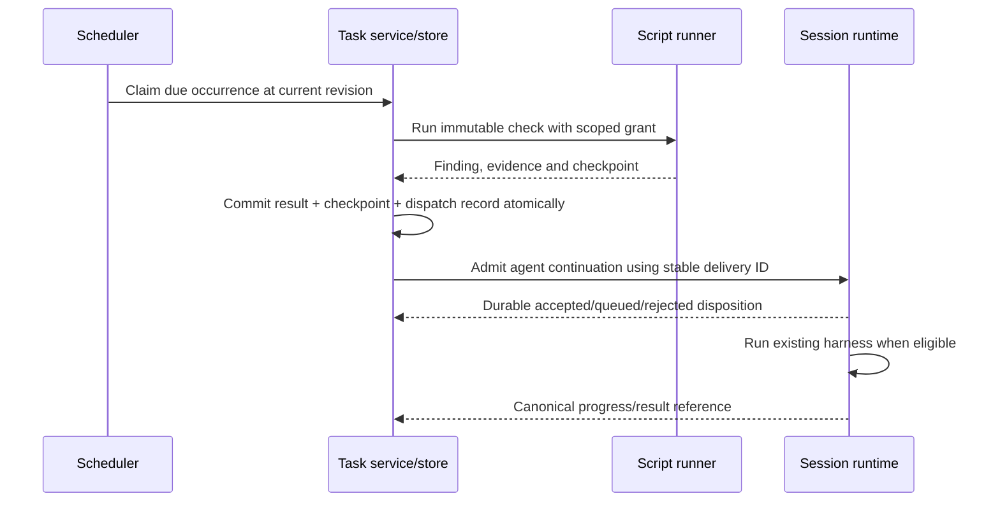

# Work system: high-level design

Proposed architecture · October 1, 2026 · Grounded in the current working tree; source inspection is not release acceptance.

This is the system design for general sessions, reusable presets, optional bot identity, durable tasks, memory, tools, triggers, script checks and local/cloud execution. It describes the complete product direction and the concrete changes from today's implementation. The narrower [Task foundation plan](2026-09-29-001-feat-tasks-plugin-on-pi-plan.md) remains the first delivery slice. The [Worker-hosted Pi proposal](2026-10-01-001-feat-hosted-agent-core-plan.md) is an optional later runtime.

## 1. Outcome and architectural decisions

A person works normally in a session: researches, brainstorms, writes, builds or operates connected services. When work must survive the conversation, the session creates a Task with the goal, execution configuration and authority to continue. That task can finish a job, wait for a reply, check a condition, repeat an output or accept new work. The creating session can end. Later sessions and checks operate from the task's durable records.

The system uses three existing product concepts:

- **Session:** the conversation and actual agent execution.
- **Preset:** reusable instructions and execution settings; optionally given a public bot identity.
- **Task:** the durable responsibility, its progress, future work and outcomes.

Projects group related work. Connections hold external account access. Documents and artifacts retain outputs. These concepts work together without requiring a new Space hierarchy or a separate Coworker object.

The design makes these decisions:

1. Extend native Tasks and the current session/harness system. Do not replace them with a Task-specific agent loop.
2. Persist background intent in the control plane. A session, model process or browser tab does not keep a task alive.
3. Prefer a saved deterministic check for condition-based wakes. Admit an agent turn only when the result requires it.
4. Resolve configuration and permissions on the server for each execution. A preset is reusable configuration, not a credential or standing authorization.
5. Access durable memory through a tool from cloud and local sessions. A filesystem mount is optional future presentation of that memory.
6. Keep ordinary chat available without a Task. Persistence of chat history and authorization for autonomous work are separate choices.
7. Reuse shared presentation components for Task details and session panels; keep their data and navigation owners separate.

## 2. What exists and how it works now

The following are observations of repository code on October 1, 2026. They establish reuse points, not proof that every deployment or provider has passed live acceptance.

### 2.1 Creating and starting a task

1. A person opens `TasksPage`. It chooses one project and renders `TasksView` or `TaskDetailPage`. The current view supports a list/board, subtasks, image attachments and linked sessions. [UI owner](../../packages/claxedo-app/src/tasks/view/tasks-page.tsx), [current behavior](../../packages/claxedo-app/src/tasks/README.md).
2. UI commands use `useServer().tasks` and the typed Tasks client. An agent reaches the same domain through `registerTaskTools`: list, get, create, edit and start. The present tool surface does not expose task status transitions or preset creation/configuration, even though the domain has those commands. [Tools](../../packages/claxedo-mcp/src/tools/tasks.ts).
3. `createTasksCommands` authorizes mutations and commits a command receipt with the write. Revision checks reject stale edits. `createTasksService` owns task rules and Start. [Commands](../../packages/claxedo-tasks/src/commands.ts), [service](../../packages/claxedo-tasks/src/tasks/service.ts).
4. Start reads the preset, slot and attempt, checks a preview digest, and asks `TasksSessionBridgePort` to create/reserve a session. The link is committed before the first prompt is submitted. The shared `createTasksSessionBridge` composes the task message and talks to the existing runtime. [Bridge contract](../../packages/claxedo-tasks/src/ports/session-bridge.ts), [bridge implementation](../../packages/claxedo-server-core/src/tasks-host/session-bridge-core.ts).
5. The hosted bridge can allocate an isolated cloud workspace and prepare the selected plugins/skills before startup. The local composition starts on an existing machine. A refusal remains a refusal; placement is not silently changed. [Hosted start](../../packages/claxedo-server/src/tasks/session-bridge.ts), [local composition](../../packages/claxedo-local-server/src/tasks/local-composition.ts).
6. The UI opens the linked session. Runtime history is checked to determine whether the first task message was sent. Task list reads do not infer session liveness.

Tasks already have `scopeId`, `projectId`, optional `workspaceId`, a parent link, provenance, revisions and stored status. Status values are `backlog`, `todo`, `doing`, `needs_you`, `done`. Subtasks have one level; completing a parent is refused while unfinished children remain. Session links record configuration slot, attempt, preset revision and configuration digest. These are useful existing contracts. [Contracts](../../packages/claxedo-tasks/src/contracts.ts).

Hosted Tasks uses D1; local Tasks uses SQLite. Existing conformance tests exercise shared semantics. Hosted scope is the resolved organization; presets are currently personal within that scope. Task reads still require project authorization. [Hosted composition](../../packages/claxedo-server/src/tasks/hosted-composition.ts), [D1 store](../../packages/claxedo-server/src/tasks/d1-store.ts), [SQLite store](../../packages/claxedo-server-core/src/tasks-host/sqlite-store.ts).

### 2.2 Preset to running harness

The current `Preset` contains a name, instructions, primary/planning/implementation/review configurations, `agentStartable`, and execution placement. Cloud presets select plugins and skills. Local presets explicitly use `inherit-local`.

`selectedAgentPluginProjection` resolves authorized retained artifacts and a selection hash. This selection is applied to a cloud workspace. At runtime, `startInput` asks `LaunchComposer.projection(harness)` for the accepted workspace projection. The projection API does not take the session's capability selection. Consequently, isolated cloud roots offer an existing implementation route; arbitrary simultaneous presets inside one local workspace need additional session-scoped resolution. [Selection](../../packages/claxedo-server/src/agent-plugins/runtime/selected-projection.ts), [runtime launch](../../packages/workspace-runtime/src/host/launch.ts), [projection](../../packages/workspace-runtime/src/host/projection.ts).

Existing account selection, credential delivery and runtime broker mechanisms remain authoritative. The Models settings switches control picker visibility; they are not a general-chat or task spending policy. Connections and the Agent Plugins MCP gateway already own external credentials and protected tool access. [Accounts](../../packages/claxedo-app/src/accounts/README.md), [account source](../../packages/claxedo-server-core/src/credentials/account-source.ts), [plugin/MCP lifecycle](../../packages/claxedo-server/src/agent-plugins/README.md).

### 2.3 Incoming channel messages

Channel transport adapters normalize messages into an `InboundEnvelope`. `createChannelCore` applies access, rate-limit, authorization, deduplication and approval handling, then resolves a session and dispatches the message. The control-plane composition creates a session in a registered workspace, records channel/thread provenance and streams replies. [Channel architecture](../../packages/claxedo-channels/docs/architecture.md), [host composition](../../packages/claxedo-server/src/channels/control-plane.ts), [delivery records](../../packages/claxedo-server/src/channels/delivery.ts).

This is a real channel-to-session path. It does not yet implement task intake, preset bot identities, case ownership or durable Task event processing. Reuse its adapters and gates; extend the routing boundary before session creation. The `channel` and `work-source` capability declarations in Connections provide token access, not webhook subscriptions or Task routing.

### 2.4 Runtime, documents and missing durable work

`workspace-runtime` owns session execution, turn admission, queuing, leases, transcript projection and recovery. `admitTurnMessageIds` intentionally allows the same message ID to run again in the same session. That is not sufficient deduplication for a retried background wake. [Admission](../../packages/workspace-runtime/src/host/turn-admission.ts).

Documents already has an authorized service, version-aware operations, history and local/hosted backends. Reuse it for user-visible documents and their history. Task attachments today are input images; they are not a general document/result ledger. [Documents service](../../packages/claxedo-server-core/src/documents/service.ts), [history](../../packages/claxedo-server-core/src/documents/history.ts), [agent tools](../../packages/claxedo-mcp/src/tools/documents.ts).

The current Task contracts have no durable wake, trigger, check script, memory namespace, run ledger or human case ownership. The hosted core Worker intentionally excludes optional services' jobs. A Task scheduler must be composed into the appropriate optional service/deployment; adding a timer to a client or assuming the core Worker already schedules tasks would be incorrect. [Core composition](../../packages/claxedo-server/src/deployments/hosted-workerd/core-worker.cf.ts), [Task route composition](../../packages/claxedo-server/src/deployments/hosted-workerd/tasks-contributions.ts).

## 3. Product scope: the whole range of work

The original work patterns remain examples of one system, not six stored task types or separate products.

| Pattern | Example | What the system retains and runs |
|---|---|---|
| Think and collaborate | Brainstorm a product; compare approaches; draft a document | An ordinary session; optional saved memory and documents. Create a Task when there is work to track or continue. |
| One-off job | Tailor a CV; research prospects; fix a test | A finite Task and one or more sessions, with results and a completion condition. |
| Errand across waits | Warranty claim; invoice follow-up; appointment booking | Task context, external conversation reference and a reply/deadline trigger. |
| Watch with a finish line | Concert tickets; supplier stock; deployment health | Saved checks, next check, checkpoint and deadline; a session only for actionable findings. |
| Recurring output | Weekly revenue analysis; morning brief; maintenance report | A schedule, distinct occurrence records and linked outputs. |
| Detector or ongoing responsibility | Incoming support; lead qualification; production errors | Durable intake, routing and separate child tasks for items with their own outcomes. |
| Multi-step project | Research, plan, create and review a product launch | Related tasks, recorded decisions, explicit dependencies and existing execution configurations. |

An ongoing assignment can combine these patterns. For example, invoice operations can discover overdue invoices, create one child task per invoice, wait for replies and produce a weekly summary. Ordinary conversation and documents remain useful throughout.

## 4. Entity model and ownership

Names marked **new** below are proposed internal concepts. They do not all need a separate top-level UI.

| Entity | Authoritative responsibility | Relationship |
|---|---|---|
| Organization/project | Membership, access and logical grouping | A task belongs to an authorized project. Company-wide views query the projects the caller may read. A project need not require a repository. |
| Preset | Reusable instructions, model/harness preferences, tools/plugins, memory defaults and allowed placement preferences | Referenced by sessions and tasks. A settings label is required; public name/avatar/mention identity is optional. |
| Task | Goal, completion policy, progress, automation configuration, accepted delegation, linked work and outcomes | A finite job or an ongoing responsibility. Uses existing parent/child tasks for independently tracked cases. |
| Session | Conversation, model context, approvals and execution history | May exist alone; may be linked to a Task. The setup session is provenance, not the permanent coordinator. |
| Run — **new** | One admitted execution of a script check or an agent continuation, including recovery state | Belongs to a Task. An agent run references an actual session/turn; a check run has no agent session. One session can serve multiple runs. |
| Trigger — **new** | Why future work becomes eligible: a due time, schedule, external event or dependency completion | Belongs to a Task and targets a check or agent operation. |
| Check definition — **new** | Immutable executable revision, input schema and execution limits | Referenced by a trigger. Its checkpoint is stored separately by Tasks. |
| Work event / dispatch record — **new** | Durable input receipt, deduplication identity and pending dispatch | Internal records, not a second task/case hierarchy. |
| Memory namespace — **new** | Versioned durable notes and access grants | Owned by a Task or, when enabled, a standalone session. Shared project knowledge is explicitly granted. |
| Connection / model account | Credential ownership, refresh, current eligibility and revocation | Remains in existing account/Connections owners; tasks and presets hold references and policy only. |
| Document / artifact reference | A user-visible output and its canonical content/history owner | Linked from Task, session and decisions; do not copy one document into every task. |

Keep the existing one-level child-task model for initial independent cases and project pieces. Do not introduce an unbounded task tree. Dependencies between tasks require explicit edges and cycle validation when multi-step automation is delivered; session slot names alone do not encode dependencies.

## 5. Target architecture

The Tasks domain owns durable intent and execution records. The control plane hosts scheduling, event ingress and adapters. Runtimes execute bounded work. No resident model coordinates those services.

**Storage decision:** task configuration, triggers, checkpoint versions, event receipts, run records and dispatch records use the existing hosted Task database and transactional store semantics. Large script artifacts and outputs use an appropriate existing blob/artifact backend, referenced by immutable digest. Sessions and transcripts stay in their existing runtime owners. Memory uses a shared service with its own narrow store port; Task memory can initially be stored alongside Task data. Supporting standalone-session namespaces extends that same service, rather than creating a second memory implementation inside a runtime.

**Deployment decision:** the always-available scheduler and durable state are hosted first. Cloud sessions use the existing sandbox/runtime route. Signed-in local sessions can use the same memory and dispatch services when their runtime is reachable. Local-only Tasks remains an explicitly different deployment: an offline local database is not shared hosted state. Autonomous local execution is enabled only for verified harness/configuration combinations.

The dispatcher is ordinary code that claims eligible work, evaluates policy and calls ports. It does not interpret arbitrary natural-language goals on every tick. Agents translate a goal into task configuration during setup; ambiguous findings can still require an agent run.

## 6. Configuration, bot identity and authority

### 6.1 One resolved execution configuration

Extend the existing preset contract and Start resolver into a shared session configuration path. Interactive sessions, Task sessions and channel-created sessions must use the same resolver. A Task stores the accepted execution configuration and its revision, including preset provenance; later dispatch does not require the setup session. Persist the resolved contents and immutable artifact references, not just a digest that requires an edited/deleted preset to reconstruct them.

Presets currently live inside `@claxedo/tasks`. Extract their contracts, validation and commands into a small shared `@claxedo/presets` domain (proposed name) so ordinary chat and channel identity do not require Tasks to be enabled. Existing hosted/local storage adapters continue to store preset records under the same authority; the host supplies resolved configuration to Tasks through a port. Update the client, Settings, agent tools and Start together to one canonical preset API, and remove the displaced implementation. Do not create another preset catalog beside the existing one. Likewise, separate capability selection from placement in the schema: local/cloud location and inherited/selected configuration are independent choices, constrained by runtime support.

The resolved configuration contains:

- Harness/model/effort and a selected account reference with payer identity.
- Pinned plugin artifacts, skills, MCP/tool exposure and explicit connection bindings.
- Memory bindings and their read/write scopes.
- Placement and runtime requirements, permission policy and execution limits.
- Preset/configuration revisions and the authority under which execution is permitted.

Effective permission is the intersection of current organization/user permissions, the task's accepted delegation, requested preset capabilities and the runtime's verified capabilities. Selecting a preset or naming a bot never expands that intersection. A default is a configuration choice, not a grant.

Preset edits create a new revision. Running work retains its resolved revision. Adopting a new revision is an explicit configuration change; removed access takes effect even while an old configuration is pinned. Missing plugins, accounts or bindings produce a visible blocker. The system never compensates by adding machine defaults, switching payer or choosing another placement.

Settings should expose which accounts/models may be used for interactive sessions and which may be delegated to background work. Reuse current account setup, selection and cloud-consent controls, but enforce purpose-specific policy server-side. Model visibility is still presentation. Native-only subscriptions are offered only through runtimes that actually support them; no Worker compatibility is inferred from a native login.

### 6.2 Optional identity

A preset may expose an identity such as Alex. Addressing `@Alex` resolves a configured channel installation/binding to a preset and authorized destination. It does not identify the payer, grant project access or silently subscribe to all messages.

- “Alex, handle this ticket” creates or routes to a finite task using that preset.
- “Alex, handle incoming support” configures an ongoing Task, intake source and limits using the same preset.
- Talking with the preset directly can remain an ordinary session.

Memory defaults can be reused in all three. The difference between one ticket and all tickets is task scope and intake configuration. Shared support knowledge and individual ticket notes have separate access. Team-shared preset visibility requires extending today's personal preset ownership; it is not already implied by organization-scoped Tasks.

### 6.3 Local capability isolation is a delivery gate

The common gap is `LaunchComposer.projection(harness)`: change it to resolve an admitted session configuration, including selected capabilities, without mutating the workspace defaults for other sessions. Carry the resolved revision into Start, attach/resume and tool admission. Configuration changes apply at a safe execution boundary.

| Adapter | Observed reuse point | Required proof/change for selected-only local sessions |
|---|---|---|
| Claude | Explicit plugin roots in [launch-context](../../packages/harness/src/transports/claude-sdk/launch-context.ts) | Current launch includes user/project/local settings. Control ambient discovery and verify unrelated tools/plugins cannot leak into a restricted session. |
| Codex | Per-thread MCP/plugin configuration in [configuration](../../packages/harness/src/transports/codex-app-server/configuration.ts), managed homes | Verify inherited configuration and simultaneous sessions with different selections; a thread config object alone does not establish isolation. |
| Cursor | MCP launch projection and selected plugin homes in [profile](../../packages/harness/src/profiles/cursor/index.ts) | The profile also mirrors user configuration such as MCP/settings. Separate or suppress ambient capability sources as required by the selected policy. |
| Pi | Per-process extension/MCP launch in [launch](../../packages/harness/src/transports/pi-rpc/launch.ts) | Verify discovery and reconfiguration. Pi is absent from the current Agent Plugins harness registry; transport support does not establish complete plugin materialization. |
| OpenCode | [Launch policy](../../packages/harness/src/transports/opencode-sdk/launch-policy.ts) | Its policy store is keyed by directory and modifies MCP/skills for that location. Add real session isolation or require a separately isolated execution location. |
| ACP | Session MCP projection in [projection](../../packages/harness/src/transports/acp/projection.ts) | Honor the peer's advertised capabilities. Whole-plugin delivery is agent-specific in the registry, not generic ACP parity. |

This is a source-based gap assessment, not a fresh live SDK certification. Cloud isolation is the first supported route for selected capability execution, subject to the deployed build's capabilities. Retain explicit inherit-local behavior for ordinary local sessions; do not label it selected-only. Plugin selection also does not sandbox native filesystem or shell access: machine execution needs its own permission boundary.

## 7. Triggers and script-first execution

A trigger makes work eligible. Its target is either a saved check or an agent operation. Condition-based watches normally target a check. A scheduled analysis can directly target an agent. A webhook whose verified payload already proves the condition can skip a redundant poll.

A check is an immutable saved script revision with declared inputs, allowed connections/tools, timeout, resource/output limits and checkpoint schema. The setup agent may author and validate it. Changing code or privileges produces a new configuration revision. The runner does not generate or modify scripts on every wake.

Checks initially observe external state. They return structured results; Tasks commits the effects on task records. Sending messages, purchasing or other external writes require an explicitly authorized action path with its own receipt/ambiguity handling. Read-only checks must not gain write access merely because a connected account can write.

| Check result | Required data | Task service behavior |
|---|---|---|
| `quiet` | Next checkpoint and observation summary | Commit checkpoint; schedule the next occurrence permitted by the trigger; start no model. |
| `actionable` | Stable finding identities, evidence and next checkpoint | Atomically commit findings, checkpoint and pending dispatch. Create/route child tasks as configured. Wake sessions only for admitted work. |
| `complete` | Evidence satisfying a configured terminal rule | Record completion and cancel future triggers without a model when that rule permits it. |
| `error` | Typed failure and diagnostic reference | Retain the previous successful checkpoint; retry with bounded backoff or expose a blocker. Never report this as quiet. |

The scheduler decides cadence and expiry from stored policy. A script's proposed next time is constrained by that policy. Unchanged actionable conditions must not wake the agent repeatedly: persist a finding identity/version or edge transition and the disposition already created for it. Claim runs with leases and revisions so an expired worker cannot commit over a newer result.

Use a bounded runner adapter over an existing isolated cloud execution backend first. `SandboxDriver.exec` is an available primitive, but it is optional and does not itself provide the required timeout, isolation, accounting and durable result contract. These are part of the new runner. Do not evaluate user/agent scripts in the privileged control-plane process. A lighter hosted check runtime can be introduced behind the same port after measured cost and isolation proof. A check may still incur compute/API cost even with no model call. [Driver contract](../../packages/sandbox-manager/src/contract.ts).

If the process stops after checkpoint commit but before runtime delivery, the pending dispatch survives. Advancing the checkpoint and then trying to wake an agent without a durable dispatch record would lose work.

## 8. Durable execution and failure behavior

### 8.1 Admission and recovery

Persist a trigger/event occurrence before confirming it. Scheduler notification is a hint; due records are discoverable from durable storage after restart. Each occurrence/run has a stable identity. A recoverable lease claims it under task, trigger and authority revisions.

The dispatcher checks current eligibility and authority, resolves configuration, then starts a check or calls the session bridge. Extend that bridge with continuation delivery distinct from first-message Start. Extend the canonical runtime admission/store owner with a durable delivery key and readback. Retrying a dispatch must return the original accepted/queued disposition rather than execute the same prompt again. Retain deduplication evidence beyond every retry/lease window.

Background input queues behind active work and human decisions. It does not steer a running turn. Explicit interactive retries remain distinct from automatic delivery retries. A session ID/message ID and a history pre-read are insufficient to make the acceptance step atomic.

| Event | Required result |
|---|---|
| Scheduler/process restarts | Rediscover due work and reclaim expired leases; fence stale results. |
| Runtime accepted; acknowledgement lost | Query/retry with the same delivery ID. No new run identity. |
| Agent fails after acceptance | Keep its run and failure reference. A new execution requires an explicit retry policy/command. |
| Local machine offline / cloud resume fails | Preserve pending work with a visible blocker and bounded retries. Do not switch placement. |
| Account, connection or project access revoked | Refuse new checks, tool calls and model admissions requiring that access. |
| Task paused/closed while dispatch is in flight | Fence new work, reconcile acceptance, and expose any already-running execution. Stop it only under the explicit stop/cancel policy. |
| External write times out | Record outcome unknown; reconcile against the external service before any retry. Runtime deduplication is not exactly-once external execution. |
| Check output is invalid or too large | Fail the check; retain prior successful checkpoint and pending evidence. |

### 8.2 Events and channel routing

Reuse transport verification and immutable sender identities. Before acknowledging a task-bound event, persist a minimized envelope containing organization, connection/installation, external event ID, conversation/case identity, received time and payload reference. Deduplicate by source identity plus event ID, not by mutable message text. Durable claim state distinguishes accepted, processing and completed; an interrupted delivery remains recoverable.

Routing is explicit:

1. A reply for a bound case goes to that child task and its eligible session.
2. A new item for an ongoing responsibility creates one child task under a stable external key.
3. A direct mention of a preset identity creates a finite task or an interactive session according to the binding.
4. An ordinary existing channel session continues through the current session route.

An event does not grant access to its sender. Task authority comes from an accepted delegation; external content remains untrusted input. Persist the route and reply destination so an agent cannot redirect an authorized reply to another channel by changing prose. Durable outbound delivery needs its own pending record, retry state and external message receipt. Reuse existing reply rendering and approval UI.

Do not implement a parallel Slack stack. Extend the routing/dispatch seam in `createControlPlaneChannels` and the channel domain ports. Deployment-specific ingress must preserve provider signature verification; a registered adapter is not proof that a particular hosted deployment mounts it.

### 8.3 Recurrence, backpressure and limits

Each scheduled occurrence has a stable identity based on trigger revision and scheduled time. Store user timezone and next due time. A schedule must define its missed-occurrence rule: coalesce a periodic scan, skip an expired opportunity, or retain a required report occurrence. Do not replay an unbounded backlog after an outage.

Bound concurrent checks, agent runs, spawned tasks, retry attempts, retained events and spend per authorized scope. Rate-limited sources back off without losing their checkpoint. A large scan persists findings in bounded batches and records continuation; it does not launch one unbounded fan-out. Closing a watch at its deadline invalidates later findings before dispatch. Persistent failures become visible and can notify the configured recipient without an agent merely narrating the error.

## 9. Memory, documents and decisions

Expose one memory service through the existing tool registration and authorization path. A session reads relevant entries and writes useful context, accepted decisions and next steps. The service derives namespace access from the authenticated session/execution grant; a caller-supplied task ID cannot grant it.

- A Task namespace belongs to that task and survives any one session or machine.
- A standalone session can explicitly enable its own durable notebook. That does not enable scheduling.
- A preset declares memory defaults and requested bindings. It does not become a global bucket containing every user's conversations.
- Shared project knowledge requires explicit access. Child case notes remain case-scoped; sharing a parent responsibility does not automatically expose every case to every run.

Entries have content, revisions, author/source provenance and bounded history. Writes use expected revision and a stable operation ID; conflicts are reconciled by rereading. A tool-confirmed write is durable. A model mentioning a fact is not proof it was saved. Memory failures are explicit, and required missing context blocks work that depends on it.

Memory notes and user-visible documents are different resources with one canonical owner each. Keep short execution notes in the memory backend; create authored deliverables in Documents and link them from the task. Documents' existing history should be reused rather than inventing another editing/history engine. A decision ledger is an append-oriented sequence of decision records with source, author, time and links; corrections supersede earlier decisions and preserve their history. Agent summaries must distinguish proposals from accepted decisions. Neither document content nor memory text can grant permissions or change automation policy.

Agents maintain these resources while doing ordinary work. Users can review the resulting context and history without manually creating a section first. A machine filesystem is scratch/execution state; required durable notes and outputs must be committed through their authoritative service before a run claims they are saved. Replacing a session reuses authorized memory, but does not pretend to recreate the original provider conversation.

## 10. Task state, cases and human involvement

Preserve current task status and explicit status commands. Add separately authoritative automation configuration, trigger/run facts and case ownership. Compute waiting/working/stuck and attention counts from those facts; do not let chat text or a sidebar guess execution state.

| Dimension | Meaning and owner |
|---|---|
| Task progress | Existing task status, updated by authorized commands and configured completion rules. |
| Completion policy | Finite outcome versus ongoing responsibility, with optional deadline and explicit terminal rule. Six example patterns remain unstored labels. |
| Automation | Disabled, enabled or paused; governs new automated admissions. |
| Run | Queued, running, succeeded, failed, canceled or outcome unknown; derived from the runner/runtime's canonical lifecycle. |
| Waiting | A persisted future trigger, external reply, dependency or human decision explains the wait. |
| Attention | A question, approval, persistent blocker or human handoff; distinct records with a clear next action. |
| Case ownership | Automation-owned, handoff-pending or human-owned, protected by an ownership revision. |

An ongoing parent stays open while accepting work, even when every current child is done. A failed or handed-off child contributes to the parent's attention count but does not stop unrelated cases. No provider turn finishing automatically means the Task is done.

**Approval** permits one specified action. **Handoff** transfers responsibility for a case. When a case needs a human, atomically record the reason, evidence, actions already taken, uncertain effects and suggested next step, then advance its ownership revision to fence agent actions. Notify the configured human/team; claiming and handing back are explicit. A notification failure or timeout never automatically returns ownership to the agent. Already-submitted external actions must be reconciled and shown to the human.

Pause intake, stop a running session, cancel a scheduled occurrence and close a task are separate operations with separate effects. Closing an ongoing parent requires an explicit disposition for open children; the existing unfinished-child guard must not be bypassed by hiding cases from the count.

## 11. Complete user flows

### A. Brainstorm, decide, implement

A person opens an ordinary session with a preset or direct settings. They brainstorm; the session can create a document and record an accepted decision. When asked to implement, it creates a Task and resolves its execution configuration using authorized tools. Start uses the existing bridge. The implementation session reads linked context, makes changes, records results and updates the task. The original brainstorming session can end independently. No background trigger is needed unless the work later waits.

### B. Condition-based watch

“Find two tickets under the agreed price until the deadline” becomes a finite Task with a validated check, scoped source access, cadence and action rules. Each due check reads availability. Quiet results update the checkpoint and next check without a session. A new matching offer creates a durable dispatch. The agent gets the actual offer/evidence, requests approval where required and attempts booking. A confirmed purchase completes the task; an expired offer returns it to waiting within the accepted policy. A source failure is a check error, not absence of tickets.

### C. Recurring business output

“Prepare the revenue report every Monday” stores a schedule and account/tool bindings. Each occurrence can first run a data collection script, then admit a session for analysis. The result is a dated document attached to that occurrence. An unavailable accounting connection blocks that occurrence with a reason. The next occurrence follows the schedule's explicit overlap/missed-run policy; no chat needs to stay open.

### D. Ongoing support or triage

A setup session configures an ongoing Task, preset, source binding, shared knowledge, response limits and handoff target. A verified webhook is saved and routed to a child task using the external ticket key. Repeated events do not create repeated cases. Each case runs in its own linked session/context, sharing only permitted knowledge and accounts. Follow-up replies route back to that case. Human handoff fences only that case; the parent keeps accepting other work. Results and issue counts appear in the company/project task view.

### E. Named bot across channels

A person mentions a configured bot identity in Slack. Existing transport/access checks resolve the sender; the binding identifies the preset and authorized project. A direct request creates a finite task or joins the already-bound conversation. Asking it to take on an ongoing responsibility proposes and records that responsibility's intake configuration and delegation. Merely mentioning the name does not establish that delegation.

### F. Local execution with changing machines

A Task's notes and future intent stay hosted. A chosen local runtime receives a scoped configuration and continuation when reachable. If the machine is offline, work remains pending. Explicitly choosing a replacement runtime creates or links an eligible session, attaches authorized memory and records the placement change. Repositories/files must be made available separately through existing workspace/artifact facilities. Memory portability does not imply filesystem portability or resumability of every provider's native conversation.

## 12. UI and organization

Task has a separate home for project/company-wide work, reachable from app-level navigation. It keeps a list and right-hand task detail panel together, independent of the session sidebar. Inline capture offers primary **Start now** and secondary **Save**. Starting opens the real task-linked session through the existing flow.

The detail panel uses direct tabs for Session, Status, About, Runs and relevant results/documents. It needs no additional Overview tab that repeats those tabs. General outputs sit with the task; code-specific Files/Review are available when relevant to an opened execution. Existing session navigation and its workspace panel remain useful. A session-side task summary can reuse the same presentation data.

The Session tab opens the task's main linked conversation, created through Start, where the person can direct work or change its configuration. Other execution sessions remain linked in Runs and child tasks. That main conversation may orchestrate through authorized tools while it runs; it is not required to remain running for timers, routing or task updates. A task that only checks deterministic conditions does not need an empty conversation created for every check.

Reuse the generic `SidePanel`/tab presentation with a Task-owned wrapper. `WorkspacePanel` currently owns placement state, file/review navigation and terminal resize behavior; importing that entire wrapper would pull code/workspace assumptions into Task home. [Panel ownership](../../packages/claxedo-app/src/panel/README.md).

Required UI/data changes:

- Cross-project list/attention queries authorized and paginated server-side. The present API requires one `projectId`; client-side concatenation is not a complete company view.
- First-class project/group creation without requiring a repository or running machine. A project record exists independently, but current task/preset pickers and capabilities still assume placements in several flows. [Project store](../../packages/claxedo-server-core/src/workspace/store/index.ts).
- A Task change feed/read-model revision so agent updates and other people's changes appear without reopening the page. Current reads invalidate on local commands and are not a live company dashboard.
- Status explanations, pending wakes, last/next check, human ownership and blockers. Quiet checks appear compactly in activity, not as empty conversations.
- Artifact/document links and decision history maintained through the same authorized operations the agent uses. The task view does not duplicate content storage.

## 13. Reuse, change and add

### Component boundaries

The following new names describe narrow responsibilities and are proposed implementation seams:

| Owner | Boundary |
|---|---|
| `@claxedo/tasks` | Goal/progress, accepted automation policy, triggers, run/finding records, case ownership and task commands. Pure domain/store ports; no provider SDK, channel transport or sandbox driver imports. |
| `@claxedo/presets` — extracted | Reusable preset records, revisions and validation. A host resolver combines them with current accounts, access and runtime capabilities. Tasks consumes a resolved configuration through a port. |
| `@claxedo/work-memory` — new | Namespace/entry contracts, revision and idempotency rules and a storage port. Host authorization admits Task/session/project bindings; this kit imports neither Tasks nor a runtime. Begin with Task scope, then enable standalone/shared scopes through the same service. |
| Hosted Task execution adapter | Scheduler, inbox/outbox draining, leases, configuration resolution and calls to `CheckRunnerPort` / the existing session bridge. Composed only into deployments offering background work. |
| `CheckRunnerPort` — new | Execute a pinned script under a bounded grant and return a typed result. Backend adapters own isolation and process lifecycle; the Task service owns checkpoint/result commits. |
| Existing session runtime and harness | Durable input admission, session/turn execution, canonical events and recovery. Receive resolved configuration; do not import Task business policy. |
| Existing account/Connections owners | Authenticate, refresh and deliver live credentials; enforce current access for each permitted use. No new secret table in presets, memory or Tasks. |

The memory domain is deliberately separate from the Task domain because both a standalone session and a Task can own a notebook. The first storage adapter may use the same hosted database; logical ownership does not require another deployment or database. New APIs and tools use these canonical services directly. An optional feature being disabled must not force its domain into unrelated general-chat or core runtime dependency closures.

Close the existing agent-tool gaps as each capability ships: an authorized agent must be able to configure a preset, update task status, maintain memory/results, set or cancel a trigger and request a handoff through the same domain commands as the UI. Runtime grants expose only the permitted operations. Describing these actions in a prompt without providing the corresponding tool does not implement the flow.

### Existing code changes

| Area | Treatment | Concrete change point |
|---|---|---|
| Task CRUD, numbering, parent links, optimistic revisions, receipts | Reuse | Extend `@claxedo/tasks` contracts/services/store ports with new records and rules. Keep the existing authoritative command path. |
| Presets | Extract and extend | Move the existing preset domain into the shared owner; expand schema and agent tool access; expose one resolved session configuration to all entrypoints. Preserve current saved configurations and Start semantics until a deliberate contract change is implemented. |
| Task Start | Reuse and extend | Keep reservation/link-before-prompt; add a continuation port for admitted run IDs. |
| Runtime admission | Change canonical owner | Add durable background delivery-key admission/readback to runtime storage; keep interactive retry semantics separate. |
| Local plugin/MCP configuration | Refactor | Resolve projection per session; change each adapter's actual inheritance/materialization behavior where needed. Do not patch consumers with a pretend empty tool list. |
| Cloud sandbox execution | Reuse | Existing allocation, capability preparation, lifecycle and credential delivery. Add a bounded script-runner adapter. |
| Scheduler, trigger evaluator and Task dispatch | Add | Optional hosted Task execution composition, persisted due records, leases, limits and recovery. No client timer or resident model. |
| Task event intake | Add around existing ingress | Durable inbox and task/case router after verification/access and before session dispatch. |
| Connections and model credentials | Reuse and extend policy | Accepted durable delegation and short-lived execution grants. Do not persist today's process-local interactive connection-turn token as a background credential. |
| Memory | Add shared service/tool | Revisioned namespace operations with Task/session scope; store beside hosted data initially. No mandatory filesystem or vector database. |
| Documents/history | Reuse | Task result links and decision references; maintain content through the existing document owner. |
| Human handoff | Add | Case ownership transitions, fencing and durable notification/reply delivery. Reuse approval UI for approvals only. |
| Task UI | Evolve | Company/project scope, inline creation, detail panel, activity and live updates. Reuse generic panel components; do not rebuild the transcript. |
| Runtime-neutral session extraction | Keep in its existing plan | Coordinate with [LOC reduction](2026-09-29-002-refactor-loc-reduction-plan.md); do not create a second session core for Tasks. |
| Worker Pi and mounted files | Deferred runtime option | Separate feasibility and provider/cost/isolation acceptance. It consumes the same task/memory/authorization contracts. |

The rewrite is concentrated in configuration resolution, durable continuation admission and channel routing. The current task domain, session UI, harness execution, account stores and document subsystem remain the implementation foundation. No parallel legacy/new task engine, dual write, synthesized success event or silent configuration fallback is part of this design.

## 14. Delivery order and acceptance

These are complete vertical slices, not claims that the full HLD fits into the current minimum release.

| Slice | Delivered behavior | Acceptance through real entrypoints |
|---|---|---|
| 1. Durable foundation | Existing task session saves task memory and accepts one one-time wake. No recurrence or intake required. | Close clients, restart dispatch, lose an acknowledgement, reopen runtime: one continuation is durably admitted and reads confirmed notes. Offline local placement remains visibly pending. |
| 2. Check before wake | A finite watch stores a script/checkpoint and wakes an agent only for a new actionable result. | Quiet/error/actionable/complete all exercised; zero provider turns for quiet checks; crash after checkpoint commit cannot lose pending work; deadline/cancel fences delivery. |
| 3. Shared execution configuration | Preset policy applies to normal and task sessions; bot identity remains optional. | UI and agent tools configure the same records. Two simultaneous sessions in one workspace see their own selected capabilities; denied ambient tools and revoked accounts stay denied. Gate each harness independently. |
| 4. Recurrence and ongoing intake | Scheduled outputs, verified events, child-task routing and case handoff. | Duplicate/out-of-order events, reconnect, overlapping runs, missed schedules, human takeover and failed notifications retain correct ownership and delivery. |
| 5. Project/company work view | Full task home, live changes, results/decisions and lightweight grouping. | A non-code project with no existing machine can capture/configure work; cross-project queries enforce access; agent updates appear live; session UI continues to work. |
| 6. Optional lighter execution | Check runtime optimization or Worker-hosted general chat, if justified. | Pinned dependencies, recovery and provider support tested in the actual deployment; measured total cost/startup benefit without weaker permissions or a second state owner. |

The full preset/channel/standalone-memory model should shape contracts from the beginning, while each slice exposes only behavior it actually implements. Slice 1 can use the current preset and existing session; it does not require completing a universal local isolation model or Worker Pi first.

Testing extends existing owners: Tasks store/command conformance for transactions and scope, session bridge tests for reservations and continuation, runtime admission tests for duplicate/restart recovery, adapter tests plus real provider runs for selected capabilities, channel tests for identity/routing/replay, and UI flows for task creation through results. Add acceptance for expired grants, stale checkpoint commits, cross-case memory isolation, budget exhaustion and ambiguous external actions. Unit success alone does not establish provider/deployment acceptance.

## 15. Implementation boundaries still requiring proof

- The exact lightweight script execution backend is not selected here. Start from an isolated backend already supported by the deployment, measure its overhead, and keep the runner port independent of any experimental Worker library.
- Per-session selected-only capability support needs harness-specific live verification. The source paths above identify gaps; they do not certify every SDK/version.
- A no-workspace general-chat runtime and model catalog are additional work. Existing cloud sessions provide the first execution route; projectless Worker chat remains optional.
- Hosted organization/team access and shared presets must use the canonical authority layer. Project grouping and an account label alone cannot establish a team authorization model.
- New durable records and protocol changes need an explicit schema/retention rollout for deployed data. This HLD does not authorize destructive data replacement or introduce compatibility shims.

The user-visible result is one continuous way to work: converse now, retain the useful context, delegate a responsibility when needed, and return to a truthful view of what ran, what is waiting and what needs a person. The additional cost is a durable execution/control layer and per-harness configuration work; the design keeps those costs out of ordinary chat and avoids paying for a model merely to poll a condition.
