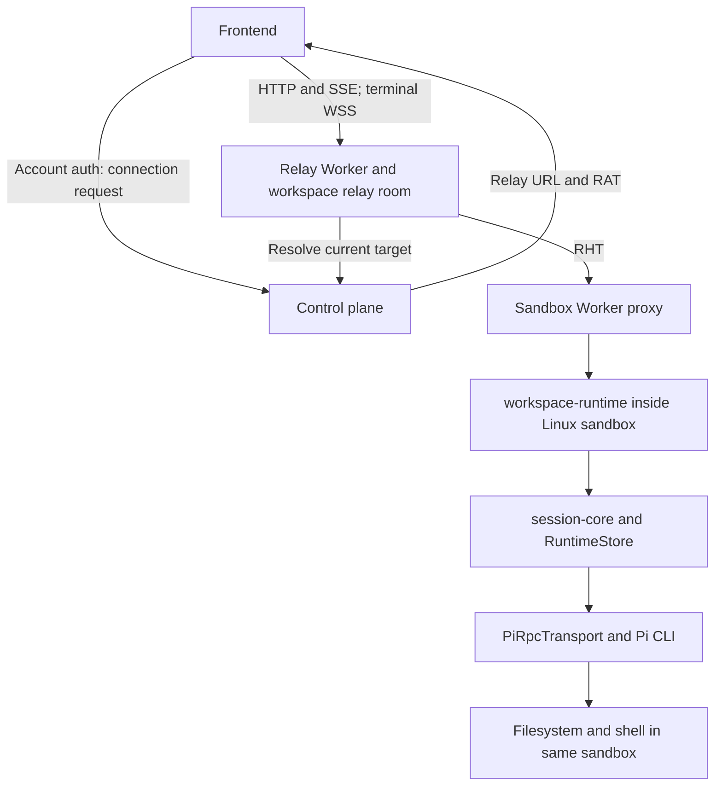
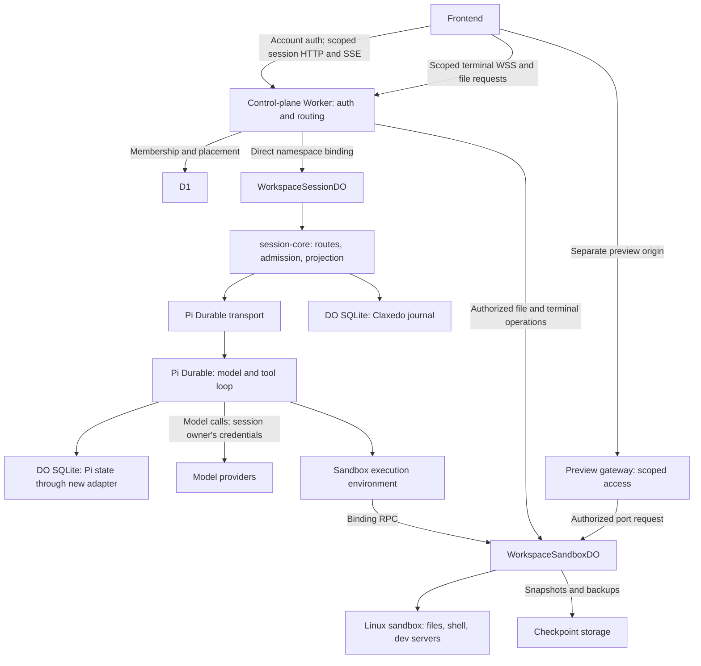
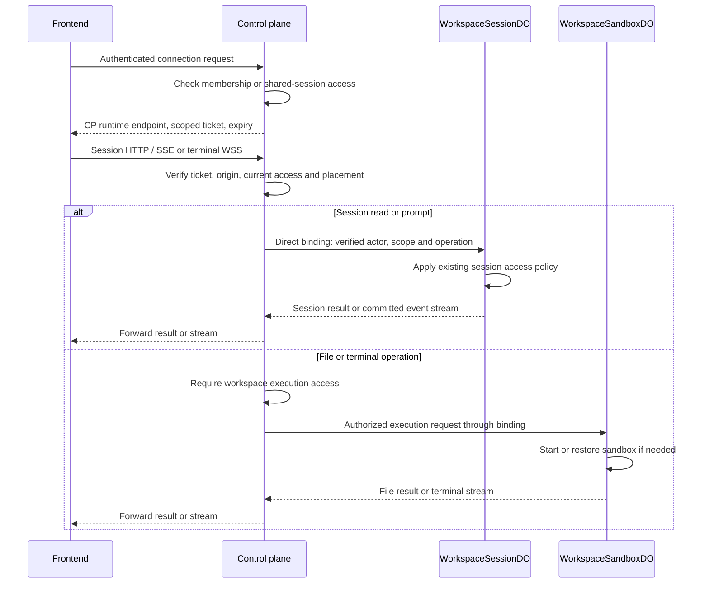
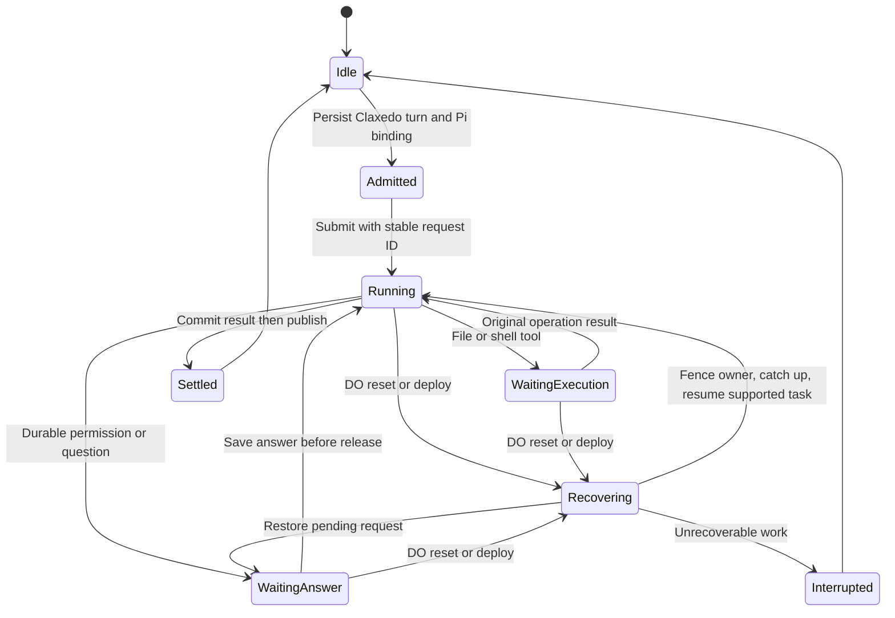

# Pi Durable on Cloudflare - Plan

> Superseded by the [Boat implementation plan](2026-10-02-2031-feat-pi-durable-boat-plan.md) and [HLD](../architecture/pi-durable-boat-hld.md). The selected design uses Boat execution and one DO per top-level session, with Pi-owned children in that DO and CP routing directly to it. This document retains the earlier Cloudflare Sandbox/workspace-DO design as historical context; its topology and work units are not the active plan.

## Goal Capsule

**Objective:** A user can run a cloud coding session, close the browser, reconnect, and continue seeing the same work even when its sandbox stops or its session host restarts.

**Means:** Pi Durable in a workspace Durable Object, with Claxedo session-core and a separate Cloudflare Sandbox SDK 1.0 execution owner (KTD1–KTD3).

**Authority:** The user request and repository instructions govern the outcome. Product requirements below govern behavior; KTDs govern mechanisms. Implementation must preserve canonical event production and existing session access policy.

**Execution boundary:** U1 is a feasibility gate. Later units depend on its proof, rather than assuming Pi's portable storage and scheduler are already integrated. This document authorizes planning only; deployment and implementation require a subsequent instruction.

---

## Product Contract

### Summary

Move the cloud Pi model/tool loop and session service out of the Linux sandbox. Use Cloudflare sandboxes for workspace files, shell execution, terminals and previews. The control-plane Worker authenticates frontend requests and calls the workspace session DO directly through a namespace binding. Existing relay connections continue to serve their current runtime placements.

### Problem Frame

Today the frontend obtains a Runtime Access Token and reaches workspace-runtime through workspace-relay. For Cloudflare, the resolved target is a Sandbox Worker proxy that forwards into workspace-runtime inside a Linux container. That container currently holds the session service and Pi RPC process as well as workspace execution.

The relay already runs as a Cloudflare Worker with workspace Durable Object rooms. Cloudflare WebSocket support is established infrastructure, not a missing capability. Session events use SSE; terminal attachment uses WebSockets. The coupling to fix is the runtime target and its readiness/routing identity being attached to a sandbox lease.

Pi Durable supplies a separate programmable harness; it is not the Pi CLI running in a Worker and does not supply this application's authenticated session host. Its portable storage needs a Cloudflare adapter. Existing session-core supplies a DO SQLite adapter and workerd tests, but its boot recovery interrupts previous work rather than continuing a Pi Durable task.

### Requirements

**Sessions and execution**

- R1. The Pi loop and Claxedo session state run outside the Linux sandbox.
- R2. V1 uses Cloudflare Sandbox SDK 1.0 for file and shell tools, browser terminals and previews.
- R3. A stopped sandbox does not make session history or the session event endpoint unavailable.
- R4. Workspace changes survive intentional sandbox suspension through an acknowledged snapshot or directory backup; changes since the last checkpoint are not claimed durable.

**Access and delivery**

- R5. Existing account authentication, workspace membership and shared-session follow/send rules govern every session operation and stream.
- R6. The browser receives a scoped runtime ticket and never receives sandbox administrative credentials or provider secrets.
- R7. Session routes and event frames preserve the existing public contracts and persisted readback semantics.

**Recovery**

- R8. Browser disconnection does not cancel an admitted turn.
- R9. Session-host restart resumes supported Pi work under the original Claxedo turn identity with no duplicate message, tool, usage or completion records.
- R10. Unsafe interrupted tool calls are reported as interrupted; recovery does not repeat shell mutations or external effects without a proven idempotent execution contract.
- R11. Stop, permission answers and queued/steered prompts retain their current authority and durable ordering through restart.

### Scope Boundaries

V1 covers Pi Durable, one session owner per workspace, and one Cloudflare sandbox execution owner per workspace. The DO can host multiple sessions; their working directories and admitted execution bindings remain explicit. Shared filesystem behavior follows today's workspace semantics.

New cloud placements use this owner; existing sessions are not silently imported from Pi CLI JSONL files. A migration of existing sessions needs its own format and binding contract. Existing machine/CLI transports remain their respective authoritative implementations.

Deferred: other execution providers, laptop execution connections, cross-region session movement and migration of existing cloud sessions. New Cloudflare placements use the control-plane Worker as their public session ingress. A separate relay or Session Worker HTTP gateway is not required on this path. The existing relay remains relevant to outbound laptop tunnels and other runtime placements.

### Acceptance Examples

- AE1. Send a prompt that reads a file and edits it. Live frames and persisted transcript show the same canonical tool IDs and result, and the file browser reads the changed sandbox file. Covers R1, R2, R7.
- AE2. Close all browser connections during generation. Reconnect through a freshly issued ticket and read the continued turn. Covers R5, R8.
- AE3. Restart the session DO between a Pi commit and Claxedo projection. Catch-up records the missing durable entry exactly once before resuming task execution. Covers R7, R9.
- AE4. Interrupt a mutating shell command. Report its known status or interrupted result without launching a second command. Covers R10.
- AE5. Save a workspace checkpoint, stop its sandbox, and read session history while stopped. The next file tool restores the workspace before accessing it. Covers R3, R4.
- AE6. A shared-session follower can read its permitted stream, but cannot send, answer another session's request, open a terminal or read unrelated workspace files. Covers R5, R6, R11.

---

## Planning Contract

### Observed Current Flow

1. `createTransport` in `packages/claxedo-app/src/server/transport.ts` calls `createWorkspaceConnections`. Browser account operations `workspace.connection.read`/`workspace.connection.mint`, or the `/api/workspace/:id/connection` route, return `relayUrl`, `runtimeAccessToken` and `tokenExpiresAt`. A shared session uses `session.connection.read`.
2. `createRelay` in `packages/claxedo-app/src/server/relay.ts` sends HTTP with a Bearer RAT and opens WebSockets with `claxedo-rat.<token>` in the subprotocol. It refreshes near expiry and retries an HTTP 401 once with a refreshed connection. WebSocket reconnect must obtain a fresh connection through its existing caller lifecycle.
3. `packages/workspace-relay/src/worker.ts` routes the workspace to a relay room. `cloudflare.ts` authorizes the request and the control-plane resolver checks current target/routing identity. Accepted network requests receive a freshly signed Relay Host Token.
4. Cloudflare's current target enters `/sandbox/:id/proxy/*` in `packages/claxedo-server/scripts/sandbox/cloudflare-worker/src/index.ts`, which forwards to the workspace-runtime container port. The runtime verifies RHT; the proxy currently leaves that verification to the container.
5. Session routes admit prompts into `createAgentRuntime`. `PiRpcTransport` starts the CLI process. `createSessionEventWriter` commits presentation before `RuntimeEventHub` publishes it. `wr/events` serves SSE; terminals attach through `runtimeSocket`.
6. Host boot calls `RuntimeStore.recoverBusySessions()` to clear stale turn leases and normalize interrupted tools, then reissues queued prompts. This path is inappropriate for Pi work that is going to resume.

### Key Technical Decisions

- KTD1. **A workspace session DO owns session execution.** Proposed `WorkspaceSessionDO` hosts `createSessionCore`, `RuntimeStore`, and Pi Durable. It uses the core's existing ports and a Worker-safe transport resolver rather than importing the Node harness composer. Covers R1, R3, R7.
- KTD2. **Execution is a separate DO.** Proposed `WorkspaceSandboxDO` controls its container through SDK 1.0's container API and file helpers. Pi receives a custom execution environment that invokes this DO through a binding. Session identity survives sandbox replacement. Covers R2–R4.
- KTD3. **The control-plane Worker calls the session DO directly.** It authenticates requests and stream upgrades, resolves authoritative workspace placement, and passes verified actor and scope through the DO binding. The session owner applies existing session policy. No relay room, public Session Worker gateway or RHT exchange is needed between these trusted components. The DO class may be deployed separately and bound with `script_name` to limit credentials and deployment coupling without adding a public HTTP hop. Covers R5, R6.
- KTD4. **Separate session availability from sandbox readiness.** Connection issuance and its routing identity refer to the authoritative session host. Execution leases and container generations belong to the sandbox owner. Extend the canonical connection producer and frontend dispatch with an explicit control-plane endpoint variant and correctly scoped ticket audience; do not call it a relay target, disguise it as a ready VM or fabricate a sandbox lease. Existing runtime placements retain their real relay variant. Covers R3, R5.
- KTD5. **Preserve ownership across the harness boundary.** Claxedo owns admission, user-facing turn identity, permission/request authority and transcript projection. Pi owns the model conversation, task checkpoints, tool loop and compaction. Add a Pi Durable transport with truthful capabilities, not a second Claxedo loop. Covers R7, R9, R11.
- KTD6. **Persist the join between both stores.** Bind session/turn/message IDs to Pi conversation/submission IDs before starting execution. Use the Claxedo admitted turn ID as the stable Pi submission request ID. Project committed Pi records with durable source identities and a stored progress cursor. Live `watch()` callbacks alone are insufficient: Pi's watch reconnects from current view and does not replay history. The cursor and projection must commit together in RuntimeStore. Covers R7, R9.
- KTD7. **One recovery coordinator claims resumed work.** It reconciles unfinished Pi submissions and Claxedo turns, advances the owner fence, catches up committed records, and resumes matching tasks. It interrupts only work that cannot resume. Keep existing crash recovery for process transports; do not globally disable interruption. Covers R9–R11.
- KTD8. **DO wakeups are explicit.** Persist scheduling needs and use alarms to resume work without a connected browser. Multiplex Pi wakeups through one owner because a DO has one alarm. During active model requests, keep work attached to an active DO invocation; checkpoints and future alarms support reset recovery. SDK timers and `resume()` by themselves are not proof of Worker lifecycle durability. Covers R8, R9.
- KTD9. **Sandbox execution uses authoritative operation identity.** Persist sandbox generation and operation/exec identity before relying on a long-running command. On owner restart, attach/query the original execution when possible; otherwise report interruption. File reads may be replay-safe, shell is unsafe by default. A snapshot restores files, not processes. Covers R4, R10.
- KTD10. **Terminal and preview traffic bypasses the Pi loop.** The control-plane ingress authorizes workspace file and terminal operations and routes them to the sandbox owner. Preview traffic uses an authenticated gateway on a separate origin with no app/account cookies forwarded to the container; public previews require an explicit sharing policy. The trusted gateway controls reachability and authority but does not make sandbox-generated HTML or output safe. Covers R2, R5, R6.

### Proposed Topology

Names in this diagram are proposed implementation components.

The control-plane Worker is a scalable request entrypoint. It authenticates and routes; it does not execute the model loop or query D1 for each streamed token. Forward response bodies and WebSocket upgrades without buffering or parsing their content. Load testing must measure ingress CPU, authorization queries and per-workspace DO contention. There is no measured load requirement for another session gateway. Separate deployments remain an option for credential scope and independent releases while preserving the direct binding path.

### Auth and Connection Sequence

The existing account connection operation remains the bootstrap. Its new placement variant returns a control-plane runtime endpoint and an audience-specific scoped ticket. Reuse the current HTTP Bearer and WebSocket subprotocol transport mechanisms where appropriate; the CP validates these tickets itself instead of forwarding them to a relay. This preserves support for clients that cannot attach arbitrary WebSocket headers. Account cookies and broad credentials never reach the sandbox.

The CP creates verified actor context after checking access; browser-supplied actor headers are not trusted. Address knowledge is never authority. The sandbox has no public administrative endpoint for the browser. Scope checks apply before every route dispatch and before accepting streams. V1 retains establishment-time stream authorization, but owner-enforced stop/revocation must satisfy any stricter existing session policy. Disconnect closes the subscription, while the session owner's durable scheduling continues the admitted turn.

### Recovery Lifecycle

### Feasibility Gates and Risks

These are implementation-time proofs, not claims that the existing code passes them:

1. Pi's asynchronous SQL transaction facade must have actual DO transaction semantics. Existing `durableObjectSqliteDatabase` wraps synchronous transactions and cannot simply be passed to Pi. Prove rollback, serialization, schema isolation and restart first.
2. Confirm the Pi storage API exposes committed identities sufficient for complete, ordered, durable projection and deduplication. If not, extend the canonical commit boundary; do not synthesize missing tool/lifecycle events from a latest-view guess.
3. Prove model streaming, Pi scheduling and alarms under workerd and deployed reset/disconnect conditions. Pi Durable remains experimental.
4. Preserve credential leasing and the session owner's spending account when another user sends a prompt. Workers hold provider credentials; sandbox egress credentials stay brokered by the execution owner.
5. Sandbox SDK 1.0 changes lifecycle control. Background container work alone does not keep an instance alive. Configure/reapply inactivity policy and keep active executions supervised; snapshots do not preserve processes.
6. Deploy a new SDK 1.0 sandbox class/namespace first. Cloudflare documents the scheduling-policy change as one-way, so conversion of the existing class is outside the initial rollout.

---

## Implementation Units

### U1. Prove Pi Durable storage and execution under workerd

**Goal:** Establish the foundation for R1 and R9 before host wiring.

**Files:** Proposed `packages/harness/src/transports/pi-durable/` portable adapter and conformance tests; proposed `packages/cloudflare-session-host/` workerd fixture and Pi storage adapter.

**Dependencies:** None.

**Approach:** Pin Pi Durable and Pi AI 1.0.0. Prove KTD5, KTD6 and KTD8 with a scripted model and one remote tool. Verify asynchronous SQLite transactions separately from session-core's synchronous adapter. Keep Cloudflare-specific adapters in the host; portable transport code must not import platform APIs.

**Test scenarios:** Commit/rollback, concurrent transactions, reopen after reset, repeated submission ID, interrupted generation, safe versus unsafe tool replay, durable entry catch-up and zero Node process/filesystem closure.

**Verification:** A real workerd DO restarts and resumes one task while preserving canonical identities. Record any Pi API gap before proceeding.

### U2. Add the Pi Durable transport and coordinated recovery

**Goal:** Implement R7, R9–R11 through existing session-core entrypoints.

**Files:** Proposed Pi Durable transport/translator and corpus; `packages/session-core/src/host/`, `packages/session-core/src/broker-ports/`, `packages/session-core/src/store.ts` and their focused recovery tests.

**Dependencies:** U1.

**Approach:** Implement KTD5–KTD7. Route create/send/steer/stop/fork/configuration through the transport contract. Persist bindings and projection cursor. Rehydrate supported admitted turns and pending requests under a new owner fence. Leave process-harness recovery with its existing owner.

**Test scenarios:** Reset before/after submission, after Pi commit but before projection, after projection but before acknowledgement, duplicate client retry, pending permission, owner credentials under shared send, queued prompts, late stale producer and concurrent sessions.

**Verification:** Transport conformance and session-core workerd tests demonstrate no duplicate completion, usage or tool result. Unsupported capabilities are explicit.

### U3. Compose the session host and extend authoritative connection routing

**Goal:** Implement R1, R3, R5–R8 with direct control-plane ingress and existing session operation/event contracts.

**Files:** Proposed `packages/cloudflare-session-host/` workspace DO, configuration and tests; hosted control-plane route composition and DO bindings; control-plane workspace connection/placement producers; `packages/claxedo-app/src/server/transport.ts`, `wire/connection.ts` and connection tests.

**Dependencies:** U2.

**Approach:** Implement KTD1, KTD3, KTD4 and KTD8. Add the canonical control-plane endpoint variant throughout connection issuance, placement resolution and frontend dispatch. Scope its tickets to the receiving CP runtime routes. Authenticate there, then invoke the workspace DO directly with verified context. Compose existing session routes, store reads and SSE events. Pass streams through without per-frame control-plane work. Keep session DO credentials narrow; a separate class deployment can be reached through the same direct namespace binding.

**Test scenarios:** Signed browser connection, wrong audience, cross-workspace token, expired/revoked token, stale routing identity, forged actor headers, shared-session follow/send, wrong origin, sandbox stopped with history still readable, browser disconnect during turn and reconnect with a fresh ticket. Measure concurrent ingress and verify stream bytes cause no per-frame membership queries.

**Verification:** The real frontend reaches the session DO through the authenticated CP endpoint and direct binding; no extra public session gateway or fabricated sandbox-ready state is needed.

### U4. Add isolated Sandbox SDK 1.0 execution

**Goal:** Implement R2, R4 and R10.

**Files:** Proposed execution DO and environment under `packages/cloudflare-session-host/`; `packages/sandbox-manager/src/drivers/cloudflare.ts` where the new placement composition needs it; separate Sandbox Worker SDK 1.0 class, Wrangler bindings and execution tests.

**Dependencies:** U1; integration needs U3.

**Approach:** Implement KTD2, KTD9 and KTD10 with Files and container exec APIs. Supply streamed stdout/stderr, exit/signal/cancel, file/image byte bounds and directory/worktree isolation. The CP routes authorized files and terminals directly to this owner; a separate-origin preview gateway authorizes port traffic. Neither flow runs through the Pi loop. Save acknowledged checkpoints before intentional suspension and restore before accepting execution.

**Test scenarios:** Read/edit/write/bash, command stream and cancel, restart with still-running exec, missing/expired checkpoint, snapshot restore without process resurrection, file escape, two-workspace isolation, terminal reconnect, preview authorization and egress credential isolation.

**Verification:** A deployed SDK 1.0 sandbox executes a real tool turn and restores edited files after suspension while session history stays reachable.

### U5. Validate the public flow and document the rollout

**Goal:** Prove all acceptance examples through the authenticated frontend.

**Files:** `packages/claxedo-app/e2e/flows/`; proposed session-host deployed acceptance suite; `docs/harness/README.md` and host/transport READMEs.

**Dependencies:** U2–U4.

**Approach:** Run AE1–AE6 with the actual control-plane ingress, session DO and sandbox DO. Introduce reset at persistence boundaries. Exercise terminals and previews independently of session events. Roll out new placements only; retain old owner bindings for existing sessions.

**Test scenarios:** Positive flow, auth failures, restart, browser disconnect, interrupted mutating execution, snapshot recovery, stale fencing, concurrent sessions and transcript/event readback.

**Verification:** Deployed evidence demonstrates the claimed durability, and documentation names remaining unsupported Pi CLI extensions/skills/MCP behavior rather than promising automatic parity.

---

## Verification Contract

No implementation, test execution or deployment was performed for this plan.

Existing gates during implementation:

- `bun run test:architecture-ratchets` after production import changes; inspect dependency chains before updating reviewed closure budgets.
- `bun run --cwd packages/session-core typecheck` and `bun run --cwd packages/session-core test`, including the workerd host/store suites.
- Focused control-plane and frontend checks for the new connection variant, scoped ticket verification, namespace dispatch and stream forwarding. Run existing relay checks if a shared contract changes; the new hosted path does not require routing through the relay.
- `bun run --cwd packages/harness check` and focused transport conformance/corpus checks. Existing folder-budget failures need their own owner; do not raise ceilings to conceal them.
- New host workerd and deployed acceptance commands must be defined in U1/U5. Local storage tests do not replace deployed model-stream, container and reset checks.

---

## Definition of Done

AE1–AE6 pass through actual public routes. The frontend can authenticate, prompt, observe, disconnect, reconnect, stop and answer requests. Session state stays available independently of the sandbox. Reset recovery preserves turn identity and canonical event ordering. Workspace checkpoints restore files with truthful process interruption. Negative auth and isolation flows pass. The new host's dependency closure is Worker-safe and obsolete paths within the new owner are removed.

### Sources and Research

- Existing architecture: `docs/harness/README.md`, `packages/session-core/README.md`, `packages/workspace-relay/README.md`.
- Existing browser wire: `packages/claxedo-app/src/server/transport.ts`, `relay.ts`, `wire/connection.ts`, `terminals.ts`.
- Existing Cloudflare sandbox composition: `packages/claxedo-server/scripts/sandbox/cloudflare-worker/README.md`, `src/index.ts`, `package.json` (SDK 0.12.9 at research time).
- [Sandbox SDK 1.0 release](https://developers.cloudflare.com/changelog/post/2026-09-30-sandbox-sdk-1-0/): custom DO ownership, separate execution and migration constraints.
- [Pi Durable 1.0 README](https://github.com/earendil-works/pi/blob/v1.0.0/packages/durable/README.md): portable storage adapters, submission identity, replay and watch semantics.
- [Cloudflare WebSockets](https://developers.cloudflare.com/durable-objects/best-practices/websockets/): platform support and hibernation.
- [DO namespace bindings](https://developers.cloudflare.com/durable-objects/api/namespace/) and [Wrangler DO configuration](https://developers.cloudflare.com/workers/wrangler/configuration/#durable-objects): direct invocation, including classes deployed in another Worker.
- [Workers limits](https://developers.cloudflare.com/workers/platform/limits/): CPU, memory and per-invocation limits for validating ingress load.
- [Cloudflare alarms](https://developers.cloudflare.com/durable-objects/api/alarms/): one alarm per DO, at-least-once delivery and restart.
- [Sandbox lifetime](https://developers.cloudflare.com/sandbox/concepts/lifetime/): timeout, supervision, deploy and file-versus-process recovery.
