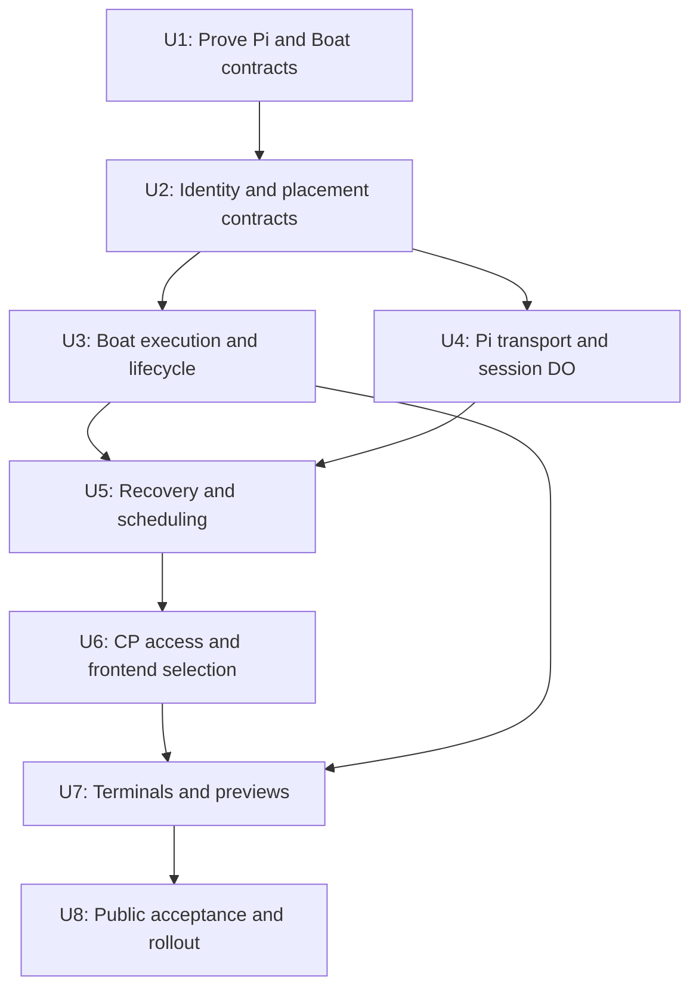

# Pi Durable session host with Boat execution

## Outcome and implementation boundary

A user creates a supported cloud workspace, selects **Pi Durable · Preview**, chooses an available account/model and sends a prompt. CP authenticates the request and resolves its top-level session's `SessionDO` directly. Each DO runs session-core, Pi Durable and that root's owned child conversations/tasks in its own store. Independent top-level sessions use separate DOs while sharing the workspace's Boat VM. Closing the browser or suspending the VM does not remove the session host or its history.

SessionDO owns durable active-turn admission, queues and recovery. CP owns continuing authorization, revocation and credential issuance; its existing `session_turn_leases` remain for existing placements and are not a second ownership lock for Pi Durable. This plan explicitly replaces that mechanism on the new path while preserving its access guarantees.

The [HLD](../architecture/pi-durable-boat-hld.md) owns the product requirements, architecture, request flows and recovery invariants. This plan turns them into eight delivery units. It supersedes the [Cloudflare Sandbox draft](2026-10-02-2001-feat-pi-durable-cloudflare-plan.md); Cloudflare still hosts CP and session DOs, but Boat is the first execution provider.

Implementation has not started under this plan. The first unit proves the external contracts before the feature is exposed. All proposed new paths below are implementation targets, not existing modules.

## Requirements trace

| HLD requirement | Delivery units | Release evidence |
|---|---|---|
| R1 Explicit `pi-durable` selection | U2, U6 | A1, A10 |
| R2 Independent root host, local owned children, VM-independent readiness | U2, U4, U5, U6 | A1, A6, A11, A12, A13, A15 |
| R3 Shared workspace files, commands, terminals and previews | U3, U6, U7 | A1, A7, A8, A11 |
| R4 New placements; existing session identities preserved | U2, U6, U8 | A10 |
| R5 Current actor access and owner-account authority | U1, U2, U4, U5, U6, U7 | A4, A8, A12, A13 |
| R6 Guest and browser credential isolation | U1, U3, U6, U7 | A4, A8 |
| R7 Canonical commit before publication | U4, U5 | A2, A3 |
| R8 Disconnect/reset recovery | U1, U4, U5 | A2, A3, A11, A12, A13, A15 |
| R9 Truthful controls and durable ordering | U4, U5, U6 | A5, A12, A13 |
| R10 No automatic repetition of uncertain mutations | U1, U3, U5 | A3, A5 |
| R11 Acknowledged suspension; atomic activity admission | U1, U3, U5, U7 | A6, A9, A11, A14 |
| R12 Real entrypoint acceptance | U8 | A1–A15 |

V1 covers new cloud workspaces using this placement and new Pi Durable sessions. It does not import existing Pi CLI transcripts, switch an existing session into/out of Pi Durable, add laptop execution, or add Cloudflare Sandbox execution. Multiple sessions can share a workspace; that shared filesystem is not a per-session security boundary.

Publish a capability matrix for model accounts, images, questions/approvals, MCP, skills, forks, goals, worktrees and extension behavior. Availability comes from the composed host/transport. Core prompt, file/shell, Stop, queue, steering, terminal and preview flows in the HLD remain release requirements. Additional controls must either work through their real entrypoints or show a declared unsupported state.

The accepted ownership unit is a top-level session and its Pi-owned task graph. When exposed as Claxedo sessions, children retain their own session IDs/access policy and route to their root's DO. Independent user forks into a new DO are deferred until an explicit cross-store history-transfer contract exists; V1 must declare that operation unsupported. Shared VM access provides no new cross-session filesystem serialization or hostile-code isolation.

## Context and decisions

### Current owners to extend

| Area | Observed owner and change point |
|---|---|
| Harness identity | `packages/agent-runtime-contract/src/harnesses.ts`, `harness-table.ts`, `harness-permission-modes.ts`; extend the finite native identity and its declared capabilities |
| Frontend selection | `packages/claxedo-app/src/composer/harness/harness-option-list.ts`, `lib/harness-selection.ts`, `lib/harness-catalog.ts`; current native options are static |
| Session creation | `packages/claxedo-app/src/server/sessions.ts`, `session-reservation.ts`, `workspace-wakes.ts`; current creation/prompt paths wake the runtime before dispatch |
| Connection delivery | `packages/claxedo-app/src/server/transport.ts`, `relay.ts`, `wire/connection.ts`; add an explicit DO endpoint variant at the authoritative producer and consumer |
| CP placement and connection authority | `packages/claxedo-server/src/authority/adapters/d1/workspace-authority.ts`, `connections/hosted-connection-info.ts`, and `packages/account-contract/src/hosted-output.ts`; CP placement is distinct from the machine-local `server-core/workspace/store/placement.ts` inventory |
| CP session index and routing | `packages/claxedo-server/src/authority/adapters/d1/session-authority.ts` already lists/resolves sessions; extend it with immutable session-to-root bindings rather than listing all DO stores |
| CP schema deployment | `packages/claxedo-server/scripts/control-plane-schema.ts` accepts only an empty database or the exact generated `migrations/control-plane/0001_baseline.sql`; an existing deployment has no automatic row-preserving upgrade path |
| Hosted entrypoint | `packages/claxedo-server/src/deployments/hosted-workerd/better-auth-d1-worker.cf.ts`, `core-worker.cf.ts`; authentication and routing already run on Workers |
| Runtime composition | `packages/session-core/src/host/runtime.ts`, `transports.ts`, `launch.ts`, `turn-admission.ts`; the current host shares a store across sessions while turn admission is already per session |
| Turn ownership and authorization | `packages/session-core/src/routes/session-prompt-admission.ts`, `session-turn-lease.ts`, `session-access-policy.ts`, `session/delivery-owner.ts`; CP's `session-authority.ts`, `routes/runtime-session-authority.ts` and `runtime-connection-secrets.ts` currently couple managed-turn leases, provenance and credential proofs. Give DO-owned admission an explicit contract, not a local-trust bypass |
| Session summary publication | `packages/claxedo-server/src/authority/adapters/d1/host-session-rows.ts` accepts enrolled-host publications; add a fenced DO publication port into the canonical index |
| Related sessions | `packages/session-core/src/host/sessions.ts` and `store.ts`; forks and child relationships currently assume shared store access, so preserve Pi-owned children locally and reject unsupported cross-store forks |
| Persistence/projection | `packages/session-core/src/sqlite/durable-object.ts`, `projection/session-event-writer.ts`, `projection/runtime-event-hub.ts`; extend committed projection instead of adding a second UI event producer |
| Recovery | `packages/session-core/src/host/recovery.ts`, `recovery-operations.ts`, `recovery-facts.ts`, `recovery-wiring.ts`; extend the existing owner with durable-transport recovery |
| Sandbox lifecycle | `packages/sandbox-manager/src/manager.ts`, `contract.ts`, `lease-types.ts`, `lease-policy.ts`; preserve lifecycle fencing and one provider-resource authority |
| Hosted lease persistence | `packages/claxedo-server/src/authority/provider-neutral-hosted-services.ts`, `sandbox/stores/d1.ts`; keep resource/activity leases in the existing D1 store |
| Boat predecessor | `packages/sandbox-manager/src/drivers/box.ts`; replace the old `/api/box/v1` implementation, which boots a full workspace-runtime |
| Execution UI | `packages/claxedo-app/src/server/files.ts`, `git.ts`, `terminals.ts`; their runtime paths need explicit execution dispatch, not accidental routing into session-only routes |
| PTY implementation | `packages/workspace-runtime/src/pty/index.ts`, `routes/pty.ts`; extract mechanics from session-host policy rather than copying the route |

Follow [harness ownership](../harness/README.md), the [runtime recovery contract](../architecture/runtime-recovery-contract.md), and [recorded defect patterns](../ai-agent-defect-patterns.md). In particular: no age-based inference that work stopped, no second recovery coordinator, no fabricated projection events, and no account selection from a shared sender. No `docs/solutions/` collection was present in this checkout.

### Chosen boundaries

1. **One DO per independent top-level session.** Name `SessionDO` with CP's authoritative `rootSessionId`. Roots resolve to themselves; Pi-owned children resolve to the same root and remain in its store/task graph. CP binds directly to the private Worker namespace; no workspace DO is inserted into routing.
2. **Boat is execution only.** Pi file/shell tools use Boat's API through an injected `ExecutionEnv`; Boat's hosted agent prompt API is not used. A small guest service supplies the PTY endpoint.
3. **One lifecycle owner.** Extend `SandboxManager` and D1 leases with an execution-only target and durable activity aggregated across every root using the workspace. Activity acquisition and archival use mutually exclusive conditional transitions. A DO holds its activity before dispatch; one root's idleness or deletion cannot release another's obligation.
4. **One provider implementation.** Keep the persisted provisioner ID `box`, display Boat, and replace the old API client with a fetch-based Boat v1 leaf module. Keep runtime boot policy and execution-only boot policy separate. No alternate legacy API client or fabricated runtime URL.
5. **One canonical session projection.** Pi durable commits feed the existing session event writer with a persisted source cursor. Pi's current-view watch is not a replay log.
6. **Two independent readiness states.** Session-host availability controls chat; execution readiness controls file/process access. A VM outage does not invalidate the session endpoint.
7. **Explicit trust boundaries.** CP holds provisioning authority, the trusted DO receives scoped execution/model leases, and the VM receives only guest execution configuration. Preview content uses a separate origin.
8. **Workspace views stay at CP.** CP supplies session lists/summaries and authorized workspace file/Git/preview routes. Requests without a session never choose an arbitrary DO; session-specific controls resolve the owning root and still authorize the requested session.
9. **Turn ownership stays in SessionDO.** One durable admission state per requested session, including children, decides active/queued/waiting work. CP provides bounded continuing authorization under the original actor and stored spending owner. The proposed `cp-session-host` provenance is explicit; it neither mints a synthetic CP turn lease nor pretends to be loopback.
10. **Generations have separate meanings.** CP's placement epoch survives ordinary activations; the DO's local attempt generation fences stale writers; Boat's execution generation fences process control. Restart does not change the browser-ticket epoch or release unknown execution.

### Delivery order

The diagram illustrates dependencies for review; it is not an instruction to run multiple implementations concurrently.

U1 settles the authorization and effect-control approach before U2 lands its contracts. The graph assumes Boat-native command execution meets G2. If a guest supervisor is required, move its minimal implementation ahead of U3/U5 and revise this graph before accepting dependent work; U7 cannot remain the first delivery of a required command-control service.

## Implementation units

### U1 — Prove Pi under workerd and Boat execution contracts

- [ ] Complete G1–G4 feasibility evidence and record blockers before dependent implementation.

**Goal:** Establish that the selected providers can satisfy persistence, effect control, credential isolation and interactive execution without changing the architecture implicitly.

**Requirements:** R5–R12. **Dependencies:** A Boat test account with the required paid lifecycle/scoping features, model test credentials, and a Cloudflare test deployment. Begin with local workerd fixtures; live provider evidence is still required.

**Files:**

- Reference/extend: `packages/session-core/src/test-support/durable-object-host.ts`, `durable-object.node-test.ts`, `store-durable-object.node-test.ts`.
- Create the minimal proof package/test configuration: `packages/session-host/package.json`; U4 extends it into the deployable composition.
- Create proof targets: `packages/session-host/src/pi-durable.node-test.ts`, `packages/session-host/src/boat-execution.live-test.ts`.
- Create focused proofs: `packages/session-host/src/authorization.node-test.ts` and `packages/claxedo-server/src/sandbox/activity.node-test.ts`; U3–U5 incorporate these into their canonical owners.
- Create evidence record: `docs/verification/pi-durable-boat.md`; link exact versions, scenarios and observed outcomes without secrets.

**Approach:** Use pinned Pi Durable 1.0.0 to prove storage transaction semantics, model streaming, committed-record access and resumption after a workerd reset. Identify the actual scheduling/yield boundary and schema separation from RuntimeStore. Test Boat file/command semantics, scoped-key issuance, protected hosted WSS, and process cancellation through the actual documented or verified control interface. Do not infer cancellation authority from a numeric PID or assume that stopping an HTTP stream stops its command.

Prove the proposed ownership split against a real CP-policy fixture: the DO retains its active turn across a long wait/reset without a CP ownership lease, then reauthorizes the original admission before new work. Exercise current access loss and credential issuance through the same authority. U2 lands the proven proof/provenance contract; the spike must not substitute a permissive fake policy.

Before restarting Pi's scheduler, establish how an uncertain tool is held without returning an `interrupted` result that lets the model repeat its effect. A reconciliation-aware replay wrapper is a candidate only when it uses committed tool/operation identity and cannot redispatch. Prove durable parking and unrelated-task progress, not merely a `replay: "safe"` flag. G2 must separately prove usable command control; if it requires a guest supervisor, revise scope, dependencies and estimate before U3/U5. The current plan does not silently select that service as the shell backend.

**Patterns:** Existing Miniflare fixtures, the harness transport contract, and canonical recovery observations. Prototype code must be incorporated into its final owner or removed before release; do not leave a parallel production path.

**Test scenarios:**

- Integration: submit once, remove every browser connection, reset the DO, and continue under the original Pi submission identity.
- Authority: park beyond the former CP turn-lease TTL, reset, answer the approval and resume the same turn under fresh CP authorization. Revoke the original sender or deny CP access and prove that no new model/tool dispatch occurs after the authorization deadline. No Pi Durable active-turn row is acquired in CP.
- Ownership: run two roots in separate DOs; reset one while the other proceeds. Prove local Pi-owned child task continuation/cancellation with a focused extension fixture, without assuming every UI subagent capability is already supported.
- Workerd: exercise co-resident DOs with Pi's module-global file queue; record actual context/identity behavior without assuming a hang or changing the environment key preemptively.
- Failure: reset between Pi commit and consumer projection; enumerate the original committed record without rerunning its tool.
- Failure: lose a Boat command-start response and inspect whether its effect occurred; document the available reconciliation/control evidence.
- Failure: reset Pi mid-mutation and verify an effect counter, original tool identity, durable hold and absence of a replacement model-generated mutation. Reads/Stop remain responsive during stalled reconciliation.
- Lifecycle: race activity acquisition against idle archival through two CP instances; exactly one transition wins and no command is dispatched after archival wins.
- Integration: write an empty file and a nonempty file, run a nonzero-exit command, stream output, archive/resume, and inspect the resulting file/process state.
- Security: mint the intended sandbox/action-scoped credential; deny another sandbox and lifecycle actions outside the grant. Record any Boat feature flag or account restriction.
- Security: inspect the actual guest credential under `noEnv`, hosted-agent/public-port permissions and billing owner. Verify expiry, replacement and revocation capabilities for the available CP credential; refuse unsupported required restrictions.
- Integration: open protected Boat hosting from a Worker as a terminal WSS upstream; exercise resize, disconnect/reconnect and preview HMR without exposing the Boat token to the browser.

**Verification:** G1–G4 have captured evidence or an explicit blocker/owner/follow-up. A failed gate prevents dependent acceptance. There is no automatic switch to Pi CLI in the VM or a weaker credential scheme.

**Exit decisions:** Record the continuing-authorization proof and revocation bound, the Pi hold/replay mechanism, actual command cancellation/reconciliation, and the durable activity transition. If any remains unresolved, identify the blocked units instead of treating the spike as complete because its timebox elapsed.

### U2 — Define harness, session placement and execution target contracts

- [ ] Land canonical producer/consumer contracts and capability gating together.

**Goal:** Represent DO-owned turns separately from CP authorization and VM activity, while preserving existing persisted identities.

**Requirements:** R1, R2, R4, R5. **Dependencies:** U1 contract findings.

**Files:**

- Modify: `packages/agent-runtime-contract/src/harnesses.ts`, `harness-table.ts`, `harness-permission-modes.ts`.
- Modify: `packages/harness/src/contract/transport.ts`, `registry/table.ts`, `registry/credentials.ts`.
- Modify canonical placement contracts: `packages/claxedo-server-core/src/platform/auth/authority.ts`, `sandbox/manager-port.ts`; `packages/claxedo-server/src/authority/adapters/d1/workspace-authority.ts` and `session-authority.ts`.
- Extend canonical authority/proof ports: `packages/claxedo-server-core/src/platform/auth/private-session-authority.ts`, `runtime-access-token.ts`; `packages/claxedo-server/src/routes/runtime-session-authority.ts`, `runtime-connection-secrets.ts`. U6 wires their public/private entrypoints.
- Extend host/provenance contracts: `packages/session-core/src/session-access-policy.ts`, `session/delivery-owner.ts`, `routes/session-route-options.ts`, `routes/session-prompt-admission.ts`, `routes/session-turn-lease.ts` and focused tests; preserve the existing process-backed lease branch explicitly.
- Modify CP schema/deploy owners: `packages/claxedo-server/migrations/control-plane/0001_baseline.sql`, `scripts/control-plane-schema.ts`, `scripts/control-plane-baseline.ts`, `scripts/deploy/staged-control-plane-migrations.ts`. Keep the generated baseline authoritative for new databases; make the required existing-database upgrade an explicit reviewed part of this unit.
- Modify connection contracts: `packages/account-contract/src/hosted-output.ts`, `hosted-operations.ts`; update CP connection production in U6. Do not store cloud session-host placement in the machine-local workspace inventory.
- Modify: `packages/sandbox-manager/src/contract.ts`, `lease-types.ts`; `packages/claxedo-server/src/sandbox/stores/lease-row.ts`, `lease-status.ts`.
- Modify: `packages/claxedo-app/src/server/wire/connection.ts`, `wire/harness-selection.ts`, `wire/harness-state.ts`.
- Test/extend: `packages/claxedo-server/src/authority/adapters/d1/workspace-authority.test.ts`, `session-authority.test.ts`, `control-plane-schema.test.ts`, `packages/claxedo-server/scripts/control-plane-baseline.test.ts`, `packages/claxedo-server/src/sandbox/stores/lease-row.test.ts`, `packages/account-contract/src/workspace-connection.test.ts`, `packages/harness/src/registry/credentials.test.ts`; create `packages/agent-runtime-contract/src/pi-durable.test.ts`.

**Approach:** Add `pi-durable` as a distinct native harness and transport identity. CP persists immutable `sessionId → rootSessionId` routing and a placement epoch, separately from the DO-local attempt generation and Boat generation. Reserve `rootSessionId = sessionId` before initialization; explicitly distinguish exposed owned-child registration from independent user forks. Make the CP endpoint response a discriminated contract without requiring workspace bootstrap/list routes to select a root. Add an execution-only sandbox target without a fictitious runtime URL. Derive picker availability from host capability, and reject in-place handoff or unsupported forks.

Define host-owned durable turn admission and the `cp-session-host` provenance separately from CP's existing leased-turn path. Persist the original actor, scoped CP admission reference, turn identity and queue order in the DO. CP verifies current actor access, admitted scope, placement and spending owner on continuation/credential requests. Authorization has a deadline no later than the existing 60-second bound while active; parking does not require an ownership heartbeat. Specify expiry, transient failure, revocation, child wakes and approval-answer behavior. Update the canonical credential proof union rather than bypassing its checks. A missing policy or unrecognized provenance must fail closed, not synthesize a lease or become local trust.

Complete the sessionless route inventory here: assign authority, implementation owner, capability and stopped-VM behavior for model/config options, permission modes, commands, terminal helpers, file/search/Git and previews. Metadata queries must work before a root or VM exists. Name the real preview navigation/gateway work and the DO-to-CP summary publication contract. Reuse existing operation owners; do not commit to duplicating Node route logic in CP.

Record the deployment's provider policy before enabling the new placement. A Boat-only deployment is a valid first scope. A deployment serving existing Cloudflare leases requires explicit dispatch by persisted provider through the canonical lifecycle owner; switching its global driver is not a migration. Do not assume that broader mixed-driver work is already included.

The current D1 deploy guard cannot perform a routine additive schema rollout. Establish the exact supported before/after schema and row-preserving transition in the canonical schema/deploy owner, with a recoverable failure path and fixtures containing existing accounts/sessions/leases. Do not invent a second schema authority, disable the guard, or reset an existing database. If that transition cannot be supplied within this feature, U8's existing-deployment rollout remains blocked with an explicit schema-upgrade follow-up; feasibility work can use a fresh isolated D1 deployment.

**Patterns:** Existing finite native dispatch, authoritative placement lookup and lease fencing. Keep `box` as the stored provisioner ID while recording Boat's current capabilities truthfully.

**Test scenarios:**

- Happy path: supported placement round-trips `pi-durable`, session-owner identity and an execution-only target through storage and wire parsing.
- Routing: two roots in one workspace have distinct DO names; a registered child resolves to its immutable root, and forged/reassigned root bindings are rejected. Session access is checked for the requested child, not inherited merely from co-residency.
- Negative: a client forces `pi-durable` onto a machine/relay placement; admission rejects it before side effects.
- Edge: a workspace has no VM yet, or its VM is stopped; session placement still resolves without a synthesized runtime URL.
- Regression: existing Pi CLI sessions retain `pi` and their runtime routes; switching an existing session into/out of `pi-durable` is refused.
- Failure: stale placement/generation cannot select the current execution resource or receive a fresh ticket.
- Ownership: duplicate/concurrent prompts admit once in the DO while child sessions preserve their own queue; CP provides no competing active-turn claim. Existing relay prompts still acquire their original CP leases.
- Authority: lost/forged admission proof, revoked original actor, foreign root, expired authorization and owner-account substitution fail before new work or credential issuance. A legitimate parked turn reauthorizes without a browser ticket.
- Identity: a normal DO reset changes only its local attempt generation; tickets retain their placement epoch. Child/fork reservation kinds cannot be interchanged.
- Bootstrap: model/permission options work with zero sessions and no VM. Provider rollout refuses to strand an existing differently-backed lease.
- Migration: an existing CP database upgrades with accounts, reservations, sessions and resource leases intact; a wrong source schema or failed transition stops deployment without resetting data.

**Verification:** All affected producers/readers agree on the contracts, migrations preserve existing rows, and the unfinished feature is not advertised by any host.

### U3 — Implement Boat v1 execution and canonical VM lifecycle

- [ ] Replace the old provider API path and compose execution-only workspaces.

**Goal:** Provide files/commands and acknowledged suspend/resume through the existing lifecycle authority.

**Requirements:** R3, R6, R10, R11. **Dependencies:** U1 G2/G3 evidence and U2.

**Files:**

- Replace/rename: `packages/sandbox-manager/src/drivers/box.ts` and `box.test.ts` with `drivers/boat.ts` and `boat.test.ts`; update callers/exports while retaining the stored `box` ID.
- Create: `packages/sandbox-manager/src/providers/boat/client.ts`, `client.test.ts`; expose a narrow fetch-only package export.
- Modify: `packages/sandbox-manager/src/manager.ts`, `lease-policy.ts`, `driver-catalog.ts`, `package.json`; `packages/sandbox-contract/src/index.ts` and `index.test.ts`.
- Modify: `packages/claxedo-server/src/authority/adapters/worker/hosted-sandbox-driver.ts`, `authority/provider-neutral-hosted-services.ts`, `sandbox/stores/d1.ts`.
- Create: `packages/session-host/src/execution/boat.ts`, `boat.test.ts`; keep provider execution composition outside the generic harness transport.
- Create: `packages/claxedo-server/src/sandbox/activity.ts`, `activity.test.ts`, `sweep.ts`, `sweep.test.ts`; wire the new scheduled handler in `deployments/hosted-workerd/better-auth-d1-worker.cf.ts` and the cron configuration in `scripts/deploy/wrangler-config.ts`.
- Extend tests: `packages/sandbox-manager/src/manager.test.ts`, `lease-policy.test.ts`; `packages/claxedo-server/src/sandbox/stores/d1.test.ts`, `authority/adapters/worker/hosted-sandbox-driver.test.ts`.

**Approach:** Share one validated Boat v1 client between lifecycle and execution adapters. Keep credentials and retry policy at their callers. Provision with `noEnv: true`, an explicit workspace root and a configured template/service version. For the paid deployment disable Boat's absolute TTL and use our recorded execution-activity policy. Do not copy full workspace-runtime credential environments into this boot path.

Persist create intent/idempotency key before dispatch and resource identity before readiness polling. Resume creates a new process-control generation. File and command results preserve empty content, nonzero exits, bounds and uncertainty. A command-start timeout/502 is not retried. Keep the old full runtime boot composition usable for its existing placement contract through the single new provider client; do not conflate it with execution-only bootstrap. Validate any existing Box resource IDs, credentials, API-origin configuration and templates against Boat v1 before replacing their provider path. If incompatible, block that rollout and document the required migration rather than guessing a conversion.

Extend D1-backed activity with idempotent acquisition/release for tools, terminals and previews. Each record identifies the root/session, operation and execution generation; aggregate these records by workspace for lifecycle decisions. Add the scheduled CP sweep explicitly: no such deployment hook was established by the code review. It reconciles bounded batches through `SandboxManager`; an expired heartbeat is a reconciliation trigger, not proof of quiescence. Unknown work blocks ordinary idle archival, and one root may release only its own obligations.

Make activity insertion conditional on the matching resource being ready, and `ready → archiving` conditional on that same epoch/generation having no owned activity. These writes share one durable ordering boundary. Commit acquisition before dispatch; reject a cached binding after archival wins. Persist failed/ambiguous stop operations and reconcile them before reopening admission. In-memory manager coalescing is not the concurrency guard across Worker instances. Expiring connection presence cannot release a tracked process or uncertain command; untracked guest processes have no independent keepalive guarantee.

Pi's module-global file queue may be shared by co-resident DOs and is not a distributed lock across isolates. Use U1 evidence to preserve the environment-identity contract; do not claim a verified cross-context failure or introduce a lock service without evidence. Preserve shared-workspace semantics and actual edit/provider errors.

Keep compute admission at the existing CP owner: explicit user wakes and admitted tool/terminal operations apply entitlement, quota and rate limits before `ensure`. Background connection/file/status reads inspect availability without provisioning. A scoped internal session-host operation carries the admitted owner context; guest input cannot bypass spending admission.

**Patterns:** The manager's lifecycle epochs, `onResource` persistence, driver metadata validation and D1 lease store. The shared provider leaf must not import Node, boot composition or a session store.

**Test scenarios:**

- Happy path: first tool creates once; subsequent tools reuse the binding; concurrent ensures converge to one resource.
- Failure: lose create response and retry the same persisted key within Boat's window; past the window retain the unresolved create instead of provisioning another VM.
- Failure: malformed API payload, provisioning failure and readiness deadline surface typed errors while retaining cleanup ownership.
- Edge: empty files, oversized/truncated output, partial stream, nonzero exit and detached `lost` status keep their distinct meanings.
- Lifecycle: an active quiet command, connected terminal or unresolved execution blocks idle stop; a chat SSE subscriber does not.
- Multiple roots: A becomes idle, resets or is deleted while B owns execution; B's activity survives and the shared VM is not archived. Duplicate/stale releases cannot remove another root's lease.
- Lifecycle race: run sweep and acquisition in separate CP instances in both orderings; a committed activity blocks archive, and committed archival refuses dispatch from a cached ready binding. Unknown stop completion keeps admission gated.
- Activity classes: lost terminal/preview presence does not imply command termination; an unresolved admitted command survives connection expiry and actor revocation as a cleanup obligation.
- Shared files: independent roots see each other's committed file changes and can use different files concurrently; tests/documentation preserve the limitation that competing mutations and shell processes can interfere.
- Lifecycle: archive failure keeps the resource and reports failure; successful resume restores files with a new generation and no claim that old processes survived.
- Security: scoped execution access cannot provision/delete another resource; unsupported secret brokering/egress policy is reported accurately.
- Security: required guest-key restrictions from G3 hold after resume, and credential replacement across two active roots does not unexpectedly break one holder.
- Regression: the full-runtime boot composition still starts and resolves its canonical endpoint through the new provider client; incompatible persisted provider configuration is diagnosed before rollout.

**Verification:** Hosted workerd can import and use the Boat driver; the provider no longer has an old REST implementation, and one durable lifecycle owner can explain every resource and unresolved operation.

### U4 — Compose Pi Durable and session-core in each root SessionDO

- [ ] Implement the transport, durable storage binding and canonical projection.

**Goal:** Each independent root runs outside Boat in its own store, retaining its Pi-owned task graph and canonical session presentation.

**Requirements:** R2, R5, R7–R9. **Dependencies:** U1 G1 and U2; U3 is needed for full Boat integration acceptance.

**Files:**

- Create: `packages/harness/src/transports/pi-durable/index.ts`, `storage.ts`, `projection.ts`, `index.test.ts`, `projection.test.ts`; expose a narrow transport export in `packages/harness/package.json`.
- Modify: `packages/harness/src/contract/transport.ts`, `capabilities/wire.ts`; follow `packages/harness/src/contract/README.md`.
- Extend the U1 package manifest: `packages/session-host/package.json`; create `src/worker.ts`, `src/session-do.ts`, `src/composition.ts`, `src/pi-storage.ts` and `src/pi-storage.node-test.ts` for the private Worker.
- Create the host adapter: `packages/session-host/src/authorization.ts`, extending U1's `authorization.node-test.ts`; adapt the canonical session-core admission/store/provenance owners specified in U2, without creating a second turn state machine.
- Modify: `packages/session-core/src/host/runtime.ts`, `host/transports.ts`, `host/launch.ts`, `routes/session-harness-query.ts`, `projection/session-event-writer.ts` and the appropriate store/schema owner.
- Extend/create tests: `packages/session-core/src/host/credentials.test.ts`, `routes/session-core.test.ts`, `packages/session-host/src/session-flow.node-test.ts`.

**Approach:** The generic transport consumes an injected Pi storage/execution interface; the private Worker composes DO SQLite, Boat execution and CP authority ports. Do not import the Node `packages/harness/src/compose.ts` or workspace-runtime bootstrap into workerd. Keep the Pi schema and RuntimeStore schema separated with explicit transaction behavior established in U1.

Each DO initializes one root and only that root's Pi-owned child conversations/tasks. Reuse session-core's per-session admission and request mechanisms inside that boundary; reject a session bound to another root before accessing state. Workspace listings come from CP's existing index. Adapt shared-store assumptions deliberately: local child operations stay local, while an independent fork cannot create a hidden second root in the original DO. Reconcile exposed-child registration with CP before publishing a routable child identity.

Make the per-session active-turn and queue claims durable and atomic before Pi dispatch. Install the U2 host-owned admission adapter explicitly; Pi Durable must not acquire a CP active-turn lease or use the absence of one as permission. Preserve actor/admission provenance on queued prompts and child wakes. Apply bounded CP authorization before new dispatch and credential use, while keeping parked turns durable without a heartbeat solely for ownership. The local attempt generation fences writers; it is not the CP placement epoch.

Persist session/turn → Pi conversation/submission bindings before dispatch. Consume canonical committed Pi records, and atomically store each Claxedo projection with its source cursor. Re-delivery is deduplicated at that source identity; a current-view notification only triggers catch-up. Use the stored owner's credential lease for model execution, including a prompt sent by an authorized collaborator.

Wire Stop, queues, steering and supported durable questions/approvals through session-core admission and request identity. Tool-side permission checks happen before the external side effect. Declare remaining capabilities from tested transport facts; never borrow Pi CLI flags just because the name contains Pi.

**Patterns:** `createAgentRuntime`, `TransportResolver`, `createSessionEventWriter`, existing account ownership, and `durableObjectSqliteDatabase` without assuming it already implements Pi's asynchronous database contract.

**Test scenarios:**

- Integration: prompt → model → read/edit/shell → final response uses the normal session routes and persisted readback.
- Edge: repeated Pi watch notifications and repeated admitted request IDs produce one tool/message/usage record.
- Failure: projection transaction fails; no corresponding event is published and committed source data remains available for catch-up.
- Authority: a shared sender triggers a turn using the stored session owner's account, not the sender's account.
- Admission: concurrent HTTP/alarm deliveries and repeated request IDs produce one active turn in the DO without a CP ownership lease; waiting approvals retain that turn after authorization expiry.
- Authority: both model and tool dispatch refuse expired/revoked continuing authorization. The original actor and owner remain distinct across queued delivery, child wakes and DO restart.
- Controls: queue/steer order is preserved; approval blocks tool dispatch until the authorized answer is persisted; stale answers are rejected.
- Isolation: two roots in separate DOs share the intended workspace filesystem while their transcripts, pending requests, owner accounts, alarms and recovery fences remain separate.
- Children: a root's Pi-owned child remains in the same DO/store and keeps its own canonical session identity. A cross-root session ID is refused; a pending child registration recovers without duplicate identity or a guessed route.
- Fork scope: independent user forks fail explicitly before creating partial state; local Pi task-owned children continue to use the native ownership model.

**Verification:** A workerd-hosted turn produces the same canonical live/readback shape as session-core consumers expect, with no second projection producer and no Node runtime closure in the DO.

### U5 — Add durable scheduling, fenced recovery and bounded Stop

- [ ] Make resets and external uncertainty part of the existing recovery path.

**Goal:** Admitted work survives disconnect/reset without duplicate effects or unbounded control waits.

**Requirements:** R5, R7–R11. **Dependencies:** U3, U4.

**Files:**

- Modify: `packages/session-core/src/host/recovery.ts`, `recovery-operations.ts`, `recovery-facts.ts`, `recovery-wiring.ts`; separately update the store-wide restart owner `packages/session-core/src/store.ts` and their focused tests.
- Create: `packages/session-host/src/scheduler.ts`, `scheduler.node-test.ts`, `execution/operations.ts`, `execution/operations.test.ts`, `recovery.node-test.ts`.
- Extend: `packages/session-core/src/routes/session-recovery.test.ts`, `packages/session-core/src/durable-object.node-test.ts`.
- Update the implemented contract when verified: `docs/architecture/runtime-recovery-contract.md`.

**Approach:** Add a transport-aware branch before store-wide process interruption. Open local state and establish the DO-local attempt generation with bounded initialization; perform CP/Boat reconciliation outside any object-wide constructor gate. Load durable admissions, original actors, queues and Pi bindings. Catch up committed projection, then reauthorize and reconcile effects before enabling each affected task. Preserve parked approvals without a CP ownership lease. Keep process-backed interruption behavior intact. Do not change the placement epoch on activation or recover another root's store.

The one persisted alarm scheduler handles runnable tasks, active authorization deadlines, request waits, publication retries and reconciliation. At expiry or a failed CP recheck, block new dispatch and retain the turn; revocation invokes bounded containment without claiming an external command stopped. An authorized answer/resume obtains current authorization for the original admission. Credential issuance follows that same context. Reads and authorized Stop remain available while a provider or projection is stalled.

Journal tool intent, execution resource/generation, dispatch state and returned provider identity. Distinguish known completion, known running and unknown outcome. An uncertain mutation pauses the affected turn and retains its execution obligation until reconciliation or an authorized recovery decision; allowing the model to submit it again under a new tool ID would also violate R10. Stop remains independently callable when generation/projection is blocked, and reports accepted request, known termination, cleanup and persisted session outcome separately. A VM-wide recovery action uses existing authorization and explains its effect on all workspace sessions.

Integrate the U1-proven Pi hold/reconciliation mechanism before any path starts its scheduler, including submit/wait APIs. A default interrupted-tool result must not release the model to retry a mutation. Re-entry under a replay-safe wrapper is reconciliation of the original operation, not a second dispatch. Late external results are recorded under their original operation and reconciled by the current attempt; they cannot directly mutate the new turn or be discarded as proof that no effect occurred.

**Patterns:** The existing runtime recovery contract and operations owner. DO alarms may redeliver; fences and canonical commit identities handle duplication. JavaScript timers and `waitUntil` are not the durable work record.

**Test scenarios:**

- Recovery matrix: reset before Pi submit acknowledgement, after tool intent, after command dispatch but before response, after Pi commit, and after Claxedo commit but before SSE publication. Preserve original identities and correct effects in each case.
- Scheduler: remove all subscribers, redeliver an alarm and overlap a stale invocation; only the current owner commits and work remains scheduled.
- Independent recovery: reset root A while root B is running; B's transcript, durable admission and alarm stay intact, and A's reset changes neither CP placement nor workspace execution generation.
- Owned tasks: verify foreground-child cancellation/settlement with its parent and the declared background-task policy. Stopping a child cannot cancel a different root, and deleting a root reconciles its obligations without destroying the shared VM.
- Control: stall the event producer or Boat request; Stop/inspection return within their defined bound without asserting unobserved termination.
- Process safety: Boat says `lost`, a PID is reused, or the VM resumes; refuse stale signaling and retain unresolved ownership until authoritative reconciliation.
- Mutation safety: after a lost command response, the paused turn cannot issue a replacement tool call with the same external effect; only reconciliation/authorized recovery releases it.
- Pi behavior: explicitly exercise default interrupted-tool recovery, the selected hold/wrapper and submit/wait-triggered scheduling. Unknown effects remain held while unrelated authorized tasks can progress.
- Request durability: reset during an approval wait, answer once after reconnect, and reject a duplicate/foreign answer without rerunning a mutation.
- Continuing access: expire a browser ticket during a long wait, reset and resume under fresh authorization with original identities. Revoke the sender before resume and during execution; CP failure at the deadline blocks new work and credentials without deleting the admission or releasing uncertain execution activity.
- Initialization: stall CP/Boat during cold-start recovery; the object initializes within its platform limit and authorized read/Stop requests remain responsive.
- Regression: existing process-backed restart tests still interrupt unfinished CLI work as designed.

**Verification:** The real workerd fault matrix passes; effect counters prove no duplicate shell mutation, and every unknown result has a visible, actionable recovery state instead of a fabricated completion.

### U6 — Connect CP authority and the frontend harness flow

- [ ] Deliver authenticated session routes and explicit Pi Durable selection.

**Goal:** Reach the session DO through the existing account bootstrap, with independent execution dispatch and truthful UX.

**Requirements:** R1, R2, R4–R6, R9. **Dependencies:** U2–U5. Public availability remains disabled until U7/U8 pass.

**Files:**

- Modify: `packages/claxedo-server/src/deployments/hosted-workerd/core-worker.cf.ts`, `better-auth-d1-worker.cf.ts`, `packages/claxedo-server/scripts/deploy/wrangler-config.ts`.
- Modify canonical authority producers: `packages/claxedo-server/src/connections/hosted-connection-info.ts`, `routes/hosted/workspace.ts`, `routes/runtime-session-authority.ts`, `routes/runtime-connection-secrets.ts`, `authority/adapters/d1/workspace-authority.ts`; keep `authority/sandbox-relay-target.ts` for its existing placements.
- Modify/extend authority ports and ticket validation: `packages/claxedo-server-core/src/platform/auth/runtime-access-token.ts`, `runtime-access-token.test.ts`, `private-session-authority.ts`, `private-session-authority.test.ts`; use a narrow private CP service entrypoint for session-host callbacks.
- Extend canonical summary publication: `packages/claxedo-server/src/authority/adapters/d1/host-session-rows.ts`, `session-authority.ts` and their tests; add the DO-authorized port without duplicating index update logic. Create `packages/session-host/src/session-index-publication.ts` and focused tests for its durable outbox/retry.
- Create: `packages/claxedo-server/src/routes/session-host.ts`, `session-host.test.ts`, `workspace-execution.ts`, `workspace-execution.test.ts`; keep workspace execution routing at CP instead of in a root DO.
- Modify: `packages/claxedo-app/src/server/transport.ts`, `relay.ts`, `sessions.ts`, `workspace-wakes.ts`, `harness-options.ts`, `account-sources.ts`, `provider-connect.ts` and the wire contracts from U2.
- Modify: `packages/claxedo-app/src/lib/harness-selection.ts`, `harness-catalog.ts`, `composer/harness/harness-option-list.ts`, `harness-options-loader.ts`, `composer/view/draft-harness-picker.tsx`, `accounts/view/hosted-account-source.tsx`, `onboarding/view/ai-step.tsx`.
- Extend tests: `packages/claxedo-server/src/routes/runtime-session-authority.test.ts`, `runtime-session-authority.wakes.test.ts`, `runtime-connection-secrets.test.ts`, `workspace/hosted-runtime-delivery-accounts.test.ts`; `packages/claxedo-app/src/server/transport.test.ts`, `workspace-wakes.test.ts`.

**Approach:** Export `SessionDO` from its private deployment and add a direct CP namespace binding. Resolve the requested session through CP's authoritative root binding, then call `getByName(rootSessionId)` with verified actor/admission context. Roots and children preserve their own access checks. Unknown/deleted sessions fail before DO dispatch. The CP-audience ticket binds requested session, root and placement epoch; normal DO resets do not invalidate it. Preserve separate workspace bootstrap/list/execution authority and canonical refresh. A caller cannot supply its own root owner, trusted actor headers or continuing-authorization proof.

Wire the U2 authority contract into narrow private CP services for continuation, credential and lifecycle requests. Check the admission reference, original actor's current permission, placement epoch and stored spending owner, rather than authenticating only a trusted host. Browser-ticket expiry does not cancel admitted work or become permanent permission. No CP `session_turn_leases` ownership row is used for this placement. Preserve the existing cloud create/wake entitlement and admission policy when moving ensure calls.

Preserve HTTP/SSE framing and the authenticated WebSocket upgrade pattern. Keep session readiness independent of Boat and admit execution through the established compute policy. Implement U2's route inventory, including sessionless model/permission metadata before a root exists. File/search/Git routes use CP workspace authority and shared operation owners over the admitted execution binding. Unsupported optional operations must not leave live buttons or automatic failing queries. Do not import Node routes wholesale into a DO, duplicate their algorithms in CP, or create an arbitrary-URL proxy.

Keep workspace lists in CP's index and add their missing producer: canonical session mutations atomically record a durable publication obligation in the DO. The private CP port applies title/status/awaiting-input updates under root/placement authority with monotonically versioned, idempotent delivery. Retries survive disconnect/reset; reordered messages cannot overwrite newer rows or revive deleted sessions. Reuse the existing per-session frontend event streams; no workspace-wide DO fan-in is needed.

Offer **Pi Durable · Preview** only on supported placements, and preserve the user's selected harness/model across async option loading. Register owner account/model discovery explicitly for `pi-durable`; reuse credential authority rather than copying Pi account records. Existing session handoff remains blocked by the server as well as the UI.

Reuse the existing picker's keyboard, focus and accessible-name behavior. Show model-option loading, no connected account and load failure as distinct states; preserve selection on retry. During execution wake, show progress without disabling session history. An unknown command outcome offers inspection/authorized recovery, never a generic retry that could repeat its effects.

**Patterns:** Existing session reservation, signed account connections, near-expiry refresh, session access policy and harness-option request sequencing. New routes must carry the same workspace/session authorization and rate/size controls as their existing equivalents.

**Test scenarios:**

- Public flow: sign in, obtain a scoped connection, create a Pi Durable session and receive events through CP with no ready Boat VM.
- Auth matrix: wrong tenant/workspace/session, wrong audience, expired token, stale generation, forged internal header and removed membership are rejected before resource access.
- Root routing: a child-scoped share reaches that child's owning DO but cannot access its root/siblings; the same workspace with a forged root ID is still rejected. No missing owner binding is synthesized.
- Workspace views: listing sessions or browsing workspace files never selects a default root or fans out to wake every session DO; creating a second root resolves a distinct store.
- Index publication: rename/status/awaiting-input changes reach CP while browsers are closed. Reset between local commit and publication, redeliver/reorder updates and delete the session; the list remains current and tombstones cannot be resurrected.
- Bootstrap: with zero root sessions and an unallocated VM, required harness model/config/permission queries succeed through their assigned owner without creating either resource.
- Shared access: a follower reads the permitted session but cannot send, answer, open a terminal or access arbitrary workspace files; an authorized sender spends the owner's account.
- Refresh: expire the runtime ticket, refresh/reconnect through canonical authority and resume committed history; revocation is not bypassed by a cached endpoint.
- Continuing authority: a stale actor/admission, expired authorization or revoked child share cannot receive model credentials or dispatch work through the trusted service binding. Existing relay lease/credential tests still pass.
- Admission: background file/connection reads on a stopped VM create no billable resource; an admitted tool or explicit wake applies the same quota/entitlement checks as current cloud compute.
- UX: change placement/harness while model options load; stale options do not overwrite the current selection. Unsupported placements explain availability without switching the harness silently.
- Integration: file tree/content and advertised diff operations show the same workspace the tool edited, with real errors for provider failures rather than empty success data.

**Verification:** The actual frontend entrypoint reaches the correct session owner, all current callers are accounted for, and Boat outages affect execution without breaking authenticated session readback.

### U7 — Extract execution service and wire terminals/previews

- [ ] Deliver authenticated interactive execution without a guest session host.

**Goal:** Browser terminals and preview apps work through CP-controlled access to Boat.

**Requirements:** R3, R5, R6, R9, R11. **Dependencies:** U1 G4, U3, U6.

**Files:**

- Extract reusable mechanics from: `packages/workspace-runtime/src/pty/index.ts`, `pty/authorized-connection.ts`, `pty/websocket-backpressure.ts`, `pty/session-start.ts`; keep the existing runtime route as its session-policy adapter.
- Create execution-only package: `packages/workspace-execution/package.json`, `src/server.ts`, `src/pty.ts`, `src/admission.ts`, `src/pty.test.ts`, `src/pty.node-test.ts`.
- Modify both callers/exports so terminal mechanics have one owner; preserve/relocate meaningful coverage from `packages/workspace-runtime/src/pty/real-spawn.test.ts`, `history-restore.test.ts`, `authorized-connection.test.ts` and `routes/pty.test.ts`.
- Extend U6's `packages/claxedo-server/src/routes/workspace-execution.ts` and `workspace-execution.test.ts`; create `workspace-preview.ts` and `workspace-preview.test.ts`.
- Modify: `packages/claxedo-app/src/server/terminals.ts` and the preview navigation/exposure entrypoints assigned in U2; create missing UI/gateway plumbing explicitly rather than assuming hosted preview callers exist.
- Create live proof: `packages/workspace-execution/src/boat-hosting.live-test.ts`; update Boat template/bootstrap in the U3 driver composition.

**Approach:** Put reusable Node PTY mechanics behind explicit admission, ownership and persistence ports, then compose them in both workspace-runtime and the execution-only service. Preserve existing runtime-specific policy in its adapter. The guest service has no session-core store or model loop and boots automatically after a Boat resume.

For a session-linked terminal, CP resolves its root DO and obtains admission under the requested session's policy. Workspace-level terminals use CP's workspace authority without requiring a session DO. CP forwards authorized control/WS requests to the protected service endpoint; the grant names workspace, execution generation, operation, terminal identity and any session/root scope with bounded lifetime. Strip account cookies and the browser runtime-ticket header/subprotocol before forwarding. Keep guest public verification configuration separate from CP signing keys. Reconnect addresses the admitted terminal only while its generation still exists.

Declare workspace-level terminals as a capability of this placement and update the frontend's current remote-session requirement only for that capability. Apply the HLD's explicit Pi Durable follower policy, including `pty_read`, without silently changing the existing relay adapter's policy. Connection presence and process obligations remain separate records in the shared lifecycle owner.

Route preview navigation/assets/HMR through an origin isolated from the application and other workspaces, using host-only credentials scoped to workspace/port. Deliver the UI/gateway/DNS setup identified in U2. Keep Boat's protected token server-side, strip app credentials, constrain redirects/upstream host/port, and refuse arbitrary-URL forwarding. New requests/upgrades check current access; test stream revocation/expiry. Record connection presence without confusing its expiry with execution completion.

**Patterns:** Existing PTY authorization, real-spawn tests, output backpressure, terminal history restore and session-access policy. Extract shared mechanics instead of maintaining two implementations.

**Test scenarios:**

- Terminal: create, input, resize, produce large output, disconnect and reconnect to the same running terminal; preserve backpressure and history semantics.
- Generation: archive/resume the VM; a stale terminal ID/grant cannot control a new process, and the UI explains that a new terminal is required.
- Security: a session follower/foreign workspace, replayed expired grant or guest-forged identity cannot open another terminal or obtain model/provisioning credentials.
- Preview: load HTML, relative assets and HMR WebSockets through protected hosting; app cookies, Boat tokens and administrative headers do not reach guest content or browser URLs.
- Preview isolation: hostile HTML in workspace A cannot read workspace B's preview using the same signed-in user's credentials; cross-origin requests, cookies and redirects preserve workspace/port scope.
- Lifecycle: open terminals/active preview use participate in activity policy; reconnect alone never implies an old process survived.
- Public integration: these flows pass through CP and a real Boat-hosted service, not only a localhost WS server.

**Verification:** G4 passes end to end, the existing runtime still uses the extracted PTY owner successfully, and no full workspace-runtime/session host is started in the new Boat execution placement.

### U8 — Verify, document and release the complete placement

- [ ] Pass acceptance, operational checks and migration/rollback rehearsal before advertising support.

**Goal:** Ship a complete, observable new placement without changing existing sessions implicitly.

**Requirements:** R1–R12. **Dependencies:** U1–U7 and a deployable test environment.

**Files:**

- Create: `packages/claxedo-app/e2e/flows/pi-durable-boat.spec.ts` and focused shared fixtures using existing cloud-sandbox/shared-session patterns.
- Reuse regression cases from: `packages/claxedo-app/e2e/flows/24-cloud-sandbox.spec.ts`, `13-terminal.spec.ts`, `04-stop-queue-reload.spec.ts`, `08-permissions-and-questions.spec.ts`, `47-shared-sessions.spec.ts`.
- Update: `docs/architecture/pi-durable-boat-hld.md`, `docs/verification/pi-durable-boat.md`, `docs/harness/README.md`, `docs/architecture/runtime-recovery-contract.md` and this plan's checkboxes.
- Add build/deployment/closure manifests for the new private Worker and execution-service packages through the existing product-boundary tooling; update the real deploy configuration from U6.

**Approach:** Capture A1–A15 through the deployed frontend, CP, session DOs and Boat. Correlate root/requested session/turn, placement epoch, local attempt generation, authorization deadline, provider generation and operation identity. Count duplicate suppression, authorization/recovery failures, unknown executions, active-object duration, index-publication lag and retained cleanup. Do not log credential material or full tool bodies by default.

For a fresh test deployment, install the generated CP baseline. For an existing deployment, first pass U2's row-preserving schema transition; the current baseline-only guard is not an upgrade mechanism. Then deploy the private session Worker and CP binding, provision the versioned guest template/service, verify a restricted test placement, and advertise the harness capability. Disabling new Pi Durable creation must keep existing durable sessions readable/recoverable; do not roll them onto Pi CLI. Tombstone deletion before cleanup, and retain failed cleanup operations for retry without recreating deleted resources.

Workspace deletion enumerates roots from CP's durable index and records per-root cleanup as well as provider cleanup. Deleting one root cleans only its owned state/tasks and execution obligations; it must retain a VM still used by other roots. Do not delete routing records until the required cleanup facts remain durably addressable.

**Patterns:** Existing deployment generation, product import closure verification, focused package test scripts and live browser flows. Keep evidence and capability documentation aligned with the final code.

**Test scenarios:** The release matrix below, plus migration read/write compatibility for existing rows, disable-new-creation while a session is active, and delete during provisioning/execution with failed provider cleanup.

**Verification:** All required acceptance criteria have actual results. Record exact commands/outcomes and any external dependency failures. An unmet criterion remains open with evidence, owner and concrete follow-up; passing mocks does not substitute for required live provider behavior.

## Release acceptance matrix

| ID | Action and expected result | Required environment |
|---|---|---|
| A1 | Select Pi Durable in a new supported workspace; prompt reads/edits/runs a command; canonical transcript and file view agree | Deployed frontend → CP → DO → Boat |
| A2 | Close all browsers mid-turn; reopen using a new ticket; original turn continued and history has one completion/usage record | Deployed stack plus workerd fault fixture |
| A3 | Reset at commit/dispatch/projection boundaries, including Pi interrupted-tool recovery and submit/wait scheduling; original IDs remain, uncertain effects stay held and neither tool replay nor a new model call repeats them | Workerd fault matrix and real Boat effect counter |
| A4 | Owner, allowed sender, follower and foreign account exercise routes; spending remains with session owner; isolation failures have no side effects | CP/DO integration and shared-session browser flow |
| A5 | Queue, steer, answer supported requests and Stop; reset during a wait and stall execution/projection; controls remain bounded and truthful | Transport conformance and deployed session controls |
| A6 | A quiet active command blocks idle stop; then archive a quiescent VM, read chat while stopped, resume and inspect preserved files | Live Boat with activity/sweep instrumentation |
| A7 | Terminal create/input/resize/reconnect works; old process authority fails after resume | Real CP-to-Boat WSS and browser terminal |
| A8 | Preview assets/HMR work on origins isolated across workspaces; foreign/expired access fails; guest/browser receive no model/provisioning secret and `noEnv` guest capabilities satisfy G3 | Browser, guest credential inspection and provider-hosting integration |
| A9 | Stop/save failure, command `lost`, cleanup failure and provider outage remain visible with retained ownership; deletion prevents recreation | Fault injection plus provider observations |
| A10 | Existing Pi/relay sessions still open unchanged; forced unsupported placement/handoff is rejected; new-creation disable preserves existing DO access | Migration/contract tests and browser regression |
| A11 | Two roots share one Boat VM; reset/stop/delete A while B executes. B's transcript, turn authority and scheduling remain intact, and its activity prevents VM archival | Multi-DO workerd fixture and live shared-workspace flow |
| A12 | Pi-owned children stay with their root; exposed child routes recover with correct scoped access and declared cancellation behavior. Independent user forks remain explicitly unsupported | Pi task-graph fixture, CP registration/auth integration, and browser flow for each advertised child capability |
| A13 | A DO-owned turn parks beyond the old CP lease TTL, resets and resumes with the same identities after reauthorization; no CP ownership lease is acquired. Actor revocation or CP failure at the deadline blocks new work/credentials without losing the turn or uncertain execution obligations | CP authority integration, workerd reset/clock fixture and shared-session browser flow |
| A14 | Race execution acquisition against archive in separate CP instances; committed activity blocks stop, committed archival blocks dispatch, and uncertain stop completion cannot reopen admission | D1 concurrency fixture and live lifecycle interleaving |
| A15 | Sessionless picker metadata needs no root/VM; committed DO titles/status reach CP with browsers closed, retries/reordering preserve current rows, and tombstones cannot be revived | Frontend bootstrap, CP index integration and workerd publication fault fixture |

Every unit changing production imports must run `bun run test:architecture-ratchets`. Investigate new reachable modules instead of raising a ceiling blindly; an intentional closure change also requires the affected product's full `verify:closure`. Use the relevant package `test`/`typecheck`/build checks and real public entrypoint tests. Preserve workerd/Node distinctions, especially the existing real PTY and Pi CLI regression coverage. This documentation task does not execute those future implementation checks.

## Risks, gates and operational impact

| Gate or risk | Decision required / evidence owner | Completion point |
|---|---|---|
| G1 Pi Durable is experimental; portable storage is not a supplied workerd adapter | Prove transactions, canonical replay, durable interrupted-tool hold, root-local tasks, co-resident-object behavior, bounded scheduling and responsive recovery on pinned 1.0.0 | U1; regression locked by U4/U5 |
| G2 Boat commands lack demonstrated retry-safe dispatch/cancel identity | Prove the control primitive, lost-start reconciliation and activity/archive ordering. A required guest supervisor changes scope and delivery dependencies before implementation | U1; production operation journal in U3/U5 |
| G3 Continuing authorization, credentials and routing need proof | Prove DO-owned admission without CP ownership leases, actor reauthorization/revocation, guest-key scope, credential cutover, owner spending and root/child access | U1; contracts in U2, host in U4/U5, entrypoints in U6 |
| G4 Boat hosted WSS and preview bootstrap need real validation | Execution-service implementer proves PTY/preview path; failure blocks the advertised interactive feature | U1; complete service acceptance in U7 |
| Existing client routes assume a full runtime behind one endpoint | U2 assigns every pre-session/execution route and preview entrypoint to a real owner; U6/U7 implement the inventory and capability gates | Before composition; verify before U8 |
| Existing CP D1 deployment accepts only an exact baseline | U2 schema/deploy owner must deliver a verified row-preserving transition; fresh isolated preview deployments are available for proof, not a substitute for upgrading existing CP safely | Before U8 rollout to existing CP |
| Shared VM operations affect multiple sessions | Atomic activity/archive transitions, separate connection/process obligations and generation fences; whole-VM recovery remains explicit and authorized | U3/U5/U7 and A14 |
| Shared-store assumptions remain in forks, children and workspace queries | Keep Pi-owned children root-local, use CP's existing list/index, and disable independent cross-store forks until a real transfer contract exists | U2/U4/U6 |
| Pi's file mutation queue is module-global | Test co-resident DO behavior; preserve shared-filesystem semantics without assuming a cross-context hang or distributed locking | U1/U3/U5 and A11 |
| Hosted composition selects one provider per deployment | U2 names the Boat-only rollout or deliberate persisted-driver dispatch needed to retain existing leases; no global driver switch beneath them | Before U3 rollout and A10 |
| CP lists need a DO summary producer | Durable versioned publication through the existing index owner; retries cannot revive tombstones | U4/U6 and A15 |
| More simultaneous roots can increase DO duration charges | Measure active objects and scheduling/subscription lifetime; benchmark workload before claiming a cost or latency improvement | U8 |
| Boat TTL, snapshots and secret features differ from Cloudflare Sandbox | Paid TTL configuration, acknowledged stop, truthful capability metadata; refuse required unsupported secret modes | U3 and live A6/A9 |
| New process-control or storage primitives are required by a failed gate | Capture the evidence and revise the affected unit/estimate before expanding scope; no hidden provider or transport fallback | At the failed gate |

Session and execution failures have distinct user-visible states: a Boat failure affects tools/files/terminals, while CP/DO authority failures affect session access. Metrics and logs must preserve that distinction. CP continues to own access/placement, session-core owns transcript/control, and `SandboxManager` owns resource lifecycle after release.

## Review disposition

The [Claude Opus 5.5 review and verification notes](../reviews/2026-10-03-pi-durable-boat-opus-5-5-review.md) reviewed the earlier document hashes. The changes below address its findings at the planning level; no implementation or provider proof is implied.

| Finding | Decision and follow-up |
|---|---|
| P1-1 Turn authority | Preserve continuing authorization and revocation, but place active-turn ownership solely in SessionDO. U1 proves the split; U2/U4/U5 replace the new path's dependence on CP turn leases. Existing placements retain their leases. A13 verifies the complete behavior |
| P1-2 Pi interrupted-tool reissue | U1 must prove the actual durable hold/reconciliation mechanism before scheduler restart; U4/U5 implement it. No automatic replay-safe flag or fabricated interrupted result. A3/A5 verify effects and controls |
| P1-3 Boat command control | G2 remains unresolved until real evidence exists. A guest supervisor is a possible scope change, not an accepted prerequisite or proof of trustworthy termination; revise dependencies before implementation if required |
| P1-4 Activity/archive race | Specify conditional durable transitions in U3 and test both interleavings in A14; an in-memory map is insufficient |
| P2-1 Driver selection | U2 must choose a Boat deployment scope or deliberate persisted-driver dispatch that retains existing placements; do not switch a deployment-wide driver beneath existing leases |
| P2-2 Shared Pi queue | Add a co-resident-object proof to G1. The queue is module-global, but the asserted hang remains unverified; no unproven environment-ID fix or distributed lock is adopted |
| P2-3 Activity lifetime | Separate connection presence, tracked execution and untracked guest processes. Unknown admitted execution remains owned; no automatic timeout-to-archive policy is introduced |
| P2-4 Sessionless routes | Move the ownership inventory into U2; U6 delivers it using canonical implementation owners. Zero-session metadata is covered by A15 |
| P2-5 Preview origins | Require workspace origin isolation and host-only scoped credentials; U2 names actual entrypoint/gateway work and U7/A8 verify it |
| P2-6 Guest provider key | Extend G3 with `noEnv` credential inspection, prompting/hosting scope, billing and cutover authority. Unsupported required restrictions block release |
| P3 Operational details | U5 bounds initialization and fixes store-wide recovery branching; U2 distinguishes children/forks; U7 defines terminal policy; U6 supplies CP index publication; U3 proves credential cutover |

## Effort and sizing gates

The previous **16–25 engineering-day** estimate is not retained as the implementation budget after review. Claude's **45–70 day** alternative also includes proposed scope additions that have not been selected. Produce a revised range after U1 and the U2 scope decisions rather than treating either number as a measured forecast.

Use an initial **2–3 engineering-day feasibility timebox** to gather the highest-risk evidence. This is an investigation budget, not a promise that all four gates will close. Report open gates and their dependent units when that timebox ends.

| Workstream to re-estimate | Evidence that determines its size |
|---|---|
| Pi transport, storage and scheduling | Portable transaction/commit APIs, durable uncertain-tool hold and bounded task resumption |
| Turn admission and authorization | DO-owned admission, original-actor reauthorization, credential proof changes and revocation tests |
| Boat execution and lifecycle | Actual command control, atomic activity transitions, guest credential policy and any required supervisor |
| CP schema and deployment | Row-preserving transition and supported single/mixed-provider rollout |
| Frontend, terminals and previews | Sessionless route inventory, summary publication, PTY extraction and actual preview UI/gateway/origin work |
| Release acceptance | Live provider access, reset/failure matrix, security/isolation and existing-placement regression |

## Sources and evidence limits

- Architecture and product authority: [Pi Durable with Boat HLD](../architecture/pi-durable-boat-hld.md).
- Pi contract reviewed: [Pi Durable 1.0.0 README](https://github.com/earendil-works/pi/blob/v1.0.0/packages/durable/README.md). Recheck the pinned API at implementation time; do not infer CLI feature parity.
- Session ownership review: [Pi's process-local file queue](https://github.com/earendil-works/pi/blob/v1.0.0/packages/durable/src/tools/file-mutation-queue.ts), [DO concurrency and storage boundaries](https://developers.cloudflare.com/durable-objects/concepts/what-are-durable-objects/), [duration billing](https://developers.cloudflare.com/durable-objects/platform/pricing/).
- Boat contracts reviewed: [v1 API and creation idempotency](https://docs.boat.dev/api/v1), [platform guide](https://docs.boat.dev/platform-guide), [API key scopes](https://docs.boat.dev/api-keys), [hosting](https://docs.boat.dev/hosting), [lifetime/long-running tasks](https://docs.boat.dev/long-running-tasks), [commands](https://docs.boat.dev/api/reference/agent/execute-sandbox-command), [command status](https://docs.boat.dev/api/reference/agent/get-command-status).
- Cloudflare contracts reviewed: [cross-Worker DO bindings](https://developers.cloudflare.com/workers/wrangler/configuration/#durable-objects), [alarms](https://developers.cloudflare.com/durable-objects/api/alarms/), [invocation limits](https://developers.cloudflare.com/workers/platform/limits/).

Initial research used repository code and official documentation on 2026-10-02. The per-root boundary, Opus review and subsequent decision to place turn ownership in SessionDO informed the 2026-10-03 revision. No live provisioning, production deployment, implementation tests or Pi Durable continuation proof was performed while preparing this plan. Those evidence gaps remain assigned to U1 and the release matrix.
