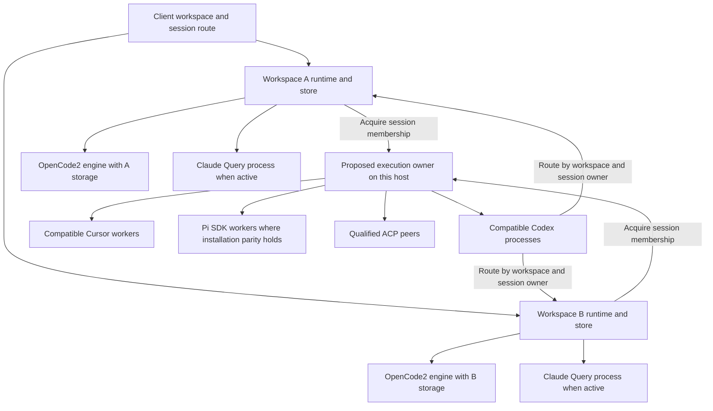

# Share harness execution wherever supported

## Goal Capsule

- **Objective:** Share compatible sessions in harness processes wherever the supported harness API and execution environment permit it. Apply this to every harness and to compatible workspaces on the same execution host.
- **User direction:** Sharing is the default target. A dedicated process requires a concrete protocol, configuration, authority, isolation, capacity, or deployment reason. The ten-Codex-process snapshot does not restrict the scope to Codex.
- **Means:** Keep workspace and session authority separate from process lifetime; implement each harness's supported sharing model and document the exact exceptions.
- **Authority:** This plan and the latest user direction supersede the previous Codex-first, benchmark-selected plan. The [current architecture](../architecture/2026-10-03-claxedo-session-execution.md) and [failure matrix](../architecture/2026-10-03-harness-failure-matrix.md) remain the current-code evidence.
- **Execution profile:** Twelve reviewable units. This is a plan; no production implementation, live process termination, configuration change, deployment, or merge has occurred.
- **Completion:** Each harness has an implemented sharing path or a demonstrated limit, with ownership, recovery, version, packaged, and deployment evidence. Unknown feasibility is unfinished research, not proof that sharing cannot work.

## Product Contract

### Current flow and precise change

**A. A prompt targets a workspace.** The client selects its workspace route. Local requests reach `ensureEmbeddedWorkspaceRuntime()`, whose `hosts` map contains one runtime object per workspace ID inside the local daemon. Remote requests reach that workspace's runtime through the relay. Workspace authority, store, directory, configuration and events belong to that runtime.

**A.1 Runtime selects a transport.** `createWorkspaceHost().harnessEngine()` creates services, a composer, transport registry, brokers and session-core. `createWorkspaceTransports().forHarness()` caches a native transport under `native:{harnessId}`. The cache belongs to one workspace, but the transport serves many session IDs. Runtime objects, transport objects, SDK engines and OS processes are different resource levels.

**A.2 Transport selects execution.** Codex currently allocates per-root processes; Cursor shares compatible workers; OpenCode2 embeds a shared engine; Claude and Pi RPC have their own session-oriented execution. ACP depends on its peer. Thus one runtime per workspace never implied one process per session.

**A.3 Return path.** Provider frames go through the owning session/turn broker into that workspace's durable store and event hub, then back to the subscribed client. This ownership must survive sharing unchanged.

**Proposed change at A.2:** workspace transports acquire execution from an explicitly injected owner for the execution domain. In a local daemon hosting workspace A and workspace B, that owner can give both the same compatible worker. It owns the launch, process router, occupancy and retirement; each workspace still owns its session broker, permissions, persistence, first-party MCP credentials and events. Closing A releases A's memberships rather than killing B's process.

**Existing native cloud branch:** when one workspace means one VM, the native harness pool is inside that VM and serves that workspace's sessions. Its deployment lifetime can coincide with the sole workspace runtime. “Execution host” below means the actual process-sharing domain, not the physical machine that might host several isolated VMs. This pooling change preserves native cloud workspace-to-VM placement. A hosted model loop with remote machine tools is a different supported-target proposal, described below; the VM boundary does not prohibit that design.

The current `createSpawnService()` is bound to a workspace launch-ownership store. For local cross-workspace sharing, moving a worker map alone would leave the wrong runtime entitled to retire/reconcile its processes. U2 changes launch ownership, daemon residency and recovery together. A cloud VM with one workspace can retain its existing workspace-owned launch store: all pooled members belong to that workspace. No global singleton may bypass the harness package's composition and process-state rules.

Sources: [embedded runtimes](../../packages/claxedo-local-server/src/deployments/local/embedded-workspace-runtime.ts), [runtime composition](../../packages/workspace-runtime/src/workspace/runtime.ts), [transport registry](../../packages/workspace-runtime/src/workspace/transports.ts), [spawn service](../../packages/workspace-runtime/src/spawn-service.ts), [launch scope](../../packages/process-ownership/src/launch/ownership-store.ts).

### Relationship to Pi Durable and typed machine execution

**Session placement and the execution interface are independent decisions.** The user's requested local architecture keeps Pi's session host and model loop on the local machine. A local workspace runtime can acquire an SDK session in a compatible shared Pi worker; that session invokes machine capabilities through a typed interface implemented directly in-process or over local IPC when a worker boundary exists. No DO or cloud round trip is required. Session configuration, MCP selection, credentials, approvals and events remain bound to the session even when the worker and machine executor are shared. Choosing this boundary does not by itself select the coding-agent SDK versus Pi Durable or prove installed-extension compatibility.

| Placement | Prompt and tool path proposed here |
| --- | --- |
| Local client, local Pi | Client → local workspace/session authority → local Pi SDK session → typed local execution adapter |
| Remote client accessing local Pi | Client → authenticated relay/host connection → the same local session host and model loop → typed local execution adapter |
| Cloud Pi Durable / Boat HLD | Client → CP → root SessionDO and model loop → BoatExecutionEnv → workspace VM |

The relay in the second row transports client access; it does not move the local model loop into a DO. A cloud-owned loop executing tools on an enrolled laptop would be a fourth, separate placement. It is not required by the user's local proposal or by sharing a typed execution interface.

The [Pi Durable / Boat HLD](../architecture/pi-durable-boat-hld.md) already proposes a separate managed harness, `pi-durable`: CP authorizes and routes each top-level session to its `SessionDO`; that owner hosts session-core, the Pi Durable model loop and durable state. Pi-owned children stay with their root. Independent roots have separate DOs and use one Boat execution VM per workspace. The [Boat implementation plan](2026-10-02-2031-feat-pi-durable-boat-plan.md) owns this work. Native Pi's `AgentSession` SDK and Pi Durable are different APIs; neither a pooled native SDK host nor this document replaces that proposal.

**Optional remote-execution extension beyond the HLD's cloud V1:** a `MachineExecutionEnv` could implement the same logical file/process boundary as `BoatExecutionEnv`, dispatching from a cloud session host to an enrolled machine through the existing authenticated host connection. This extension is not a prerequisite for the direct local adapter above. The relay carries requests and results; it does not own tool admission, session policy or execution history. On the machine, extract/reuse execution mechanics with an injected authorization contract rather than assuming current session-dependent file/PTY routes are a standalone executor. This is new executor/protocol work: the HLD explicitly excludes laptop execution and full Pi CLI extension parity from V1.

Each dispatched operation needs a runtime-validated operation shape, authoritative workspace/session/turn/tool identity, immutable effective configuration revision, bounded execution grant, stable invocation ID and target execution generation. Resolve these from admitted state, not model-supplied ownership fields. Record intent before sending; the machine durably records admission/outcome and rejects conflicting reuse of an ID. Status and cancellation address that original invocation and generation. A lost response does not prove non-execution: retain an uncertain outcome and reconcile without automatically repeating mutations. Root-host fencing and shared-machine generation remain distinct. Terminals and previews retain their own authorized streaming routes.

**MCP scope is a separate fix.** Current [launch composition](../../packages/session-core/src/host/launch.ts) obtains projection by harness, and [workspace projection](../../packages/workspace-runtime/src/workspace/projection.ts) caches its generation by harness. Conversely, [session MCP assembly](../../packages/harness/src/contract/mcp.ts) and `Pi's launch handoff` already accept a session's launch payload and add session-specific first-party access. Thus the present product lacks arbitrary independent session selection at the configuration producer; RPC itself is not a blanket prohibition on per-session MCP. Changed Pi launch configuration during an active turn returns `Cannot reconfigure Pi during an active turn`; idle reconfiguration restarts/resumes that session.

For managed Pi, resolve authorized workspace defaults plus explicit session selection into a durable configuration revision and a session-specific MCP tool catalog. HTTP MCP can run from the session host when its network/auth contract permits it. Machine-local stdio MCP requires a machine-owned connection/process and a bridge for discovery, calls, cancellation and any advertised server interactions; a one-shot shell call is insufficient. Connection credentials, approval routing and server configuration remain session-scoped unless that server's actual contract permits sharing. Pi Durable's execution environment alone does not implement this MCP bridge. Configuration changes must not silently replace the catalog/credentials used by an already-admitted call; apply a declared revision boundary and handle revocation explicitly.

Typed execution redirects only tools/extensions using that boundary. An installed Pi CLI extension that imports Node filesystem/process APIs is not automatically remote-safe or compatible with Pi Durable. Keep native installed-Pi support under U7; use the existing Pi Durable HLD for the managed target, with an explicit capability matrix and separate machine-extension acceptance before advertising it. Hosted session ownership can remove the model loop from the workspace VM, but it does not prove any amount of memory saving, eliminate command/MCP children, or isolate concurrent edits to the shared workspace files.

### Requirements

- R1. Compatible sessions use shared execution wherever the supported harness permits it; an exception names its actual limiting mechanism and evidence.
- R2. Sharing is considered across workspaces on the same execution host, not arbitrarily limited by the current transport map. Separate machines/sandboxes remain separate process domains.
- R3. Session transcript, approval, question, tool, usage, child-thread, title and turn ownership remain independent.
- R4. Provider accounts, credential generations, plugin trust and process-global configuration remain compatible within each group. Sharing never grants authority.
- R5. Workspace state and history remain under existing canonical owners. Do not merge databases or infer session identity just to reuse a worker.
- R6. Stop, close and workspace disposal affect only their admitted scope unless process-level failure requires group retirement; then every occupant receives honest loss and recovery state.
- R7. Release only proven-quiescent execution. Live goals, children, background terminals, pending requests, startup, configuration and uncertain outcomes prevent idle release.
- R8. Resume preserves the exact prior conversation and fences stale generations. Missing history or unknown execution never becomes a replacement successful conversation.
- R9. Local unsigned, signed desktop, enrolled-machine and cloud routes preserve their access, placement and credential contracts. Desktop quit releases client residency and preserves running daemon work.
- R10. All six integrations have a concrete implementation or verified limit, including plugin/MCP configuration and supported-version evidence. Preserve Pi's selected executable/version, eligible owner profile, extension/package discovery and project trust behavior; do not silently substitute a bundled Pi for the user's installation. Correct Pi's MCP declaration and stale relay documentation.
- R11. Measure process/engine/worker occupancy, memory, descendants and latency for every integration. Measurements tune capacity and identify regressions; an arbitrary percentage saving is not the prerequisite for implementing supported sharing.
- R12. Finish through real entrypoints, packaged/deployed acceptance, removal of replaced paths, and source/package/running-build provenance. No silent dedicated-process fallback hides a broken shared path.

### Sharing target for every harness

| Harness | Target | Exact limitation or necessary change |
| --- | --- | --- |
| Codex app-server | Multiple concurrent root threads per compatible process, including sessions from different local workspaces. | Replace entry-bound request/event routing and process retirement. Partition incompatible process auth, environment and profile generations; keep cwd and thread-scoped configuration on the thread. |
| Cursor SDK | Reuse the existing multiple-Agent worker model across compatible workspaces. | Inject the registry above workspace lifetime; preserve per-Agent callbacks/cwd/MCP and immutable worker-home generations. A shared worker timeout remains a group failure. |
| OpenCode2 embedded V2 | Keep multiple compatible sessions in each engine and existing OS-process sharing between local workspace engines. | It is already in the daemon process. One engine per workspace is not one child process per workspace. Distinct database/account owners are real engine boundaries; collapsing them is a separate state migration, not required to achieve OS-process sharing. Instance selectors can partition supported application configuration, not authorization or database ownership. |
| Pi | Pursue embedded `AgentSession` sharing where it preserves the selected Pi installation and full supported behavior. | Current RPC can run the user's installed executable and eligible profile. SDK extension loading is possible but is not automatically CLI or version parity. Importability of the selected installation, built-in extensions, project trust, native dependencies and process-global extension behavior must be proved. Keep RPC when that contract cannot be met; do not replace the user's Pi with an unrelated bundled SDK. |
| ACP | Share one connection/peer for peer/version combinations demonstrated to support independent concurrent sessions. | ACP session IDs alone do not establish concurrency or per-session release. Some peers still spawn a CLI child per session. Qualify peers explicitly; retain a documented dedicated mode when a peer actually requires it. |
| Claude Agent SDK | Share Claxedo host infrastructure, retain the SDK-required independent Query/CLI for each concurrent conversation, and release completed Queries correctly. | The supported SDK spawns a CLI per independent concurrent session. Streaming several turns into one Query is not concurrent independent-session support. A shared outer wrapper does not remove those CLI processes. |

Claude's current [hosting contract](https://code.claude.com/docs/en/agent-sdk/hosting) explicitly describes the per-session subprocess model. Pi's upstream [SDK factory](https://github.com/earendil-works/pi/blob/main/packages/coding-agent/src/core/sdk.ts) exposes session object construction; this is a feasibility basis, not proof that all extension profiles are isolated. U1 pins and tests the exact supported artifact. ACP [session setup](https://agentclientprotocol.com/protocol/v1/session-setup) supplies session identity and configuration, not a universal peer-concurrency guarantee.

### Coverage of the original audit claims

| Original claims | Disposition and implementation |
| --- | --- |
| 1–7: runtime/session ownership | U2 keeps workspace authority and separates execution-resource ownership; U11 proves public routes. |
| 8–16: Codex | U3/U4 implement process routing, compatible sharing and group recovery. U10 adds safe quiescent release. |
| 17–19: Claude | U9 preserves the real SDK limit, normal result cleanup and background safety; no pretend multiplexing. |
| 20–22: Cursor | U5 extends existing sharing and fixes worker-home/lifetime ownership. |
| 23–29: OpenCode2 | U6 proves existing process/engine sharing and configuration boundaries; instances are used only for an actual application-config scope. |
| 30–32: Pi | U1 fixes the MCP declaration; U7 proves installed-Pi/extension parity before SDK cutover, implements sharing where the contract permits it, or records the concrete installation/profile limit. |
| 33–35: ACP | U8 qualifies and shares capable peers, routing session callbacks and preserving peer-specific extensions. |
| 36: wrappers | U2 preserves launch identity and verified retirement; U11 measures wrapper and payload separately. |
| 37–38: desktop/T3 examples | Comparative references; neither replaces Claxedo's authority and recovery contracts. |
| 39: panic/memory | U11 measures attributed resources. The old RSS snapshot proves neither unique memory nor crash causation. |
| 40: execution above workspace | U2 makes the same-host execution owner part of the target instead of deferring it based on the Codex snapshot. |

## Planning Contract

### Key Technical Decisions

- KTD1. **Retain one authority runtime per workspace for existing native placements.** Move physical resource lifetime, not workspace state, above that runtime. Clients and relay continue addressing workspace/session identities. The separate Pi Durable proposal has per-root hosted session authority and shared workspace execution; this native pooling decision does not constrain its topology.
- KTD2. **Construct one execution owner per actual execution domain.** Local daemon composition injects it into its workspace runtimes. Each cloud workspace VM composes its own owner inside the VM; a standalone runtime composes one for itself. These are ordinary composition objects, not extra services or processes. Do not create a global remote pool spanning VMs/machines or bypass sandbox filesystem/credential boundaries.
- KTD3. **Partition by actual compatibility.** Include harness/executable version, principal/account and credential generation where process-scoped, process-global environment, immutable plugin/config/home generation and trust policy. Workspace ID is not automatically a process key; include it only when a demonstrated process-global resource requires it. Per-session directories, brokers and first-party MCP tokens remain session-specific.
- KTD4. **One process router, many authoritative memberships.** Use a canonical tuple of workspace identity/generation and session identity/generation, mapped to upstream root/child/side IDs. Never use the last-bound broker. Refuse requests with unknown ownership; bound early notifications by count, bytes and deadline until canonical ownership arrives.
- KTD5. **Match launch ownership to the real sharing scope.** Reuse the launch gate, identity verification and ownership store contracts. Local cross-workspace workers need a host-owned store/generation and explicit durable memberships; extend owner scope only if the existing standalone owner cannot express that lifecycle. In a single-workspace cloud VM, retain the existing workspace-owned store/generation and record member sessions there. A workspace reconciler must never signal another owner's shared launch.
- KTD6. **Separate member release, worker drain and host retirement.** Workspace close fences new work, stops/drains its own members, and releases only those memberships. A process crash, poisoned SDK or uncontainable startup retires the group with coordinated loss. Do not replay uncertain tool calls. Failed retirement remains an owned, retryable failure.
- KTD7. **Keep process-readable profiles immutable while occupied.** Resolve effective launch content before acquisition; changed launch content chooses a new generation. Do not mutate global `process.env` or `process.cwd()` for individual sessions. Reuse canonical conversation storage independently of profile directories.
- KTD8. **Keep harness-specific behavior at the transport.** Share only the resource lifetime/membership mechanism. Codex threads, Cursor Agents, OpenCode2 engines, Pi sessions and ACP peer contracts retain their own protocols and translators. No generic event guessing, capability invention, or universal pooling flag.
- KTD9. **Select a bounded capacity from evidence.** Reuse an eligible non-full worker before starting another. A finite cap can protect responsiveness and limit correlated failure; document its measured reason per harness instead of imposing an arbitrary four-session ceiling everywhere. Idle release complements sharing and is not its prerequisite.
- KTD10. **Replace complete paths without deleting product capabilities.** Each enabled shared integration has one implementation for one or many occupants. Unsupported profiles/peers are explicit capability partitions, not exception-triggered fallback. A Pi SDK cutover must preserve installed-Pi support as well as persisted identity. Do not remove RPC on the strength of tests against a different bundled SDK. Retain the current RPC integration until a replacement covers its selected target; any distinct managed-SDK versus user-installed-CLI modes need an explicit supported-target contract, not automatic fallback.

The local OpenCode2 engines in this diagram already run inside the daemon's OS process. Keeping distinct engine/database objects does not contradict process sharing. Sharing harness processes also does not automatically make stdio MCP children safe to share: their protocol, configuration and credential lifetime need independent support. Count those children separately.

### Measurement and exception policy

Use isolated fixtures with 1, 2 and 8 sessions, both in one workspace and split across two compatible workspaces. Include active, quiescent, background, pending approval, rotation and failed-stop states. Use incompatible-account/profile controls and a separate host/sandbox control. Record exact source, dependency, executable and packaged build identities.

For each compatible group at measured capacity K, verify that N concurrent eligible members need the expected number of workers (normally ceiling(N/K)), with documented auxiliary/title/prewarm processes. Report engine count separately from OS-process count for OpenCode2. Record Claude CLI children and ACP downstream children so outer-wrapper sharing is not mislabeled as eliminating execution cost.

Measure wrapper, payload, MCP descendants, daemon and renderer in the same window, without double counting. On macOS distinguish RSS from physical footprint; neither sum is a claim of unique machine memory. On Linux record PSS/cgroup accounting where available. Use five alternating matched runs and at least twenty start/resume observations; publish memory, CPU, first-event and resume latency, retained growth and post-disposal leftovers. The previous arbitrary 15%/64 MiB selection gate is removed. A demonstrated regression informs capacity or implementation repair; do not silently return to dedicated processes.

A sharing exception must name the harness/version/profile, unsupported operation or process-global state, source and executable evidence, exact refusal/uncertainty result, scope affected and condition that would remove the limitation. Unknown peer behavior or untested extension isolation requires a qualification task. It cannot be recorded as a proven impossibility.

## Implementation Units

### U1. Establish supported sharing contracts and correct declarations

- **Requirements/dependencies:** R1/R10/R11; no dependency.
- **Owners:** `packages/harness/src/registry/table.ts`, adjacent tests, profiles and transport READMEs, Pi conformance, dependency/version fixtures, and `packages/workspace-relay/docs/architecture.md`.
- **Changes:** Correct Pi's MCP declaration; document current relay revocation/SSE lifetime. Pin actual supported SDK/CLI/peer versions and list process-global versus session-specific settings for all six integrations. Resolve OpenCode2 through the harness import, not the stale workspace-runtime-local beta-18684 installation. Inventory Pi installation forms from `PI_EXECUTABLE` and PATH, including package entrypoints, launch shims and custom/standalone executables. Determine whether an SDK can be loaded from that exact installation and version; separately identify the managed cloud image's artifact and native/Node closure.
- **Acceptance:** Real two-session capability flows, exact expected errors from the failure matrix, SDK provenance, Pi stdio/HTTP/first-party MCP and unsupported-form checks. This inventory guides implementation rather than selecting only Codex.

### U2. Separate host execution ownership from workspace authority

- **Requirements/dependencies:** R2–R9/R12; U1.
- **Owners:** `workspace-runtime/src/workspace/runtime.ts`, `workspace/transports.ts`, `spawn-service.ts`, ownership/reconciliation owners; local-server embedded-runtime composition and daemon lifecycle; `packages/process-ownership/src/launch/`; `packages/harness/src/compose.ts` and narrow contracts.
- **Changes:** Introduce an explicitly constructed execution-resource owner and inject it through composition. Keep protocol-specific registries inside their transports. For local cross-workspace workers, place launch records under a host generation/store with durable workspace/session membership and process identity. For a single-workspace VM, reuse its workspace store/generation. Separate process-level spawn/clock/lifetime services from member brokers and first-party MCP issuers: the first acquiring workspace's abort signal or callbacks must not become the worker's lifetime owner. Integrate shared workers into daemon residency, recovery inspection, drain and restart; preserve workspace store ownership and fences. Acquire/persist membership before exposing execution; recover interrupted acquisition/release without guessing membership.
- **Acceptance:** Two workspaces borrow one fixture worker; closing A leaves B running; A cannot retire B's launch during reconciliation; host restart accounts for every member; failed retirement blocks unsafe replacement; desktop quit preserves active work; host drain covers all shared and dedicated launches. Keep the sandbox owner local to its sandbox. No process-wide singleton or fake workspace owner.

### U3. Give Codex one authoritative process router

- **Requirements/dependencies:** R3/R6/R8; U1/U2.
- **Owners:** `codex-app-server/rpc.ts`, `session.ts`, `entry.ts`, `notifications.ts`, `native-children.ts`, `requests.ts`, `titles.ts`, `usage.ts`; proposed transport-local process router.
- **Changes:** Route requests, root/child/side notifications and process-global messages through one owner. Map canonical thread IDs to workspace/session memberships and current brokers. Replace per-entry `onRequest` replacement and broadcast notification classification. Refuse unknown-owner requests; fail bounded early-frame storage honestly on expiry/exhaustion.
- **Acceptance:** Simultaneous approvals in two workspaces; opposite-order answers; early child frames; overlapping title calls; usage exactly once; stale generation events; the CX5 no-active-turn refusal never becomes silent wrong-broker routing. Routing plus U4 retires as one complete release slice.

### U4. Share Codex processes and coordinate their failures

- **Requirements/dependencies:** R1–R8/R11; U2/U3.
- **Owners:** Codex `launch.ts`, `sessions.ts`, `entry.ts`, `configuration.ts`, `terminals.ts`, `profiles/codex/`, process registry and session-core recovery only where a canonical fact is missing.
- **Changes:** Acquire by real compatibility across same-host workspaces. Hold profile/config generations immutable; keep upstream thread persistence resumable. Split root unload from worker retirement. Apply group loss on crash or unresolved startup when thread-local cessation cannot be proved. Reconcile every member through its workspace broker.
- **Acceptance:** Same-group roots share despite different workspace IDs/cwd; incompatible launch state separates; each root gets correct MCP credentials; Stop A preserves B; startup timeout retires/fences every affected member; closing one workspace leaves other memberships intact; exact resume and background inventory remain correct. Preserve CX1–CX4 intentional safety behavior at the appropriate member/group scope.

### U5. Extend Cursor's existing worker sharing

- **Requirements/dependencies:** R1–R8/R11; U1/U2.
- **Owners:** `cursor-sdk/host-registry.ts`, `host.ts`, `index.ts`, `cancel.ts`, `profiles/cursor/index.ts` and worker protocol tests.
- **Changes:** Reuse the existing registry under the injected host lifetime rather than building another pool. Identify Agent/run membership across workspaces. Replace active shared-home rewrites with immutable generations for launch-affecting changes; preserve Agent-scoped cwd/key/MCP configuration. Release only the departing Agent; retire the worker only through its resource owner.
- **Acceptance:** Two workspace Agents share; plugin add/remove and credential rotation cannot alter an incompatible sibling profile; cancellation acknowledgement with a still-running run remains distinct from an unresponsive cancel/close that retires the worker. All affected members receive `Cursor SDK host retired` and recover; unaffected workers continue.

### U6. Preserve and complete OpenCode2's shared-engine boundaries

- **Requirements/dependencies:** R1/R3–R8/R10/R11; U1/U2 contract integration where needed.
- **Owners:** `opencode-sdk/host.ts`, `runtime.ts`, `transport.ts`, `session-config.ts`, `launch-policy.ts`, `tool-port.ts`, engine event pump, runtime SDK smoke probes.
- **Changes:** Keep compatible sessions sharing the current embedded engine and retain OS-process sharing across local workspace engines. Route engine events/tools by actual session owner. Verify engine-account guards, directory projection/reload and rollback as explicit contracts. If a supported application-plugin scope needs distinct SDK instances, key every relevant config/tool/reload/recovery owner together; do not key one SDK callback while leaving directory maps global. Do not consolidate separate workspace databases as a disguised process optimization.
- **Acceptance:** Two compatible sessions share one engine; two workspace engines add no harness OS child; incompatible accounts retain the exact OC1/OC2 refusal; config changes affect precisely their declared directory/engine scope; conflicting tools retain OC4; failed open/rollback reports OC8; interrupt uncertainty preserves siblings. An instance migration, if required by the chosen profile contract, must pass recovery-before-prompt and teardown tests before release.

### U7. Preserve installed Pi while qualifying SDK worker sharing

- **Requirements/dependencies:** R1–R8/R10–R12; U1/U2.
- **Owners:** Existing `pi-rpc/` lifecycle/translation/MCP contracts, Pi profiles, composer/registry, real Pi conformance and saved-session fixtures; proposed Pi SDK transport/worker files with narrow responsibilities.
- **Changes:** First prove the selected installation can supply a compatible SDK without changing the user's Pi version, fork, launcher semantics or native dependencies. Where it can, use its supported session factory with independent AgentSession, session manager, settings/resource view, credentials, events and extension UI bridge per member. Reproduce eligible owner-profile and trusted project discovery with Pi's own loader, preserve projected extension roots and Claxedo's injections, and keep brokered/member profiles separate. Pi 1.0.0's SDK documentation says CLI built-in MCP, codemode and tool-search extensions require explicit SDK-host registration; reproduce their activation and `bindExtensions()` lifecycle. Keep cwd explicit, avoid global env/cwd mutation, and group only compatible process-global extension settings. Preserve approvals, steer/queue, `agent_settled`, usage and native JSONL identity. If the selected executable has no usable SDK surface, record that concrete limit and retain RPC for the existing contract; do not manufacture an equivalent installation.
- **Acceptance:** An explicit `PI_EXECUTABLE` and a PATH install remain the authoritative version; eligible own-profile settings/extensions/packages and trusted project resources match the CLI's effective discovery, commands, tools and provider definitions. Brokered/member sessions do not inherit the machine owner's private profile. Test the CLI's built-ins, Claxedo MCP/title extensions, supported dialogs/notices and existing terminal-only UI limitations. Then prove concurrent markers/tools/approvals, plugin add/remove, queues/abort, compaction, background work, missing-file refusal and exact RPC-created JSONL resume. Preserve public `pi` identity and migrate any changed persisted binding explicitly. Crash/stall one worker and reconcile every occupant. Cut over only when this installation/behavior contract and measured benefit hold; report a specific unsupported installation/profile rather than silently excluding it from parity.

Current ownership evidence: `binary resolver`, [composition and owner agent directory](../../packages/workspace-runtime/src/host/composition.ts), `profile selection`, `RPC launch`, and `transport behavior`. The pinned Pi 1.0.0 fixture's `docs/sdk.md` and `dist/core/sdk.js` were inspected for SDK discovery and built-in-extension differences. Package-import feasibility for arbitrary user installations remains unproven.

U7 concerns the existing native `pi` identity and selected installation, including a local shared SDK worker with a typed local execution adapter where qualification succeeds. It requires no DO. Cloud `pi-durable` execution belongs to the linked HLD/Boat plan. Extending a cloud-owned model loop to enrolled machines requires separate public-flow, per-session MCP, disconnect/recovery and operation-reconciliation acceptance. Reuse the logical execution contract across placements while preserving their explicit session-host and storage ownership.

### U8. Share qualified ACP peers

- **Requirements/dependencies:** R1–R8/R10/R11; U1/U2.
- **Owners:** `acp/connection.ts`, `startup.ts`, `lifecycle.ts`, `events.ts`, `cancellation.ts`, `streams.ts`, `projection.ts`, and peer descriptor/version qualification.
- **Changes:** Define a Claxedo qualification record for each supported peer/version, separate from standard ACP capabilities. A qualified peer has one connection router and independent session memberships; dispatch updates, permissions, filesystem and terminal callbacks using protocol session ownership. Separate session cancellation/release from connection close. Preserve real peer-specific plugin extensions. Unknown methods/owners are refused; no generic claim of peer concurrency.
- **Acceptance:** Two real concurrent peer sessions with opposite-order requests; one stop/release while the other runs; load/resume; transport loss and acknowledged-but-pending cancellation; child process census. For serial/single-session peers, record the demonstrated dedicated-process exception. Remote connection reuse never establishes that disconnect stopped remote execution.

### U9. Enforce Claude's supported sharing ceiling

- **Requirements/dependencies:** R1/R3–R8/R10/R11; U1; U2 for host accounting.
- **Owners:** `claude-sdk/live-query.ts`, `turns.ts`, `query-options.ts`, launch context and lifecycle flows.
- **Changes:** Keep independent CLI/Query execution where the supported SDK requires it. Reuse common Claxedo host services without rebinding Query callbacks across sessions. Ensure ordinary completed results release eligible Queries and descendants; retain background work and honest interrupt/cleanup uncertainty. Avoid unnecessary extra probe/title executions where the existing canonical path supports reuse.
- **Acceptance:** N independent concurrent sessions have N justified CLI executions, with no extra unexplained copies; session settings/callbacks remain independent; ordinary completion closes; live background replacement preserves CL1; model/permission refusal and interrupt failure preserve their exact outcomes. Record this API limit explicitly instead of inventing a multi-session Query.

### U10. Apply quiescent release and configuration rotation coherently

- **Requirements/dependencies:** R4/R6–R8/R11; relevant U4–U9 owner complete.
- **Owners:** Existing harness-specific lifecycle/background inventories and the shared host membership owner; session-core admission/attachments/recovery for authoritative integration.
- **Changes:** Serialize admission, pending requests, configuration, title/child/goal work, idle eligibility, release and reacquisition against generations. Release members without losing persisted identity; retire empty workers with verified descendant cleanup. Unknown inventory is ineligible. Keep first-party MCP credentials session-scoped and profile resources retained until their last reader releases them.
- **Acceptance:** Idle-release/new-prompt race, live background and pending approvals, credential withdrawal, failed retirement, missing history, stale completion, and restart. Idle cleanup complements each harness's sharing path; it cannot be used to substitute away required concurrent sharing.

### U11. Prove all clients, placements and resource counts

- **Requirements/dependencies:** R1–R12; U1/U2 and every harness slice; baseline can begin earlier.
- **Owners:** Existing harness flows/version matrix, app `stack`, `desktop`, `signed`, `signedDesktop`, `signedCloud` fixtures, workspace-runtime and relay entrypoints; proposed narrowly scoped fixture benchmark runner.
- **Changes:** Run same-workspace and same-host cross-workspace scenarios through real UI/runtime/relay boundaries. Keep production authority, persistence, transport and launch ownership real; fake only permitted external model, OAuth, sandbox-driver and test ACP boundaries. Independently read stored events, process identities and memberships.
- **Acceptance:** All six sharing targets or evidenced limits; signed account switch and share revocation; local route preserved after sign-in; tunnel replacement; cloud stopped GET does not start; explicit wake/config delivery; checkpoint/recovery; desktop quit/reopen preserves execution while connector availability remains separately assessed. Packaged Electron and deployed host/cloud acceptance are separate from fixture success.

### U12. Finish the migration and publish evidence

- **Requirements/dependencies:** R10–R12; U1–U11.
- **Owners:** Final task-owned diff, harness architecture/README owners, failure matrix and attributed performance report.
- **Changes:** Remove replaced registries, per-entry process ownership, obsolete Pi framing where cut over, duplicate lifecycle paths and experimental fallback flags. Update current topology and exact group failure scope. Preserve public persisted IDs and intentional unsupported errors. Report each remaining dedicated resource's concrete reason and each unverified release criterion with an owner.
- **Acceptance:** Package checks, corpus comparisons, source/closure/file-size ratchets, public flows, packaged/deployed evidence and measured resource accounting. No universal memory-savings claim from a process-count reduction alone.

## Verification Contract

These commands are for implementation, not claims of execution while drafting. Run tests in owning packages; add focused new tests beside the new canonical owners and use the package's Node tests for launch-gate behavior.

| ID | Commands / working directory | Evidence |
| --- | --- | --- |
| V1 | `packages/harness`: `bun test src/registry/table.test.ts src/conformance/pi-mcp.test.ts src/capabilities/mcp-filter.test.ts src/contract/mcp.test.ts` | Capability declaration and real Pi MCP forms |
| V2 | `packages/harness`: `bun test src/transports/codex-app-server src/transports/claude-sdk src/transports/cursor-sdk src/transports/pi-rpc src/transports/opencode-sdk src/transports/acp`, updated to the final Pi path after cutover; `bun run check` | Transport ordering, errors, invariants and package architecture |
| V3 | `packages/workspace-runtime`: `bun test src/workspace/runtime-session-owner.test.ts src/workspace/runtime-projection-defer.test.ts src/workspace/shutdown.test.ts src/ownership/reconcile-launch-ownership.test.ts src/remote-session-authority.test.ts`; add host-owner integration and owning local-server/session-core recovery tests | Membership, authority, configuration, shutdown and recovery |
| V4 | Root: `bun run build:packages`; `bun run --cwd packages/harness flows`; `bun run --cwd packages/harness flows:versions`; `bun run --cwd packages/workspace-runtime test:opencode-node` | Real supported harness/SDK entrypoints and version/artifact provenance |
| V5 | `packages/claxedo-app`: `bun run e2e -- <changed-spec> --project=web --project=phone --repeat-each=20`; Electron cases with `--project=desktop`; required CI repeats | Public fixture routes, followed by separate packaged/deployed acceptance |
| V6 | Root: `bun run lint`, `bun run typecheck`, `bun run test:architecture-ratchets`, `git diff --check`; app `check` if changed, plus affected `verify:closure` for intentional import changes | Static and dependency boundaries; never raise a baseline to hide an accidental edge |

The release matrix includes unsigned local; signed desktop on the same machine; signed web and desktop through an enrolled host; and signed web/desktop through a cloud sandbox. Same-host sharing is asserted only where the runtime processes actually share a permitted execution domain. Cross-sandbox negative tests assert separation rather than inventing a shared local process.

## Definition of Done

- Every supported harness has its maximum implemented compatible sharing scope or an exact evidenced limit; lack of investigation is not a limit.
- Workspace identity remains the authority/store boundary and no longer imposes an accidental worker boundary for shareable harnesses.
- Group failure, member release, workspace shutdown, daemon restart and credential rotation preserve all affected session identities and honest state.
- Pi installed-executable/profile/extension parity and each ACP peer qualification are completed or explicitly reported as unmet criteria. An SDK migration cannot be marked complete by testing only a bundled version and dropping user-installed Pi support.
- Actual process/engine/descendant counts, memory and latency are reported without inventing savings. Remaining dedicated workers have explained compatibility or capacity reasons.
- Replaced production paths are removed, repository checks pass, and packaged/deployed acceptance is demonstrated or clearly marked as an outstanding release gate.
