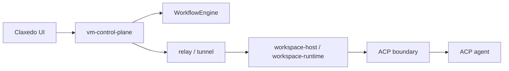

# VM Control Plane Workstreams

## Goal

Build a Claxedo-owned hosted workspace architecture with a clear split between:

- a product-owned control plane
- a workspace-local runtime/host
- a durable execution layer for long-running agent work
- a relay/tunnel layer for live hosted connectivity

This direction replaces the old gateway-style proxy split with a clearer ownership model:

- `vm-control-plane` owns auth, projects, workspaces, durable authority state, shared metadata, workflow dispatch, review metadata, and cross-workspace coordination
- `workspace-host` or `workspace-runtime` owns filesystem, PTY, process, git, and runtime-local execution
- relay/tunnel brokering connects browsers and cloud callers to hosted runtimes
- ACP remains the inner-loop agent contract where applicable

Related docs:

- [docs/plans/2026-04-11-durable-workspace-control-plane-implementation-plan.md](/Users/yashvardhansingh/.codex/worktrees/b0da/opencode/docs/plans/2026-04-11-durable-workspace-control-plane-implementation-plan.md)
- [docs/sync-architecture-target.md](/Users/yashvardhansingh/.codex/worktrees/b0da/opencode/docs/sync-architecture-target.md)
- [docs/cloud-architecture-hardening.md](/Users/yashvardhansingh/.codex/worktrees/b0da/opencode/docs/cloud-architecture-hardening.md)

## Locked Direction

- No central cloud OpenCode server
- No revival of the deleted `claxedo-gateway` as the primary long-term shape
- `workspaceId` is the stable identity across routing, events, sessions, and review state
- hosted control plane remains a Node/Hono service with durable authority state
- shared product metadata belongs in central canonical stores
- replay-worthy runtime timeline state uses durable append/replay paths where needed
- relay/tunnel brokering replaces the current permanent proxy path as the long-term hosted connectivity shape
- durable agent execution belongs in a workflow layer, not in workspace authority itself

## Workstreams

### 1. Contracts and ownership

Define the hard boundaries before implementation spreads:

- `vm-control-plane <-> workspace-host` API
- `vm-control-plane <-> WorkflowEngine` API
- browser/bootstrap/relay contract
- normalized event envelope carrying `workspaceId`
- session identity, lifecycle, and metadata ownership
- secret ownership and delivery model

Primary output:

- endpoint ownership matrix
- runtime contract spec
- workflow contract
- event schema
- session and workspace metadata schema

### 2. `vm-control-plane` foundation

Build the browser-facing control-plane service.

Responsibilities:

- auth and org/user access control
- project and workspace records
- `WorkspaceAuthority` persistence and lease state
- runtime provider selection and lifecycle
- sandbox wake, stop, destroy, and health
- shared metadata APIs
- review metadata and workspace-level orchestration APIs
- attach/bootstrap metadata for relay and browser clients

### 3. Workspace host

Build the per-workspace runtime host that sits beside the agent and implements workspace-local capabilities.

Responsibilities:

- filesystem access
- terminal and process execution
- git/worktree inspection
- review/diff extraction
- MCP server lifecycle
- local secret materialization when explicitly allowed
- runtime-local session persistence
- event emission back to the control plane

This layer should stay thin. It is not another general-purpose product backend.

### 4. Workflow execution

Standardize durable agent execution around a `WorkflowEngine`.

Responsibilities:

- schedule or trigger durable runs
- approval waits
- webhook wakes
- retries, cancel, and resume
- workflow/run linkage to workspaces and sessions

Important constraint:

- workflow execution is not the same thing as workspace authority

### 5. Relay and tunnel brokering

Make hosted connectivity explicit.

Responsibilities:

- host registration and heartbeat
- browser attach bootstrap
- cloud-to-host dispatch
- hosted session attachment and reconnect brokering

This replaces the long-term assumption that the control plane permanently proxies runtime APIs.

### 6. Secrets, auth, and provider policy

Move all hosted secret handling into the control plane and make delivery explicit.

Responsibilities:

- org-scoped provider credentials
- runtime-provider defaults and BYO configuration
- workspace-scoped short-lived token issuance
- MCP auth storage and refresh handling
- revocation and rotation behavior

### 7. Session model and eventing

Rebuild session tracking around `workspaceId` instead of directory.

Responsibilities:

- session create/load/fork/archive/delete indexing
- child session relationships
- central shared metadata
- durable timeline/replay ingestion where needed
- event fan-in from many workspaces
- event fan-out to many browser clients
- ordering and dedupe rules

### 8. Claxedo app integration

Retarget the app from gateway/proxy assumptions to the hosted control-plane/runtime contract.

Responsibilities:

- replace raw proxy assumptions with control-plane bootstrap and relay attach behavior
- thread `workspaceId` through global state, tabs, sessions, and recents
- move remote routing away from raw directory identity
- consume control-plane APIs plus workspace-scoped runtime state

### 9. Review and git experience

Make review a first-class product surface rather than an accidental byproduct of session state.

Responsibilities:

- changed files and diff summaries
- branch/workspace relationship tracking
- multi-workspace review state
- pre-apply review surfaces
- links between sessions, terminals, and code changes

### 10. Migration and deletion

Remove the dead architecture incrementally.

Responsibilities:

- identify proxy-first and merged-state assumptions
- isolate remaining OpenCode-specific patch points
- deprecate stale docs and config names
- avoid carrying both old and new routing models longer than necessary

## Recommended Implementation Order

1. Contracts and ownership
2. `vm-control-plane` foundation
3. Session model and eventing
4. Workflow execution
5. Workspace host
6. Relay and tunnel brokering
7. Secrets and provider policy
8. Claxedo app integration
9. Review and git experience
10. Migration and deletion

## Immediate Deliverables

1. Endpoint ownership matrix marking each surface as control-plane-owned, host-owned, workflow-owned, or compat
2. `vm-control-plane <-> workspace-host` contract doc
3. `WorkflowEngine` contract doc
4. Normalized event and session metadata schema
5. `workspaceId` migration map for the app

## Non-Goals for the First Pass

- recreating the old gateway shape exactly
- making one storage system pretend to be every kind of state owner
- keeping directory as the primary remote identity
- treating ACP alone as the full product runtime without a workspace host
