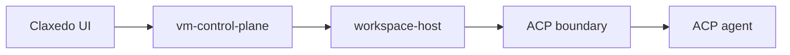

# VM Control Plane Workstreams

## Goal

Build a Claxedo-owned remote workspace architecture that keeps the outer loop in `vm-control-plane` and moves the inner loop into a per-workspace runtime built around ACP.

This direction replaces the old gateway-style OpenCode proxy split with a cleaner product-owned boundary:

- `vm-control-plane` owns auth, projects, workspaces, runtime lifecycle, secrets, session metadata, review metadata, and cross-workspace events
- `workspace-host` runs inside each workspace and implements the ACP client-side capabilities against the local sandbox
- ACP is the agent-side contract used by Claude, Codex, Gemini, and other ACP-compliant agents

## Locked Direction

- No central cloud OpenCode server
- No revival of the deleted `claxedo-gateway` as the primary long-term shape
- `workspaceId` is the stable identity across routing, events, sessions, and review state
- ACP is the inner-loop contract
- Claxedo-specific backend/runtime behavior should live in Claxedo-owned surfaces instead of scattered patches
- Convex remains the shared metadata store for the hosted product surface

## Workstreams

### 1. Contracts and Ownership

Define the hard boundaries before implementation spreads:

- `vm-control-plane <-> workspace-host` API
- `workspace-host <-> ACP agent` contract expectations
- normalized event envelope carrying `workspaceId`
- session identity, lifecycle, and metadata ownership
- secret ownership and delivery model

Primary output:

- endpoint ownership matrix
- runtime contract spec
- event schema
- session metadata schema

### 2. `vm-control-plane` Foundation

Build the browser-facing control plane service.

Responsibilities:

- auth and org/user access control
- project and workspace records
- runtime provider selection and lifecycle
- sandbox wake, stop, destroy, health
- runtime target resolution
- session index and session metadata mirror
- review metadata and workspace-level orchestration APIs

Expected surface:

- workspace/project CRUD and listing
- runtime lifecycle endpoints
- secret and provider policy endpoints
- aggregated `/event`
- browser-safe APIs for Claxedo UI

### 3. Workspace Host

Build the per-workspace runtime host that sits beside the agent and implements ACP client capabilities.

Responsibilities:

- filesystem access
- terminal and process execution
- git/worktree inspection
- review/diff extraction
- MCP server lifecycle
- local secret materialization
- local session persistence hooks
- event emission back to the control plane

This layer should stay thin. It is not another general-purpose product backend.

### 4. ACP Integration Layer

Standardize the agent-facing runtime around ACP.

Responsibilities:

- launch ACP-compliant agents
- negotiate capabilities
- expose filesystem, terminal, content, slash commands, and permissions through ACP
- normalize agent-specific differences where possible
- define fallback behavior for missing ACP capabilities

Important constraint:

- ACP is the inner-loop protocol, but product semantics like workspace lifecycle, review, billing, and cross-workspace state remain outside ACP

### 5. Secrets, Auth, and Provider Policy

Move all hosted secret handling into the control plane and make delivery explicit.

Responsibilities:

- org-scoped provider credentials
- org-scoped runtime-provider defaults and BYO configuration
- workspace-scoped secret delivery on start/wake
- MCP auth storage and refresh handling
- revocation and rotation behavior

This replaces the old assumption that local files like `auth.json` or `mcp-auth.json` are the source of truth.

### 6. Session Model and Eventing

Rebuild session tracking around `workspaceId` instead of directory.

Responsibilities:

- session create/load/fork/archive/delete indexing
- child session relationships
- root metadata mirror to Convex
- event fan-in from many workspaces
- event fan-out to many browser clients
- reconnect, heartbeat, ordering, and dedupe rules

This is the stream that prevents the product from becoming split-brain.

### 7. Claxedo App Integration

Retarget the app from deleted gateway assumptions to the new control-plane/runtime contract.

Responsibilities:

- replace `gatewayUrl` assumptions with `vm-control-plane`
- thread `workspaceId` through global state, tabs, sessions, and recents
- move remote routing away from raw directory identity
- consume root control-plane APIs plus workspace-scoped runtime state
- keep demo/mock mode separate from the real hosted architecture

This stream should also consolidate Claxedo-specific app patches into clearer owned modules.

### 8. Review and Git Experience

Make review a first-class product surface rather than an accidental byproduct of session state.

Responsibilities:

- changed files and diff summaries
- branch/workspace relationship tracking
- multi-workspace review state
- pre-apply review surfaces
- links between sessions, terminals, and code changes

This is a product stream, not just an infrastructure stream.

### 9. Migration and Deletion

Remove the dead architecture incrementally.

Responsibilities:

- identify old gateway assumptions in `claxedo-app`
- isolate remaining OpenCode-specific patch points
- deprecate stale docs and config names
- avoid carrying both old and new routing models longer than necessary

Primary output:

- a clear cutover path
- a deletion list for old gateway/control-plane assumptions

## Recommended Implementation Order

1. Contracts and ownership
2. Endpoint ownership matrix
3. `vm-control-plane` foundation
4. Session model and eventing
5. Workspace host
6. Secrets and provider policy
7. ACP integration layer
8. Claxedo app integration
9. Review and git experience
10. Migration and deletion

## Immediate Deliverables

The next concrete artifacts to produce are:

1. A full endpoint ownership matrix marking each surface as control-plane-owned, workspace-host-owned, or mixed/compat
2. A `vm-control-plane <-> workspace-host` contract doc
3. A normalized event and session metadata schema
4. A `workspaceId` migration map for the app

## Non-Goals for the First Pass

- Recreating the old gateway shape exactly
- Making Convex behave like a drop-in SQLite replacement for OpenCode internals
- Keeping directory as the primary remote identity
- Treating ACP alone as the full product runtime without a workspace host

