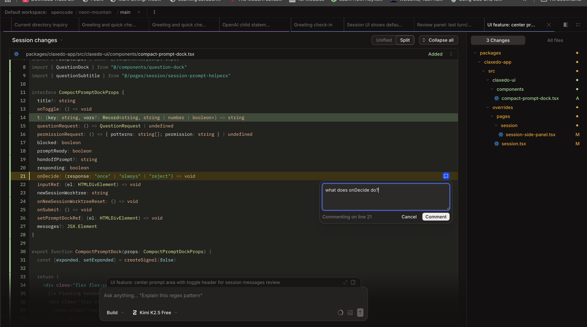

# Changelog

All notable changes to Claxedo App will be documented in this file.

The format is based on [Keep a Changelog](https://keepachangelog.com/en/1.1.0/),
and this project adheres to [Semantic Versioning](https://semver.org/spec/v2.0.0.html).

## [Unreleased]

## [0.0.57] - 2026-03-08

### Added
- Expanded website use cases for process management and first-class doc authoring

### Changed
- Refined the Claxedo website hero, pricing copy, and platform messaging
- Reworked the use-case gallery with full screenshots and an in-page viewer

### Fixed
- Screenshot zoom UI no longer opens as an oversized white dialog panel

## [0.0.8] - 2026-02-18

### Added

### Changed

### Fixed

## [0.0.4] - 2026-02-14

### Added
- Windows build support — path normalization and GNU toolchain for cross-platform desktop builds

### Fixed
- Disable onboarding/local-setup dialog — no longer shown on remote deployments
- Compact prompt dock now visible on all review tabs, auto-restores messages on review close
- SSE event stream uses platform.fetch for non-loopback URLs

## [0.0.3] - 2026-02-14

### Added
- Compact prompt dock overlays the review panel when the session column is narrow — auto-collapses messages but keeps chat accessible without leaving code review
- RadioGroup-based diff style switcher replaces icon-button toggles in session review toolbar

### Fixed
- Windows crash: override resolver Vite plugin failed on Windows due to backslash vs forward-slash path mismatch, causing duplicate SolidJS contexts and "Server context must be used within a context provider" error
- Windows path bugs: replaced all `URL.pathname` usage with `fileURLToPath()` across Vite configs and build scripts to avoid `/C:/...` leading-slash issues on Windows
- Session messages panel no longer hides on new/empty sessions when review panel is open
- Minimum session panel width reduced from 450px to 280px to support compact mode

## [0.0.2] - 2026-02-14

### Added
- Compact prompt dock that floats over the review panel — messages auto-collapse behind a certain size but you can still chat without leaving code review

  

### Changed

### Fixed

## [0.0.1] - 2026-02-13

### Added
- Initial release preparation with documentation and release automation
- Override system for extending OpenCode without modifying upstream
- Custom rail-based layout with tab navigation (ClaxedoLayout)
- Cloud workspace creation and management
- Clerk authentication integration
- Remote access/tunneling support
- Desktop application support via Tauri
- Server-scoped state persistence
- Agent lifecycle hooks for terminal status indicators
- xterm.js-based terminal with WebGL rendering

### Changed
- Terminal implementation migrated from ghostty-web to xterm.js
- Context providers restructured for server-scoped isolation

### Fixed
- Context scope issues between app-scope and directory-scope providers
- Terminal state persistence across workspace navigation

[Unreleased]: https://github.com/kyashrathore/opencode/compare/claxedo-v0.0.57...HEAD
[0.0.57]: https://github.com/kyashrathore/opencode/releases/tag/claxedo-v0.0.57
[0.0.8]: https://github.com/kyashrathore/opencode/releases/tag/claxedo-v0.0.8
[0.0.4]: https://github.com/kyashrathore/opencode/compare/claxedo-v0.0.3...claxedo-v0.0.4
[0.0.3]: https://github.com/kyashrathore/opencode/compare/claxedo-v0.0.2...claxedo-v0.0.3
[0.0.2]: https://github.com/kyashrathore/opencode/releases/tag/claxedo-v0.0.2
[0.0.1]: https://github.com/kyashrathore/opencode/releases/tag/claxedo-v0.0.1
