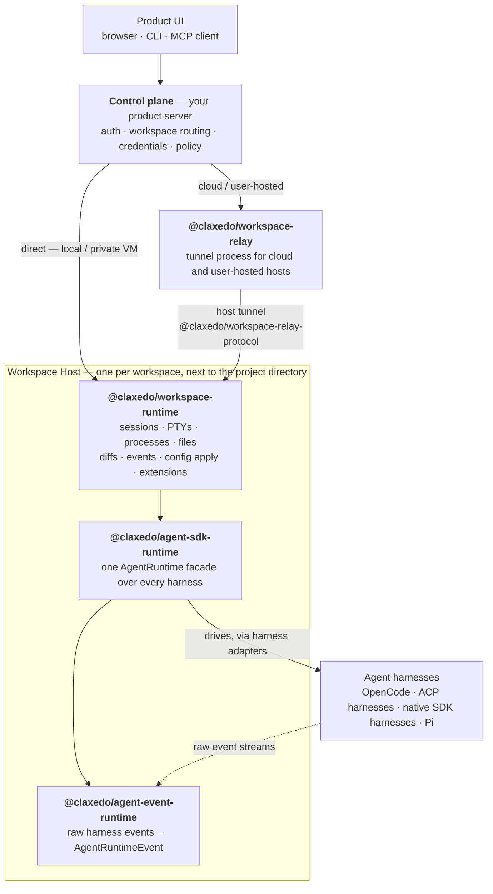

import Card from "../../../../components/framework/compat/Card.astro"
import CardGroup from "../../../../components/framework/compat/CardGroup.astro"
import Steps from "../../../../components/framework/compat/Steps.astro"
import Step from "../../../../components/framework/compat/Step.astro"


Claxedo is layered around one owner per concern. An event starts at a
harness, gets normalized, flows through the per-workspace host, and — for remote
access — travels over the relay to whichever control plane routed the request.

## Event flow, bottom to top

<Steps>
  <Step title="agent-event-runtime — normalize">
    Turns harness-specific streams into canonical `AgentRuntimeEvent`s and
    compatibility projections, so UI and session replay do not branch per
    harness.
  </Step>
  <Step title="agent-sdk-runtime — one facade">
    Presents a single `AgentRuntime` facade over OpenCode, ACP harnesses, native
    SDK harnesses, and Pi. Owns harness factories, stores, turns, events, and
    capability checks.
  </Step>
  <Step title="workspace-runtime — the host">
    The per-workspace execution host next to the project directory. Owns harness
    lifecycle, sessions, PTYs, managed processes, files, diffs, runtime events,
    config apply, and Agent Extension replay.
  </Step>
  <Step title="workspace-relay — remote access">
    A separate relay process that tunnels browser/gateway traffic to
    workspace-runtime hosts running on cloud VMs or user machines.
  </Step>
  <Step title="control plane — who & where">
    Your server (hosted or self-hosted). Owns auth, org/workspace authorization,
    credential storage, marketplace policy, and workspace routing. It decides
    who reaches which host, and whether directly or through the relay.
  </Step>
</Steps>

## The picture



`@claxedo/workspace-relay-protocol` is the shared wire contract underneath the
relay hop: both `workspace-relay` and the runtime's host tunnel speak the same
`TunnelMessage` protocol without the runtime depending on the relay server
implementation.

## Who runs where

| Layer | Runs in | Package |
| --- | --- | --- |
| Product control plane | Local server, self-hosted server, or hosted service | Your product code |
| Workspace Host | Next to the project directory | `@claxedo/workspace-runtime` |
| Agent SDK Runtime | Inside the Workspace Host | `@claxedo/agent-sdk-runtime` |
| Event runtime | Inside adapters/host projections | `@claxedo/agent-event-runtime` |
| Relay | Separate relay process | `@claxedo/workspace-relay` |
| Relay protocol | Shared dependency | `@claxedo/workspace-relay-protocol` |
| MCP server | MCP client subprocess | `@claxedo/mcp` |

## Two composition shapes

**Local, single user** — the control plane calls the host directly over
loopback:

```text
Product UI → local control plane → workspace-runtime → project directory
```

**Cloud or user-hosted** — traffic crosses the relay to reach the host:

```text
Product UI → control plane / gateway → workspace-relay
           → workspace-runtime host tunnel → project directory
```

<CardGroup cols={2}>
  <Card title="Sessions, turns & events" href="/framework/concepts/sessions-turns-events" icon="code">
    The core vocabulary the whole stack is built from.
  </Card>
  <Card title="The workspace host" href="/framework/concepts/workspace-host" icon="server">
    Where a session runs, and the `host` / `toolSandbox` split.
  </Card>
</CardGroup>
