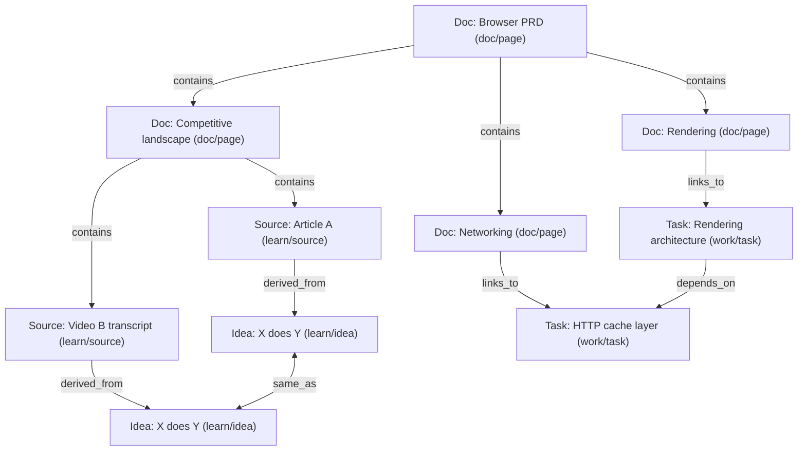

# PRD: Claxedo WorkGraph

## One-Liner

Claxedo WorkGraph is a local-first, doc-first workspace where notes, sources, ideas, tasks, decisions, evidence, and agent runs share one graph and one history.

## Product Intent

The product feels like a clean document editor and a powerful graph at the same time:
- Write rough notes without committing to structure.
- Promote parts of a doc into tasks, decisions, and evidence without leaving the doc.
- Ingest many sources and keep only unique ideas, categorized and linked.
- Create focused slices so the workspace can feel like a complete app, but only show one effort at a time.
- Converge section-by-section with a gavel flow so the doc stays readable while the debate remains accessible.

## Goals

1. Doc stays a doc: readable narrative is the default surface.
2. One identity for everything: any paragraph, task, idea, or artifact can be referenced forever.
3. Slices for focus: pick a slice and the entire UI scopes to that subgraph.
4. Planning as a view: turn doc intent into a task DAG only when asked.
5. Learning as a view: ingest sources, extract ideas, de-duplicate, categorize, and link to evidence.
6. Section gavel: converge on a final version per section without embedding every discussion in the main text.
7. Local-first by default with durable history for replay, audit, and sync.

## Non-Goals

- Replacing the editor with a block-first storage model.
- Forcing every doc to end in executable tasks.
- Making hard-coded node type enums the schema boundary.

---

## Core Model

WorkGraph has four primitives: nodes, edges, events, and snapshots.

### Node

Nodes are intentionally generic. Meaning is carried by `tags` and `attrs`.

```
Node:
  id:         string
  title:      string
  body:       string
  status:     string
  tags:       string[]
  attrs:      string        // json
  created_at: string
  updated_at: string
```

Tag conventions (runtime conventions, not hard schema):
- `doc/*`: pages, sections, section versions
- `work/*`: backlog tasks and planning units
- `run/*`: agent runs and execution overlays
- `plan/*`: questions, decisions, risks
- `evidence/*`: artifacts, citations, provenance
- `learn/*`: sources, ideas, clusters, categories
- `collab/*`: threads and review states
- `view/*`: saved slices and view definitions

### Edge

Edges are first-class and open-ended.

```
Edge:
  id:         string
  source:     string
  target:     string
  type:       string
  attrs:      string        // json
  created_at: string
```

Common edge types:
- `contains` (page tree, section hierarchy)
- `links_to` (general references and citations)
- `depends_on` (task graph dependencies)
- `supports` (evidence supports a claim/decision/task)
- `derived_from` (idea derived from a source)
- `same_as` (de-dup equivalence)
- `member_of` (idea belongs to a cluster)
- `categorized_as` (idea/cluster linked to a category)
- `spawned_run` (task/section spawned a run)
- `produced` (run produced an artifact)
- `discusses` (thread discusses a section/version/decision)

### Event (Canonical History)

Every mutation is an event so the system is replayable and debuggable.

```
Event:
  id:            string
  stream_id:     string
  stream_seq:    number
  logical_ts:    number
  schema_version:number
  type:          string
  payload_json:  string
  actor_type:    string
  actor_id:      string
  op_id:         string
  prev_hash:     string
  hash:          string
  created_at:    string
```

### Snapshot

Snapshots are performance tools, not truth. Replay remains canonical.

```
Snapshot:
  id:         string
  stream_id:  string
  event_seq:  number
  state_json: string
  created_at: string
```

---

## Views

All views render the same underlying graph.

- Document view: pages and sections as readable text with stable anchors.
- Backlog view: tasks with filters, priorities, and dependency awareness.
- Flow view (graph + timeline merged): dependencies rendered as a waterfall; adding dates turns it into a timeline/Gantt; selecting a node reveals its event history and diffs.
- Library view: sources, extracted ideas, clusters, and categories.

## Slices

A slice is a saved definition of a subgraph.

Slice definition:
- seeds: starting nodes (page, section, goal, category)
- traversal: which edge types to follow, depth, direction
- filters: tags, status, time windows
- presentation defaults: which view opens first, grouping/sort/layout hints

A slice is stored as a node tagged `view/slice`.

UX:
- the workspace can feel like a complete app
- selecting a slice scopes doc/backlog/flow/search to that subgraph
- nothing is deleted or moved in the underlying graph

---

## UX Workflows

### 1) Second Brain and Learning Engine

Input:
- documents, links, transcripts, highlights

Output:
- extracted ideas as small, linkable nodes
- de-dup clusters that keep only unique points
- categories that can be browsed as slices
- clean notes that cite sources and link to idea clusters

Minimum nodes and edges:
- `learn/source`, `learn/idea`, `learn/cluster`, `learn/category`
- `derived_from`, `same_as`, `member_of`, `categorized_as`, `summarizes`

### 2) Doc to Plan (Optional)

From a page or a selected section:
- generate a proposed plan graph (tasks + dependencies + questions/decisions)
- show it as a slice and a diff before commit
- create bidirectional links back into the doc so the doc stays canonical

### 3) Run Agents Without Losing the Doc

Runs are overlays:
- you can launch a run from a section or task
- the run creates artifacts and evidence nodes
- the doc remains readable and only shows citations/backlinks unless expanded

### 4) Section Gavel (Converge Without Polluting the Doc)

Docs converge section-by-section. The main text should not become a transcript.

Model:
- `doc/section` is a stable identity node for a section anchor
- `doc/section_version` is a gavelled version of section content
- `collab/thread` holds discussion, alternates, and recommendations

Edges:
- `version_of` (section_version -> section)
- `supersedes` (new_version -> old_version)
- `discusses` (thread -> section or section_version)
- `resolves` (section_version -> thread)

UX:
- default reading shows only current gavelled section content
- section history lists gavelled versions and diffs
- discussion is one click away via backlinks, not inline

### 5) Inline "@ Agent" Requests (Doc-Native)

The user can invoke an agent inline anywhere in a doc using `@...` in natural language.

Examples:
- `@workgraph check if we already have a feature doc for HTTP cache; summarize what exists and link it here`
- `@workgraph list all related docs/decisions/tasks for this section`
- `@workgraph extract unique ideas from the sources linked in this doc and rewrite this section with citations`

Requirements:
- The agent searches the current slice first (if one is selected), then optionally expands to the full workspace.
- Results are written back as:
  - a short inline summary (keeps the doc readable)
  - linked nodes (doc links, evidence, decisions) so the user can inspect provenance
- The invocation itself becomes a first-class node (so it can be replayed, diffed, and attributed).

Suggested representation:
- `run/request` node created at the doc cursor location with `attrs` containing:
  - `anchor` (doc section/paragraph pointer)
  - `prompt`
  - `scope` (slice id, tags filter)
- outputs as `evidence/artifact` nodes linked via `produced`

### 6) Slash Commands and Ghost Typing (Editor-Native)

The editor supports two complementary “speed layers”:
- Slash commands (`/`) for explicit actions.
- Ghost typing for continuous writing assistance that does not interrupt flow.

Slash command requirements:
- always available at the cursor
- discoverable, keyboard-first
- actions operate on the current anchor (paragraph/section) unless the user selects a different scope

Ghost typing requirements:
- suggestions are ephemeral until accepted
- accepting creates a normal edit plus optional link insertions (citations/backlinks), never hidden state
- the agent can propose citations as part of the suggestion, but the user controls acceptance

### 7) Self-Healing Links (Identity-First)

Links should not be brittle.

Rules:
- doc links bind to `Node.id` plus an optional `anchor` within `doc/section` or section-version content
- if the text anchor shifts (edits, reflow), the UI attempts reattachment using stable section ids and local heuristics
- when reattachment fails, the link renders as “needs repair” and offers one-click relink to a suggested target

This makes the workspace feel safe to refactor: you can reorganize documents without breaking the graph.

---

## Key UI Elements (Doc-First)

- Section toolbar: `Related`, `Backlinks`, `Generate Plan`, `Run Agent`, `Gavel`, `History`.
- Inline `@workgraph` (and other `@agent`) command at the cursor with preview-before-insert.
- Recent docs tabs (Coda-like): quick switching between active pages/sections/slices.
- Slash command (Notion-like): type `/` to insert actions (create task, link, gavel, run agent, insert citation, create slice).
- Ghost typing: when you pause, the agent suggests the next few sentences in gray; `Tab` accepts, typing continues ignores.
- Self-healing links: links bind to node ids + anchors, not filenames/paths; renames and moves do not break references.
- Open-in-side-pane: `Shift+click` on any linked doc/section opens it to the side for read/edit without leaving context.
- Doc todos -> graph tasks: markdown todos in a doc (`- [ ]`) materialize as `work/task` nodes linked to the originating section; completing either updates both.
- Mobile per-section actions (Craft-like): swipe right on a paragraph/section to reveal actions (link, taskify, nest, duplicate, gavel) without precision text selection.
- Audio-first capture: dictate notes, create tasks, and invoke `@agent` actions by voice; the result is still a normal doc with links.
- Keyboard-first workflow: command palette, quick open, recent tabs, and consistent shortcuts for gavel/history/backlinks/slices.
- Flow view: dependency waterfall by default; add dates for a timeline/Gantt; show event markers and diffs inline.
- Related panel: tasks, ideas, decisions, runs, artifacts linked to this section.
- Backlinks panel: incoming edges grouped by tag (work, learn, run, evidence, collab).
- Citations: agent-proposed facts insert into the doc with linked evidence nodes.
- Slice picker: switch between "everything" and a focused effort.

---

## Browser Example (Multiple Docs, Optional Execution)



---

## Collaboration That Stays Close to Code

The collaboration product is not “more discussion”. It is a way to converge on decisions and ship code with less churn.

The core loop:
1. Write intent in a section.
2. Collaborate in a thread attached to that section (alternates, tradeoffs, evidence).
3. Gavel the section into a stable version (a contract).
4. Derive tasks from the gavelled version (optional).
5. Link tasks to code changes and verification evidence.
6. If reality changes, reopen the section (new thread, new version), without losing history.

Minimum “close to code” link types:
- `implements` (code change -> task or section_version)
- `changes` (code change -> file/artifact)
- `verifies` (test run/artifact -> code change or task)
- `blocks` / `depends_on` (task graph)
- `supports` (evidence -> section_version/decision)

Definition of done for any task derived from a gavelled section:
- a linked code change exists (or an explicit “no code” resolution)
- verification evidence exists (tests, checks, review gate) or an explicit waiver is recorded as a decision node

## Delivery Plan (Code-Adjacent MVP)

### P0: Doc Anchors + Backlinks + Todos -> Tasks

Ship:
- stable `doc/section` identities and anchors
- backlinks and “Related” panel per section
- markdown todos materialize as `work/task` nodes with bidirectional sync
- inline `@workgraph` query: “do we already have this doc / summarize what exists”

Exit criteria:
- any section can show everything linked to it (tasks, ideas, evidence, threads)
- tasks created from docs always navigate back to the originating paragraph/section

### P1: Section Threads + Gavel + Reopen

Ship:
- `collab/thread` nodes attached to sections
- `doc/section_version` nodes and gavel/reopen UX
- section history with diffs and attribution

Exit criteria:
- main doc stays readable by default
- gavel creates a stable version that can be referenced by tasks and code artifacts

### P2: Code Change + Verification as First-Class Nodes

Ship:
- `code/change` nodes (PR, patch, commit, or local diff) with `implements` links to tasks/section_versions
- `evidence/test_run` (or `evidence/check`) nodes linked via `verifies`
- a “Ready to ship” slice that requires `implements` + `verifies`

Exit criteria:
- you can answer “what code did we ship for this gavelled section?” in one click
- you can answer “what verified it?” in one click

### P3: Multi-User Sync (Optional Later)

Ship:
- replicated event log + conflict handling for concurrent edits

Exit criteria:
- two users can gavel sections and create tasks without breaking links or history

---

## Competitive Lens (Linear and Notion)

Linear:
- strong execution primitives (issues/projects/cycles, triage/inbox, speed)
- opinionated workflow defaults

Notion:
- strong doc and database flexibility (many views, relations, backlinks)
- capture-first workflows

Claxedo WorkGraph:
- one identity for docs, tasks, sources, ideas, decisions, evidence, and runs
- slices that can include mixed node types and traversal, not just filtered rows or issue lists
- section gavel to keep docs readable while preserving full debate context
- local-first history as a primary product surface (timeline, diff, replay)

---

## Query Surface (Conceptual)

```
workgraph.node(id) -> Node
workgraph.edges(id) -> Edge[]
workgraph.search(query, tags?) -> Node[]
workgraph.subgraph(seeds, opts) -> { nodes, edges }
workgraph.slice(id) -> { def, nodes, edges }
workgraph.timeline(stream_id, since?) -> Event[]
workgraph.snapshot(stream_id) -> Snapshot
workgraph.diff(snapshotA, snapshotB) -> Change[]
```

## Success Metrics

- A user can keep notes, sources, and tasks in one place without losing readability.
- A user can select a slice and only see the relevant effort across all views.
- De-dup reduces repeated ideas while keeping provenance links to sources.
- Section gavel keeps docs clean and makes decisions easy to revisit.
- Replay reproduces current state deterministically from event 0.
